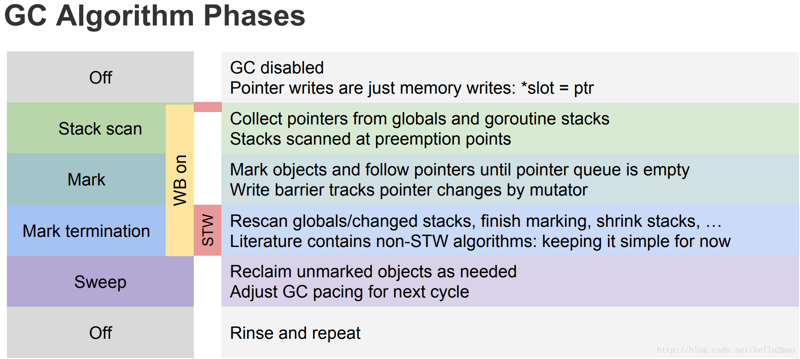

# Golang GC算法 #

经典的GC算法有三种： 

- 引用计数(reference counting)
- 标记-清除(mark & sweep) 
- 复制收集(Copy and Collection) 

## mark & sweep算法 ##

Golang 1.5后，采取的是“非分代的、非移动的、并发的、三色的”`mark & sweep`垃圾回收算法。 

- 非分代：不像Java那样分为年轻代和年老代，自然也没有minor gc和maj o gc的区别。
- 非移动：在垃圾回收之后不会进行内存整理以清除内存碎片。
- 写屏障：在并发标记的过程中，如果应用程序（mutator）修改了对象图，就可能出现标记遗漏的可能，写屏障就是为了处理标记遗漏的问题。
- 三色：将GC中的对象按照搜索的情况分成三种：

	- 黑色: 对象在这次GC中已标记,且这个对象包含的子对象也已标记
	- 灰色: 对象在这次GC中已标记, 但这个对象包含的子对象未标记
	- 白色: 对象在这次GC中未标记

一共分为四个阶段： 

	- 栈扫描（开始时STW） 
	- 第一次标记（并发） 
	- 第二次标记（STW） 
	- 清除（并发）

**STW分析**

Stop The World有两个过程。

- 初始标记阶段：

	- systemstack(stopTheWorldWithSema):启动stop the world
	- systemstack(func(){finishsweep_m()}): 不断去除要清理的span进行清理，然后重置gcmark位
	- clearpools(): 清扫sched.sudogcache和sched.deferpool，不知道在干嘛......
	- gcController.startCycle():启动新一轮GC，设置gc controller的状态位和计算一些估计值
	- gcMarkRootPrepare(): 计算扫描根对象的任务数量
	- gcMarkTinyAllocs(): 涂灰所有tiny alloc等待合并的对象
	- systemstack(func(){now=startTheWorldWithSema(trace.enable)}): 停止stop the world

- 重新标记阶段

	- systemstack(stopTheWorldWithSema)：启动STW
	- gcWakeAllAssists()：唤醒所有因辅助gc而休眠的G
	- nextTriggerRatio:=gcController.endCycle()：计算下一次触发gc需要的heap大小
	- setGCPhase(_GCmarktermination)：启用写屏障
	- systemstack(func() {gcMark(startTime)})： 再次执行标记
	- systemstack(func(){setGCPhase(_GCoff)；gcSweep(work.mode)})：关闭写屏障，唤醒后台清扫任务，将在STW结束后开始运行
	- gcSetTriggerRatio(nextTriggerRatio)：更新下次触发gc时的heap大小
	- systemstack(func() { startTheWorldWithSema(true) }): 停止STW

**三色标记算法**

三色标记算法是对标记阶段的改进，一个明显好处是能够让用户程序和mark并发的进行，原理如下：

	- 起初所有对象都是白色。
	- 从根出发扫描所有可达对象，标记为灰色，放入待处理队列。
	- 从队列取出灰色对象，将其引用对象标记为灰色放入队列，自身标记为黑色。
	- 重复3，直到灰色对象队列为空。此时白色对象即为垃圾，进行回收。

