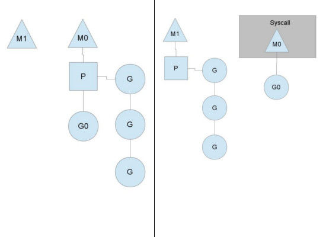
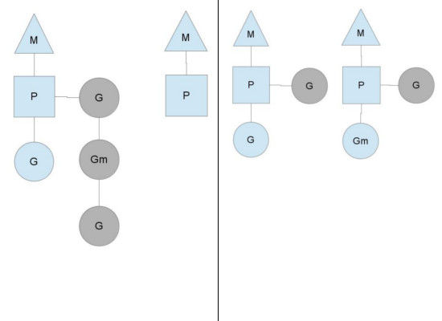
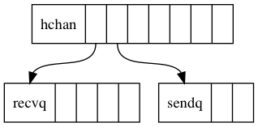
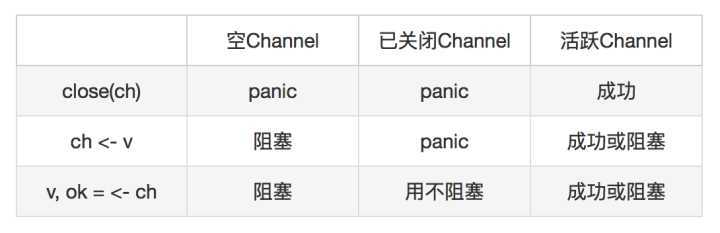

# goroutine与channel #

[非常棒的一篇文章https://www.cnblogs.com/wdliu/p/9272220.html](https://www.cnblogs.com/wdliu/p/9272220.html)

[https://blog.csdn.net/qq_25504271/article/details/81000217](https://blog.csdn.net/qq_25504271/article/details/81000217)

[深入golang之---goroutine并发控制与通信](https://studygolang.com/articles/13343)

[https://www.w3cschool.cn/go_internals/go_internals-8h5b282y.html](https://www.w3cschool.cn/go_internals/go_internals-8h5b282y.html)

## 相关术语 ##

- 进程

cpu在切换程序的时候，如果不保存上一个程序的状态（也就是我们常说的context--上下文），直接切换下一个程序，就会丢失上一个程序的一系列状态，于是引入了进程这个概念，用以划分好程序运行时所需要的资源。因此进程就是一个程序运行时候的所需要的基本资源单位（也可以说是程序运行的一个实体）。

- 线程

cpu切换多个进程的时候，会花费不少的时间，因为切换进程需要切换到内核态，而每次调度需要内核态都需要读取用户态的数据，进程一旦多起来，cpu调度会消耗一大堆资源，因此引入了线程的概念，线程本身几乎不占有资源，他们共享进程里的资源，内核调度起来不会那么像进程切换那么耗费资源。多线程场景下，每个线程一次处理一个请求，线程越多可并发处理的请求数就越多，但是在高并发下，多线程开销会比较大。

- 协程

协程拥有自己的寄存器上下文和栈。协程调度切换时，将寄存器上下文和栈保存到其他地方，在切回来的时候，恢复先前保存的寄存器上下文和栈。因此，协程能保留上一次调用时的状态（即所有局部状态的一个特定组合），每次过程重入时，就相当于进入上一次调用的状态，换种说法：进入上一次离开时所处逻辑流的位置。线程和进程的操作是由程序触发系统接口，最后的执行者是系统；协程的操作执行者则是用户自身程序，goroutine也是协程。


## 调度模型 ##

Go的调度器内部有四个重要的结构：M，P，S，Sched，前三个的定义在文件runtime/runtime.h中，而Sched的定义在runtime/proc.c中。Go语言的调度相关实现也是在文件proc.c中。

- G: 代表一个goroutine，它有自己的栈、instruction pointer和其他信息（正在等待的channel等等），用于调度。
- M: M是machine的缩写，代表内核级线程，一个M就是一个线程，goroutine就是跑在M之上的；M是一个很大的结构，里面维护小对象内存cache（mcache）、当前执行的goroutine、随机数发生器等等非常多的信息，M必须关联了P才可以执行Go代码，但是当它处理阻塞或者系统调用中时，可以不需要关联P。
- P: P全称是Processor，处理器，它的主要用途就是用来执行goroutine的，所以它也维护了一个goroutine队列，里面存储了所有需要它来执行的goroutine
- Sched： 代表调度器，它维护有存储M和G的队列以及调度器的一些状态信息等。

**结构体G**

```golang
struct G
{
    uintptr    stackguard;    // 分段栈的可用空间下界
    uintptr    stackbase;    // 分段栈的栈基址
    Gobuf    sched;        //进程切换时，利用sched域来保存上下文
    uintptr    stack0;
    FuncVal*    fnstart;        // goroutine运行的函数
    void*    param;        // 用于传递参数，睡眠时其它goroutine设置param，唤醒时此goroutine可以获取
    int16    status;        // 状态：Gidle,Grunnable,Grunning,Gsyscall,Gwaiting,Gdead
    int64    goid;        // goroutine的id号
    G*    schedlink;
    M*    m;        // for debuggers, but offset not hard-coded
    M*    lockedm;    // G被锁定只能在这个m上运行
    uintptr    gopc;    // 创建这个goroutine的go表达式的pc
    ...
};
```

goroutine切换时，上下文信息保存在结构体的sched域中。goroutine是轻量级的线程或者称为协程，切换时并不必陷入到操作系统内核中，所以保存过程很轻量。


**结构体M**

```golang
struct M
{
    G*    g0;        // 带有调度栈的goroutine
    G*    gsignal;    // signal-handling G 处理信号的goroutine
    void    (*mstartfn)(void);
    G*    curg;        // M中当前运行的goroutine
    P*    p;        // 关联P以执行Go代码 (如果没有执行Go代码则P为nil)
    P*    nextp;
    int32    id;
    int32    mallocing; //状态
    int32    throwing;
    int32    gcing;
    int32    locks;
    int32    helpgc;        //不为0表示此m在做帮忙gc。helpgc等于n只是一个编号
    bool    blockingsyscall;
    bool    spinning;
    Note    park;
    M*    alllink;    // 这个域用于链接allm
    M*    schedlink;
    MCache    *mcache;
    G*    lockedg;
    M*    nextwaitm;    // next M waiting for lock
    GCStats    gcstats;
    ...
};
```

结构体M中有两个G，一个是curg，代表结构体M当前绑定的结构体G。另一个是g0，是带有调度栈的goroutine，这是一个比较特殊的goroutine。普通的goroutine的栈是在堆上分配的可增长的栈，而g0的栈是M对应的线程的栈。所有调度相关的代码，会先切换到该goroutine的栈中再执行。

**结构体P**

```golang
struct P
{
    Lock;
    uint32    status;  // 状态：Pidle,Prunning,Psyscall,Pgcstop,Pdead
    P*    link;
    uint32    schedtick;   // 每次调度时将它加一
    M*    m;    // 链接到它关联的M (nil if idle)
    MCache*    mcache;

    G*    runq[256];
    int32    runqhead;
    int32    runqtail;

    // Available G's (status == Gdead)
    G*    gfree;
    int32    gfreecnt;
    byte    pad[64];
};
```

Processor的缩写。结构体P的加入是为了提高Go程序的并发度，实现更好的调度。M代表OS线程。P代表Go代码执行时需要的资源。当M执行Go代码时，它需要关联一个P，当M为idle或者在系统调用中时，它也需要P。有刚好GOMAXPROCS个P。所有的P被组织为一个数组，在P上实现了工作流窃取的调度器。跟G不同的是，P不存在waiting状态。MCache被移到了P中，但是在结构体M中也还保留着。在P中有一个Grunnable的goroutine队列，这是一个P的局部队列。当P执行Go代码时，它会优先从自己的这个局部队列中取，这时可以不用加锁，提高了并发度。如果发现这个队列空了，则去其它P的队列中拿一半过来，这样实现工作流窃取的调度。这种情况下是需要给调用器加锁的。

**Sched**

Sched是调度实现中使用的数据结构，该结构体的定义在文件proc.c中。

```golang
struct Sched {
    Lock;

    uint64    goidgen;

    M*    midle;     // idle m's waiting for work
    int32    nmidle;     // number of idle m's waiting for work
    int32    nmidlelocked; // number of locked m's waiting for work
    int3    mcount;     // number of m's that have been created
    int32    maxmcount;    // maximum number of m's allowed (or die)

    P*    pidle;  // idle P's
    uint32    npidle;  //idle P的数量
    uint32    nmspinning;

    // Global runnable queue.
    G*    runqhead;
    G*    runqtail;
    int32    runqsize;

    // Global cache of dead G's.
    Lock    gflock;
    G*    gfree;

    int32    stopwait;
    Note    stopnote;
    uint32    sysmonwait;
    Note    sysmonnote;
    uint64    lastpoll;

    int32    profilehz;    // cpu profiling rate
}
```

大多数需要的信息都已放在了结构体M、G和P中，Sched结构体只是一个壳。可以看到，其中有M的idle队列，P的idle队列，以及一个全局的就绪的G队列。Sched结构体中的Lock是非常必须的，如果M或P等做一些非局部的操作，它们一般需要先锁住调度器。

**调度的实现**


上图中有两个物理线程M，每一个M都拥有一个处理器P，每一个也都有一个正在运行的goroutine。P的数量可以通过`GOMAXPROCS()`来设置，它其实也代表了真正的并发度，即有多少个goroutine可以同时运行。图中灰色的那些goroutine并没有运行，而是出于ready的就绪态，正在等待被调度。P维护着这个队列（称之为runqueue），Go语言里，启动一个goroutine很容易：`go function`即可，所以每有一个go语句被执行，runqueue队列就在其末尾加入一个goroutine，在下一个调度点，就从runqueue中取出一个goroutine执行。

当一个OS线程M0陷入阻塞时（如下图)，P转而在M1上运行，图中的M1可能是正被创建，或者从线程缓存中取出。



当MO返回时，它必须尝试取得一个P来运行goroutine，一般情况下，它会从其他的OS线程那里拿一个P过来，如果没有拿到的话，它就把goroutine放在一个global runqueue里，然后自己睡眠（放入线程缓存里）。所有的P也会周期性的检查global runqueue并运行其中的goroutine，否则global runqueue上的goroutine永远无法执行。
 
另一种情况是P所分配的任务G很快就执行完了（分配不均），这就导致了这个处理器P很忙，但是其他的P还有任务，此时如果global runqueue没有任务G了，那么P不得不从其他的P里拿一些G来执行。一般来说，如果P从其他的P那里要拿任务的话，一般就拿run queue的一半，这就确保了每个OS线程都能充分的使用，如下图：



goroutine的状态变迁图：


## channel ##

[golang channel 使用总结](http://litang.me/post/golang-channel/)

[Golang Channel最佳实践之基本规则](https://www.jianshu.com/p/5046bf8593c3)

**内部结构**



- 接收消息的协程队列。这个队列的结构是一个限定最大长度的链表，所有阻塞在channel的接收操作的协程都会被放在这个队列里。
- 发送消息的协程队列。这个队列的结构也是一个限定最大长度的链表。所有阻塞在channel的发送操作的协程也都会被放在这个队列里。
- 环形数据缓冲队列。这个环形数组的大小就是channel的容量。如果数组装满了，就表示channel满了，如果数组里一个值也没有，就表示channel是空的。对于一个阻塞型channel来说，它总是同时处于即满又空的状态。不带缓冲的channel此队列size则为0。

**操作规则**


