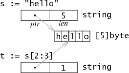

# 基本数据结构 #

[https://www.w3cschool.cn/go_internals/go_internals-tdys282g.html](https://www.w3cschool.cn/go_internals/go_internals-tdys282g.html)

## 字符串 ##

字符串在Go语言内存模型中用一个2字长的数据结构表示。它包含一个指向字符串存储数据的指针和一个长度数据。因为string类型是不可变的，对于多字符串共享同一个存储数据是安全的。切分操作`str[i:j]`会得到一个新的2字长结构，一个可能不同的但仍指向同一个字节序列的指针和长度数据。这意味着字符串切分可以在不涉及内存分配或复制操作。这使得字符串切分的效率等同于传递下标。




## slice ##

[https://www.cnblogs.com/f-ck-need-u/p/9854932.html](https://www.cnblogs.com/f-ck-need-u/p/9854932.html)

一个slice是一个数组某个部分的引用。在内存中，它是一个包含3个部分：容量(capacity)、长度(length)和指向底层数组某个元素的指针（Pointer），每个部分占8字节(1个机器字长，64位架构的机器上一个机器字长为64bit，共8字节，32位的则是32bit，共4字节)。直接打印一个slice时输出的结构为`[x/y]0xADDR`(x为length，y为capacity，0xADDR为Pointer)

结构定义：（$GOROOT/src/pkg/runtime/runtime.h）

```golang
struct    Slice
    {    // must not move anything
        byte*    array;        // actual data
        uintgo    len;        // number of elements
        uintgo    cap;        // allocated number of elements
    };
```

- Pointer：该slice在底层数组的起点
- Capacity：表示底层数组的长度，即这个slice当前能扩展的最大长度
- Length：表示slice当前的长度，长度会在追加元素时进行扩展，最大的扩展长度为Capacity(但在数组自动扩展时不适用)，即Length必须小于等于Capacity

声明一个slice，但不做初始化的时候，这个slice就是一个nil slice。nil slice表示它的指针为nil，也就是这个slice不会指向哪个底层数组。也因此，nil slice的长度和容量都为0
还有一种长度和容量都为0，但却有指向的slice，但是指向的底层数组暂时是长度为0的空数组。

nil slice：


空slice：


数组的slice并不会实际复制一份数据，它只是创建一个新的数据结构，包含了另外的一个指针，一个长度和一个容量数据。 如同分割一个字符串，分割数组也不涉及复制操作：它只是新建了一个结构来放置一个不同的指针，长度和容量。

nil切片被用在很多标准库和内置函数中，描述一个不存在的切片的时候，就需要用到nil切片。比如函数在发生异常的时候，返回的切片就是nil切片。nil切片的指针指向nil。空切片一般会用来表示一个空的集合。比如数据库查询，一条结果也没有查到，那么就可以返回一个空切片。


例：


对`[]int{2,3,5,7,11}`求值操作会创建一个包含五个值的数组，并设置x的属性来描述这个数组。分割表达式x[1:3]并不分配更多的数据：它只是写了一个新的slice结构的属性来引用相同的存储数据。在例子中，长度为2--只有y[0]和y[1]是有效的索引，但是容量为4--y[0:4]是一个有效的分割表达式。

由于slice是不同于指针的多字长结构，分割操作并不需要分配内存，甚至没有通常被保存在堆中的slice头部。这种表示方法使slice操作和在C中传递指针、长度对一样廉价。Go语言最初使用一个指向以上结构的指针来表示slice，但是这样做意味着每个slice操作都会分配一块新的内存对象。即使使用了快速的分配器，还是给垃圾收集器制造了很多没有必要的工作。移除间接引用及分配操作可以让slice足够廉价，以避免传递显式索引。

**slice的扩容**

[https://halfrost.com/go_slice/](https://halfrost.com/go_slice/)

slice在Go的运行时库中就是一个C语言动态数组的实现。在对slice进行append等操作时，可能会造成slice的自动扩容。其扩容时的大小增长规则是：

- 如果新的slice大小是当前大小2倍以上，则大小增长为新大小
- 否则循环以下操作：如果当前slice大小小于1024，按每次2倍增长，否则每次按当前大小1/4增长。直到增长的大小超过或等于新大小。

注意：扩容扩大的容量都是针对原来的容量而言的，而不是针对原来数组的长度而言的。

看一下扩容策略：

```golang

func growslice(et *_type, old slice, cap int) slice {  
    if raceenabled {
        callerpc := getcallerpc(unsafe.Pointer(&et))
        racereadrangepc(old.array, uintptr(old.len*int(et.size)), callerpc, funcPC(growslice))
    }
    if msanenabled {
        msanread(old.array, uintptr(old.len*int(et.size)))
    }
 
    if et.size == 0 {
        // 如果新要扩容的容量比原来的容量还要小，这代表要缩容了，那么可以直接报panic了。
        if cap < old.cap {
            panic(errorString("growslice: cap out of range"))
        }
 
        // 如果当前切片的大小为0，还调用了扩容方法，那么就新生成一个新的容量的切片返回。
        return slice{unsafe.Pointer(&zerobase), old.len, cap}
    }
 
  // 扩容的策略
    newcap := old.cap
    doublecap := newcap + newcap
    if cap > doublecap {
        newcap = cap
    } else {
        if old.len < 1024 {
            newcap = doublecap
        } else {
            for newcap < cap {
                newcap += newcap / 4
            }
        }
    }
 
    // 计算新的切片的容量，长度。
    var lenmem, newlenmem, capmem uintptr
    const ptrSize = unsafe.Sizeof((*byte)(nil))
    switch et.size {
    case 1:
        lenmem = uintptr(old.len)
        newlenmem = uintptr(cap)
        capmem = roundupsize(uintptr(newcap))
        newcap = int(capmem)
    case ptrSize:
        lenmem = uintptr(old.len) * ptrSize
        newlenmem = uintptr(cap) * ptrSize
        capmem = roundupsize(uintptr(newcap) * ptrSize)
        newcap = int(capmem / ptrSize)
    default:
        lenmem = uintptr(old.len) * et.size
        newlenmem = uintptr(cap) * et.size
        capmem = roundupsize(uintptr(newcap) * et.size)
        newcap = int(capmem / et.size)
    }
 
    // 判断非法的值，保证容量是在增加，并且容量不超过最大容量
    if cap < old.cap || uintptr(newcap) > maxSliceCap(et.size) {
        panic(errorString("growslice: cap out of range"))
    }
 
    var p unsafe.Pointer
    if et.kind&kindNoPointers != 0 {
        // 在老的切片后面继续扩充容量
        p = mallocgc(capmem, nil, false)
        // 将 lenmem 这个多个 bytes 从 old.array地址 拷贝到 p 的地址处
        memmove(p, old.array, lenmem)
        // 先将 P 地址加上新的容量得到新切片容量的地址，然后将新切片容量地址后面的 capmem-newlenmem 个 bytes 这块内存初始化。为之后继续 append() 操作腾出空间。
        memclrNoHeapPointers(add(p, newlenmem), capmem-newlenmem)
    } else {
        // 重新申请新的数组给新切片
        // 重新申请 capmen 这个大的内存地址，并且初始化为0值
        p = mallocgc(capmem, et, true)
        if !writeBarrier.enabled {
            // 如果还不能打开写锁，那么只能把 lenmem 大小的 bytes 字节从 old.array 拷贝到 p 的地址处
            memmove(p, old.array, lenmem)
        } else {
            // 循环拷贝老的切片的值
            for i := uintptr(0); i < lenmem; i += et.size {
                typedmemmove(et, add(p, i), add(old.array, i))
            }
        }
    }
    // 返回最终新切片，容量更新为最新扩容之后的容量
    return slice{p, old.len, newcap}
}

```

扩容之后对应的数组不一定还是之前的数组，有两种情况：

- 原数组还有容量可以扩容，执行`append()`操作以后，会在原数组上直接操作，这种情况下，扩容以后的数组还是指向原来的数组。（不建议）
- 原来数组的容量已经达到了最大值，再想扩容， Go默认会先开一片内存区域，把原来的值拷贝过来，然后再执行`append()`操作。(安全)


**make和new**

Go有两个数据结构创建函数：new和make。基本的区别是new(T)返回一个*T，返回的这个指针可以被隐式地消除引用（图中的黑色箭头）。而make(T, args)返回一个普通的T。通常情况下，T内部有一些隐式的指针（图中的灰色箭头）。一句话，new返回一个指向已清零内存的指针，而make返回一个复杂的结构。


**slice与unsafe.Pointer相互转换**

slice中得到一块内存地址：

```golang
s := make([]byte, 200)
ptr := unsafe.Pointer(&s[0])
```

从一个内存指针构造出Go语言的slice结构的几种方法:

方法1：

```golang
var ptr unsafe.Pointer
s := ((*[1<<10]byte)(ptr))[:200]
```

先将ptr强制类型转换为另一种指针，一个指向`[1<<10]byte`数组的指针，这里数组大小其实是假的。然后用slice操作取出这个数组的前200个，于是s就是一个200个元素的slice。

方法2：

```golang
var ptr unsafe.Pointer
var s1 = struct {
    addr uintptr
    len int
    cap int
}{ptr, length, length}
s := *(*[]byte)(unsafe.Pointer(&s1))
```

把slice的底层结构写出来，将addr，len，cap等字段写进去，将这个结构体赋给s。

方法3(推荐)：

```golang
var o []byte
sliceHeader := (*reflect.SliceHeader)((unsafe.Pointer(&o)))
sliceHeader.Cap = length
sliceHeader.Len = length
sliceHeader.Data = uintptr(ptr)
```

## map ##

[https://blog.csdn.net/u011957758/article/details/82846609](https://blog.csdn.net/u011957758/article/details/82846609)

### 数据结构 ###

Go中的map在底层是用哈希表实现的，其结构如下：

```golang
type hmap struct {
    // Note: the format of the hmap is also encoded in cmd/compile/internal/gc/reflect.go.
    count     int // 元素个数
    flags     uint8
    B         uint8  // 可以最多容纳6.5*2^B个元素，6.5为装载因子，这个值来源于Go中的宏控制(#define LOAD6.5)
    noverflow uint16 // bucket溢出个数
    hash0     uint32 // hash种子

    buckets    unsafe.Pointer // array of 2^B Buckets. may be nil if count==0.
    oldbuckets unsafe.Pointer // previous bucket array of half the size, non-nil only when growing
    nevacuate  uintptr        // 搬迁进度，小于nevacuate的已经搬迁

    extra *mapextra // optional fields
}

// mapextra holds fields that are not present on all maps.
type mapextra struct {
    overflow    *[]*bmap
    oldoverflow *[]*bmap

    // nextOverflow holds a pointer to a free overflow bucket.
    nextOverflow *bmap
}

// A bucket for a Go map.
type bmap struct {
    // 每个元素hash值的高8位，如果tophash[0] < minTopHash，表示这个桶的搬迁状态
    tophash [bucketCnt]uint8
    // 接下来是8个key、8个value，但是不能直接看到；为了优化对齐，go采用了key放在一起，value放在一起的存储方式，
    // 再接下来是hash冲突发生时，下一个溢出桶的地址
}
```

一个map主要由以上三个结构组成：

- hmap： 每个map的底层结构是hmap，它包含了map的各种基本信息。
- mapextra： 存放map的一些额外信息，例如overflow bucket，并非每个map都会有次此结构。
- bmap： 代表bucket，每一个bucket通常存放8个元素，最后由一个overflow字段指向下一个bmap，注意key、value、overflow字段都不显示定义，而是通过maptype计算偏移获取的。

[https://www.jianshu.com/p/092d4a746620](https://www.jianshu.com/p/092d4a746620)


- `hmap.extra.nextOverflow`指向的是预分配的overflow bucket，预分配的用完了那么值就变成nil。
- `hmap.noverflow`是overflow bucket的数量，当B小于16时是准确值，大于等于16时是大概的值。
- `hmap.count`是当前map的元素个数，也就是len()返回的值。


具体的Bucket结构如下所示：

```golang
struct Bucket
{
    uint8  tophash[BUCKETSIZE]; // hash值的高8位....低位从bucket的array定位到bucket
    Bucket *overflow;           // 溢出桶链表，如果有
    byte   data[1];             // BUCKETSIZE keys followed by BUCKETSIZE values
};
```

其中BUCKETSIZE是用宏定义的8，每个bucket中存放最多8个key/value对, 如果多于8个，那么会申请一个新的bucket，并将它与之前的bucket链起来。
按key的类型采用相应的hash算法得到key的hash值。将hash值的低位当作Hmap结构体中buckets数组的index，找到key所在的bucket。将hash的高8位存储在了bucket的tophash中。注意，这里高8位不是用来当作key/value在bucket内部的offset的，而是作为一个主键，在查找时对tophash数组的每一项进行顺序匹配的。先比较hash值高位与bucket的tophash[i]是否相等，如果相等则再比较bucket的第i个的key与所给的key是否相等。如果相等，则返回其对应的value，反之，在overflow buckets中按照上述方法继续寻找。

### 扩容 ###

哈希表就是以空间换时间，访问速度与填充因子相关，bucket挂接的链表越来越长，性能就会越来越慢。如果扩容前的哈希表大小为2^B，扩容之后的大小为2^(B+1)，每次扩容都变为原来大小的两倍，哈希表大小始终为2的指数倍，则有(hash mod 2^B)等价于(hash & (2^B-1))。

当元素个数/bucket个数大于等于6.5时，就会进行扩容，把bucket数量扩成原本的两倍。当hash表扩容之后，需要将老数据重新迁移到新的table上(源代码中称之为evacuate)， 这个工作并没有在扩容之后一次性完成，而是逐步的完成。

[https://studygolang.com/articles/19219?fr=sidebar](https://studygolang.com/articles/19219?fr=sidebar)

**扩容条件**

```golang
if !h.growing() && (overLoadFactor(h.count+1, h.B) || tooManyOverflowBuckets(h.noverflow, h.B)) {
    hashGrow(t, h)
    goto again
}
```

- 当前没有正在进行扩容动作（以判断`hmap.oldbuckets != nil`(`!h.growing()`)为基准）
- 触发load factor的最大值，负载因子已达到当前界限(负载因子`load factor`，用途是评估哈希表当前的时间复杂度，其与哈希表当前包含的键值对数、桶数量等相关。如果负载因子越大，则说明空间使用率越高，但产生哈希冲突的可能性更高。而负载因子越小，说明空间使用率低，产生哈希冲突的可能性更低)
- 溢出桶overflow buckets过多(溢出桶`overflow buckets`的判定与buckets总数和overflow buckets总数相关联)

**扩容容量规则**

map扩容时有两种扩容规则，其判断规则如下：

`hashGrow`函数
```golang
if !overLoadFactor(h.count+1, h.B) {
    bigger = 0
    h.flags |= sameSizeGrow
}
```

即：

- 负载因子`load factor`没有超过当前界限，属于溢出桶`overflow buckets`过多的情况,扩容规则将是`sameSizeGrow`，即是不改变大小的扩容动作。
- 负载因子`load factor`达到当前界限，动态扩容当前大小的两倍作为其新容量大小

**扩容空间预分配**

新申请的扩容空间（newbuckets/newoverflow）都是预分配，等真正使用的时候才会初始化

```golang
...
oldbuckets := h.buckets
newbuckets, nextOverflow := makeBucketArray(t, h.B+bigger, nil)

flags := h.flags &^ (iterator | oldIterator)
if h.flags&iterator != 0 {
    flags |= oldIterator
}

h.B += bigger
...
h.noverflow = 0

if h.extra != nil && h.extra.overflow != nil {
    ...
    h.extra.oldoverflow = h.extra.overflow
    h.extra.overflow = nil
}
if nextOverflow != nil {
    ...
    h.extra.nextOverflow = nextOverflow
}
```

**增量扩容**

扩容完毕后（预分配），不会马上就进行迁移。而是采取增量扩容的方式，当有访问到具体 bukcet 时，才会逐渐的进行迁移（将 oldbucket 迁移到 bucket）

```golang
func growWork(t *maptype, h *hmap, bucket uintptr) {
    evacuate(t, h, bucket&h.oldbucketmask())

    if h.growing() {
        evacuate(t, h, h.nevacuate)
    }
}
```

- `evacuate(t, h, bucket&h.oldbucketmask())`: 将oldbucket中的元素迁移rehash到扩容后的新bucket
- `evacuate(t, h, h.nevacuate)`: 如果当前正在进行扩容，则再进行多一次迁移

如果数据迁移过程中又需要进行扩容，就会不断地进行迁移，待迁移完毕后才会开始进行下一次的扩容动作，如下：

```golang

again:
    bucket := hash & bucketMask(h.B)
```
```
if !h.growing() && (overLoadFactor(h.count+1, h.B) || tooManyOverflowBuckets(h.noverflow, h.B)) {
    hashGrow(t, h)
    goto again 
}
```

**map设计中的性能优化**

HMap中是Bucket的数组，而不是Bucket指针的数组。好的方面是可以一次分配较大内存，减少了分配次数，避免多次调用mallocgc。但相应的缺点，其一是可扩展哈希的算法并没有发生作用，扩容时会造成对整个数组的值拷贝(如果实现上用Bucket指针的数组就是指针拷贝了，代价小很多)。其二是首个bucket与后面产生了不一致性。这个会使删除逻辑变得复杂一点。比如删除后面的溢出链可以直接删除，而对于首个bucket，要等到evalucated完毕后，整个oldbucket删除时进行。没有重用设freelist重用删除的结点。作者把这个加了一个TODO的注释，不过想了一下觉得这个做的意义不大。因为一方面，bucket大小并不一致，重用比较麻烦。另一方面，下层存储已经做过内存池的实现了，所以这里不做重用也会在内存分配那一层被重用的，bucket直接key/value和间接key/value优化。这个优化做得蛮好的。注意看代码会发现，如果key或value小于128字节，则它们的值是直接使用的bucket作为存储的。否则bucket中存储的是指向实际key/value数据的指针，bucket存8个key/value对。查找时进行顺序比较。第一次发现高位居然不是用作offset，而是用于加快比较的。定位到bucket之后，居然是一个顺序比较的查找过程。后面仔细想了想，觉得还行。由于bucket只有8个，顺序比较下来也不算过分。仍然是O(1)只不过前面系数大一点点罢了。相当于hash到一个小范围之后，在这个小范围内顺序查找。插入删除的优化。前面已经提过了，插入只要找到相同的key或者第一个空位，bucket中如果存在一个以上的相同key，前面覆盖后面的(只是如果，实际上不会发生)。而删除就需要遍历完所有bucket溢出链了。这样map的设计就是为插入优化的。考虑到一般的应用场景，这个应该算是很合理的。作者还列了另个2个TODO：将多个几乎要empty的bucket合并；如果table中元素很少，考虑shrink table。(毕竟现在的实现只是单纯的grow)。