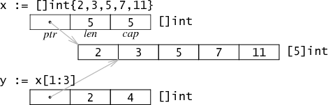

# 基本数据结构 #

[https://www.w3cschool.cn/go_internals/go_internals-tdys282g.html](https://www.w3cschool.cn/go_internals/go_internals-tdys282g.html)

## 字符串 ##

字符串在Go语言内存模型中用一个2字长的数据结构表示。它包含一个指向字符串存储数据的指针和一个长度数据。因为string类型是不可变的，对于多字符串共享同一个存储数据是安全的。切分操作`str[i:j]`会得到一个新的2字长结构，一个可能不同的但仍指向同一个字节序列的指针和长度数据。这意味着字符串切分可以在不涉及内存分配或复制操作。这使得字符串切分的效率等同于传递下标。


## slice ##

一个slice是一个数组某个部分的引用。在内存中，它是一个包含3个域的结构体：指向slice中第一个元素的指针，slice的长度，以及slice的容量。长度是下标操作的上界，如x[i]中i必须小于长度。容量是分割操作的上界，如x[i:j]中j不能大于容量。数组的slice并不会实际复制一份数据，它只是创建一个新的数据结构，包含了另外的一个指针，一个长度和一个容量数据。 如同分割一个字符串，分割数组也不涉及复制操作：它只是新建了一个结构来放置一个不同的指针，长度和容量。

例：



对`[]int{2,3,5,7,11}`求值操作会创建一个包含五个值的数组，并设置x的属性来描述这个数组。分割表达式x[1:3]并不分配更多的数据：它只是写了一个新的slice结构的属性来引用相同的存储数据。在例子中，长度为2--只有y[0]和y[1]是有效的索引，但是容量为4--y[0:4]是一个有效的分割表达式。

由于slice是不同于指针的多字长结构，分割操作并不需要分配内存，甚至没有通常被保存在堆中的slice头部。这种表示方法使slice操作和在C中传递指针、长度对一样廉价。Go语言最初使用一个指向以上结构的指针来表示slice，但是这样做意味着每个slice操作都会分配一块新的内存对象。即使使用了快速的分配器，还是给垃圾收集器制造了很多没有必要的工作。移除间接引用及分配操作可以让slice足够廉价，以避免传递显式索引。

**slice的扩容**

slice在Go的运行时库中就是一个C语言动态数组的实现，在$GOROOT/src/pkg/runtime/runtime.h中可以看到它的定义：

```golang
struct    Slice
{    // must not move anything
    byte*    array;        // actual data
    uintgo    len;        // number of elements
    uintgo    cap;        // allocated number of elements
};
```

在对slice进行append等操作时，可能会造成slice的自动扩容。其扩容时的大小增长规则是：

- 如果新的大小是当前大小2倍以上，则大小增长为新大小
- 否则循环以下操作：如果当前大小小于1024，按每次2倍增长，否则每次按当前大小1/4增长。直到增长的大小超过或等于新大小。


**make和new**

Go有两个数据结构创建函数：new和make。基本的区别是new(T)返回一个*T，返回的这个指针可以被隐式地消除引用（图中的黑色箭头）。而make(T, args)返回一个普通的T。通常情况下，T内部有一些隐式的指针（图中的灰色箭头）。一句话，new返回一个指向已清零内存的指针，而make返回一个复杂的结构。


**slice与unsafe.Pointer相互转换**

slice中得到一块内存地址：

```golang
s := make([]byte, 200)
ptr := unsafe.Pointer(&s[0])
```

从一个内存指针构造出Go语言的slice结构的几种方法:

方法1：
```golang
var ptr unsafe.Pointer
s := ((*[1<<10]byte)(ptr))[:200]
```

先将ptr强制类型转换为另一种指针，一个指向`[1<<10]byte`数组的指针，这里数组大小其实是假的。然后用slice操作取出这个数组的前200个，于是s就是一个200个元素的slice。

方法2：
```golang
var ptr unsafe.Pointer
var s1 = struct {
    addr uintptr
    len int
    cap int
}{ptr, length, length}
s := *(*[]byte)(unsafe.Pointer(&s1))
```

把slice的底层结构写出来，将addr，len，cap等字段写进去，将这个结构体赋给s。

方法3(推荐)：
```golang
var o []byte
sliceHeader := (*reflect.SliceHeader)((unsafe.Pointer(&o)))
sliceHeader.Cap = length
sliceHeader.Len = length
sliceHeader.Data = uintptr(ptr)
```

## map ##

**数据结构**

Go中的map在底层是用哈希表实现的，哈希表的数据结构中一些关键的域如下所示：

```golang
struct Hmap
{
    uint8   B;    // 可以容纳2^B个项
    uint16  bucketsize;   // 每个桶的大小

    byte    *buckets;     // 2^B个Buckets的数组
    byte    *oldbuckets;  // 前一个buckets，只有当正在扩容时才不为空
};
```

上面给出的结构体只是Hmap的部分的域。需要注意到的是，这里直接使用的是Bucket的数组，而不是Bucket*指针的数组。这意味着，第一个Bucket和后面溢出链的Bucket分配有些不同。第一个Bucket是用的一段连续的内存空间，而后面溢出链的Bucket的空间是使用mallocgc分配的。
这个hash结构使用的是一个可扩展哈希的算法，由hash值mod当前hash表大小决定某一个值属于哪个桶，而hash表大小是2的指数，即上面结构体中的2^B。每次扩容，会增大到上次大小的两倍。结构体中有一个buckets和一个oldbuckets是用来实现增量扩容的。正常情况下直接使用buckets，而oldbuckets为空。如果当前哈希表正在扩容中，则oldbuckets不为空，并且buckets大小是oldbuckets大小的两倍。

具体的Bucket结构如下所示：

```golang
struct Bucket
{
    uint8  tophash[BUCKETSIZE]; // hash值的高8位....低位从bucket的array定位到bucket
    Bucket *overflow;           // 溢出桶链表，如果有
    byte   data[1];             // BUCKETSIZE keys followed by BUCKETSIZE values
};
```
其中BUCKETSIZE是用宏定义的8，每个bucket中存放最多8个key/value对, 如果多于8个，那么会申请一个新的bucket，并将它与之前的bucket链起来。
按key的类型采用相应的hash算法得到key的hash值。将hash值的低位当作Hmap结构体中buckets数组的index，找到key所在的bucket。将hash的高8位存储在了bucket的tophash中。注意，这里高8位不是用来当作key/value在bucket内部的offset的，而是作为一个主键，在查找时对tophash数组的每一项进行顺序匹配的。先比较hash值高位与bucket的tophash[i]是否相等，如果相等则再比较bucket的第i个的key与所给的key是否相等。如果相等，则返回其对应的value，反之，在overflow buckets中按照上述方法继续寻找。

