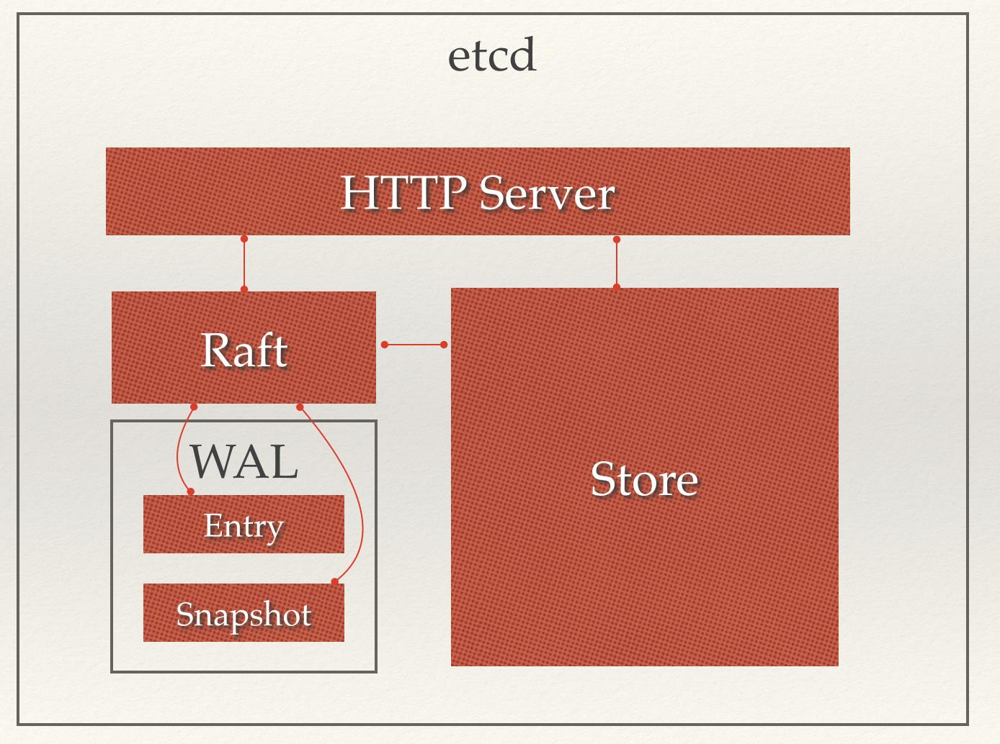

# ETCD #

[https://blog.csdn.net/zl1zl2zl3/article/details/79627412](https://blog.csdn.net/zl1zl2zl3/article/details/79627412)

Etcd是一个用Go语言编写的开源的分布式键值存储，它由CoreOS团队开发，现在由Cloud Native Computing Foundation负责管理。主要用途是共享配置和服务发现。

## 主要功能 ##

- 提供存储以及获取数据的接口，它通过协议保证Etcd集群中的多个节点数据的强一致性。用于存储元信息以及共享配置。
- 提供监听机制，客户端可以监听某个key或者某些key的变更。用于监听和推送变更。
- 提供key的过期以及续约机制，客户端通过定时刷新来实现续约（v2和v3的实现机制不一样）。用于集群监控以及服务注册发现。
- 提供原子的CAS（Compare-and-Swap）和 CAD（Compare-and-Delete）支持（v2通过接口参数实现，v3通过批量事务实现）。用于分布式锁以及leader选举。

## 架构 ##

- HTTP Server： 用于处理用户发送的API请求以及其它etcd节点的同步与心跳信息请求。
- Store：用于处理etcd支持的各类功能的事务，包括数据索引、节点状态变更、监控与反馈、事件处理与执行等等，是etcd对用户提供的大多数API功能的具体实现。
- Raft：Raft强一致性算法的具体实现，是etcd的核心。
- WAL：Write Ahead Log（预写式日志），是etcd的数据存储方式。除了在内存中存有所有数据的状态以及节点的索引以外，etcd就通过WAL进行持久化存储。WAL中，所有的数据提交前都会事先记录日志。Snapshot是为了防止数据过多而进行的状态快照；Entry表示存储的具体日志内容。
	
	wal日志是二进制的，解析出来后是以上数据结构LogEntry。其中第一个字段type，只有两种，一种是0表示Normal，1表示ConfChange（ConfChange表示 Etcd 本身的配置变更同步，比如有新的节点加入等）。第二个字段是term，每个term代表一个主节点的任期，每次主节点变更term就会变化。第三个字段是index，这个序号是严格有序递增的，代表变更序号。第四个字段是二进制的data，将raft request对象的pb结构整个保存下来。raft协议本身不关心应用数据，也就是data中的部分，一致性都通过同步wal日志来实现，每个节点将从主节点收到的data apply到本地的存储，raft只关心日志的同步状态，如果本地存储实现的有bug，比如没有正确的将data apply到本地，也可能会导致数据不一致。

## Etcd v2与v3 ##

Etcd v2和v3本质上是共享同一套raft协议代码的两个独立的应用，接口不一样，存储不一样，数据互相隔离。也就是说如果从 Etcd v2升级到Etcd v3，原来v2的数据还是只能用v2的接口访问，v3的接口创建的数据也只能访问通过v3的接口访问。

**Etcd v2存储，Watch以及过期机制**

Etcd v2是个纯内存的实现，并未实时将数据写入到磁盘，持久化机制很简单，就是将store整合序列化成json写入文件。数据在内存中是一个简单的树结构。store中有一个全局的currentIndex，每次变更，index会加1.然后每个event都会关联到currentIndex。当客户端调用watch接口（参数中增加 wait参数）时，如果请求参数中有waitIndex，并且waitIndex小于currentIndex，则从EventHistroy表中查询index小于等于waitIndex，并且和watch key匹配的event，如果有数据，则直接返回。如果历史表中没有或者请求没有带waitIndex，则放入WatchHub中，每个key会关联一个watcher列表。 当有变更操作时，变更生成的event会放入EventHistroy表中，同时通知和该key相关的watcher。

几个注意事项：
- EventHistroy是有长度限制的，最长1000。也就是说，如果你的客户端停了许久，然后重新watch的时候，可能和该waitIndex相关的event已经被淘汰了，这种情况下会丢失变更。
- 如果通知watch的时候，出现了阻塞（每个watch的channel有100个缓冲空间），Etcd会直接把watcher删除，也就是会导致wait请求的连接中断，客户端需要重新连接。
- Etcd store的每个node中都保存了过期时间，通过定时机制进行清理。

ETCD V2的一些限制：
- 过期时间只能设置到每个key上，如果多个key要保证生命周期一致则比较困难。
- watch只能watch某一个key以及其子节点（通过参数 recursive),不能进行多个watch。
- 很难通过watch机制来实现完整的数据同步（有丢失变更的风险），所以当前的大多数使用方式是通过watch得知变更，然后通过get重新获取数据，并不完全依赖于watch的变更event。

**Etcd v3存储，Watch以及过期机制**

