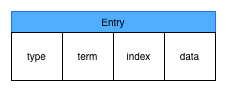
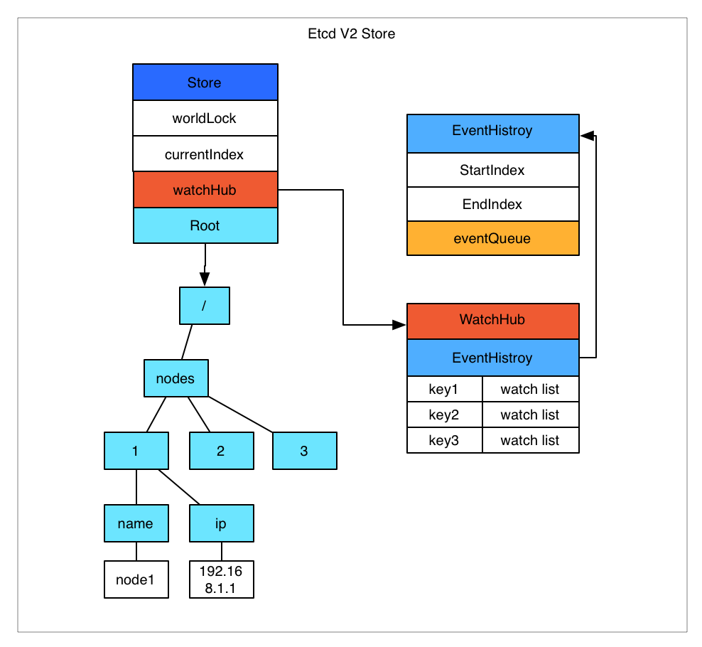
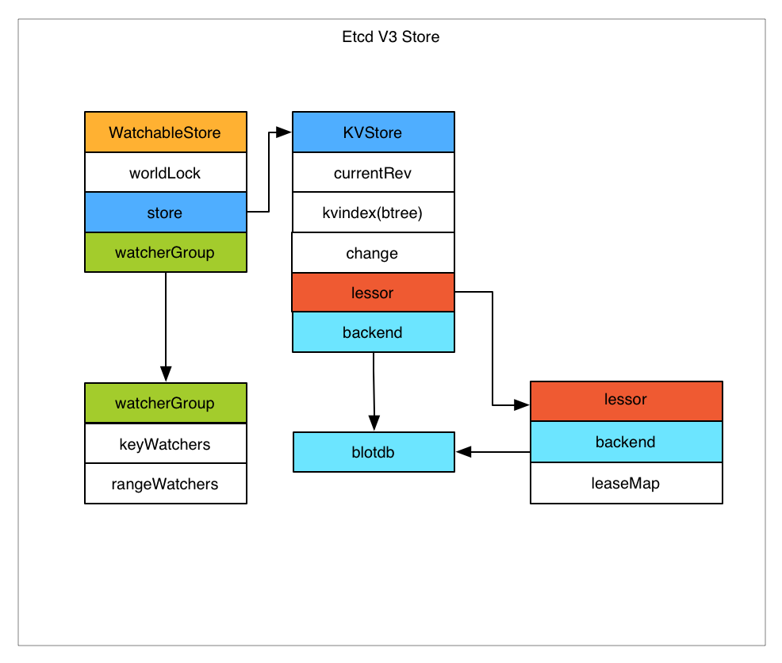

# ETCD #

[https://blog.csdn.net/zl1zl2zl3/article/details/79627412](https://blog.csdn.net/zl1zl2zl3/article/details/79627412)

Etcd是一个用Go语言编写的开源的分布式键值存储，它由CoreOS团队开发，现在由Cloud Native Computing Foundation负责管理。主要用途是共享配置和服务发现。

## 主要功能 ##

- 提供存储以及获取数据的接口，它通过协议保证Etcd集群中的多个节点数据的强一致性。用于存储元信息以及共享配置。
- 提供监听机制，客户端可以监听某个key或者某些key的变更。用于监听和推送变更。
- 提供key的过期以及续约机制，客户端通过定时刷新来实现续约（v2和v3的实现机制不一样）。用于集群监控以及服务注册发现。
- 提供原子的CAS（Compare-and-Swap）和CAD（Compare-and-Delete）支持（v2通过接口参数实现，v3通过批量事务实现）。用于分布式锁以及leader选举。

## 相关概念 ##

- Raft：etcd所采用的保证分布式系统强一致性的算法。
- Node：一个Raft状态机实例。
- Member： 一个etcd实例。它管理着一个Node，并且可以为客户端请求提供服务。
- Cluster：由多个Member构成可以协同工作的etcd集群。
- Peer：对同一个etcd集群中另外一个Member的称呼。
- Client： 向etcd集群发送HTTP请求的客户端。
- WAL：预写式日志，etcd用于持久化存储的日志格式。
- snapshot：etcd防止WAL文件过多而设置的快照，存储etcd数据状态。
- Proxy：etcd的一种模式，为etcd集群提供反向代理服务。
- Leader：Raft算法中通过竞选而产生的处理所有数据提交的节点。
- Follower：竞选失败的节点作为Raft中的从属节点，为算法提供强一致性保证。
- Candidate：当Follower超过一定时间接收不到Leader的心跳时转变为Candidate开始竞选。
- Term：某个节点成为Leader到下一次竞选时间，称为一个Term。
- Index：数据项编号。Raft中通过Term和Index来定位数据。


## 架构 ##


- HTTP Server： 用于处理用户发送的API请求以及其它etcd节点的同步与心跳信息请求。
- Store：用于处理etcd支持的各类功能的事务，包括数据索引、节点状态变更、监控与反馈、事件处理与执行等等，是etcd对用户提供的大多数API功能的具体实现。
- Raft：Raft强一致性算法的具体实现，是etcd的核心。
- WAL：Write Ahead Log（预写式日志），是etcd的数据存储方式。除了在内存中存有所有数据的状态以及节点的索引以外，etcd就通过WAL进行持久化存储。WAL中，所有的数据提交前都会事先记录日志。Snapshot是为了防止数据过多而进行的状态快照；Entry表示存储的具体日志内容。
	
	wal日志是二进制的，解析出来后是以上数据结构LogEntry。其中第一个字段type，只有两种，一种是0表示Normal，1表示ConfChange（ConfChange表示 Etcd 本身的配置变更同步，比如有新的节点加入等）。第二个字段是term，每个term代表一个主节点的任期，每次主节点变更term就会变化。第三个字段是index，这个序号是严格有序递增的，代表变更序号。第四个字段是二进制的data，将raft request对象的pb结构整个保存下来。raft协议本身不关心应用数据，也就是data中的部分，一致性都通过同步wal日志来实现，每个节点将从主节点收到的data apply到本地的存储，raft只关心日志的同步状态，如果本地存储实现的有bug，比如没有正确的将data apply到本地，也可能会导致数据不一致。

## Etcd v2与v3 ##

Etcd v2和v3本质上是共享同一套raft协议代码的两个独立的应用，接口不一样，存储不一样，数据互相隔离。也就是说如果从 Etcd v2升级到Etcd v3，原来v2的数据还是只能用v2的接口访问，v3的接口创建的数据也只能访问通过v3的接口访问。

###Etcd v2存储，Watch以及过期机制###



Etcd v2是个纯内存的实现，并未实时将数据写入到磁盘，持久化机制很简单，就是将store整合序列化成json写入文件。数据在内存中是一个简单的树结构。store中有一个全局的currentIndex，每次变更，index会加1.然后每个event都会关联到currentIndex。当客户端调用watch接口（参数中增加 wait参数）时，如果请求参数中有waitIndex，并且waitIndex小于currentIndex，则从EventHistroy表中查询index小于等于waitIndex，并且和watch key匹配的event，如果有数据，则直接返回。如果历史表中没有或者请求没有带waitIndex，则放入WatchHub中，每个key会关联一个watcher列表。 当有变更操作时，变更生成的event会放入EventHistroy表中，同时通知和该key相关的watcher。

几个注意事项：

- EventHistroy是有长度限制的，最长1000。也就是说，如果你的客户端停了许久，然后重新watch的时候，可能和该waitIndex相关的event已经被淘汰了，这种情况下会丢失变更。
- 如果通知watch的时候，出现了阻塞（每个watch的channel有100个缓冲空间），Etcd会直接把watcher删除，也就是会导致wait请求的连接中断，客户端需要重新连接。
- Etcd store的每个node中都保存了过期时间，通过定时机制进行清理。

ETCD V2的一些限制：

- 过期时间只能设置到每个key上，如果多个key要保证生命周期一致则比较困难。
- watch只能watch某一个key以及其子节点（通过参数 recursive),不能进行多个watch。
- 很难通过watch机制来实现完整的数据同步（有丢失变更的风险），所以当前的大多数使用方式是通过watch得知变更，然后通过get重新获取数据，并不完全依赖于watch的变更event。

###Etcd v3存储，Watch以及过期机制###



**store的实现**

Etcd v3将watch和store拆开实现。Etcd v3 store分为两部分，一部分是内存中的索引，kvindex，是基于google开源的一个golang的btree实现的，另外一部分是后端存储。按照它的设计，backend可以对接多种存储，当前使用的boltdb。boltdb是一个单机的支持事务的kv存储，Etcd的事务是基于boltdb的事务实现的。Etcd在boltdb中存储的key是reversion，value是Etcd自己的key-value组合，也就是说Etcd会在boltdb中把每个版本都保存下，从而实现了多版本机制。

示例：

用etcdctl通过批量接口写入两条记录：
```
etcdctl txn <<<' 
put key1 "v1" 
put key2 "v2" 
```

再通过批量接口更新这两条记录：
```
etcdctl txn <<<' 
put key1 "v12" 
put key2 "v22"
```

boltdb中其实有了4条数据：
```
rev={3 0}, key=key1, value="v1" 
rev={3 1}, key=key2, value="v2" 
rev={4 0}, key=key1, value="v12" 
rev={4 1}, key=key2, value="v22"
```

reversion主要由两部分组成，第一部分main rev，每次事务进行加一，第二部分sub rev，同一个事务中的每次操作加一。如上示例，第一次操作的main rev是3，第二次是4。当然这种机制大家想到的第一个问题就是空间问题，所以 Etcd 提供了命令和设置选项来控制compact，同时支持put操作的参数来精确控制某个key的历史版本数。了解了Etcd的磁盘存储，可以看出如果要从boltdb中查询数据，必须通过reversion，但客户端都是通过key来查询value，所以 Etcd 的内存kvindex保存的就是key和reversion之前的映射关系，用来加速查询。

**watch机制的实现**

Etcd v3的watch机制支持watch某个固定的key，也支持watch一个范围（可以用于模拟目录的结构的watch），所以watchGroup包含两种watcher，一种是key watchers，数据结构是每个key对应一组watcher，另外一种是range watchers, 数据结构是一个IntervalTree，方便通过区间查找到对应的watcher。同时，每个WatchableStore包含两种watcherGroup，一种是synced，一种是unsynced，前者表示该group的watcher数据都已经同步完毕，在等待新的变更，后者表示该group的watcher数据同步落后于当前最新变更，还在追赶。当Etcd收到客户端的watch请求，如果请求携带了revision参数，则比较请求的revision和store当前的revision，如果大于当前revision，则放入synced组中，否则放入unsynced组。同时 Etcd 会启动一个后台的goroutine持续同步unsynced的watcher，然后将其迁移到synced组。也就是这种机制下，Etcd v3支持从任意版本开始watch，没有v2的1000条历史event表限制的问题（当然这是指没有compact的情况下）。

**ETCD V2与V3的区别**

Etcd v2在通知客户端时，如果网络不好或者客户端读取比较慢，发生了阻塞，则会直接关闭当前连接，客户端需要重新发起请求。Etcd v3为了解决这个问题，专门维护了一个推送时阻塞的watcher队列，在另外的goroutine里进行重试。Etcd v3对过期机制也做了改进，过期时间设置在lease上，然后key和lease关联。这样可以实现多个key关联同一个lease id，方便设置统一的过期时间，以及实现批量续约。

一些主要变化：

- 接口通过grpc提供rpc接口，放弃了v2的http接口。优势是长连接效率提升明显，缺点是使用不如以前方便，尤其对不方便维护长连接的场景。
- 废弃了原来的目录结构，变成了纯粹的kv，用户可以通过前缀匹配模式模拟目录。
- 内存中不再保存value，同样的内存可以支持存储更多的key。
- watch机制更稳定，基本上可以通过watch机制实现数据的完全同步。
- 提供了批量操作以及事务机制，用户可以通过批量事务请求来实现Etcd v2的CAS机制（批量事务支持if条件判断）。

## ETCD的一些注意事项 ##

- Etcd cluster初始化的问题
如果集群第一次初始化启动的时候，有一台节点未启动，通过v3的接口访问的时候，会报告Error:  Etcdserver: not capable 错误。这是为兼容性考虑，集群启动时默认的API版本是2.3，只有当集群中的所有节点都加入了，确认所有节点都支持v3接口时，才提升集群版本到v3。这个只有第一次初始化集群的时候会遇到，如果集群已经初始化完毕，再挂掉节点，或者集群关闭重启（关闭重启的时候会从持久化数据中加载集群API版本），都不会有影响。

- Etcd读请求的机制
v2  quorum=true 的时候，读取是通过raft进行的，通过cli请求，该参数默认为true。
v3  –consistency=“l” 的时候（默认）通过raft读取，否则读取本地数据。sdk 代码里则是通过是否打开：WithSerializable option 来控制。
一致性读取的情况下，每次读取也需要走一次raft协议，能保证一致性，但性能有损失，如果出现网络分区，集群的少数节点是不能提供一致性读取的。但如果不设置该参数，则是直接从本地的store里读取，这样就损失了一致性。使用的时候需要注意根据应用场景设置这个参数，在一致性和可用性之间进行取舍。

- Etcd的compact机制
Etcd默认不会自动compact，需要设置启动参数，或者通过命令进行compact，如果变更频繁建议设置，否则会导致空间和内存的浪费以及错误。Etcd v3的默认的backend quota 2GB，如果不compact，boltdb文件大小超过这个限制后，就会报错：”Error: etcdserver: mvcc: database space exceeded”，导致数据无法写入。