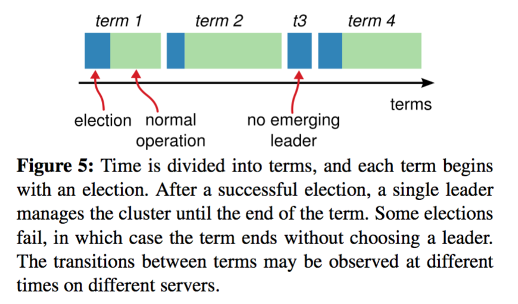
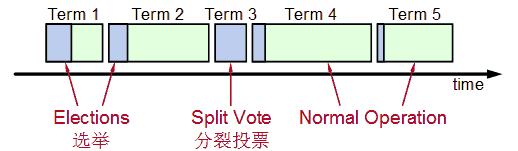

# Raft算法 #
[https://www.cnblogs.com/hzmark/p/raft.html](https://www.cnblogs.com/hzmark/p/raft.html "https://www.cnblogs.com/hzmark/p/raft.html")

Raft是一种共识算法，旨在替代Paxos。它的首要设计目的就是易于理解，所以在选主的冲突处理等方式上它都选择了非常简单明了的解决方案。

**三种节点角色**

- Leader: 处理所有客户端交互，日志复制等，一般一次只有一个Leader.
- Follower: 类似选民，完全被动
- Candidate候选人: 类似Proposer律师，可以被选为一个新的领导人。、

角色之间的转换关系：

- 所有节点初始状态都是Follower角色
- 超时时间内没有收到Leader的请求则转换为Candidate进行选举
- Candidate收到大多数节点的选票则转换为Leader；发现Leader或者收到更高任期的请求则转换为Follower
- Leader在收到更高任期的请求后转换为Follower

**任期**

每个任期都由一次选举开始，若选举失败则这个任期内没有Leader；如果选举出了Leader则这个任期内有Leader负责集群状态管理。Splite Vote是因为如果同时有两个候选人向大家邀票，这时通过类似加时赛来解决，两个候选者在一段timeout比如300ms互相不服气的等待以后，因为双方得到的票数是一样的，一半对一半，那么在300ms以后，再由这两个候选者发出邀票，这时同时的概率大大降低，那么首先发出邀票的的候选者得到了大多数同意，成为领导者Leader，而另外一个候选者后来发出邀票时，那些Follower选民已经投票给第一个候选者，不能再投票给它，它就成为落选者了，最后这个落选者也成为普通Follower一员了。

