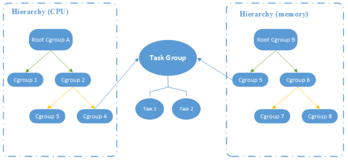

# Cgroups #

摘自[CGroup 介绍、应用实例及原理描述](https://www.cnblogs.com/caoxiaojian/p/5633430.html)

Cgroups是control groups的缩写，是Linux内核提供的一种可以限制、记录、隔离进程组（process groups）所使用的物理资源（如：cpu,memory,IO等等）的机制。这个项目最早是由Google的工程师在2006年发起（主要是Paul Menage和Rohit Seth），最早的名称为进程容器（process containers）。在2007年时，因为在Linux内核中，容器（container）这个名词太过广泛，为避免混乱，被重命名为cgroup，并且被合并到2.6.24版的内核中去。

提供的功能如下：

- 限制进程组可以使用的资源数量（Resource limiting ）。比如：memory子系统可以为进程组设定一个memory使用上限，一旦进程组使用的内存达到限额再申请内存，就会触发OOM（out of memory）

- 进程组的优先级控制（Prioritization ）。比如：可以使用cpu子系统为某个进程组分配特定cpu share

- 记录进程组使用的资源数量（Accounting ）。比如：可以使用cpuacct子系统记录某个进程组使用的cpu时间

- 进程组隔离（Isolation）。比如：使用ns子系统可以使不同的进程组使用不同的namespace，以达到隔离的目的，不同的进程组有各自的进程、网络、文件系统挂载空间

- 进程组控制（Control）。比如：使用freezer子系统可以将进程组挂起和恢复

## 相关术语 ##

- task（任务）

	task表示系统中的一个进程。
 
- cgroup（控制组）
 
	cgroups中的资源控制都以cgroup为单位实现。cgroup表示按某种资源控制标准划分而成的任务组，包含一个或多个子系统。一个任务可以加入某个cgroup，也可以从某个cgroup迁移到另外一个cgroup。
 
- subsystem（子系统）

	cgroups中的subsystem就是一个资源调度控制器（Resource Controller）。比如CPU子系统可以控制CPU时间分配，内存子系统可以限制 cgroup内存使用量。
 
- hierarchy（层级树）

	hierarchy由一系列cgroup以一个树状结构排列而成，每个hierarchy通过绑定对应的subsystem进行资源调度。hierarchy中的cgroup节点可以包含零个或多个子节点，子节点继承父节点的属性。整个系统可以有多 hierarchy。

**它们之间的关系如下**：

- 每次在系统中创建新层级时，该系统中的所有任务都是那个层级的默认cgroup（我们称之为 root cgroup，此cgroup在创建层级时自动创建，后面在该层级中创建的cgroup都是此cgroup的后代）的初始成员；

- 一个子系统最多只能附加到一个层级；
 
- 一个层级可以附加多个子系统；
 
- 一个任务可以是多个cgroup的成员，但是这些cgroup必须在不同的层级；

- 系统中的进程（task）创建子进程（task）时，该子任务自动成为其父进程所在cgroup的成员。然后可根据需要将该子任务移动到不同的cgroup中，但开始时它总是继承其父任务的cgroup。

**层级图如下**：

**子系统的介绍**

- blkio

	这个子系统为块设备设定输入/输出限制，比如物理设备（磁盘，固态硬盘，USB 等等）。

- cpu

	这个子系统使用调度程序提供对CPU的cgroup任务访问。

- cpuacct

	这个子系统自动生成cgroup中任务所使用的CPU报告。

- cpuset

	这个子系统为cgroup中的任务分配独立CPU（在多核系统）和内存节点。

- devices

	这个子系统可允许或者拒绝cgroup中的任务访问设备。

- freezer

	这个子系统挂起或者恢复cgroup中的任务。

- hugetlb

	允许限制CGroup 的HubeTLB使用

- memory

	这个子系统设定cgroup中任务使用的内存限制，并自动生成由那些任务使用的内存资源报告。

- net_cls

	这个子系统使用等级识别符（classid）标记网络数据包，可允许Linux流量控制程序（tc）识别从具体cgroup中生成的数据包。

- net_prio

	提供接口以供动态调节程序的网络传输优先级。

- perf_event

	增加了对没group的检测跟踪的能力，即可以检测属于某个特定的group的所有线程以及运行在特定CPU上的线程。

- ns

	称空间子系统