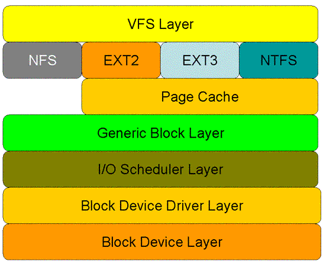

# CGroup子系统--blkio #

**Linux 4.0 IO 协议栈框架图:**

## Linux的IO体系 ##

摘自[Cgroup - Linux 的 IO 资源隔离](https://www.v2ex.com/t/251497)

**Linux中IO层级模型**

- VFS 层：虚拟文件系统层。由于内核要跟多种文件系统打交道，而每一种文件系统所实现的数据结构和相关方法都可能不尽相同，所以，内核抽象了这一层，专门用来适配各种文件系统，并对外提供统一操作接口。
- 文件系统层：不同的文件系统实现自己的操作过程，提供自己特有的特征
- 页缓存层：我们的老朋友了，如果不了解缓存是什么的，可以先来看看Linux 内存资源管理部分。
- 通用块层：由于绝大多数情况的IO操作是跟块设备打交道，所以Linux在此提供了一个类似vfs层的块设备操作抽象层。下层对接各种不同属性的块设备，对上提供统一的Block IO请求标准。
- IO 调度层：因为绝大多数的块设备都是类似磁盘这样的设备，所以有必要根据这类设备的特点以及应用的不同特点来设置一些不同的调度算法和队列。以便在不同的应用环境下有针对性的提高磁盘的读写效率。针对机械硬盘的各种调度方法就是在这实现的。
- 块设备驱动层：驱动层对外提供相对比较高级的设备操作接口，往往是C语言的，而下层对接设备本身的操作方法和规范。
- 块设备层：这层就是具体的物理设备了，定义了各种对设备操作方法和规范。

## blkio子系统 ##

Cgroup中的blkio子系统的主要功能是实现对磁盘I/O带宽的可定制化控制。目前支持的控制策略只要有两种：BLKIO_POLICY_PROP和BLKIO_POLICY_THROTL，即基于权重方式和基于流量方式。其相关用户态接口如下：

- blkio.weight

	指​​​定​​​cgroup默​​​认​​​可​​​用​​​访​​​问​​​块​​​I/O的​​​相​​​对​​​比​​​例​​​（加​​​权​​​），范​​​围​​​为​​​100到​​​1000。​​​这​​​个​​​值​​​可​​​由​​​具​​​体​​​设​​​备​​​的​​​ `blkio.weight_device`参​​​数​​​覆​​​盖​​​。

- blkio.weight_device

	指​​​定​​​对​​​cgroup中​​​可​​​用​​​的​​​具​​​体​​​设​​​备​​​I/O访​​​问​​​的​​​相​​​对​​​比​​​例​​​（加​​​权​​​），范​​​围​​​是​​​100到​​​1000。​​​这​​​个​​​值​​​可​​​由​​​为​​​设​​​备​​​指​​​定​​​的​​​`blkio.weight`参​​​数​​​覆​​​盖​​​。​​​这​​​个​​​值​​​的​​​格​​​式​​​为​​​major:minor weight，其​​​中​​​major和​​​minor是​​​设​​​备​​​类​​​型​​​和​​​节​​​点​​​数​​​，我​​​们​​​也​​​称​​​之​​​为​​​Linux设​​​备​​​列​​​表​​​。​​​例​​​如​​​运行`echo 8:0 500 > blkio.weight_device`,则表示“为​​​访​​​问​​​/dev/sda的​​​cgroup分​​​配​​​加​​​权​​​500”。
 
- blkio.time
 
	报​​​告​​​cgroup对​​​具​​​体​​​设​​​备​​​的​​​I/O访​​​问​​​时​​​间​​​。​​​一共​​​有​​​三​​​个​​​字​​​段​​​：major、​​​minor和​​​time。​​​Major和​​​minor是​​​设​​​备​​​类​​​型​​​和​​​节​​​点​​​数​​​，time是​​​时​​​间​​​长​​​度​​​，单​​​位​​​为​​​毫​​​秒​​​（ms）。
 
- blkio.sectors
 
	报​​​告​​​使​​​用​​​cgroup转​​​换​​​到​​​具​​​体​​​设​​​备​​​或​​​者​​​由​​​具​​​体​​​设​​​备​​​转​​​换​​​出​​​的​​​扇​​​区​​​数​​​。​​​条​​​目​​​有​​​三​​​个​​​字​​​段​​​：major、​​​minor和​​​sectors。​​​major、​​​minor是​​​设​​​备​​​类​​​型​​​和​​​节​​​点​​​数​​​，sectors是​​​磁​​​盘​​​扇​​​区​​​数​​​。

- blkio.io_service_bytes

	报​​​告​​​使​​​用​​​ cgroup 转​​​换​​​到​​​具​​​体​​​设​​​备​​​或​​​者​​​由​​​具​​​体​​​设​​​备​​​中​​​转​​​换​​​出​​​的​​​字​​​节​​​数​​​。​​​条​​​目​​​有​​​四​​​个​​​字​​​段​​​：major、​​​minor、​​​operation 和​​​ bytes。​​​Major 和​​​ minor 是​​​在​​​ Linux 分​​​配​​​的​​​设​​​备​​​中​​​指​​​定​​​的​​​设​​​备​​​类​​​型​​​和​​​节​​​点​​​数​​​，operation 代​​​表​​​操​​​作​​​类​​​型​​​（read、​​​write、​​​sync 或​​​者​​​ async），bytes 是​​​转​​​换​​​的​​​字​​​节​​​数​​​。​​​

- blkio.io_serviced

	报​​​告​​​使​​​用​​​cgroup在​​​具​​​体​​​设​​​备​​​中​​​执​​​行​​​的​​​I/O操​​​作​​​数​​​。​​​条​​​目​​​有​​​四​​​个​​​字​​​段​​​：major、​​​minor、​​​operation和​​number。​​​Major和​​minor是​​​设​​​备​​​类​​​型​​​和​​​节​​​点​​​数​​​，operation代​​​表​​​操​​​作​​​类​​​型​​​（read、​​​write、​​​sync或​​​者​​​ async），number代​​​表​​​操​​​作​​​数​​​。
​​​
- blkio.io_service_time

	报​​​告​​​使​​​用​​​cgroup在​​​具​​​体​​​设​​​备​​​中​​​的​​​I/O操​​​作​​​请​​​求​​​发​​​送​​​和​​​请​​​求​​​完​​​成​​​之​​​间​​​的​​​时​​​间​​​。​​​条​​​目​​​有​​​四​​​个​​​字​​​段​​​：major、​​​minor、​​​operation和​​​time。​​​Major和​​​minor是设​​​备​​​类​​​型​​​和​​​节​​​点​​​数​​​，operation代​​​表​​​操​​​作​​​类​​​型​​​（read、​​​write、​​​sync或​​​者​​​async），time是​​​时​​​间​​​长​​​度​​​，单​​​位​​​为​​​纳​​​秒​​​（ns）。​​​使​​​用​​​纳​​​秒​​​为​​​单​​​位​​​报​​​告​​​而​​​不​​​是​​​较​​​大​​​的​​​单​​​位​​​是​​​要​​​使​​​报​​​告​​​即​​​使​​​对​​​固​​​态​​​设​​​备​​​也​​​是​​​有​​​意​​​义​​​的​​​。
​​​
- blkio.io_wait_time

	报​​​告​​​在​​​具​​​体​​​设​​​备​​​中​​​cgroup为​​​调​​​度​​​程​​​序​​​队​​​列​​​中​​​等​​​待​​​的​​​I/O操​​​作​​​时​​​间​​​总​​​计​​​。​​​请​​​注​​​意​​​：

	1、报​​​告​​​的​​​时​​​间​​​可​​​以​​​比​​​消​​​耗​​​的​​​时​​​间​​​更​​​长​​​，因​​​为​​​报​​​告​​​的​​​时​​​间​​​是​​​该​​​cgroup所​​​有​​​I/O操​​​作​​​的​​​总​​​和​​​，而​​​不​​​是​​​该​​​ cgroup本​​​身​​​等​​​待​​​I/O操​​​作​​​的​​​时​​​间​​​。​​​要​​​查​​​找​​​该​​​组​​​群​​​作​​​为​​​整​​​体​​​而​​​消​​​耗​​​的​​​等​​​待​​​时​​​间​​​，请​​​使​​​用​​​`blkio.group_wait_time`。

	2​​​、如​​​果​​​该​​​设​​​备​​​有​​​queue_depth > 1，则​​​报​​​告​​​的​​​时​​​间​​​只​​​包​​​括​​​向​​​该​​​设​​​备​​​发​​​送​​​请​​​求​​​之​​​前​​​的​​​时​​​间​​​，而​​​不​​​包​​​括​​​在​​​该​​​设​​​备​​​重​​​新​​​提​​​出​​​请​​​求​​​时​​​等​​​待​​​服​​​务​​​的​​​任​​​何​​​时​​​间​​​。
​​​
- blkio.io_merged

	报​​​告​​​使​​​用​​​cgroup将​​​BIOS请​​​求​​​合​​​并​​​到​​​I/O操​​​作​​​请​​​求​​​的​​​次​​​数​​​。​​​条​​​目​​​有​​​两​​​个​​​字​​​段​​​：number和​​​operation。​​​Number是​​​请​​​求​​​次​​​数​​​，operation代​​​表​​​操​​​作​​​类​​​型​​​（read、​​​write、​​​sync或​​​者​​​async）。
​​​
- blkio.io_queued

	报​​​告​​​cgroup为​​​I/O操​​​作​​​排​​​队​​​的​​​请​​​求​​​次​​​数​​​。​​​条​​​目​​​有​​​两​​​个​​​字​​​段​​​：number和​​​operation。​​​Number是​​​请​​​求​​​次​​​数​​​，operation 代​​​表​​​操​​​作​​​类​​​型​​​（read、​​​write、​​​sync或​​​者​​​async）。
​​​
- blkio.avg_queue_size

	报​​​告​​​在​​​该​​​组​​​群​​​存​​​在​​​的​​​整​​​个​​​过​​​程​​​中​​​，cgroup的​​​I/O操​​​作​​​的​​​平​​​均​​​队​​​列​​​大​​​小​​​。​​​每​​​次​​​这​​​个​​​cgroup获​​​得​​​一​​​个​​​时​​​间​​​单​​​位​​​时​​​都​​​对​​​该​​​队​​​列​​​大​​​小​​​进​​​行​​​采​​​样​​​。​​​请​​​注​​​意​​​这​​​个​​​报​​​告​​​只​​​有​​​在​​​将​​​系​​​统​​​设​​​定​​​为​​​`CONFIG_DEBUG_BLK_CGROUP=y`时​​​可​​​用​​​。
​​​
- blkio.group_wait_time
 
	报​​​告​​​cgroup等​​​待​​​每​​​个​​​队​​​列​​​的​​​时​​​间​​​总​​​计​​​（单​​​位​​​为​​​纳​​​秒​​​ -ns）。​​​每​​​次​​​这​​​个​​​cgroup的​​​队​​​列​​​获​​​得​​​一​​​个​​​时​​​间​​​单​​​位​​​时​​​就​​​会​​​更​​​新​​​这​​​个​​​报​​​告​​​，因​​​此​​​如​​​果​​​在​​​cgroup等​​​待​​​时​​​间​​​单​​​位​​​时​​​读​​​取​​​这​​​个​​​伪​​​文​​​件​​​，则​​​该​​​报​​​告​​​将​​​不​​​会​​​包​​​含​​​等​​​待​​​当​​​前​​​队​​​列​​​中​​​的​​​操​​​作​​​的​​​时​​​间​​​。​​​请​​​注​​​意​​​这​​​个​​​报​​​告​​​只​​​有​​​在​​​将​​​系​​​统​​​设​​​定​​​为​​​`CONFIG_DEBUG_BLK_CGROUP=y`时​​​可​​​用​​​。​​​

- blkio.empty_time

	报​​​告​​​cgroup在​​​没​​​有​​​任​​​何​​​等​​​待​​​处​​​理​​​请​​​求​​​时​​​花​​​费​​​的​​​时​​​间​​​总​​​计​​​（单​​​位​​​为​​​纳​​​秒​​​ -ns）。​​​每​​​次​​​这​​​个​​​cgroup有​​​等​​​待​​​处​​​理​​​请​​​求​​​时​​​都​​​会​​​更​​​新​​​这​​​个​​​报​​​告​​​，因​​​此​​​如​​​果​​​​​​在​​​cgroup没​​​有​​​任​​​何​​​等​​​待​​​处​​​理​​​请​​​求​​​是​​​读​​​取​​​这​​​个​​​伪​​​文​​​件​​​，则​​​该​​​报​​​告​​​中​​​不​​​会​​​包​​​含​​​消​​​耗​​​在​​​当​​​前​​​空​​​状​​​态​​​中​​​的​​​时​​​间​​​。​​​请​​​注​​​意​​​这​​​个​​​报​​​告​​​只​​​有​​​在​​​将​​​该​​​系​​​统​​​设​​​定​​​为​​​`CONFIG_DEBUG_BLK_CGROUP=y`时​​​可​​​用​​​。
​​​
- blkio.idle_time

	报​​​告​​​调​​​度​​​程​​​序​​​在​​​cgroup等​​​待​​​比​​​已​​​经​​​在​​​其​​​它​​​队​​​列​​​或​​​者​​​来​​​自​​​其​​​它​​​组​​​群​​​请​​​求​​​更​​​好​​​的​​​请​​​求​​​时​​​显​​​示​​​闲​​​置​​​的​​​时​​​间​​​总​​​计​​​（单​​​位​​​为​​​纳​​​秒​​​ -ns）。​​​每​​​次​​​该​​​组​​​群​​​不​​​显​​​示​​​闲​​​置​​​时​​​就​​​会​​​更​​​新​​​这​​​个​​​报​​​告​​​，因​​​此​​​如​​​果​​​​​​在​​​cgroup闲​​​置​​​时​​​读​​​取​​​这​​​个​​​伪​​​文​​​件​​​，则​​​该​​​报​​​告​​​将​​​不​​​会​​​包​​​括​​​消​​​耗​​​在​​​当​​​前​​​闲​​​置​​​状​​​态​​​的​​​时​​​间​​​。​​​请​​​注​​​意​​​，只​​​有​​​在​​​将​​​系​​​统​​​设​​​定​​​为​​​`CONFIG_DEBUG_BLK_CGROUP=y`时​​​这​​​个​​​报​​​告​​​才​​​可​​​用​​​。
​​​
- blkio.dequeue

	报​​​告​​​cgroup的​​​I/O操​​​作​​​请​​​求​​​被​​​具​​​体​​​设​​​备​​​从​​​队​​​列​​​中​​​移​​​除​​​的​​​次​​​数​​​。​​​条​​​目​​​有​​​三​​​个​​​字​​​段​​​：major、​​​minor和​​​number。​​​major和​​​minor是​​​设​​​备​​​类​​​型​​​和​​​节​​​点​​​数​​​，number是​​​将​​​该​​​组​​​群​​​从​​​队​​​列​​​中​​​移​​​除​​​的​​​次​​​数​​​。​​​请​​​注​​​意​​​这​​​个​​​报​​​告​​​只​​​有​​​在​​​将​​​系​​​统​​​设​​​定​​​为​​​`CONFIG_DEBUG_BLK_CGROUP=`时​​​可​​​用​​​。
​​​
- blkio.reset_stats

	重​​​新​​​设​​​定​​​在​​​其​​​它​​​伪​​​文​​​件​​​中​​​记​​​录​​​的​​​统​​​计​​​数​​​据​​​。​​​在​​​这​​​个​​​文​​​件​​​中​​​写​​​入​​​一​​​个​​​整​​​数​​​为​​​这​​​个​​​cgroup重​​​新​​​设​​​定​​​统​​​计​​​数​​​据​​​。​​​​​​​​​