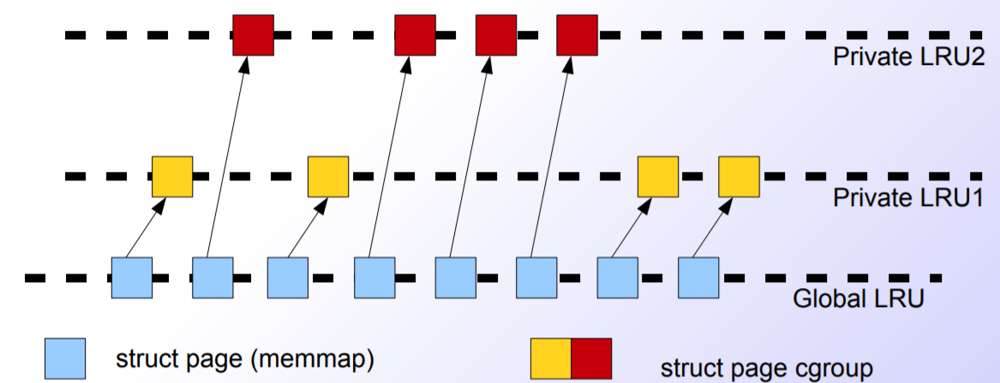

# Cgroup子系统--memory #

## Linux内存回收机制 ##

摘自[docker cgroup 技术之memory（首篇）](https://www.cnblogs.com/charlieroro/p/10180827.html)

用户进程的内存页分为两种：file-backed pages（与文件对应的内存页），和anonymous pages（匿名页），比如进程的代码、映射的文件都是file-backed，而进程的堆、栈都是不与文件相对应的、就属于匿名页。file-backed pages在内存不足的时候可以直接写回对应的硬盘文件里，称为page-out，不需要用到交换区(swap)。/proc/meminfo中有一个dirty字段(所有的drity=Dirty+NFS_Unstable+Writeback)，为了维护数据的一致性，内核在清空内存前会对内存中的数据进行写回操作，此时内存中的数据也被称为脏数据，如果需要清空的内存比较大，可能会消耗大量系统io资源；而anonymous pages在内存不足时就只能写到硬盘上的交换区(swap)里，称为swap-out，匿名页即将被swap-out时会先被放进swap cache，在数据写入硬盘后，swap cache才会被free。

[查看更多](http://linuxperf.com/?cat=7)


**回收LRU上内存的三种方式**

- 使用kswapd进行周期性检查，linux的内存被分为不同的zone，每个zone中都有3个字段：page_min,page_low,page_high，kswapd依据这3个值进行内存回收。linux 32位和64位定义的zone是不同的，可以在/proc/zoneinfo中查看zone的具体信息。

- 内存严重不足时触发OOM-killer，当kswapd回收后仍然不满足需求时才会触发该机制。

- 使用/proc/sys/vm/drop_caches手动释放内存。


## Memory子系统 ##


memory cgroup的主要功能：

- 限制memory(含匿名和文件映射，swap cache)

- 限制swap+memory

- 统计cgroup的内存信息

- 为每个cgroup设置内存软限制

memory子系统中以`memory.kmem.`开头的伪文件用于设置cgroup的内核参数，这些功能被称为内核内存扩展(CONFIG_MEMCG_KMEM)，用于限制cgroup中进程占用的内核内存资源，一般用的比较少。内核内存不会使用swap。系统默认会开启这些功能，可以使用如下命令查看是否打开：

```
cat /boot/config-`uname -r`|grep CONFIG_MEMCG
CONFIG_MEMCG=y
CONFIG_MEMCG_SWAP=y
CONFIG_MEMCG_SWAP_ENABLED=y
CONFIG_MEMCG_KMEM=y
```

cgroup内存的回收与linux系统的内存回收机制类似，每个cgroup都有对应的LRU，当内存cgroup的内存达到限定值时会触发LRU上的内存回收。需要注意的是cgroup无法控制全局LRU的内存回收，因此在系统内存匮乏的时候，会触发全局LRU上内存的swap操作，此时cgroup无法限制这种行为(如cgroup限制了swap的大小为1G，但此时可能会超过1G)。下图可以看出cgoup的LRU控制的内存也在全局LRU所控制的范围内。




**memory子系统参数**

摘自[资源管理-memory](https://access.redhat.com/documentation/zh-cn/red_hat_enterprise_linux/6/html/resource_management_guide/sec-memory)

- memory.oom_control

	内存超限之后的oom行为控制。该文件中有两个值：

	1、oom_kill_disable 0

		默认为0，表示打开oom killer，即是当内存超限时会Kill掉进程。如果设置为1则表示关闭oom killer，当内存超限时内核就不会kill掉进程，而是夯住进程，此进程会被置为D状态，并且内核会将其放到`OOM-waitqueue`队列中，当此Cgroup中有足够的内存供进程使用时，OOM-waitqueue`队列中的进程又可以继续运行。

	2、under_oom 0
	
		此字段是只读的，用来表示当前的cgroup是不是已经进入了oom状态，如果是，这个值将置为1。

	`cgroup.event_control`用来与`memory.oom_control`配合，在触发oom-kill的时候给出事件通知。事件级别有low，medium和critical三种，事件传递有default，hierarchy，local三种。示例参考[OOM 控制和通知](https://access.redhat.com/documentation/zh-cn/red_hat_enterprise_linux/7/html/resource_management_guide/sec-memory#memory_example-usage)。

- memory.stat

	内​​​存​​​统​​​计信息。具体参数如下：
	

	注：除​​​`hierarchical_memory_limit`和​​​`hierarchical_memsw_limit`​外​​​，其余参数都​​​有​​​一​​​个​​​对​​​应​​​前​​​缀`total`​​​。​​​例​​​如​​​：swap报​​​告​​​cgroup的​​​swap用​​​量​​​，total_swap报​​​告​​​该​​​cgroup及​​​其​​​所​​​有​​​子​​​组​​​群​​​的​​​swap用​​​量​​​总​​​和​​​。另外：

		`active_anon + inactive_anon = 匿​​​名​​​内​​​存​​​ + tmpfs 的​​​文​​​件​​​缓​​​存​​​ + swap 缓​​​存`

		`active_anon + inactive_anon ≠​​​ rss`

		​​​`active_file + inactive_file = 缓​​​存​​​减​​​去​​​tmpfs大​​​小`​​​​​​

- memory.usage_in_bytes

	统计​​​该​​​cgroup中​​​进​​​程​​​使​​​用​​​的​​​当​​​前​​​总​​​内​​​存​​​用​​​量​​​（以​​​字​​​节​​​为​​​单​​​位​​​）。
​​​
- memory.memsw.usage_in_bytes

	统计该​​​cgroup中​​​进​​​程​​​使​​​用​​​的​​​当​​​前​​​内​​​存​​​用​​​量​​​和​​​swap空​​​间​​​总​​​和​​​（以​​​字​​​节​​​为​​​单​​​位​​​）。
​​​
- memory.max_usage_in_bytes

	统计​​​该​​​cgroup中​​​进​​​程​​​使​​​用​​​的​​​最​​​大​​​内​​​存​​​用​​​量​​​（以​​​字​​​节​​​为​​​单​​​位​​​）。
​​​
- memory.memsw.max_usage_in_bytes

	统计​​​该​​​cgroup中​​​进​​​程​​​使​​​用​​​的​​​最​​​大​​​内​​​存​​​用​​​量​​​和​​​swap空​​​间​​​用​​​量​​​（以​​​字​​​节​​​为​​​单​​​位​​​）。
​​​
- memory.limit_in_bytes

	内存硬限制。设​​​定​​​用​​​户​​​内​​​存​​​的​​​最​​​大​​​量​​​（包​​​括​​​文​​​件​​​缓​​​存​​​）。​​​如​​​果​​​没​​​有​​​指​​​定​​​单​​​位​​​，则​​​将​​​该​​​数​​​值​​​理​​​解​​​为​​​字​​​节​​​。​​​但​​​是​​​可​​​以​​​使​​​用​​​前​​​缀​​​代​​​表​​​更​​​大​​​的​​​单​​​位​​​-k或​​​者​​​K代​​​表​​​千​​​字​​​节​​​，m或​​​者​​​M代​​​表​​​MB，g或​​​者​​​G代​​​表​​​GB。如果配置为`-1`则表示解除现有限制。另外注意​​​无法​​​使​​​用​​​memory.limit_in_bytes限​​​制​​​root cgroup，只​​​能​​​在​​​该​​​层​​​级​​​中​​​较​​​低​​​的​​​组​​​群​​​中​​​应​​​用​​​这​​​些​​​值​​​。

- memory.soft_limit_in_bytes

	内存软限制。与`memory.limit_in_bytes`不同的是，这个限制并不会阻止进程使用超过限额的内存，只是在系统内存不足时，会优先回收超过限额的进程占用的内存，使之向限定值靠拢。如果想要软限制生效，应该把它的值设置成小于硬限制。​​​
​​​
- memory.memsw.limit_in_bytes

	设​​​定​​​最​​​大​​​内​​​存​​​与​​​swap用​​​量​​​之​​​和​​​。​​​​​​同样无法​​​使​​​用​​​memory.memsw.limit_in_bytes限​​​制​​​ root cgroup；只​​​能​​​在​​​该​​​层​​​级​​​中​​​较​​​低​​​的​​​组​​​群​​​中​​​应​​​用​​​这​​​些​​​值​​​。​​​
​​​
- memory.failcnt

	统计​​​内​​​存​​​达​​​到​​​在​​​`memory.limit_in_bytes`设​​​定​​​的​​​限​​​制​​​值​​​的​​​次​​​数​​​。
​​​
- memory.memsw.failcnt

	统计内​​​存​​​加​​​swap空​​​间​​​限​​​制​​​达​​​到​​​在​​​`memory.memsw.limit_in_bytes`设​​​定​​​的​​​值​​​的​​​次​​​数​​​。
​​​
- memory.force_empty

	当​​​设​​​定​​​为​​​0时​​​，会​​​清​​​空​​​这​​​个​​​cgroup中​​​任​​​务​​​所​​​使​​​用​​​的​​​所​​​有​​​页​​​面​​​的​​​内​​​存​​​。​​​这​​​个​​​接​​​口​​​只​​​可​​​在​​​cgroup中​​​没​​​有​​​任​​​务​​​时​​​使​​​用​​​。​​​如​​​果​​​无​​​法​​​清​​​空​​​内​​​存​​​，则​​​在​​​可​​​能​​​的​​​情​​​况​​​下​​​将​​​其​​​移​​​动​​​到​​​上​​​级​​​cgroup中​​​。​​​删​​​除​​​cgroup前​​​请​​​使​​​用​​​`memory.force_empty`以​​​避​​​免​​​将​​​不​​​再​​​使​​​用​​​的​​​页​​​面​​​缓​​​存​​​移​​​动​​​到​​​它​​​的​​​上​​​级​​​cgroup中​​​。
​​​
- memory.swappiness

	将​​​内​​​核​​​倾​​​向​​​设​​​定​​​为​​​换​​​出​​​这​​​个​​​cgroup中​​​任​​​务​​​所​​​使​​​用​​​的​​​进​​​程​​​内​​​存​​​，而​​​不​​​是​​​从​​​页​​​缓​​​冲​​​中​​​再​​​生​​​页​​​面​​​。​​​这​​​也​​​是​​​在​​​`/proc/sys/vm/swappiness`中​​​设​​​定​​​的​​​使​​​用​​​同​​​一​​​方​​​法​​​为​​​整​​​个​​​系​​​统​​​设​​​定​​​的​​​内​​​核​​​倾​​​向​​​。​​​默​​​认​​​值​​​为​​​ 60。​​​低​​​于​​​这​​​个​​​值​​​会​​​降​​​低​​​内​​​核​​​换​​​出​​​进​​​程​​​内​​​存​​​的​​​倾​​​向​​​，将​​​其​​​设​​​定​​​为​​​0则​​​完​​​全​​​不​​​会​​​为​​​cgroup中​​​的​​​任​​​务​​​换​​​出​​​进​​​程​​​内​​​存​​​。​​​高​​​于​​​这​​​个​​​值​​​将​​​提​​​高​​​内​​​核​​​换​​​出​​​进​​​程​​​内​​​存​​​的​​​倾​​​向​​​，大​​​于​​​100时​​​内​​​核​​​将​​​开​​​始​​​换​​​出​​​作​​​为​​​这​​​个​​​cgroup中​​​进​​​程​​​的​​​地​​​址​​​空​​​间​​​一​​​部​​​分​​​的​​​页​​​面​​​。​​​

	注​​​意设置为0不​​​会​​​阻​​​止​​​换​​​出​​​进​​​程​​​内​​​存​​​；系​​​统​​​缺​​​少​​​内​​​存​​​时​​​仍​​​可​​​能​​​发​​​生​​​换​​​出​​​内​​​存​​​，这​​​是​​​因​​​为​​​全​​​局​​​虚​​​拟​​​内​​​存​​​管​​​理​​​逻​​​辑​​​不​​​读​​​取​​​该​​​cgroup值​​​。​​​要​​​完​​​全​​​锁​​​定​​​页​​​面​​​，请​​​使​​​用​​​ mlock() 而​​​不​​​是​cgroup。
​​​
	​​以​​​下​​​组​​​群​​​的​​​swappiness无法更改：

		1、root cgroup，它​​​使​​​用​​​在​​​`/proc/sys/vm/swappiness`中​​​设​​​定​​​的​​​swappiness。​​​
		2、有​​​属​​​于​​​它​​​的​​​子​​​组​​​群​​​的​​​cgroup。
​​​
- memory.use_hierarchy

	包​​​含​​​指​​​定​​​是​​​否​​​应​​​将​​​内​​​存​​​用​​​量​​​计​​​入​​​cgroup层​​​级​​​的​​​吞​​​吐​​​量​​​的​​​标​​​签​​​（0或​​​者​​​1）。​​​如​​​果​​​启​​​用​​​（1），内​​​存​​​子​​​系​​​统​​​会​​​从​​​超​​​过​​​其​​​内​​​存​​​限​​​制​​​的​​​子​​​进​​​程​​​中​​​再​​​生​​​内​​​存​​​。​​​默​​​认​​​情​​​况​​​（0）是​​​子​​​系​​​统​​​不​​​从​​​任​​​务​​​的​​​子​​​进​​​程​​​中​​​再​​​生​​​内​​​存​​​。

- memory.move_charge_at_immigrate

	配置进程所占用的内存是否随着进程的迁移一起迁移到新的cgroup中（0或者1），默认为1，即迁移的时候要在新的cgroup中累积（charge）原来信息，并把旧group中的信息给uncharge掉。如果新cgroup中没有足够的空间容纳新来的进程，首先内核会在cgroup内部回收内存，如果还是不够，就会迁移失败。​​​