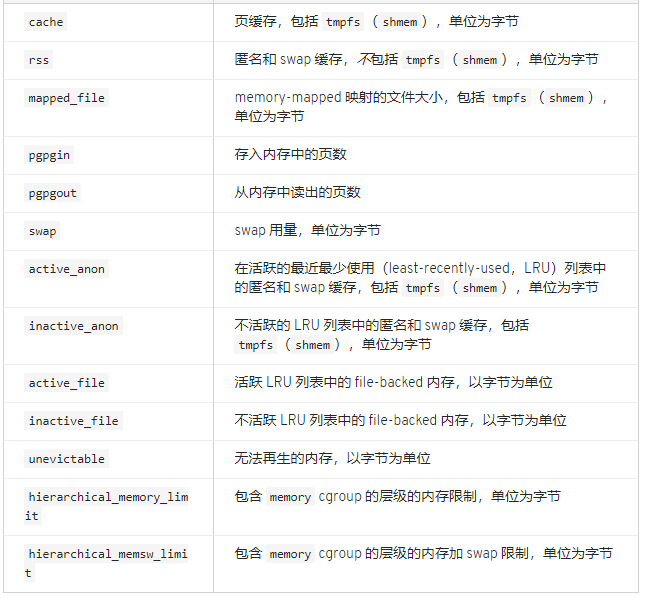

# Cgroup子系统--memory #

**memory子系统参数**

摘自[资源管理-memory](https://access.redhat.com/documentation/zh-cn/red_hat_enterprise_linux/6/html/resource_management_guide/sec-memory)

- memory.stat

	内​​​存​​​统​​​计信息。具体参数如下：
	

	注：除​​​`hierarchical_memory_limit`和​​​`hierarchical_memsw_limit`​外​​​，其余参数都​​​有​​​一​​​个​​​对​​​应​​​前​​​缀`total`​​​。​​​例​​​如​​​：swap报​​​告​​​cgroup的​​​swap用​​​量​​​，total_swap报​​​告​​​该​​​cgroup及​​​其​​​所​​​有​​​子​​​组​​​群​​​的​​​swap用​​​量​​​总​​​和​​​。另外：

		`active_anon + inactive_anon = 匿​​​名​​​内​​​存​​​ + tmpfs 的​​​文​​​件​​​缓​​​存​​​ + swap 缓​​​存`

​​		`active_anon + inactive_anon ≠​​​ rss`

		​​​`active_file + inactive_file = 缓​​​存​​​减​​​去​​​tmpfs大​​​小`​​​​​​

- memory.usage_in_bytes

	统计​​​该​​​cgroup中​​​进​​​程​​​使​​​用​​​的​​​当​​​前​​​总​​​内​​​存​​​用​​​量​​​（以​​​字​​​节​​​为​​​单​​​位​​​）。
​​​
- memory.memsw.usage_in_bytes

	统计该​​​cgroup中​​​进​​​程​​​使​​​用​​​的​​​当​​​前​​​内​​​存​​​用​​​量​​​和​​​swap空​​​间​​​总​​​和​​​（以​​​字​​​节​​​为​​​单​​​位​​​）。
​​​
- memory.max_usage_in_bytes

	统计​​​该​​​cgroup中​​​进​​​程​​​使​​​用​​​的​​​最​​​大​​​内​​​存​​​用​​​量​​​（以​​​字​​​节​​​为​​​单​​​位​​​）。
​​​
- memory.memsw.max_usage_in_bytes

	统计​​​该​​​cgroup中​​​进​​​程​​​使​​​用​​​的​​​最​​​大​​​内​​​存​​​用​​​量​​​和​​​swap空​​​间​​​用​​​量​​​（以​​​字​​​节​​​为​​​单​​​位​​​）。
​​​
- memory.limit_in_bytes

	设​​​定​​​用​​​户​​​内​​​存​​​的​​​最​​​大​​​量​​​（包​​​括​​​文​​​件​​​缓​​​存​​​）。​​​如​​​果​​​没​​​有​​​指​​​定​​​单​​​位​​​，则​​​将​​​该​​​数​​​值​​​理​​​解​​​为​​​字​​​节​​​。​​​但​​​是​​​可​​​以​​​使​​​用​​​前​​​缀​​​代​​​表​​​更​​​大​​​的​​​单​​​位​​​-k或​​​者​​​K代​​​表​​​千​​​字​​​节​​​，m或​​​者​​​M代​​​表​​​MB，g或​​​者​​​G代​​​表​​​GB。如果配置为`-1`则表示解除现有限制。另外注意​​​无法​​​使​​​用​​​memory.limit_in_bytes限​​​制​​​root cgroup，只​​​能​​​在​​​该​​​层​​​级​​​中​​​较​​​低​​​的​​​组​​​群​​​中​​​应​​​用​​​这​​​些​​​值​​​。​​​
​​​
- memory.memsw.limit_in_bytes

	设​​​定​​​最​​​大​​​内​​​存​​​与​​​swap用​​​量​​​之​​​和​​​。​​​​​​同样无法​​​使​​​用​​​memory.memsw.limit_in_bytes限​​​制​​​ root cgroup；只​​​能​​​在​​​该​​​层​​​级​​​中​​​较​​​低​​​的​​​组​​​群​​​中​​​应​​​用​​​这​​​些​​​值​​​。​​​
​​​
- memory.failcnt

	统计​​​内​​​存​​​达​​​到​​​在​​​`memory.limit_in_bytes`设​​​定​​​的​​​限​​​制​​​值​​​的​​​次​​​数​​​。
​​​
- memory.memsw.failcnt

	统计内​​​存​​​加​​​swap空​​​间​​​限​​​制​​​达​​​到​​​在​​​`memory.memsw.limit_in_bytes`设​​​定​​​的​​​值​​​的​​​次​​​数​​​。
​​​
- memory.force_empty

	当​​​设​​​定​​​为​​​0时​​​，会​​​清​​​空​​​这​​​个​​​cgroup中​​​任​​​务​​​所​​​使​​​用​​​的​​​所​​​有​​​页​​​面​​​的​​​内​​​存​​​。​​​这​​​个​​​接​​​口​​​只​​​可​​​在​​​cgroup中​​​没​​​有​​​任​​​务​​​时​​​使​​​用​​​。​​​如​​​果​​​无​​​法​​​清​​​空​​​内​​​存​​​，则​​​在​​​可​​​能​​​的​​​情​​​况​​​下​​​将​​​其​​​移​​​动​​​到​​​上​​​级​​​cgroup中​​​。​​​删​​​除​​​cgroup前​​​请​​​使​​​用​​​`memory.force_empty`以​​​避​​​免​​​将​​​不​​​再​​​使​​​用​​​的​​​页​​​面​​​缓​​​存​​​移​​​动​​​到​​​它​​​的​​​上​​​级​​​cgroup中​​​。
​​​
- memory.swappiness

	将​​​内​​​核​​​倾​​​向​​​设​​​定​​​为​​​换​​​出​​​这​​​个​​​cgroup中​​​任​​​务​​​所​​​使​​​用​​​的​​​进​​​程​​​内​​​存​​​，而​​​不​​​是​​​从​​​页​​​缓​​​冲​​​中​​​再​​​生​​​页​​​面​​​。​​​这​​​也​​​是​​​在​​​`/proc/sys/vm/swappiness`中​​​设​​​定​​​的​​​使​​​用​​​同​​​一​​​方​​​法​​​为​​​整​​​个​​​系​​​统​​​设​​​定​​​的​​​内​​​核​​​倾​​​向​​​。​​​默​​​认​​​值​​​为​​​ 60。​​​低​​​于​​​这​​​个​​​值​​​会​​​降​​​低​​​内​​​核​​​换​​​出​​​进​​​程​​​内​​​存​​​的​​​倾​​​向​​​，将​​​其​​​设​​​定​​​为​​​0则​​​完​​​全​​​不​​​会​​​为​​​cgroup中​​​的​​​任​​​务​​​换​​​出​​​进​​​程​​​内​​​存​​​。​​​高​​​于​​​这​​​个​​​值​​​将​​​提​​​高​​​内​​​核​​​换​​​出​​​进​​​程​​​内​​​存​​​的​​​倾​​​向​​​，大​​​于​​​100时​​​内​​​核​​​将​​​开​​​始​​​换​​​出​​​作​​​为​​​这​​​个​​​cgroup中​​​进​​​程​​​的​​​地​​​址​​​空​​​间​​​一​​​部​​​分​​​的​​​页​​​面​​​。​​​注​​​意设置为0不​​​会​​​阻​​​止​​​换​​​出​​​进​​​程​​​内​​​存​​​；系​​​统​​​缺​​​少​​​内​​​存​​​时​​​仍​​​可​​​能​​​发​​​生​​​换​​​出​​​内​​​存​​​，这​​​是​​​因​​​为​​​全​​​局​​​虚​​​拟​​​内​​​存​​​管​​​理​​​逻​​​辑​​​不​​​读​​​取​​​该​​​cgroup值​​​。​​​要​​​完​​​全​​​锁​​​定​​​页​​​面​​​，请​​​使​​​用​​​ mlock() 而​​​不​​​是​cgroup。​​​
	​​以​​​下​​​组​​​群​​​的​​​swappiness无法更改：
		root cgroup，它​​​使​​​用​​​在​​​`/proc/sys/vm/swappiness`中​​​设​​​定​​​的​​​swappiness。​​​
		有​​​属​​​于​​​它​​​的​​​子​​​组​​​群​​​的​​​cgroup。
​​​
- memory.use_hierarchy

	包​​​含​​​指​​​定​​​是​​​否​​​应​​​将​​​内​​​存​​​用​​​量​​​计​​​入​​​cgroup层​​​级​​​的​​​吞​​​吐​​​量​​​的​​​标​​​签​​​（0或​​​者​​​1）。​​​如​​​果​​​启​​​用​​​（1），内​​​存​​​子​​​系​​​统​​​会​​​从​​​超​​​过​​​其​​​内​​​存​​​限​​​制​​​的​​​子​​​进​​​程​​​中​​​再​​​生​​​内​​​存​​​。​​​默​​​认​​​情​​​况​​​（0）是​​​子​​​系​​​统​​​不​​​从​​​任​​​务​​​的​​​子​​​进​​​程​​​中​​​再​​​生​​​内​​​存​​​。​​​