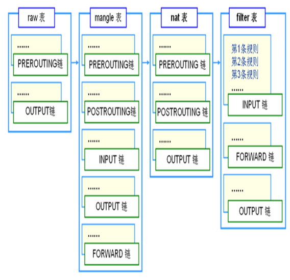

# Iptables #

[iptabels详解系列文章](http://www.zsythink.net/archives/1199)

iptables是Linux内核中的防火墙软件netfilter的管理工具，位于用户空间，同时也是netfilter的一部分。Netfilter位于内核空间，不仅有网络地址转换的功能，也具备数据包内容修改、以及数据包过滤等防火墙功能。netfilter/iptables的最大优点是它可以配置有状态的防火墙，有状态的防火墙能够指定并记住为发送或接收信息包所建立的连接的状态。防火墙可以从信息包的连接跟踪状态获得该信息。在决定新的信息包过滤时，防火墙所使用的这些状态信息可以增加其效率和速度。这里有四种有效状态，名称分别为ESTABLISHED、INVALID、NEW和RELATED。

## 四表五链 ##

**四表**

- filter表 —— 过滤数据包；内核模块：iptabels_filter
- Nat表 —— 用于网络地址转换（IP、端口）；内核模块：iptables_nat
- Mangle表 —— 修改数据包，重新封装；内核模块：iptabels_mangle
- Raw表 —— 决定数据包是否被状态跟踪机制处理;内核模块：iptables_raw

**五链**

- INPUT链 —— 处理输入数据包
- OUTPUT链 —— 处理输出数据包
- FORWARD链 —— 处理转发数据包
- PREROUTING链 —— 处理进入路由表之前的数据包
- POSTROUTING链 —— 处理发送到网卡接口之前的数据包

**链表关系**

## 数据包处理 ##

**数据包处理流程**

**数据包处理动作**

- ACCEPPT：接受数据包。

- DROP：直接丢弃数据包。不给任何回应信息，这时候客户端会感觉自己的请求沉入大海，等过了超时时间才会有反应。

- REJECT: 拒绝数据包通过，必要时会给源地址发送一个响应包。

- REDIRECT：重定向、映射、透明代理。
 
- SNAT：源地址转换。
 
- DNAT：目标地址转换。
 
- MASQUERADE：IP伪装（NAT），用于ADSL。是SNAT的一种特殊形式，适用于动态的，临时会变的IP上。
 
- LOG：日志记录。在/var/log/messages文件中记录日志信息。除了记录对数据包不做任何动作。
