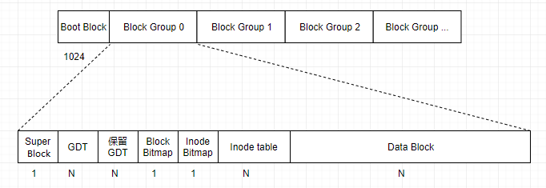

# EXT文件系统原理 #

## 文件系统结构 ##
开局一张图，内容全靠编

## Block ##
一个块大小一般为1K或2K或4K，文件系统以Block为读写单位，即使一个小于1K大小的文件也会占用1个block，如果一个环境中会产生大量的小文件，这将会非常占用存储空间。

## Inode ##
我们知道在Linux系统内，我们存储一个文件，不仅会关心它里边存储的数据，还会关心它的类型、所有者、大小、时间戳、权限等，这些信息没有与文件数据存储在一起，而是存储在Inode（索引节点）中，在Inode中有一个非常重要的数据，就是指向属于该文件数据block的指针，系统通过扫描该Inode就可以找到属于该文件在数据块的block，这样就避免遍历所有块来查找文件数据。一个Inode的大小一般为128字节或者256字节。

## Inode table ##
我们现在知道了，一个Inode为128字节或者256字节，文件系统以block为读写单位，而它最小为1K，如果一个Inode就占用一个block未免有点太过浪费了，所以就有了Inode表。Inode表其实就是把一些Inode组合起来在逻辑上组成一张表。

## Inode位图 ##
在磁盘做格式化之后所有的inode号都已经分配并存储在inode表里面了，这个时候inode表里只有一些inode号，其它都是空的，当有文件写入时就会为其分配一个inode号，并填充其它元数据信息。但是操作系统是如何知道哪个inode号是未被使用的呢，它当然不会去扫描整个inode表，这样会有较大的性能损耗，所以出现了inode位图（inodemap），它专门用来标记一个inode号是否被使用。一个字节八位，也就是说一个字节可以标记八个inode号，操作系统扫描inode位图就能知道哪些inode号未被分配。

## 块位图 ##
我们知道一个文件写入时不仅要写入其元数据信息，还要写入自身数据，同样操作系统会在Data Block区为其寻找未被使用的Block去填充数据。如inode位图一样，块位图（bitmap）标记Data Block中的block是否被填充了数据，操作系统扫描块位图就知道如何为待写入数据分配Block。

## Block Group ##
随着计算机技术的飞速发展，现在需要保存的数据越来越大。虽然操作系统扫描Inode位图、块位图已经能较快地为文件分配inode号与数据block，但面对大量数据写入时还是比较消耗性能，一次写入要扫描整张表。解决方法就是把一块分区分为很多Block Group，每个Block Group都包含了元数据Block和Data Block，这样Inode位图与块位图就很小，扫描起来也会快很多，极大地提高了写入性能。
操作系统是如何来划分Block Group的呢？
我们看看开头的那张图，一个Block Group中用一个block来存储块位图，如果一个Block为1K（当然还可能为2K或者4K，算法一样）的话，一个1K大小的块位图能标记1*1024*8=8192个Block，即能标记8192/1024=8M的Block，也就是说一个Block Group大小为8M。

## Super Block ##

