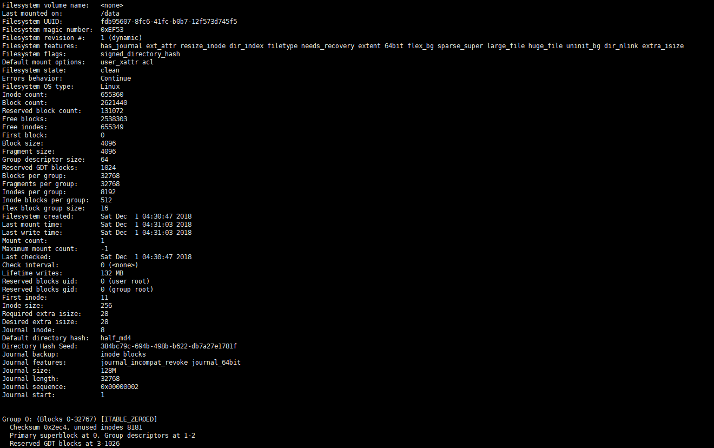

# EXT文件系统原理 #

## 一、文件系统结构 ##
开局一张图，内容全靠编

## Block ##
一个块大小一般为1K或2K或4K，文件系统以Block为读写单位，即使一个小于1K大小的文件也会占用1个block，如果一个环境中会产生大量的小文件，这将会非常占用存储空间。

## Inode ##
我们知道在Linux系统内，我们存储一个文件，不仅会关心它里边存储的数据，还会关心它的类型、所有者、大小、时间戳、权限等，这些信息没有与文件数据存储在一起，而是存储在Inode（索引节点）中，在Inode中有一个非常重要的数据，就是指向属于该文件数据block的指针，系统通过扫描该Inode就可以找到属于该文件在数据块的block，这样就避免遍历所有块来查找文件数据。一个Inode的大小一般为128字节或者256字节。

## Inode table ##
我们现在知道了，一个Inode为128字节或者256字节，文件系统以block为读写单位，而它最小为1K，如果一个Inode就占用一个block未免有点太过浪费了，所以就有了Inode表。Inode表其实就是把一些Inode组合起来在逻辑上组成一张表。

## Inode位图 ##
在磁盘做格式化之后所有的inode号都已经分配并存储在inode表里面了，这个时候inode表里只有一些inode号，其它都是空的，当有文件写入时就会为其分配一个inode号，并填充其它元数据信息。但是操作系统是如何知道哪个inode号是未被使用的呢，它当然不会去扫描整个inode表，这样会有较大的性能损耗，所以出现了inode位图（inodemap），它专门用来标记一个inode号是否被使用。一个字节八位，也就是说一个字节可以标记八个inode号，操作系统扫描inode位图就能知道哪些inode号未被分配。

## 块位图 ##
我们知道一个文件写入时不仅要写入其元数据信息，还要写入自身数据，同样操作系统会在Data Block区为其寻找未被使用的Block去填充数据。如inode位图一样，块位图（bitmap）标记Data Block中的block是否被填充了数据，操作系统扫描块位图就知道如何为待写入数据分配Block。

## Block Group ##
随着计算机技术的飞速发展，现在需要保存的数据越来越大。虽然操作系统扫描Inode位图、块位图已经能较快地为文件分配inode号与数据block，但面对大量数据写入时还是比较消耗性能，一次写入要扫描整张表。解决方法就是把一块分区分为很多Block Group，每个Block Group都包含了元数据Block和Data Block，这样Inode位图与块位图就很小，扫描起来也会快很多，极大地提高了写入性能。
操作系统是如何来划分Block Group的呢？
我们看看开头的那张图，一个Block Group中用一个block来存储块位图，如果一个Block为1K（当然还可能为2K或者4K，算法一样）的话，一个1K大小的块位图能标记1*1024*8=8192个Block，即能标记8192/1024=8M的Block，也就是说一个Block Group大小为8M。

## Super Block ##
inode的大小数量、block大小数量、使用量、剩余量、文件系统格式、当前文件系统是否正常等等信息就存放在Super Block中，这些信息总共占用1个block。Super Block存放于第一个Block Group中，其中数据极为重要，所以它还会有备份，操作系统通常只读取第一个Blcok Group中的Super Block，只有遇到这个Super Block损坏，才会去读取备份Super Block。

## 块组描述符表（GDT） ##
一个块组描述符占用32字节，里边存储了自己块组的元数据信息，这些块组描述符组合在一起就是块组描述符表（GDT），与Super Blcok类似，并不是每一个块组中都存有GDT，读取时也是首先读取第一个块组中的GDT。

## 保留 GDT ##
用于以后扩容时使用，如果扩容后块组描述符表占用超过了当前占用的Block大小，保留GDT就派上了用场，它与GDT和Super Block总是同时出现。

## Data Block ##
顾名思义，Data Blcok是用来存储数据的。
根据文件类型的不同，存储方式也不同：

- 对于常规文件，文件的数据存储在数据块中
- 对于目录，该目录下的所有文件和一级子目录的目录名存储在数据块中。文件名保存在它所在目录的数据块中，除文件名之外，ls -l命令看到的其它信息都保存在该文件的inode中。目录也是一种文件，是一种特殊类型的文件
- 对于符号链接，如果目标路径名较短则直接保存在inode中以便更快地查找，如果目标路径名较长则分配一个数据块来保存
- 设备文件、FIFO和socket等特殊文件没有数据块，设备文件的主设备号和次设备号保存在inode中

## dumpe2fs ##
对于ext文件系统家族，我们可以使用dumpe2fs命令查看其诸多信息

从上图中我们能看到很多有用的信息，此文件系统的挂载点、Inode号总数、Block总数、保留的Block数量、空闲Inode号数量、空闲Block数量、每个Block的大小、每个块组的block数量等。

## Boot Block（引导块） ##
存在于装了操作系统的主分区和装了操作系统的逻辑分区上的第一个块，不是每个分区都有这个Boot Block。它占用1024字节，里边存放的是Boot loader，称为VBR(主分区装操作系统时)或EBR(扩展分区装操作系统时)。当操作系统开机时，会首先加载MBR中的boot loader，然后定位到操作系统所在分区的Boot sector上加载此处的Boot loader。当安装了多个操作系统时，在加载MBR中的Boot loader后会列出所装的操作系统列表，列表上的各个操作系统指向它们所在分区的Boot sector上。
MBR全称是Master Boot Record,中文名叫“主引导记录”，位于硬盘第一个扇区的前446字节。一个扇区共512字节，剩下另外的64个字节用于存储“硬盘分区表”DPT(Disk Partition Table)，最后两个字节“55，AA”是分区表结束的标志。整个512字节构成了硬盘的主引导扇区。

通常我们也用dd if=/dev/XXX of=mbr bs=512 count=1来备份MBR。

