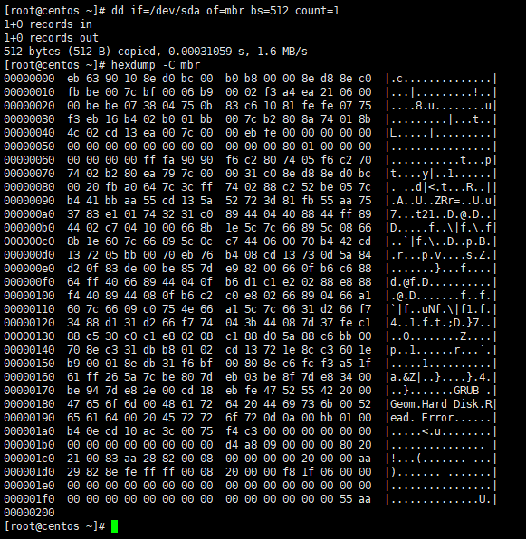
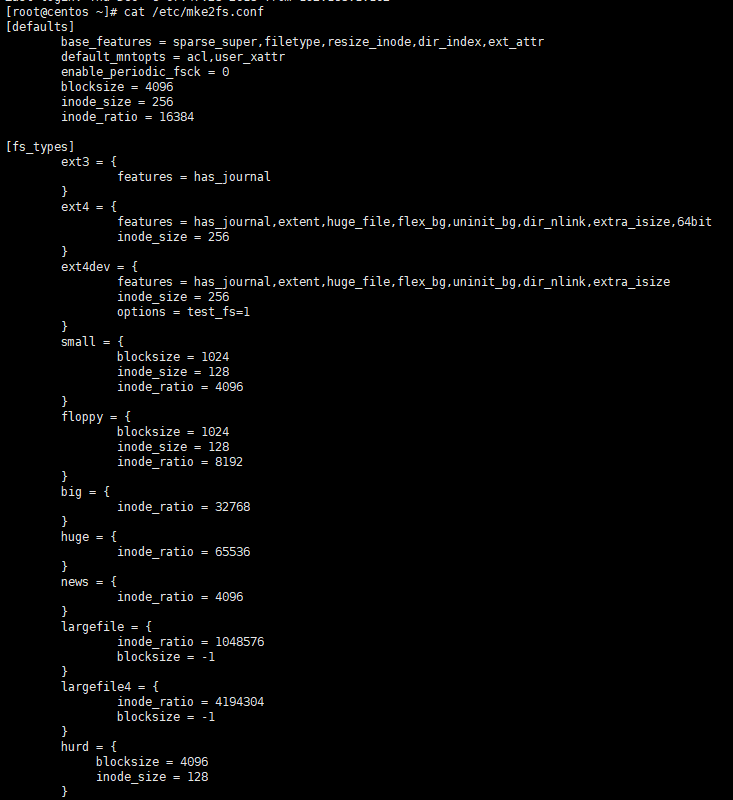
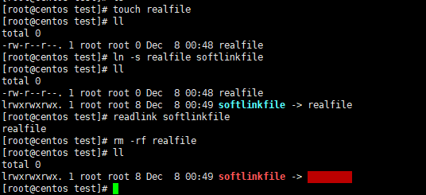
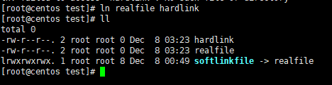
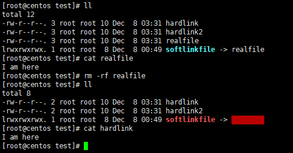
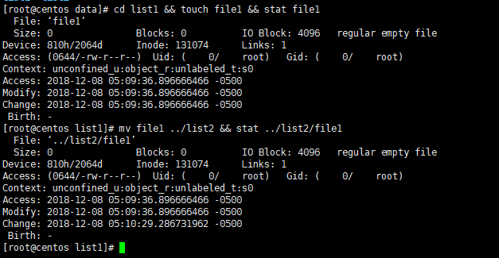
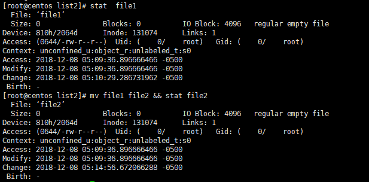

# EXT文件系统原理 #

## 一、文件系统结构 ##
开局一张图，内容全靠编

### Block ###
一个块大小一般为1K或2K或4K，文件系统以Block为读写单位，即使一个小于1K大小的文件也会占用1个block，如果一个环境中会产生大量的小文件，这将会非常占用存储空间。

### Inode ###
我们知道在Linux系统内，我们存储一个文件，不仅会关心它里边存储的数据，还会关心它的类型、所有者、大小、时间戳、权限等，这些信息没有与文件数据存储在一起，而是存储在Inode（索引节点）中，在Inode中有一个非常重要的数据，就是指向属于该文件数据block的指针，系统通过扫描该Inode就可以找到属于该文件在数据块的block，这样就避免遍历所有块来查找文件数据。一个Inode的大小一般为128字节或者256字节。

### Inode table ###
我们现在知道了，一个Inode为128字节或者256字节，文件系统以block为读写单位，而它最小为1K，如果一个Inode就占用一个block未免有点太过浪费了，所以就有了Inode表。Inode表其实就是把一些Inode组合起来在逻辑上组成一张表。

### Inode位图 ###
在磁盘做格式化之后所有的inode号都已经分配并存储在inode表里面了，这个时候inode表里只有一些inode号，其它都是空的，当有文件写入时就会为其分配一个inode号，并填充其它元数据信息。但是操作系统是如何知道哪个inode号是未被使用的呢，它当然不会去扫描整个inode表，这样会有较大的性能损耗，所以出现了inode位图（inodemap），它专门用来标记一个inode号是否被使用。一个字节八位，也就是说一个字节可以标记八个inode号，操作系统扫描inode位图就能知道哪些inode号未被分配。

### 块位图 ###
我们知道一个文件写入时不仅要写入其元数据信息，还要写入自身数据，同样操作系统会在Data Block区为其寻找未被使用的Block去填充数据。如inode位图一样，块位图（bitmap）标记Data Block中的block是否被填充了数据，操作系统扫描块位图就知道如何为待写入数据分配Block。

### Block Group ###
随着计算机技术的飞速发展，现在需要保存的数据越来越大。虽然操作系统扫描Inode位图、块位图已经能较快地为文件分配inode号与数据block，但面对大量数据写入时还是比较消耗性能，一次写入要扫描整张表。解决方法就是把一块分区分为很多Block Group，每个Block Group都包含了元数据Block和Data Block，这样Inode位图与块位图就很小，扫描起来也会快很多，极大地提高了写入性能。
操作系统是如何来划分Block Group的呢？
我们看看开头的那张图，一个Block Group中用一个block来存储块位图，如果一个Block为1K（当然还可能为2K或者4K，算法一样）的话，一个1K大小的块位图能标记1*1024*8=8192个Block，即能标记8192/1024=8M的Block，也就是说一个Block Group大小为8M。

### Super Block ###
inode的大小数量、block大小数量、使用量、剩余量、文件系统格式、当前文件系统是否正常等等信息就存放在Super Block中，这些信息总共占用1个block。Super Block存放于第一个Block Group中，其中数据极为重要，所以它还会有备份，操作系统通常只读取第一个Blcok Group中的Super Block，只有遇到这个Super Block损坏，才会去读取备份Super Block。

### 块组描述符表（GDT） ###
一个块组描述符占用32字节，里边存储了自己块组的元数据信息，这些块组描述符组合在一起就是块组描述符表（GDT），与Super Blcok类似，并不是每一个块组中都存有GDT，读取时也是首先读取第一个块组中的GDT。

### 保留 GDT ###
用于以后扩容时使用，如果扩容后块组描述符表占用超过了当前占用的Block大小，保留GDT就派上了用场，它与GDT和Super Block总是同时出现。

### Data Block ###
顾名思义，Data Blcok是用来存储数据的。
根据文件类型的不同，存储方式也不同：

- 对于常规文件，文件的数据存储在数据块中
- 对于目录，该目录下的所有文件和一级子目录的目录名存储在数据块中。文件名保存在它所在目录的数据块中，除文件名之外，ls -l命令看到的其它信息都保存在该文件的inode中。目录也是一种文件，是一种特殊类型的文件
- 对于符号链接，如果目标路径名较短则直接保存在inode中以便更快地查找，如果目标路径名较长则分配一个数据块来保存
- 设备文件、FIFO和socket等特殊文件没有数据块，设备文件的主设备号和次设备号保存在inode中

### dumpe2fs ###
对于ext文件系统家族，我们可以使用dumpe2fs命令查看其诸多信息

从上图中我们能看到很多有用的信息，此文件系统的挂载点、Inode号总数、Block总数、保留的Block数量、空闲Inode号数量、空闲Block数量、每个Block的大小、每个块组的block数量等。

### Boot Block（引导块） ###
存在于装了操作系统的主分区和装了操作系统的逻辑分区上的第一个块，不是每个分区都有这个Boot Block。它占用1024字节，里边存放的是Boot loader，称为VBR(主分区装操作系统时)或EBR(扩展分区装操作系统时)。当操作系统开机时，会首先加载MBR中的boot loader，然后定位到操作系统所在分区的Boot sector上加载此处的Boot loader。当安装了多个操作系统时，在加载MBR中的Boot loader后会列出所装的操作系统列表，列表上的各个操作系统指向它们所在分区的Boot sector上。
MBR全称是Master Boot Record,中文名叫“主引导记录”，位于硬盘第一个扇区的前446字节。一个扇区共512字节，剩下另外的64个字节用于存储“硬盘分区表”DPT(Disk Partition Table)，最后两个字节“55，AA”是分区表结束的标志。整个512字节构成了硬盘的主引导扇区。

通常我们也用dd if=/dev/XXX of=mbr bs=512 count=1来备份MBR。

## 二、理解Inode ##

### 如何分配Inode ###
inode最小为128字节，以128的倍数分配。它的默认值由/etc/mke2fs.conf文件指定。

由上图可知，此文件系统的Inode大小为256字节，每个Block大小为4K，inode_ratio是指Inode的分配比例，图中为16384，表示每16384个字节即16KB就分配一个inode号，所以每个Inode号对应4个Block。

### 软链接 ###
软链接又称符号链接，即soft link或symbolic link，其功能与Windows系统中的快捷方式类似，它实际指向原文件，原文件损坏或消失，软链接文件就损坏。

通过`ln -s realfile softlinkfile`命令可以创建软链接，在创建软链接的时候，虽然源文件可以使用相对路径，但强烈建议使用绝对路径。

软链接建立之后，它指向的路径就不会改变，如果此时原文件被移动到其它地方或者被删掉，软链接就会损坏。

软链接的几个特点：

- 软链接有自己的文件属性及权限等；
- 可对不存在的文件或目录创建软链接；
- 软链接可交叉文件系统；
- 软链接可对文件或目录创建；
- 创建软链接时，链接计数不会增加；
- 删除软链接并不影响被指向的文件，但若被指向的原文件被删除，则相关软连接被称为死链接，若被指向路径文件被重新创建，死链接可恢复为正常的软链接

### 硬链接 ###
我们知道每个文件都有一个inode。有一种情况：多个文件的Inode是相同的（Inode号、元数据、Block位置都相同），这种文件我们称为硬链接，每创建一个文件的硬链接，实质上是多一个指向该Inode记录的Inode指针，并且硬链接数加1。

我们在删除文件时，实质上是删除该文件所在目录Data Block中对应的Inode指针，也就是减少其硬链接次数，由于Block指针是存储在Inode中的，所以并不是真的删除数据，如果还有其他的指针指向该Inode，那么该文件的Block指针依然存在。当硬链接次数为1时再删除文件就是真的删除文件了，此时Inode记录中Block指针也将被删除。

硬链接的几个特点：

- 文件有相同的inode及data block；
- 只能对已存在的文件进行创建；
- 不能交叉文件系统进行硬链接的创建；
- 不能对目录进行创建，只可对文件创建；
- 删除一个硬链接文件并不影响其他有相同 inode 号的文件

为什么不能对目录创建硬链接呢？因为文件系统已经把每个目录的硬链接都创建好了，它们就是相对路径中的"."和".."，分别标识当前目录的硬链接和上级目录的硬链接。

## 三、文件操作细节 ##

### 读取文件 ###

- 找到根文件系统的块组描述符表所在的Block，读取GDT找到Inode table的Block号；
- 在Inode table的Block中找到根"/"的Inode，定位到"/"指向的Data Block；
- 在"/"的Data block中记录了其下所有的目录名和指向对应目录文件Inode的指针，找到对应的Inode记录，Inode中存储了指向对应目录的Block指针，依次类推，找到待查看文件所在目录的Data Block；
- 在文件所在目录的Data Block中找到对应文件的Inode指针，通过该指针定位到该Inode所在的块组及所在的Inode table，并根据该Inode记录找到对应文件的Data Block；
- 最后根据找到的Data Block读取数据。

### 删除文件 ###
 
- 找到待删文件的Inode和Data Block；
- 删除Inode table中对应Inode里的Data Block指针；
- 将Inode位图中将该文件的Inode号标记为未使用；
- 删除该文件所在目录的Data Block中相关行；
- 将块位图中Data Block对应的Block号标记为未使用

注意这里的文件不包括目录文件。

在日常使用Linux的时候，我们经常会遇到这样一种情况：由于未及时清理文件，某个目录的空间被消耗完毕，我们删掉某个较大的无用文件，再使用df -h查看，发现空间使用仍然是百分之百，为何空间未被释放呢？

一般发生此类情况是由于某一个进程正在引用需要被删除的文件。我们删除了文件，目录内也查找不到这个文件，但是这个文件在被进程引用时已经加载了其所有的Data Block指针，进程还是可以获取到该文件的所有数据，该进程结束前文件空间不会被释放，也就是删除流程卡在了第五步。
df命令其实是读取超级块中的信息（要不说我们使用df命令能非常快地打印出所需信息呢），超级块中此文件的信息还未被清除呢，实际上是块位图中还未将此文件占用的Block号标记为未使用。

### 删除目录 ###

- 找到该目录和目录下所有文件、子目录、子文件的Inode和Data Block；
- 在Inode位图中将所有的Inode号标记为未使用；
- 在块位图中将所有的Block号标记为未使用；
- 删除该目录父目录的Data Block中的对应行

### 写入、复制、移动、重命名文件 ###

**写入文件**

- 先读取GDT，找到块组Inode位图中没有被使用的Inode号，并给其分配Inode号；
- 在Inode table中填充该Inode号的其它记录；
- 在所在目录的Data Block中添加一条该文件的相关记录；
- 将数据填充到未被标记为已使用的Data Block中；
- 填充完之后，将对应的Data Block指针更新到Inode table中

**复制文件**

跟在一个文件系统内写入文件的过程一样

**移动文件**

在同一个文件系统内移动文件的话，只是修改目标目录的Data Block，在其Inode表里加上一行指向待移动文件的Inode指针，所以速度也是很快的。

从上图中我们能看到移动之后文件的Inode号并没有更改。

如果在不用文件系统内移动文件，可以理解为先将文件内容复制一份至目标文件系统，再将源文件系统内的文件删除。

**重命名文件**

重命名文件只是将所在目录Data Block中对应文件的文件名记录更新而已，存放于Data Block中的数据没有变化，所以很快就能完成文件的重命名。注意这里说的是在同一个目录下进行文件的重命名。

