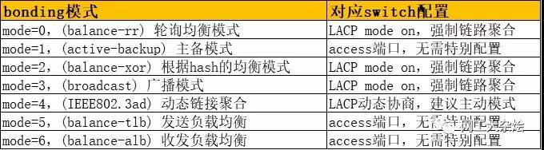

# 网卡聚合 #

[https://www.cnblogs.com/liuxia912/p/11132460.html](https://www.cnblogs.com/liuxia912/p/11132460.html)

[https://www.kernel.org/doc/Documentation/networking/bonding.txt](https://www.kernel.org/doc/Documentation/networking/bonding.txt)

Linux下一共有七种网卡bond方式，最常见的三种模式是bond0，bond1，bond6。linux内核自带bonding功能，因此通常不需要安装，只需要把bonding模块加载到内核里即可。

## bond0 ##

bond0，即：(balance-rr) Round-robin policy（平衡轮询策略）。数据包传输顺序是依次传输（即第1个包走eth0 下一个包就走eth1，一直循环下去，直到最后一个传输完毕），此模式提供负载平衡和容错能力；但是我们知道如果一个连接或者会话的数据包从不同的接口发出的话，若中途再经过不同的链路，在客户端很有可能会出现数据包无序到达的问题，而无序到达的数据包需要重新要求被发送，这样网络的吞吐量就会下降。

## bond1 ##

bond1，即： (active-backup) Active-backup policy（主-备份策略）。只有一个设备处于活动状态，当一个宕掉另一个马上由备份转换为主设备。mac地址是外部可见的，从外面看来，bond的MAC地址是唯一的，以避免switch(交换机)发生混乱。此模式只提供了容错能力；由此可见此算法的优点是可以提供高网络连接的可用性，但是它的资源利用率较低，只有一个接口处于工作状态，在有N个网络接口的情况下，资源利用率为1/N。

## bond2 ##

bond2，即：(balance-xor) XOR policy（平衡策略）。基于指定的传输HASH策略传输数据包。缺省的策略是：`(源MAC地址 XOR 目标MAC地址) % slave数量`，（XRO为异或运算，值不同时结果为1，相同为0）。其他的传输策略可以通过xmit_hash_policy选项指定，此模式提供负载平衡和容错能力。

## bond3 ##

bond3，即：broadcast（广播策略）。在每个slave接口上传输每个数据包，此模式提供了容错能力。

## bond4 ##

bond4，即：(802.3ad) IEEE 802.3ad Dynamic link aggregation（IEEE 802.3ad 动态链接聚合）。创建一个聚合组，它们共享同样的速率和双工设定。根据802.3ad规范将多个slave工作在同一个激活的聚合体下。外出流量的slave选举是基于传输hash策略，该策略可以通过xmit_hash_policy选项从缺省的XOR策略改变到其他策略。需要注意的是，并不是所有的传输策略都是802.3ad适应的，尤其考虑到在802.3ad标准。不同的实现可能会有不同的适应性。

必要条件：

- ethtool支持获取每个slave的速率和双工设定
- switch(交换机)支持IEEE 802.3ad Dynamic link aggregation
- 大多数switch(交换机)需要经过特定配置才能支持802.3ad模式

## bond5 ##

bond5，即：(balance-tlb) Adaptive transmit load balancing（适配器传输负载均衡）。不需要任何特别的switch(交换机)支持的通道bonding 。在每个slave上根据当前的负载（根据速度计算）分配外出流量。如果正在接受数据的slave出故障了，另一个slave接管失败的slave的MAC地址。该模式的必要条件：ethtool支持获取每个slave的速率。

## bond6 ##

bond6，即：(balance-alb) Adaptive load balancing（适配器适应性负载均衡）。该模式包含了balance-tlb模式，同时加上针对IPV4流量的接收负载均衡(receive load balance, rlb)，而且不需要任何switch(交换机)的支持。接收负载均衡是通过ARP协商实现的。bonding驱动截获本机发送的ARP应答，并把源硬件地址改写为bond中某个slave的唯一硬件地址，从而使得不同的对端使用不同的硬件地址进行通信。来自服务器端的接收流量也会被均衡。当本机发送ARP请求时，bonding驱动把对端的IP信息从ARP包中复制并保存下来。当ARP应答从对端到达时，bonding驱动把它的硬件地址提取出来，并发起一个ARP应答给bond中的某个slave。使用ARP协商进行负载均衡的一个问题是：每次广播 ARP请求时都会使用bond的硬件地址，因此对端学习到这个硬件地址后，接收流量将会全部流向当前的slave。这个问题可以通过给所有的对端发送更新 （ARP应答）来解决，应答中包含他们独一无二的硬件地址，从而导致流量重新分布。当新的slave加入到bond中时，或者某个未激活的slave重新激活时，接收流量也要重新分布。接收的负载被顺序地分布（round robin）在bond中最高速的slave上。当某个链路被重新接上，或者一个新的slave加入到bond中，接收流量在所有当前激活的slave中全部重新分配，通过使用指定的MAC地址给每个client发起ARP应答。

必要条件：

- ethtool支持获取每个slave的速率；
- 底层驱动支持设置某个设备的硬件地址，从而使得总是有个slave(curr_active_slave)使用bond的硬件地址，同时保证每个bond 中的slave都有一个唯一的硬件地址。如果curr_active_slave出故障，它的硬件地址将会被新选出来的 curr_active_slave接管

其实mod=6与mod=0的区别：mod=6，先把eth0流量占满，再占eth1，….ethX；而mod=0的话，会发现2个口的流量都很稳定，基本一样的带宽。而mod=6，会发现第一个口流量很高，第2个口只占了小部分流量。

