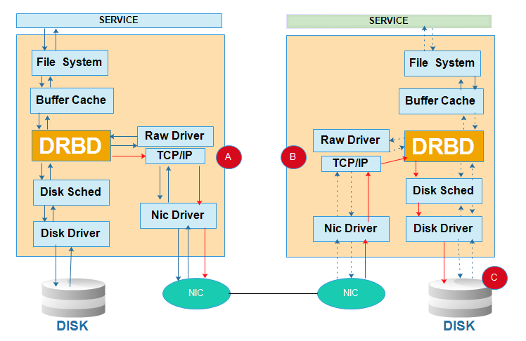

# DRBD简介 #

DRBD（Distributed Replicated Block Device）：叫做分布式复制块设备，这是一种基于软件，无共享，复制的解决方案。在服务器之间的块设备（包括硬盘、分区、逻辑卷）进行镜像。DRBD是镜像块设备，是按数据位镜像成一样的数据块。DRBD的位置处于文件系统以下，比文件系统更加靠近操作系统内核及IO栈。

## 工作原理 ##



客户端发起一个写操作的系统调用给文件系统，写请求再到达内核缓冲区，然后到达DRBD模块，此时drbd会复制写入磁盘的数据，且进行两步操作，第一步操作是调用磁盘驱动，将数据写入本地的磁盘设备，第二部是通过网卡设备将数据发送给备用节点，备用节点的网卡接受到数据之后，将数据再发送给drbd模块，DRBD模块再调用磁盘驱动将数据写入磁盘。

**工作模式**

- 主从模型master/slave（primary/secondary）

	这种模式下，在某一时刻只允许有一个主节点。主节点可以挂载使用，写入数据等；从节点不可以挂载文件系统，因此，也不可以执行读写操作。这种模式可用在任何的文件系统上。默认这种模式下，一旦主节点发生故障，从节点需要手工将资源进行转移，且主节点变成从节点和从节点变成主节点需要手动进行切换。不能自动进行转移，因此比较麻烦。


- 双主模型 dula primary(primary/primary)

	DRBD8.0之后的新特性。所谓双主模型是2个节点都可以当做主节点来挂载使用。在双主模式下，任何资源在任何特定的时间都存在两个主节点。这种模式需要一个共享的集群文件系统，利用分布式的锁机制进行管理，如GFS和OCFS2。部署双主模式时，DRBD可以是负载均衡的集群，这就需要从两个并发的主节点中选取一个首选的访问数据。这种模式默认是禁用的，如果要是用的话必须在配置文件中进行声明。

**同步协议**

- 协议A

	数据在本地完成写操作且数据已经发送到TCP/IP协议栈的队列中，则认为写操作完成。如果本地节点的写操作完成，此时本地节点发生故障，而数据还处在TCP/IP队列中，则数据不会发送到对端节点上。因此，两个节点的数据将不会保持一致。这种协议虽然高效，但是并不能保证数据的可靠性。

- 协议B
 
	数据在本地完成写操作且数据已到达对端节点则认为写操作完成。如果两个节点同时发生故障，即使数据到达对端节点，这种方式同样也会导致在对端节点和本地节点的数据不一致现象，也不具有可靠性。

- 协议C

	只有当本地节点的磁盘和对端节点的磁盘都完成了写操作，才认为写操作完成。这是集群流行的一种方式，应用也是最多的，这种方式虽然不高效，但是最可靠。

## 常用命令 ##
[https://blog.csdn.net/jailman/article/details/81479891](https://blog.csdn.net/jailman/article/details/81479891)


- 使用`drbd-overview`命令观察状态:

	```# drbd-overview
	  0:r0  Connected Primary/Secondary UpToDate/UpToDate C r—– /nfs ext4 20G 45M 19G 1%
	```

- 通过伪文件系统/proc/drbd 文件来运行状态

	```
	# cat /proc/drbd 
	version: 8.3.16 (api:88/proto:86-97)
	GIT-hash: a798fa7e274428a357657fb52f0ecf40192c1985 build by phil@Build64R6, 2014-11-24 14:51:37
	 0: cs:Connected ro:Primary/Secondary ds:UpToDate/UpToDate C r—–
	    ns:0 nr:0 dw:664 dr:2017 al:1 bm:0 lo:0 pe:0 ua:0 ap:0 ep:1 wo:f oos:0
	```

	- cs(Connect State)：表示网络连接的状态
	- ro(Role)：表示运行节点的角色，Primary/Secondary　表示本机为主
	- ds(Disk State)：表示当前的硬盘状态
	- Replication protocol：表示当前复制所使用的协议，可以是ABC
	- I/O Flags：6个I/O输入输出标志，从各个方面反映了本地资源的状态
	- Performance indicators：性能指标，这是一组统计数据和计数器，反映出资源的利用情况和性能
	- ns(network send)：通过网络连接发送到对端的数据量，单位KB.
	- nr(network receive)：通过网络连接从对点接收的数据量，单位KB.
	- dw(disk write)：向本地硬盘写入网络数据，单位KB.
	- dr(disk read)：网络从本地硬盘读取的数据量，单位KB.
	- al(activity log)：元数据活动日志的更新次数。
	- bm(bit map)：元数据区域更新的资源。
	- lo(local count)：由DRBD产生的本地I/O请求数据。
	- pe(pending)：就是等待响应，已经发送到圣战，但是还没有得到对端回应的数量。
	- ua(unacknow wledged)：就是未确认，通过网络连接收到对方的请求，但是还没有做出处理的数量.
	- ap(application pending)：转发到DRBD的I/O请求，仍然没有被DRBD所响应。
	- ep(epochs)：epoch对象的数，通常为1。当使用barrier或者none写顺序方法时，可能会增加底层I/O负荷。
	- wo(write order)：当前使用的写顺序的方法：b(barrier)/f(flush)/d(drain)/n(none)。
	- oos(out of sync)：当前没有同步的数据总数量，单位为KB.

- 查看磁盘状态

	```drbdadm dstate git```
	
	本地和对等节点的硬盘状态：
	
	- Diskless 无盘：本地没有块设备分配给DRBD使用，这表示没有可用的设备，或者使用drbdadm命令手工分离或是底层的I/O错误导致自动分离  
	- Attaching：读取无数据时候的瞬间状态 
	- Failed 失败：本地块设备报告I/O错误的下一个状态，其下一个状态为Diskless无盘  
	- Negotiating：在已经连接的DRBD设置进行Attach读取无数据前的瞬间状态 
	- Inconsistent：数据是不一致的，在两个节点上（初始的完全同步前）这种状态出现后立即创建一个新的资源。此外，在同步期间（同步目标）在一个节点上出现这种状态 
	- Outdated：数据资源是一致的，但是已经过时 
	- DUnknown：当对等节点网络连接不可用时出现这种状态 
	- Consistent：一个没有连接的节点数据一致，当建立连接时，它决定数据是UpToDate或是Outdated 
	- UpToDate：一致的最新的数据状态，这个状态为正常状态 

- 查看资源连接状态

	```drbdadm cstate git```
	
	- StandAlone 独立的：网络配置不可用；资源还没有被连接或是被管理断开（使用 drbdadm disconnect 命令），或是由于出现认证失败或是脑裂的情况
	- Disconnecting 断开：断开只是临时状态，下一个状态是StandAlone独立的
	- Unconnected 悬空：是尝试连接前的临时状态，可能下一个状态为WFconnection和WFReportParams
	- Timeout 超时：与对等节点连接超时，也是临时状态，下一个状态为Unconected悬空
	- BrokerPipe：与对等节点连接丢失，也是临时状态，下一个状态为Unconected悬空
	- NetworkFailure：与对等节点推动连接后的临时状态，下一个状态为Unconected悬空
	- ProtocolError：与对等节点推动连接后的临时状态，下一个状态为Unconected悬空
	- TearDown 拆解：临时状态，对等节点关闭，下一个状态为Unconected悬空
	- WFConnection：等待和对等节点建立网络连接
	- WFReportParams：已经建立TCP连接，本节点等待从对等节点传来的第一个网络包
	- Connected 连接：DRBD已经建立连接，数据镜像现在可用，节点处于正常状态
	- StartingSyncS：完全同步，有管理员发起的刚刚开始同步，未来可能的状态为SyncSource或PausedSyncS
	- StartingSyncT：完全同步，有管理员发起的刚刚开始同步，下一状态为WFSyncUUID
	- WFBitMapS：部分同步刚刚开始，下一步可能的状态为SyncSource或PausedSyncS
	- WFBitMapT：部分同步刚刚开始，下一步可能的状态为WFSyncUUID
	- WFSyncUUID：同步即将开始，下一步可能的状态为SyncTarget或PausedSyncT
	- SyncSource：以本节点为同步源的同步正在进行
	- SyncTarget：以本节点为同步目标的同步正在进行
	- PausedSyncS：以本地节点是一个持续同步的源，但是目前同步已经暂停，可能是因为另外一个同步正在进行或是使用命令(drbdadm pause-sync)暂停了同步
	- PausedSyncT：以本地节点为持续同步的目标，但是目前同步已经暂停，这可以是因为另外一个同步正在进行或是使用命令(drbdadm pause-sync)暂停了同步
	- VerifyS：以本地节点为验证源的线上设备验证正在执行
	- VerifyT：以本地节点为验证目标的线上设备验证正在执行
