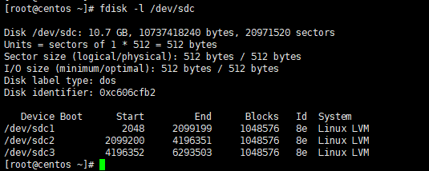
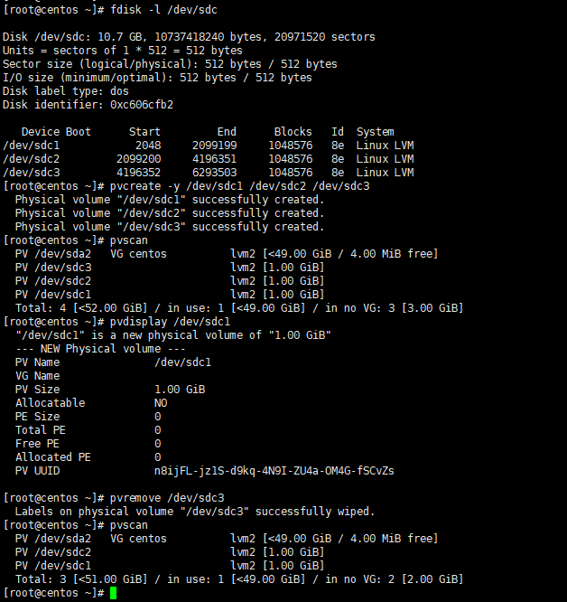
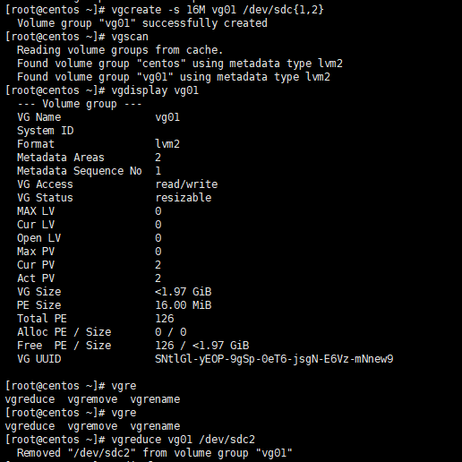
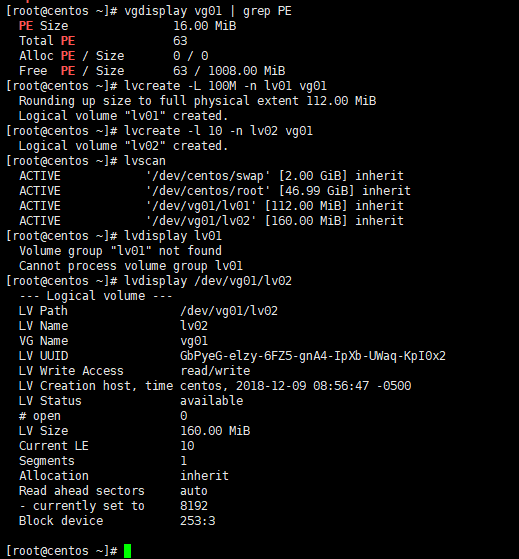
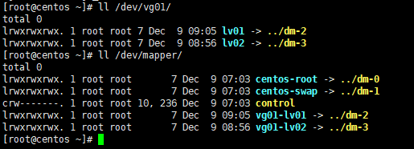
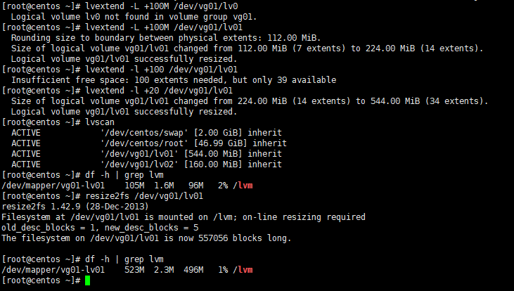

# LVM #

## 一、基本术语 ##

**物理卷（Physical volume） (PV)**

物理卷在逻辑卷管理中处于最底层，它可以是实际物理硬盘上的分区，也可以是整个物理硬盘，创建PV时要求系统分区的system ID为8e。

**卷组（Volumne Group）（VG）**

卷组建立在物理卷上，一卷组中至少要包括一个物理卷，卷组建立后可动态的添加卷到卷组中，一个逻辑卷管理系统工程中可有多个卷组。

**逻辑卷（Logical Volume）（LV）**

逻辑卷建立在卷组之上，可以使用卷组中未分配的空间建立逻辑卷，逻辑卷可以动态地扩展和缩小空间。系统中的多个逻辑卷要以属于同一个卷组，也可以属于不同的多个卷组。其相当于非LVM系统中的磁盘分区。

**条块化的逻辑卷（Striped Logical Volumes）**

向此逻辑卷中写入数据时,文件系统能将数据放置到多个物理卷中，对于大量连接读写操作,能改善数据I/O效率。

**线性逻辑卷（Linear Volumes）**

一个线性逻辑卷聚合多个物理卷成为一个逻辑卷

**物理区域（Physical Extent）（PE）**

物理区域是物理卷中可用于分配的最小存储单元，在创建卷组时可指定物理区域的大小，默认为4M，后期不能更改，同一卷组所有物理卷的物理区域大小需一致。实际的数据就是存储在此。

**逻辑区域（Logical Extent）（LE）**

LE为逻辑存储单元，PE为物理存储单元，它的大小和PE的大小一样，并且与之一一对应。

由于受内核限制的原因，一个逻辑卷（Logic Volume）最多只能包含65536个PE（Physical Extent），所以一个PE的大小就决定了逻辑卷的最大容量，4MB(默认) 的PE决定了单个逻辑卷最大容量为256GB，若希望使用大于256G的逻辑卷，则创建卷组时需要指定更大的PE

**卷组描述符区域（VGDA）**

逻辑卷以及卷组相关的元数据保存在位于物理卷起始处的VGDA(卷组描述符区域)中。VGDA内存储有以下信息： PV描述符、VG描述符、LV描述符、和一些PE描述符。在系统启动LVM时激活VG，并将VGDA加载至内存，以此来识别LV的实际物理存储位置。当系统进行I/O操作时，就会根据VGDA建立的映射机制来访问实际的物理位置。

**写入模式**

LVM有两种写入模式：

- 线性模式 (linear)：先将一个PV中的PE写完之后再写入另一个PV，也是LVM的默认模式。 
- 交错模式 (triped)：与Raid0类似，将一份数据拆分成多份，分别写入该LV对应的每个PV中，读写性能较好

虽然triped模式相对来说有较好的读写性能，但并不建议使用此模式，我们可以使用RAID来保障磁盘的读写性能。

**快照（Snapshots）**

LVM提供了快照功能，可以将某个时间点的数据做精确备份。LVM会在VG中预留一些PE作为快照区，刚创建快照时，快照区内PE只存储了待备份数据的一些元数据信息，并没有真实地去拷贝原数据。快照使用写时复制（copy on write）技术来检测数据在原始数据块中何时更改，当原数据有更改时，LVM会将要更改的PE内的原始数据拷贝一份至快照区PE内，数据区的对应PE填充新的数据内容。

注意：如果发生变化的PE数量很大，快照区没有足够的空间进行存储时，此快照会立即失效，所以如需要保证快照不会丢失，就需要创建与原始数据一样大小的空间来作为快照区空间。

## 二、LVM操作 ##

**常用命令**

|管理项|PV|VG|LV|
|:-----|:-----:|:------:|
|scan|pvscan|vgscan|lvscan|
|create|pvcreate|vgcreate|lvcreate|
|display|pvdisplay|vgdisplay|lvdisplay|
|extend||vgextend|lvextend|
|reduce||vgreduce|lvreduce|
|remove|pvremove|vgremove|lvremove|
|resize|pvresize||lvresize|
|attribute|pvchange|vgchange|lvchange|

**LVM管理**

- PV管理

	1、创建三个标识符为LVM类型的分区，注意创建分区后需要将其system id修改为8e（MBR格式下为8e，GPT格式下是8300）

	

	2、将/dev/sdc1、/dev/sdc2、/dev/sdc3创建为PV:

	`pvcreate -y /dev/sdc1 /dev/sdc2 /dev/sdc3`

	3、使用pvscan查看PV及其属性：
	
	`pvscan`

	4、使用pvdisplay查看其中一个pv的属性信息：
	
	`pvdisplay /dev/xxx`

	5、使用pvremove删除某一个分区
	
	`pvremove /dev/xxx`

	

- VG管理

	1、使用vgcreate创建一个VG：

	`vgcreate -s 16M vg_name /dev/xxx{1,2...}`
	
	使用-s指定PE的大小，本例中为16M

	2、使用vgscan查看VG及其属性：

	`vgscan`

	3、使用vgdisplay查看其中一个VG的属性信息：

	`vgdisplay vg_name`

	4、使用vgreduce移除某一个PV：

	`vgreduce vg_name /dev/xxx`

	

- LV管理

	1、使用lvcreate创建LV：
	
	`lvcreate -L 100M -n lv_name vg_name`
	
	`lvcreate -l 10 -n lv_name vg_name`

	2、使用lvscan查看LV及其属性：

	`lvscan`

	3、使用lvdisplay查看其中一个LV的属性信息，注意需要指定其全路径，而不能简单的指定lv名：

	`lvdisplay /dev/vg_name/lv_name`

	

	4、格式化LV并挂载：

	`mke2fs -t ext4 /dev/vg_name/lv_name`

	5、我们创建完LV后，会对应创建一个/dev/vg_name/lv_name文件，这是一个软链接，链接到/dev/dm设备，同时也会在/dev/mapper目录下创建链接文件
	
	

	6、使用lvextend或者lvresize进行LV扩容：
	
	`lvextend -L +100M /dev/vg_name/lv_name`
	
	`lvextend -l +20 /dev/vg_name/lv_name`

	特别注意：如果执行扩容时没有指定-r选项，扩容之后一定要使用resize2fs命令（ext文件系统使用resize2fs，xfs文件系统使用xfs_growfs）来刷新文件系统的大小。

	

	7、可以使用lvreduce对LV进行缩容，一般都用不到，而且xfs文件系统也不支持收缩，这里就不做记录了。
	
	

