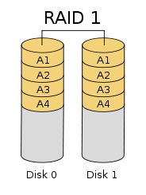

# RAID #

## 一、概述 ##

RAID独立磁盘冗余阵列(Redundant Array of Independent Disks)，以前叫做廉价冗余磁盘阵列(Redundant Array of Inexpensive Disks)。

RAID 中主要有三个关键概念和技术：镜像（ Mirroring ）、数据条带（ Data Stripping ）和数据校验（ Data parity ）。

- 镜像

	数据被复制到多个磁盘上，可以提高数据可靠性，并且读取数据时可并发从两个或多个副本读取，读性能有显著提高，但写性能要稍低， 确保数据正确地写到多个磁盘需要更多的时间消耗。

- 数据条带
 
	与镜像的多副本不同，数据条带时将数据分片保存在多个不同的磁盘上，多个数据分片共同组成一个完整数据。很显然，它将具有更高的并发粒度，当访问数据时，可以同时对位于不同磁盘上数据进行读写操作， I/O性能有较大提升。

- 数据校验

	利用冗余数据进行数据错误检测和修复，通常采用海明码、异或操作等算法。利用校验功能，能提高磁盘阵列的可靠性、鲁棒性和容错能力。很显然它会影响系统性能。

 磁盘阵列有两种实现方式，“软件阵列”与“硬件阵列” 。

- 软件阵列

	软件RAID在内核磁盘（块设备）编码中实现各类RAID级别，可以提供数据冗余功能，但是磁盘子系统的性能会有所降低，有的降低幅度还比较大，达30%左右。

- 硬件阵列

	使用专门的磁盘阵列卡来实现，它能独立于主机之外地来管理RAID子系统，通常市面上的服务器都支持硬件RAID。

目前业界公认的标准是RAID0~RAID5，除RAID2外的四个等级被定为工业标准，而在实际应用领域中使用最多的RAID等级是RAID0、RAID1、RAID3、RAID5、RAID6和RAID10。

## 二、RAID实现方式 ##

**RAID0**

RAID0是一种简单的、无数据校验的数据条带化技术，将多块物理硬盘设备通过硬件或软件的方式直接串联在一起，成为一个大的卷组，也称为条带卷(striping)。数据被分散存储在所有磁盘中，磁盘利用率最大，读取数据时可以以独立访问方式实现并发访问。但是RAID0没有数据的冗余和错误修复能力，其中任意一个硬盘损坏都会让整个系统数据损坏。

**RAID1**

RAID1也可称为镜像，将多块磁盘绑定，数据会被复制分别存储在不同的磁盘上，这样当一块磁盘发生故障，系统还能自动从对应的镜像磁盘读取数据。它的磁盘利用率为百分之五十，数据在写入时性能会受到影响，但不会影响读取性能。RAID1容错能力强，但实现成本高。

**RAID2**

RAID2也被称为纠错海明码磁盘阵列，即是通过纠错海明码来实现数据冗余校验。海明码（Hamming Code）是一个可以有多个校验位，具有检测并纠正一位错误代码的纠错码。

在RAID2中，数据存储宽度（即存储数据的磁盘数量）可以自己设定，用户数据按位进行存储，每块磁盘存储一位数据编码。磁盘数量取决于所设定的数据存储宽度，这里有一个简单的计算方式：2的N次方 >= D+N+1,其中D为数据存储宽度，N为校验磁盘数量，如果数据存储宽度为4，那校验盘数量就为3，如果数据存储宽度为64，那校验盘数量就为7。

也正是由于RAID2这种实现方式，数据在损坏时重建耗时非常长，存储数据时还会耗费大量存储空间来存储校验数据，目前市面上几乎没有RAID2的商业产品，主流存储设备均不支持RAID2.

**RAID3**

RAID3专门指定一块磁盘来存储校验数据，至少需要三块磁盘，不同磁盘上同一带区的数据作异或逻辑运算（XOR）校验，校验值写入校验盘中。当一块磁盘失效时，可能会影响到读取性能，如果读取的数据不在失效盘上，读取性能不会受到影响，但若读取数据刚好在失效盘上，则必须读取同一带区的所有数据，再根据校验数据来重建数据，这个过程会极大地影响读取性能。

RAID3只需要一块校验盘，磁盘利用率很高，在没有失效盘的时候性能也不错，不过目前随着RAID5的不断升级，RAID3也被RAID5逐渐取代。

**RAID4**

RAID4与RAID3类似，也采用了一块盘来作为校验磁盘，但它的条带方式不同，其以块为单位进行数据写入，每一次写操作只涉及到数据盘和校验盘。同样的，RAID4也对不同磁盘上同一带区的数据作异或逻辑运算（XOR）校验。

RAID4读性能非常不错，写性能稍微逊色，写入数据时只能一个磁盘一个磁盘地写，并且还要写入校验数据，加之随着磁盘数量的增加，一块校验盘的性能会成为主要性能瓶颈，主流存储设备也很少支持RAID4。

**RAID5**

RAID5原理与RAID4类似，不同之处在于其校验数据分布在阵列中的所有磁盘上，而不是存储于一块专门的磁盘上，故不存在RAID4中校验盘称为性能瓶颈的问题，并且其扩展性非常好，可以支撑更大的容量。

一个磁盘损坏时，系统可以根据同一条带的其他数据块和对应的校验数据来重建损坏的数据，同样，在重建数据时系统性能会受到较大的影响。

相较于其他RAID模式来说，RAID5兼顾了存储性能、数据安全和存储成本等各方面因素，目前也是众多厂家比较青睐的RAID模式。

**RAID6**

RAID0-5都只能保证单个磁盘损坏时数据不丢失，但如果两块磁盘同时损坏，数据将无法恢复。RAID6支持双重校验，RAID5相比，RAID6增加了第二个独立的奇偶校验信息块。两个独立的奇偶系统使用不同的算法，数据的可靠性非常高，当两个磁盘同时失效时，即可通过求解两元方程来重建两个磁盘上的数据。如此一来，将消耗更大的磁盘空间，写性能也有较大下降，很少得到实际应用。

