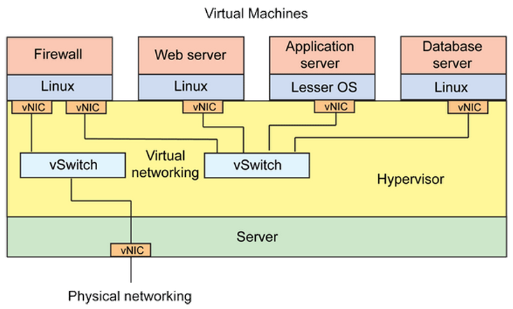
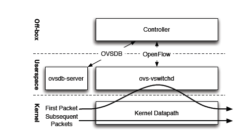
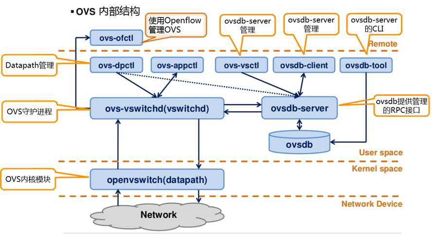
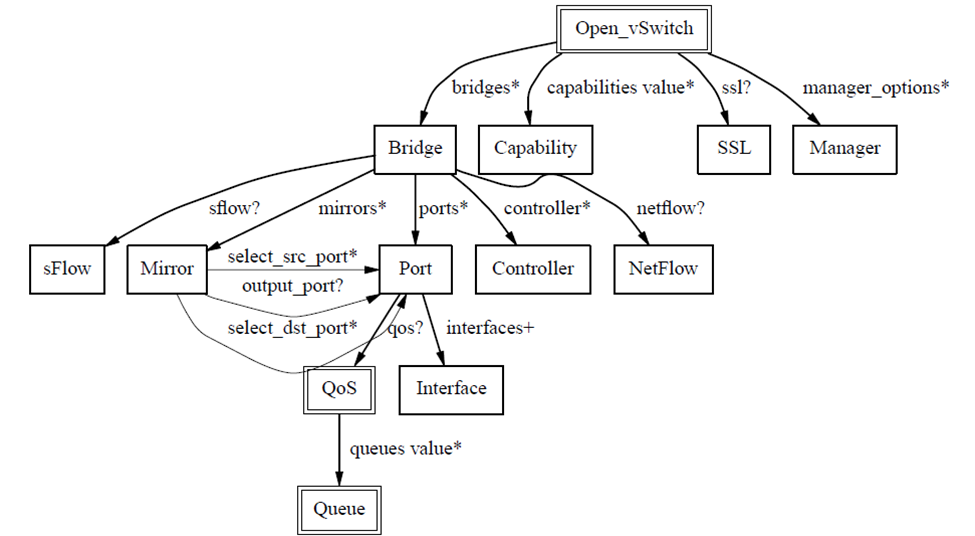

# OpenvSwitch（OVS） #

摘自[https://www.2cto.com/net/201707/655718.html](https://www.2cto.com/net/201707/655718.html)

## Open vSwitch简介 ##

OpenvSwitch简称OVS，正如其官网(http://openvswitch.org/)所述，OVS是一个高质量、多层的虚拟交换软件。它的目的是通过编程扩展支持大规模网络自动化，同时还支持标准的管理接口和协议。

随着虚拟化应用普及，需要部署更多的虚拟化交换机，而费用昂贵的闭源虚拟交换机让用户不堪重负，多层虚拟化软件交换机Open vSwitch由Nicira Networks开发，主要实现代码为可移植的C代码。它遵循Apache 2.0开源代码版权协议，可用于生产环境，支持跨物理服务器分布式管理、扩展编程、大规模网络自动化和标准化接口，实现了和大多数商业闭源交换机功能类似的软件交换机。

OVS官方的定位是要做一个产品级质量的多层虚拟交换机，通过支持可编程扩展来实现大规模的网络自动化。设计目标是方便管理和配置虚拟机网络，检测多物理主机在动态虚拟环境中的流量情况。针对这一目标，OVS具备很强的灵活性。可以在管理程序中作为软件switch运行，也可以直接部署到硬件设备上作为控制层。

如下图，在某台物理服务器中，运行着4台虚拟机，为了将这4台虚拟机在逻辑上组成我们需要的网络架构，于是就虚拟出了2台交换机，组成图中的网络架构。



架构：



[https://opengers.github.io/openstack/openstack-base-use-openvswitch/](https://opengers.github.io/openstack/openstack-base-use-openvswitch/)

- Controller

	Controller指OpenFlow控制器。OpenFlow控制器可以通过OpenFlow协议连接到任何支持OpenFlow的交换机，比如OVS。控制器通过向交换机下发流表规则来控制数据流向。除了可以通过OpenFlow控制器配置OVS中flows，也可以使用OVS提供的ovs-ofctl命令通过OpenFlow协议去连接OVS，从而配置flows，命令也能够对OVS的运行状况进行动态监控。

- ovsdb-sever 

	OVS的数据库服务器，用来存储虚拟交换机的配置信息。它与manager和ovs-vswitchd交换信息使用了OVSDB(JSON-RPC)的方式。
 
- ovs-vswitchd

	ovs-vswitchd守护进程是OVS的核心部件，它和datapath内核模块一起实现OVS基于流的数据交换。作为核心组件，它使用openflow协议与上层OpenFlow控制器通信，使用OVSDB协议与ovsdb-server通信，使用netlink和datapath内核模块通信。ovs-vswitchd在启动时会读取ovsdb-server中配置信息，然后配置内核中的datapaths和所有OVS switches，当ovsdb中的配置信息改变时(例如使用ovs-vsctl工具)，ovs-vswitchd也会自动更新其配置以保持与数据库同步。在OVS中，ovs-vswitchd从OpenFlow控制器获取流表规则，然后把从datapath中收到的数据包在流表中进行匹配，找到匹配的flows并把所需应用的actions返回给datapath，同时作为处理的一部分，ovs-vswitchd会在datapath中设置一条datapath flows用于后续相同类型的数据包可以直接在内核中执行动作，此datapath flows相当于OpenFlow flows的缓存。
 
- OpenFlow

	OpenFlow是开源的用于管理交换机流表的协议，OpenFlow在OVS中的地位可以参考上面架构图，它是Controller和ovs-vswitched间的通信协议。需要注意的是，OpenFlow是一个独立的完整的流表协议，不依赖于OVS，OVS只是支持OpenFlow协议，有了支持，我们可以使用OpenFlow控制器来管理OVS中的流表，OpenFlow不仅仅支持虚拟交换机，某些硬件交换机也支持OpenFlow协议

OVS常用作SDN交换机(OpenFlow交换机)，其中控制数据转发策略的就是OpenFlow flow。OpenStack Neutron中实现了一个OpenFlow控制器用于向OVS下发OpenFlow flows控制虚拟机间的访问或隔离。本文讨论的默认是作为SDN交换机场景下

OpenFlow flow的流表项存放于用户空间主进程ovs-vswitchd中，OVS除了连接OpenFlow控制器获取这种flow，文章后面会提到的命令行工具ovs-ofctl工具也可以手动管理OVS中的OpenFlow flow，可以查看man ovs-ofctl了解

在OVS中，OpenFlow flow是最重要的一种flow, 然而还有其它几种flows存在

有个OVS大概的了解，我们看看OVS到底由哪些模块组成，以及个模块的作用。如图：


- ovs-vswitchd： 主要模块，实现switch的daemon，包括一个支持流交换的Linux内核模块；
- ovsdb-server： 轻量级数据库服务器，提供ovs-vswitchd获取配置信息，例如vlan、port等信息；
- ovs-brcompatd： 让ovs-vswitch替换linux bridge，包括获取bridge ioctls的Linux内核模块；
- ovs-dpctl：用来配置switch内核模块；
- ovs-vsctl： 查询和更新ovs-vswitchd的配置；
- ovs-appctl： 发送命令消息，运行相关daemon；
- ovs-ofctl： 查询和控制OpenFlow交换机和控制器；
- ovs-openflowd：一个简单的OpenFlow交换机；
- ovs-controller：一个简单的OpenFlow控制器；
- ovs-pki：OpenFlow交换机创建和管理公钥框架；
- ovs-tcpundump：tcpdump的补丁，解析OpenFlow的消息；
- ovs-bugtool：管理openvswitch的bug信息。



数据库结构：



通过ovs-vsctl创建的所有的网桥，网卡，都保存在数据库里面，ovs-vswitchd会根据数据库里面的配置创建真正的网桥，网卡。

## OVS相关概念 ##

- Bridge

	Bridge代表一个以太网交换机(Switch)，一个主机中可以创建一个或者多个Bridge。Bridge的功能是根据一定规则，把从端口收到的数据包转发到另一个或多个端口。
	使用`ovs-vsctl`命令创建一个名为br0的Bridge：
	
	`ovs-vsctl add-br br0  `

- Port

	端口Port与物理交换机的端口概念类似，Port是OVS Bridge上创建的一个虚拟端口，每个Port都隶属于一个Bridge。Port有以下几种类型：

	- Normal

		可以把操作系统中已有的网卡(物理网卡em1/eth0,或虚拟机的虚拟网卡tapxxx)挂载到ovs上，ovs会生成一个同名Port处理这块网卡进出的数据包。此时端口类型为Normal。
		把物理网卡eth1挂载到OVS网桥br-ext上，OVS会自动创建同名Port eth1：
		
		`ovs-vsctl add-port br-ext eth1`
		
		注意： 挂载到OVS上的网卡设备不支持分配IP地址，因此若之前eth1配置有IP地址，挂载到OVS之后IP地址将不可访问。这里的网卡设备不只包括物理网卡，也包括主机上创建的虚拟网卡。

	- Internal

		Internal类型是OVS内部创建的虚拟网卡接口，每创建一个Port，OVS会自动创建一个同名接口(Interface)挂载到新创建的Port上。
		例：创建一个网桥br0，并创建一个Internal类型的Port p0

		```
		ovs-vsctl add-br br0   
		ovs-vsctl add-port br0 p0 -- set Interface p0 type=internal
		  
		ovs-vsctl show br0
		    Bridge "br0"
		        fail_mode: secure
		        Port "p0"
		            Interface "p0"
		                type: internal
		        Port "br0"
		            Interface "br0"
		                type: internal
		```
		
		当ovs创建一个新网桥时，默认会创建一个与网桥同名的Internal Port。在OVS中，只有”internal”类型的设备才支持配置IP地址信息。
		
		```
		ip addr add 192.168.10.11/24 dev br0
		ip link set br0 up
		ip route add default via 192.168.10.1 dev br0
		```

		Normal与Internal类型区别： Internal类型会自动创建接口(Interface)，而Normal类型是把主机中已有的网卡接口添加到OVS中。

	- Patch

		当主机中有多个ovs网桥时，可以使用Patch Port把两个网桥连起来。Patch Port总是成对出现，分别连接在两个网桥上，从一个Patch Port收到的数据包会被转发到另一个Patch Port，类似于Linux系统中的veth。

	- Tunnel

		OVS中支持添加隧道(Tunnel)端口，常见隧道技术有两种gre或vxlan。隧道技术是在现有的物理网络之上构建一层虚拟网络，上层应用只与虚拟网络相关，以此实现的虚拟网络比物理网络配置更加灵活，并能够实现跨主机的L2通信以及必要的租户隔离。不同隧道技术其大体思路均是将以太网报文使用隧道协议封装，然后使用底层IP网络转发封装后的数据包，其差异性在于选择和构造隧道的协议不同。Tunnel在OpenStack中用作实现大二层网络以及租户隔离，以应对公有云大规模，多租户的复杂网络环境。

- Interface

	Interface是连接到Port的网络接口设备，是OVS与外部交换数据包的组件，在通常情况下，Port和Interface是一对一的关系，只有在配置Port为 bond模式后，Port和Interface是一对多的关系。这个网络接口设备可能是创建Internal类型Port时OVS自动生成的虚拟网卡，也可能是系统的物理网卡或虚拟网卡(TUN/TAP)挂载在ovs上。 OVS中只有”Internal”类型的网卡接口才支持配置IP地址。
	Interface是一块网络接口设备，负责接收或发送数据包，Port是OVS网桥上建立的一个虚拟端口，Interface挂载在Port上。


