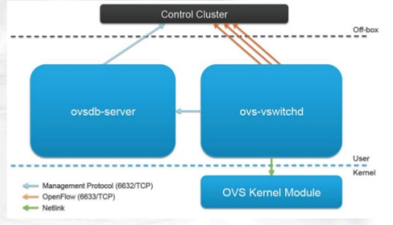

# OpenvSwitch（OVS） #

摘自[https://www.2cto.com/net/201707/655718.html](https://www.2cto.com/net/201707/655718.html)

## 1、什么是Open vSwitch ##

OpenvSwitch简称OVS，正如其官网(http://openvswitch.org/)所述，OVS是一个高质量、多层的虚拟交换软件。它的目的是通过编程扩展支持大规模网络自动化，同时还支持标准的管理接口和协议。

随着虚拟化应用普及，需要部署更多的虚拟化交换机，而费用昂贵的闭源虚拟交换机让用户不堪重负，多层虚拟化软件交换机Open vSwitch由Nicira Networks开发，主要实现代码为可移植的C代码。它遵循Apache 2.0开源代码版权协议，可用于生产环境，支持跨物理服务器分布式管理、扩展编程、大规模网络自动化和标准化接口，实现了和大多数商业闭源交换机功能类似的软件交换机。

OVS官方的定位是要做一个产品级质量的多层虚拟交换机，通过支持可编程扩展来实现大规模的网络自动化。设计目标是方便管理和配置虚拟机网络，检测多物理主机在动态虚拟环境中的流量情况。针对这一目标，OVS具备很强的灵活性。可以在管理程序中作为软件switch运行，也可以直接部署到硬件设备上作为控制层。

如下图，在某台物理服务器中，运行着4台虚拟机，为了将这4台虚拟机在逻辑上组成我们需要的网络架构，于是就虚拟出了2台交换机，组成图中的网络架构。

组件：

[https://opengers.github.io/openstack/openstack-base-use-openvswitch/](https://opengers.github.io/openstack/openstack-base-use-openvswitch/)

- Controller

	Controller指OpenFlow控制器。OpenFlow控制器可以通过OpenFlow协议连接到任何支持OpenFlow的交换机，比如OVS。控制器通过向交换机下发流表规则来控制数据流向。除了可以通过OpenFlow控制器配置OVS中flows，也可以使用OVS提供的ovs-ofctl命令通过OpenFlow协议去连接OVS，从而配置flows，命令也能够对OVS的运行状况进行动态监控。

- ovsdb-sever 

	OVS的数据库服务器，用来存储虚拟交换机的配置信息。它与manager和ovs-vswitchd交换信息使用了OVSDB(JSON-RPC)的方式。
 
- ovs-vswitchd

	ovs-vswitchd守护进程是OVS的核心部件，它和datapath内核模块一起实现OVS基于流的数据交换。作为核心组件，它使用openflow协议与上层OpenFlow控制器通信，使用OVSDB协议与ovsdb-server通信，使用netlink和datapath内核模块通信。ovs-vswitchd在启动时会读取ovsdb-server中配置信息，然后配置内核中的datapaths和所有OVS switches，当ovsdb中的配置信息改变时(例如使用ovs-vsctl工具)，ovs-vswitchd也会自动更新其配置以保持与数据库同步。在OVS中，ovs-vswitchd从OpenFlow控制器获取流表规则，然后把从datapath中收到的数据包在流表中进行匹配，找到匹配的flows并把所需应用的actions返回给datapath，同时作为处理的一部分，ovs-vswitchd会在datapath中设置一条datapath flows用于后续相同类型的数据包可以直接在内核中执行动作，此datapath flows相当于OpenFlow flows的缓存。
 
- ovs kernel module

	OVS的内核模块，处理包交换和隧道，缓存flow，如果在内核的缓存中找到转发规则则转发，否则发向用户空间去处理。

有个OVS大概的了解，我们看看OVS到底由哪些模块组成，以及个模块的作用。如图：

- ovs-vswitchd： 主要模块，实现switch的daemon，包括一个支持流交换的Linux内核模块；
- ovsdb-server： 轻量级数据库服务器，提供ovs-vswitchd获取配置信息，例如vlan、port等信息；
- ovs-brcompatd： 让ovs-vswitch替换linux bridge，包括获取bridge ioctls的Linux内核模块；
- ovs-dpctl：用来配置switch内核模块；
- ovs-vsctl： 查询和更新ovs-vswitchd的配置；
- ovs-appctl： 发送命令消息，运行相关daemon；
- ovs-ofctl： 查询和控制OpenFlow交换机和控制器；
- ovs-openflowd：一个简单的OpenFlow交换机；
- ovs-controller：一个简单的OpenFlow控制器；
- ovs-pki：OpenFlow交换机创建和管理公钥框架；
- ovs-tcpundump：tcpdump的补丁，解析OpenFlow的消息；
- ovs-bugtool：管理openvswitch的bug信息。

数据库结构：

通过ovs-vsctl创建的所有的网桥，网卡，都保存在数据库里面，ovs-vswitchd会根据数据库里面的配置创建真正的网桥，网卡。

