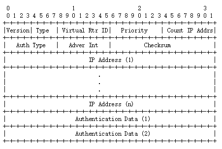
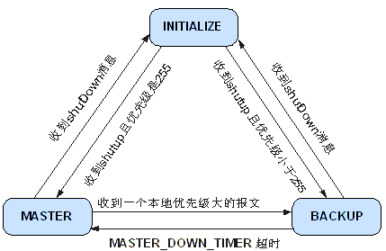

# VRRP #

[RFC-2338](https://tools.ietf.org/html/rfc2338)

[RFC-3768](https://tools.ietf.org/html/rfc3768)

## 基本概念 ##

**VRRP路由器(VRRP Router)**

运行VRRP协议一个或多个实例的路由器设备

**虚拟路由器(Virtual Router)**

由一个Master路由器和多个Backup路由器组成，也被称为VRRP备份组。也是一个共享局域网内主机的默认网关

**Master路由器**

转发报文或者应答ARP请求的VRRP路由器，承担着流量的转发

**Backup路由器**

一组没有承担转发任务的VRRP路由器，当一个虚拟路由器中的Master路由器出现故障时，它们可以通过竞选成为新的Master

**虚拟IP地址(Virtual IP Address)**

虚拟路由器的IP地址，一个虚拟路由器可以拥有一个或多个虚拟IP地址

**主IP地址(Primary IP Address)**

从接口的真实IP地址中选出来的一个主用IP地址，通常选择配置的第一个IP地址。 VRRP通告报文的源地址总是主IP地址

**虚拟MAC地址**

虚拟路由器根据虚拟路由器ID生成的MAC地址，当虚拟路由器回应ARP请求时，使用虚拟MAC地址，而不是接口的真实MAC地址回应ARP请求。虚拟MAC地址组成方式是：00-00-5E-00-01-{VRID}，前三个字节00-00-5E是IANA组织分配的，接下来的两个字节00-01是为VRRP协议指定的，最后的VRID是虚拟路由器标识，取值范围[1，255] 

**VRID**

虚拟路由器标识，在同一个VRRP组内的路由器必须有相同的VRID，通过VRID表明自己属于哪个VRRP组

## 通告报文结构 ##

### VRRP通告报文结构 ###

VRRP协议只有一种报文，即VRRP报文。VRRP报文用来将Master设备的优先级和状态通告给同一虚拟路由器的所有VRRP路由器。VRRP报文封装在IP报文中，报文结构如下：

**VRRP报文字段简介**：

- Version

协议版本号，4位，在RFC3768中定义为2

- Type

报文类型，4位，只会为1，表示Advertisement

- Virtual Rtr ID

虚拟路由器ID，8位，取值范围是1～255

- Priority

发送报文的VRRP路由器在虚拟路由器中的优先级，8位。取值范围是0～255，其中可用的范围是1～254。0表示设备停止参与VRRP，用来使备份路由器尽快成为主路由器，而不必等到计时器超时；255则保留给IP地址拥有者。缺省值是100。

- Count IP Addrs

VRRP中IP地址个数，8位。

- Authentication Type

验证类型，8位，RFC2338定义的取值为：

0 - No Authentication

1 - Simple Text Password

2 - IP Authentication Header

随后的RFC3768中将Authentication Type取值变更为（即取消认证，因为这些认证方式并不能提供真正的安全）：

0 - No Authentication

1 - Reserved

2 - Reserved

- Adver Int

通告包的发送间隔时间，8位，单位是秒，默认为1秒

- Checksum

校验和，16位，只针对VRRP数据部分进行校验，不包括IP头部

- IP Address(es)

虚拟路由器IP地址，数量由Count IP Addrs决定，这些信息主要用于发现并修复误配置路由器

- Authentication Data

RFC3768中定义该字段只是为了和老版本兼容，必须置0

**VRRP报文中IP字段**

- 源IP地址

Master路由器发送包的物理接口IP地址

- 目的IP地址

IP组播地址224.0.0.18

- TTL

必须为255

- 协议号

0x70（十进制为112）

## VRRP协议状态机 ##

VRRP协议中定义了三种状态机：初始状态（Initialize）、活动状态（Master）、备份状态（Backup）。其中，只有处于活动状态的设备才可以转发发送到虚拟IP地址的报文。

## VRRP选举机制 ##

- VRRP根据优先级来来确定路由器角色，优先级越高，则越有可能成为master路由器。
- 如果VRRP报文中master路由器优先级高于自己的优先级，则路由器保持在Backup状态。
- 如果VRRP报文中master路由器优先级低于自己的优先级，采用抢占工作方式的路由器抢占为master状态，周期性地发送VRRP报文，采用非抢占工作方式的路由器仍然保持Backup状态。
- 如果在一定时间内没有收到VRRP报文，则路由器切换为Master状态。
- VRRP优先级的取值范围为0到255（数值越大表明优先级越高），可配置的范围是1到254，优先级0为系统保留给路由器放弃Master位置时候使用，255则是系统保留给IP地址拥有者使用。
- 如果虚拟ip地址与VRRP组中的某台VRRP路由器ip地址相同，则此路由器为ip地址拥有者，这台路由器将被定位主路由器，其优先级始终为255。
- 在没有ip地址拥有者，且优先级相同的情况下，ip地址大的作为主路由器。

## VRRP定时器 ##

VRRP定时器分为两种：VRRP通告报文间隔时间定时器和VRRP抢占延迟时间定时器。

- VRRP通告报文时间间隔定时器
 
VRRP备份组中的Master路由器会定时发送VRRP通告报文，通知备份组内的路由器自己工作正常。可以通过设置VRRP定时器来调整Master路由器发送VRRP通告报文的时间间隔。如果Backup路由器在等待了3个间隔时间后，依然没有收到VRRP通告报文，则认为自己是Master路由器，并对外发送VRRP通告报文，重新进行Master路由器的选举。

- VRRP抢占延迟时间定时器

为了避免备份组内的成员频繁进行主备状态转换，让Backup路由器有足够的时间搜集必要的信息（如路由信息），Backup路由器接收到优先级低于本地优先级的通告报文后，不会立即抢占成为Master，而是等待一定时间——抢占延迟时间后，才会对外发送VRRP通告报文取代原来的Master路由器。

## VRRP工作过程 ##

(1) 路由器使能VRRP功能后，会根据优先级确定自己在备份组中的角色。优先级高的路由器成为Master路由器，优先级低的成为Backup路由器。Master路由器定期发送VRRP通告报文，通知备份组内的其他路由器自己工作正常；Backup路由器则启动定时器等待通告报文的到来。Master路由器通过发送免费ARP报文，将自己的虚拟MAC地址通知给与它连接的设备或者主机

(2) 在抢占方式下，当Backup路由器收到VRRP通告报文后，会将自己的优先级与通告报文中的优先级进行比较。如果大于通告报文中的优先级，则成为Master路由器；否则将保持Backup状态。

(3) 在非抢占方式下，只要Master路由器没有出现故障，备份组中的路由器始终保持Master或Backup状态，Backup路由器即使随后被配置了更高的优先级也不会成为Master路由器。

(4) 如果Backup路由器的定时器超时后仍未收到Master路由器发送来的VRRP通告报文，则认为Master路由器已经无法正常工作，此时Backup路由器会认为自己是Master路由器，并对外发送VRRP通告报文。备份组内的路由器根据优先级选举出Master路由器，承担报文的转发功能。

(5) 虚拟路由器状态切换时，新的Master路由器只是简单地发送一个携带虚拟路由器的MAC地址和虚拟IP地址信息的免费ARP报文，这样就可以更新与它连接的主机或设备中的ARP相关信息，网络中的主机感知不到Master路由器已经切换为另外一台设备。

