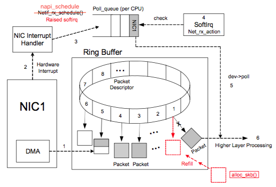

# 网卡的Ring Buffer #

[摘自https://ylgrgyq.github.io/2017/07/23/linux-receive-packet-1/](https://ylgrgyq.github.io/2017/07/23/linux-receive-packet-1/)

[https://www.cnblogs.com/mauricewei/p/10502300.html](https://www.cnblogs.com/mauricewei/p/10502300.html)

## Ring Buffer ##


Ring Buffe消息接收过程如下：



NIC (network interface card) 在系统启动过程中会向系统注册自己的各种信息，系统会分配Ring Buffer队列也会分配一块专门的内核内存区域给NIC用于存放传输上来的数据包。struct sk_buff是专门存放各种网络传输数据包的内存接口，在收到数据存放到NIC专用内核内存区域后，sk_buff 内有个data指针会指向这块内存。Ring Buffer队列内存放的是一个个Packet Descriptor，其有两种状态： ready和used 。初始时Descriptor是空的，指向一个空的sk_buff，处在ready状态。当有数据时，DMA负责从NIC取数据，并在Ring Buffer上按顺序找到下一个ready的Descriptor，将数据存入该Descriptor指向的sk_buff中，并标记槽为used。因为是按顺序找ready的槽，所以Ring Buffer是个FIFO的队列。

- 系统启动时NIC (network interface card)  进行初始化，系统分配内存空间给 Ring Buffer 。
- 初始状态下，Ring Buffer 队列每个槽中存放的 Packet Descriptor 指向 sk_buff ，状态均为 ready。
- DMA 将 NIC 接收的数据包逐个写入 sk_buff ，一个数据包可能占用多个 sk_buff ，sk_buff 读写顺序遵循FIFO（先入先出）原则。
- 被写入数据的 sk_buff 变为 used 状态。
- DMA 读完数据之后，NIC 会通过 NIC Interrupt Handler 触发IRQ（中断请求）。
- NIC driver 注册 poll 函数。
- poll 函数对数据进行检查，例如将几个 sk_buff 合并，因为可能同一个数据可能被分散放在多个 sk_buff 中。
- poll 函数将sk_buff 交付上层网络栈处理。
- poll 函数清理sk_buff，清理Ring Buffer上的Descriptor将其指向新分配的sk_buff并将状态设置为ready。


## 多CPU下的Ring Buffer处理 (Receive Side Scaling) ##

分配给 Ring Buffer 的空间是有限的，当收到的数据包速率大于单个 CPU 处理速度的时候Ring Buffer可能被占满，占满之后再来的新数据包会被自动丢弃。而现在机器都是有多个CPU，同时只有一个CPU去处理 Ring Buffer 数据会很低效，这个时候就产生了叫做Receive Side Scaling(RSS) 或者叫做multiqueue的机制来处理这个问题。支持RSS的网卡内部会有多个 Ring Buffer，NIC 收到 Frame 的时候能通过 Hash Function 来决定 Frame 该放在哪个 Ring Buffer 上，触发的IRQ也可以通过操作系统或者手动配置 IRQ affinity 将 IRQ 分配到多个 CPU 上。这样 IRQ 能被不同的 CPU 处理，从而做到 Ring Buffer 上的数据也能被不同的 CPU 处理，从而提高数据的并行处理能力。
如果支持RSS的话，NIC会为每个队列分配一个IRQ，通过`/proc/interrupts`能进行查看。可以通过配置IRQ affinity指定IRQ由哪个CPU来处理中断。先通过`/proc/interrupts`找到IRQ号之后，将希望绑定的CPU号写入`/proc/irq/IRQ_NUMBER/smp_affinity`。（写入的是16进制的bit mask)。比如看到队列rx_0对应的中断号是41那就执行：

`echo 6 > /proc/irq/41/smp_affinity`

6表示的是CPU2和CPU1。0号CPU的掩码是0x1 (0001)，1号CPU掩码是0x2 (0010)，2号CPU掩码是0x4 (0100)，3号CPU掩码是0x8 (1000)依此类推。

##  Ring Buffer相关命令 ##

**网卡收到的数据包统计**

```
ethtool -S eh0
NIC statistics:
     rx_packets: 792819304215
     tx_packets: 778772164692
     rx_bytes: 172322607593396
     tx_bytes: 201132602650411
     rx_broadcast: 15118616
     tx_broadcast: 2755615
     rx_multicast: 0
     tx_multicast: 10
```

RX 就是收到数据，TX 是发出数据。还会展示 NIC 每个队列收发消息情况。其中比较关键的是带有drop字样的统计和fifo_errors的统计:

```
tx_dropped: 0
rx_queue_0_drops: 93
rx_queue_1_drops: 874
....
rx_fifo_errors: 2142
tx_fifo_errors: 0
```

**查询Ring Buffer大小**

`ethtool -g eth0`

**调整Ring Buffer队列数量**

```
ethtool -l eth0
Channel parameters for eth0:
Pre-set maximums:
RX:             0
TX:             0
Other:          1
Combined:       8
Current hardware settings:
RX:             0
TX:             0
Other:          1
Combined:       8
```

Combined = 8，说明当前NIC网卡会使用8个进程处理网络数据。更改eth0网卡Combined的值：

`ethtool -L eth0 combined 8`

注意：ethtool的设置操作可能都要重启一下才能生效。

**调整Ring Buffer队列大小**

`ethtool -G eth0 rx 4096`

`ethtool -G eth0 tx 4096`

**调整Ring Buffer队列权重**

NIC如果支持mutiqueue的话NIC会根据一个Hash函数对收到的数据包进行分发。能调整不同队列的权重，用于分配数据。

```
ethtool -x eth0
RX flow hash indirection table for eth0 with 8 RX ring(s):
    0:      0     0     0     0     0     0     0     0
    8:      0     0     0     0     0     0     0     0
   16:      1     1     1     1     1     1     1     1
   ......
   64:      4     4     4     4     4     4     4     4
   72:      4     4     4     4     4     4     4     4
   80:      5     5     5     5     5     5     5     5
   ......
  120:      7     7     7     7     7     7     7     7
```

此NIC一共有8个队列，一个有128个不同的Hash值，上面就是列出了每个Hash值对应的队列是什么。最左侧 0 8 16 是为了能让你快速的找到某个具体的Hash值。比如Hash值是76的话我们能立即找到72那一行：”72: 4 4 4 4 4 4 4 4”，从左到右第一个是72数第5个就是76这个Hash值对应的队列是4。

`ethtool -X eth0 weight 6 2 8 5 10 7 1 5`

设置8个队列的权重。加起来不能超过128 。128是indirection table大小，每个NIC可能不一样。

**更改Ring Buffer Hash Field**

分配数据包的时候是按照数据包内的某个字段来进行的，这个字段能进行调整。

```
ethtool -n eth0 rx-flow-hash tcp4
TCP over IPV4 flows use these fields for computing Hash flow key:
IP SA
IP DA
L4 bytes 0 & 1 [TCP/UDP src port]
L4 bytes 2 & 3 [TCP/UDP dst port]
```

**softirq数统计**

通过`/proc/softirqs`能看到每个CPU上softirq数量统计：

```
cat /proc/softirqs
                    CPU0       CPU1       
          HI:          1          0
       TIMER: 1650579324 3521734270
      NET_TX:   10282064   10655064
      NET_RX: 3618725935       2446
       BLOCK:          0          0
BLOCK_IOPOLL:          0          0
     TASKLET:      47013      41496
       SCHED: 1706483540 1003457088
     HRTIMER:    1698047   11604871
         RCU: 4218377992 3049934909
```

看到NET_RX就是收消息时候触发的softirq，一般看这个统计是为了看看softirq在每个CPU上分布是否均匀，不均匀的话可能就需要做一些调整。

**IRQ统计**

`/proc/interrupts`能看到每个CPU的IRQ统计。一般就是看看NIC有没有支持multiqueue以及NAPI的IRQ合并机制是否生效。看看IRQ是不是增长的很快。
