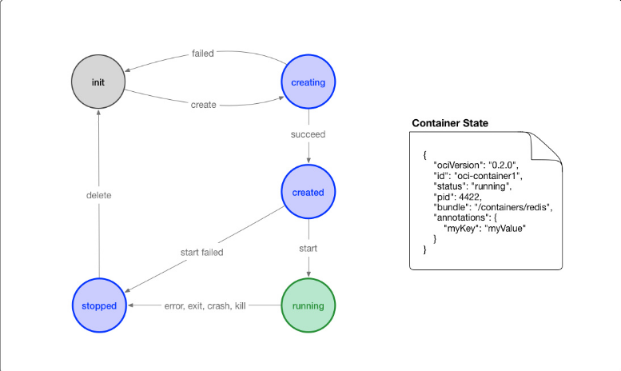

# Docker OCI #

OCI（Open Container Initiative）由 Docker、Coreos以及其他容器相关公司创建于2015年，由Linux基金会进行管理，致力于Container Runtime的标准制定和runc的开发等工作。目前主要有两个标准：容器运行时标准 （runtime spec）和 容器镜像标准（image spec）。

OCI规定了如何下载OCI镜像并解压到`OCI filesystem bundle`，这样OCI runtime就可以运行OCI bundle了。


## 容器运行时标准 （runtime spec） ##

[https://github.com/opencontainers/runtime-spec](https://github.com/opencontainers/runtime-spec)

### Filesystem Bundle ###

Filesystem Bundle是个目录，用于给runtime提供启动容器必备的配置文件和文件系统。标准的Container Bundle包含以下两个内容：

- config.json

	此文件必须存在于Bundle的根目录中，且名字必须为config.json，其中包含了容器运行的配置信息

- 容器的Root Filesystem

	可以由config.json文件中的root.path指定

### Runtime and Lifecycle ###

**state：**

- ociVersion：创建容器时的OCI版本

- id：容器唯一的ID

- status：容器的runtime状态，可取值如下：

	- creating：容器正在被创建（lifecycle的第2步）
	- created：容器完成创建，没有返回错误且没有执行用户程序（lifecycle的第2步之后）
	- running：容器正在执行用户程序且没有返回错误（lifecycle的第5步之后）
	- stoped：容器进程退出（lifecycle的第7步）
	
	

- pid：容器在宿主机上的进程PID(容器状态为`created`或者`running`时)

- bundle：宿主机上容器bundle目录的绝对路径

- annotation：容器相关的标注（可选）

示例：

```json
{
    "ociVersion": "0.2.0",
    "id": "oci-container1",
    "status": "running",
    "pid": 4422,
    "bundle": "/containers/redis",
    "annotations": {
        "myKey": "myValue"
    }
}

```

**Lifecycle**

- 1、OCI runtime的create调用与bundle的路径和ID相关

- 2、OCI runtime依据config.json中的设置来创建环境，如果无法创建config.json中指定的环境，则返回错误。此阶段主要创建config.json中的资源，并没有执行用户程序。该步骤之后对config.json文件的修改都不会影响容器

- 3、runtime使用容器的唯一ID来执行start容器的命令

- 4、runtine执行prestart hooks，如果prestart hooks执行失败，则返回错误，并停止容器，执行第9条操作

- 5、runtime执行用户程序

- 6、runtime执行poststart hooks，如果poststart hooks执行失败，则记录warning日志，而poststart hooks和lifecycle继续运行

- 7、容器进程退出，可能是由错误退出，人为退出，程序崩溃或runtime 执行kill命令引起

- 8、runtime使用容器的唯一id来执行delete容器操作

- 9、如果在容器创建阶段（第2步）没有完成某些步骤，则容器必须被销毁

- 10、runtime执行poststop hooks，如果poststop hooks执行失败，则记录warning日志，而poststop hooks和lifecycle继续运行

**Operations**

- Query State

	`state <container-id>`，返回上述state内容

- Create

	`create <container-id> <path-to-bundle>`，该操作中会用到config.json除process之外的配置属性(因为process是在start阶段用到的)。实现中可能会与本规范不一致，如在create操作之前实现了pre-create。

- Start

	`start <container-id>`，执行config.json的process中定义的程序，如果process没有设定，则返回错误

- Kill

	`kill <container-id> <signal>`，向一个非running状态的容器发送的信号会被忽略。此操作用于向容器进程发送Kill信号

- Delete

	`delete <container-id>`，尝试删除一个非stopped的容器会返回错误。容器删除后其ID可能会被后续的容器使用

**Hooks**

定义每个Operations前后执行的操作，共有`prestart`、`poststart`和`poststop`三个操作，每个操作中都可包含`path`、`args`、`env`和`timeout`四个参数。[参考posix-platform-hooks部分](https://github.com/opencontainers/runtime-spec/blob/master/config.md#posix-platform-hooks)

示例：

```
"hooks": {
        "prestart": [
            {
                "path": "/usr/bin/fix-mounts",
                "args": ["fix-mounts", "arg1", "arg2"],
                "env":  [ "key1=value1"]
            },
            {
                "path": "/usr/bin/setup-network"
            }
        ],
        "poststart": [
            {
                "path": "/usr/bin/notify-start",
                "timeout": 5
            }
        ],
        "poststop": [
            {
                "path": "/usr/sbin/cleanup.sh",
                "args": ["cleanup.sh", "-f"]
            }
        ]
    }
```


### Configuration File ###


- Specification version

	必选，指定了bundle使用的OCI的版本

- root

	- path：容器的bundle路径，可以是相对路径和绝对路径，该值通常为rootfs
	- readonly：当设置为true时，容器的根文件为只读，默认false

- mount

	- destination：容器中的挂载点，必须是绝对路径
	- source：挂载的设备名称，文件或目录名称(bind mount时)，当option中有bind或rbind时改mount类型为bind mount
	- option：mount的选项，[参考mount选项](http://man7.org/linux/man-pages/man8/mount.8.html)
	
	**示例(Linux)：**
	
	```
	"mounts": [
	{
	"destination": "/tmp",
	"type": "tmpfs",
	"source": "tmpfs",
	"options": ["nosuid","strictatime","mode=755","size=65536k"]
	},
	{
	"destination": "/data",
	"type": "bind",
	"source": "/volumes/testing",
	"options": ["rbind","rw"]
	```


- process：定义了容器的进程信息
	- terminal：默认false，为true时，linux系统会为该进程分配一个pseudoterminal(pts)，并使用标准输入输出流
	- consoleSize：指定terminal的长宽规格
		- height
		– width
	- cwd：执行命令的绝对路径
	- env：环境变量
	- args：命令参数，至少需要指定一个参数，首参数即被execvp执行的文件
	
	其中根据不同的平台还会有不同的参数。
	POSIX process：

	- rlimits：设置进程的资源，如cpu，内存，文件大小等，参见getrlimit。docker里面使用--ulimit来设置单个进程的资源
		- type：linux或Solaris
		- soft：内核分配给该进程的资源
		- hard；可配置的资源的最大值，即soft的最大值。unprivileged进程(没有CAP_SYS_RESOURCE capability)可以将soft设置为0-hard之间的值
	
	Linux process：

	- apparmorProfile：指定进程的apparmor文件
	- capabilities：指定进程的capabilities
		- effective 
		- bounding 
		- inheritable
		- permitted
		- ambient
	- noNewPrivileges：设置为true后可以防止进程获取额外的权限(如使得suid和文件capabilities失效)，该标记位在内核4.10版本之后可以在/proc/$pid/status中查看NoNewPrivs的设置值。[参考no_new_privs](https://www.kernel.org/doc/Documentation/prctl/no_new_privs.txt)
	- oomScoreAdj ：给进程设置oom_score_adj值
	- selinuxLabel :设置进程的SELinux标签，即MAC值
	
	- user：用于控制运行进程的用户
		- uid：指定容器命名空间的UserID
		- gid：指定容器命名空间的GroupID
		- additionalGids：指定容器命名空间中附加的GroupID
	
	示例（Linux）：

	```
	"process": {
		"terminal": true,
		"consoleSize": {
			"height": 25,
			"width": 80
		},
		"user": {
			"uid": 1,
			"gid": 1,
			"additionalGids": [5, 6]
		},
		"env": [
			"PATH=/usr/local/sbin:/usr/local/bin:/usr/sbin:/usr/bin:/sbin:/bin",
			"TERM=xterm"
		],
		"cwd": "/root",
		"args": [
			"sh"
		],
		"apparmorProfile": "acme_secure_profile",
		"selinuxLabel": "system_u:system_r:svirt_lxc_net_t:s0:c124,c675",
		"noNewPrivileges": true,
		"capabilities": {
			"bounding": [
				"CAP_AUDIT_WRITE",
				"CAP_KILL",
				"CAP_NET_BIND_SERVICE"
			],
			"permitted": [
				"CAP_AUDIT_WRITE",
				"CAP_KILL",
				"CAP_NET_BIND_SERVICE"
			],
			"inheritable": [
				"CAP_AUDIT_WRITE",
				"CAP_KILL",
				"CAP_NET_BIND_SERVICE"
			],
			"effective": [
				"CAP_AUDIT_WRITE",
				"CAP_KILL"
			],
			"ambient": [
				"CAP_NET_BIND_SERVICE"
			]
		},
		"rlimits": [
			{
				"type": "RLIMIT_NOFILE",
				"hard": 1024,
				"soft": 1024
			}
		]
	}
	```


- hostname

	指定容器内的主机名

- Platform-specific configuration

	在linux，Windows，solaris平台上使用namespaces，cgroup等参数项

	- linux

		- Default Filesystems：如下路径需要正确挂载到容器中，以便容器进程的正确执行
		```
		Path        Type
		/proc       proc
		/sys        sysfs
		/dev/pts    devpts
		/dev/shm    tmpfs
		```
		- namespaces
			- type：指定namespace类型，如果没有指定namespace type，则继承父namespace的属性
				- ipc
				- mount
				- user
				- network
				- uts
				- pid
				- cgroup
			- path：namespace的文件，如果没有指定，则生成一个新的namespace
		- User namespace mappings:指定了uid和gid从宿主机到容器的映射关系
			- uidMappings
				- hostID
				- containerID
				- size
			- gidMappings
				- hostID
				- containerID
				- size
		
		- device：列出在容器中的设备
			- type：设备的类型
			- path:容器中的全路径
			- major, minor：设备的主设备号和次设备号，主设备号表示类型，次设备号表示分区，可以使用"ls -al /dev"查看主次设备号。
			- fileMode：文件ADC访问权限
			- uid：容器中设备的uid
			- gid：容器中设备的gid
		
		**示例：**
		```
		"devices": [
			{
				"path": "/dev/fuse",
				"type": "c",
				"major": 10,
				"minor": 229,
				"fileMode": 438,
				"uid": 0,
				"gid": 0
			},
			{
				"path": "/dev/sda",
				"type": "b",
				"major": 8,
				"minor": 0,
				"fileMode": 432,
				"uid": 0,
				"gid": 0
			}
		]
		```

	- Control groups

		控制容器的资源以及设备接入等

		- cgroupsPath:cgroup的路径，该路径可以是绝对路径，也可以是相对路径。如果没有设置该值，cgroup会使用默认的cgroup路径
		- devices：用于配置设备白名单
			- allow: 设置是否允许接入
			- type：设备类型: a (all), c (char), or b (block)， 默认为all
			- major, minor：设备的主次号。默认all
			- access：设备的cgroup权限,r(read), w(write), 和m(mknod)。
		
		**示例：**

		```
		"devices": [
			{
				"allow": false,
				"access": "rwm"
			},
			{
				"allow": true,
				"type": "c",
				"major": 10,
				"minor": 229,
				"access": "rw"
			}
		]
		```
		- memory： 内存限制，参考Linux/CGroups相关笔记
			- limit:设置内存使用limit
			- reservation：设置内存的soft limit
			- swap：设置memory+Swap使用limit
			- kernel：设置内存的hard limit
			- kernelTCP：设置内核TCP buffer的hard limit
			- swapness：设置swap的使用比例
			- disableOOMKiller：是否开启oomkiller
		
		**示例：**
		```
		"memory": {
			"limit": 536870912,
			"reservation": 536870912,
			"swap": 536870912,
			"kernel": -1,
			"kernelTCP": -1,
			"swappiness": 0,
			"disableOOMKiller": false
		}
		```

		- cpu: CPU限制，参考Linux/CGroups相关笔记
			- shares:cgroup中task使用的cpu的相对比例
			- quota:一个period中使用的cpu时间
			- period:以毫秒为单位的cpu周期 (CFS scheduler only)
			- realtimeRuntime:以毫秒为单位的cgroup tasks连续使用cpu资源的最长周期
			- realtimePeriod:实时调度的period
			- cpus:CPU列表
			- mems:memory nodes列表

		**示例：**
		```
		"cpu": {
			"shares": 1024,
			"quota": 1000000,
			"period": 500000,
			"realtimeRuntime": 950000,
			"realtimePeriod": 1000000,
			"cpus": "2-3",
			"mems": "0-7"
		}
		```

		- blockIO
			- weight
			- leafWeight
			- weightDevice
				- major, minor
				- weight
				- leafWeight
			- throttleReadBpsDevice
				- major, minor
				- rate
			- throttleWriteBpsDevice
			- throttleReadIOPSDevice
			- throttleWriteIOPSDevice

		**示例：**
		```
		"blockIO": {
			"weight": 10,
			"leafWeight": 10,
			"weightDevice": [
				{
					"major": 8,
					"minor": 0,
					"weight": 500,
					"leafWeight": 300
				},
				{
					"major": 8,
					"minor": 16,
					"weight": 500
				}
			],
			"throttleReadBpsDevice": [
				{
					"major": 8,
					"minor": 0,
					"rate": 600
				}
			],
			"throttleWriteIOPSDevice": [
				{
					"major": 8,
					"minor": 16,
					"rate": 300
				}
			]
		}
		```


			
	- windows
	- solaris

