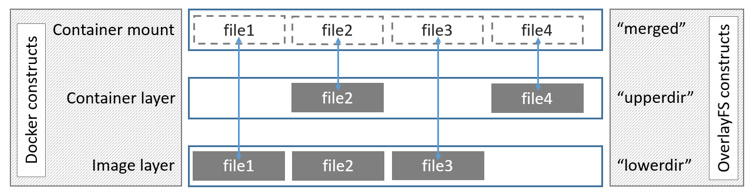

# Docker存储驱动 #

## AUFS ##

[https://docs.docker.com/storage/storagedriver/aufs-driver/](https://docs.docker.com/storage/storagedriver/aufs-driver/)

Aufs最初代表的意思“另一个联合文件系统（another union filesystem）”，试图对当时已经存在的UnionFS实现进行重写。后来叫Alternative UnionFS，再后来就叫成了高大上的Advance UnionFS。

AUFS把若干目录按照顺序和权限挂载为一个目录，默认情况下，只有第一层是可写的，其余都是只读层，新写的文件都会被放在最上面的可写层中，当需要删除只读层中的文件时，AUFS通过在可写层目录下建立对应的whiteout隐藏文件来实现。此外AUFS利用其CoW（copy-on-write）特性来修改只读层中的文件。AUFS工作在文件层面，因此，只要有对只读层中的文件做修改，不管修改数据的量的多少，在第一次修改时，文件都会被拷贝到可写层然后再被修改。AUFS的CoW特性能够允许在多个容器之间共享分层，从而减少物理空间占用。

在Docker中，只读层就是image，可写层就是Container。其结构如下：

AUFS只在Ubuntu或者Debian的内核上才可以启用，因为Aufs从来没有被上游Linux内核社区接受，且原作者已经放弃了让它被内核采纳的努力。不过在Ubtuntu或者Debian上，默认的graphdriver就是aufs，它能满足绝大多数需求。

## Overlay ##

[https://docs.docker.com/storage/storagedriver/overlayfs-driver/](https://docs.docker.com/storage/storagedriver/overlayfs-driver/)

Overlay是一个联合文件系统，相比aufs来说，它的分支模型更为简单。Overlay只有两层：一个是下层目录（lower-dir）”，对应镜像层，另一个是“上层目录（upper-dir）”，对应容器层，同样的，镜像层是只读的，容器层可写。

采用Overlay存储驱动时，在路径/var/lib/docker/overlay/下（/var/lib/docker为Docker Root Dir），每个镜像层都有一个对应的目录，包含了本层镜像的内容，而每个镜像层只包含一个root目录，如下：

当启动容器后，会在已有的镜像层上创建一层容器层，容器层在路径/var/lib/docker/overlay下也存在对应的目录，在该目录下，文件lower-id记录的即为镜像层，upper包含了容器层的内容。创建容器时将lower-id指向的镜像层目录以及upper目录联合挂载到merged目录。work用来完成如copy-on_write的操作，如下：

Overlay从kernel3.18进入主流Linux内核。比AUFS和Device mapper速度快,因为OverlayFS只有两层，不是多层，所以OverlayFS “copy-up”操作快于AUFS,以此可以减少操作延时。另外OverlayFS支持页缓存共享，多个容器访问同一个文件能共享一个页缓存，以此提高内存使用率。不过Overlay有一个非常严重的问题，就是特别消耗inode，随着镜像和容器增加，inode会遇到瓶颈。Overlay2能解决这个问题。在Overlay下，为了解决inode问题，可以考虑将/var/lib/docker挂在单独的文件系统上，或者增加系统inode设置。

## Overlay2 ##

Overlay的硬链接实现方式已经引发了inode耗尽的问题，这阻碍了它的大规模采用，而overlay2可以解决inode耗尽和一些其他的问题。Overlay2也将继续保留overlay的一些特性。

Derek McGowan在[PR22126](https://github.com/moby/moby/pull/22126)中添加了overlay2的graphdriver，于2016年6月被合并进Docker 1.12版本。Linux在内核4.0上添加的[Multiple lower layers in overlayfs特性](https://kernelnewbies.org/Linux_4.0)，也即是说如果需要安装Docker使用Overlay2，需要先将Linux内核升级至4.0版本。

采用Overlay2存储驱动时，在路径/var/lib/docker/overlay2/下（/var/lib/docker为Docker Root Dir）即存储了镜像文件。在此目录下，有一个l目录，其中包含了很多软连接，使用短名称指向了其他层。采用短名称是用来避免mount参数时达到页面大小的限制。

在容器镜像目录内，有一个link文件，其中包含了上边提到的短名称，另外还有个diff目录，这其中包含了当前镜像的内容。

当启动容器之后，也是会在/var/lib/docker/overlay2目录下生成一层容器层，其中包括diff，merged和work目录，link和lower文件。diff目录中记录了每一层自己的数据，link文件中记录了该层链接目录，在lower文件中，使用:符号来分割不同的底层，并且顺序是从高层到底层。

## Device Mapper ##

[https://docs.docker.com/storage/storagedriver/device-mapper-driver/](https://docs.docker.com/storage/storagedriver/device-mapper-driver/)

在Linux Kernel 2.6.9之后支持Device Mapper，Device Mapper提供一种从逻辑设备到物理设备的映射框架机制,为实现用于存储资源管理的块设备驱动提供了一个高度模块化的内核架构。

Device Mapper包含三个比较重要的对象概念，Mapped Device、Mapping Table和Target Device。Mapped Device是一个抽象出来的逻辑设备，通过Mapping Table映射关系与Target Device建立映射，Target Device即为Mapped Device所映射的物理空间段。

Device Mapper在内核中实现了诸多Target Driver插件，包括软Raid、加密、多路径、镜像、快照等，上图中linear、mirror、snapshot、multipath表示的就是这些Target Driver。

尹洋老师写了一篇[Linux 内核中的 Device Mapper 机制](https://www.ibm.com/developerworks/cn/linux/l-devmapper/index.html)，非常详细，复习时需仔细品味。

Docker的Device mapper利用Thin-provisioning snapshot管理镜像和容器。Snapshot是Lvm的一种特性，它可以在线为the origin（original device）创建一个虚拟快照(Snapshot)。Thin-Provisioning就是精简置备，逻辑上为其分配足够的空间，但实际上是真正占用多少空间就为其分配多少空间。Thin-provisioning Snapshot将Thin-Provisioning和Snapshoting两种技术结合起来，将多个虚拟设备同时挂载到一个数据卷从而实现数据共享。

上边提到的AUFS和OverlayFS是文件级存储，Device mapper是块级存储，所有的操作都是直接对块进行操作，而不是文件。

Docker Daemon第一次启动时会创建thin-pool，thin-pool的命名规则为"docker-dev_num-inode_num-pool"（dev是/var/lib/docker/devicemapper目录所在块设备的设备号，形式为主设备号:二级设备号；inode是这个目录的inode号），如下：

thin-pool基于块设备或者loop设备创建，这取决于使用loop-lvm还是direct-lvm，默认情况下是使用loop-lvm，但这仅仅适用于测试环境，若是生产环境强烈建议使用direct-lvm。块设备有两个，一个为data，存放数据，另一个为metadata，存放元数据(通过--storage-opt dm.datadev和--storage-optdm.metadatadev指定块设备)。

在 Docker 17.06或更高版本，Docker可以自动管理块设备，简化direct-lvm模式的配置。而这仅适用于Docker的首次设置，并且只能使用一个块设备，如果需要使用多个块设备，需手动配置direct-lvm模式。参考以下配置选项：

**Device Mapper的工作流程**
Docker采用devicemapper存储驱动时，所有和镜像及容器层相关的对象都保存在/var/lib/docker/devicemapper/里。base device是最底层的对象，就是上边说到的thin-pool（可使用`docker info` 命令查看），它包含一个文件系统，每个容器镜像层和容器层都从它开始。base device的元数据和所有的镜像及容器层都以JSON格式存储在/var/lib/docker/devicemapper/metadata/中，这些层是CoW的快照。每个容器的可写层都会挂载到/var/lib/docker/devicemapper/mnt/中的一个挂载点。对每个只读镜像层和每个停止状态的容器，都对应一个空目录。

对于一个镜像来说，每个镜像层都是其下一层的snapshot，而每个镜像的最底层是Pool中的一个已存在base device的snapshot。当一个容器运行起来时，容器就是它所依赖镜像的snapshot。下图是官方提供的两个容器的层级结构图：

**容器的读写操作（devicemapper）**

**读取文件**：

devicemapper的读取操作也发生在块级别，以官方给的例子为例：

1、容器内的一个APP要读`0x44f`块的内容，容器的dm设备是基于镜像的snapshot，容器里没有这个数据，但是它有一个指针指向这个块数据在镜像dm设备的位置，`0x44f`这个块的内容在`a005e`设备的`0xf33`块上。

2、从镜像`a005e`中读取`0xf33`块的内容到内存中，把数据返回给APP。

3、一个镜像有很多层，应用所需要的数据不一定在镜像的最上层就能找到，如果找不到就会依次往下层去寻找。

**写入文件**：

- 写入新文件

使用devicemapper驱动程序，通过allocate-on-demand操作实现将新数据写到容器中，新文件的每个块都分配到容器的可写层。

- 更新文件

将待更新文件的相关块从最近的镜像层中读取出来，当容器写入文件时，只有修改后的块被写入容器的可写层。

- 删除文件或目录

当删除容器可写层中的文件或目录，或者镜像层删除其父层中存在的文件时，devicemapper存储驱动程序会截获对该文件或目录的进一步读取尝试，并回应文件或目录不存在，不会真的删除，并且在读取相关文件或目录时告诉程序其已不存在。

- 写然后删除文件

如果在容器中写入文件并稍后删除该文件，所有这些操作都发生在容器的可写层中。在这种情况下，如果使用`direct-lvm`，块将被释放。如果使用`loop-lvm`，块可能不会被释放。这是不在生产环境中使用`loop-lvm`的另一个原因。

## Btrfs ##

Btrfs被称为下一代写时复制文件系统，也是文件级级存储，但是可以像Device mapper一样直接操作底层设备。Btrfs设计实现高级功能的同时，着重于容错、修复以及易于管理。

Btrfs利用subvolumes和snapshots管理镜像容器分层。使用Btrfs存储引擎时，镜像层信息和容器可写层全部保存在`/var/lib/docker/btrfs/subvolumes/`目录下，在此目录下，每个镜像或容器层都有一个目录。subvolumes就像一个普通的Unix文件系统，其有自己的内部目录结构。subvolumes在更新文件时会涉及到CoW操作，在写入新文件时会从底层存储池内按需分配空间。它们能嵌套也能做snapshot。下图中有4个subvolume，`subvolume 2`和`subvloume 3`嵌套存在而`subvolume 4`则有自己的内部目录树。

在Btrfs里，一个镜像只有最底层是一个真正的subvolume，其它层都是snapshot。

在磁盘上，snapshot看起来与subvolume一致，但实际上它们更小，Btrfs的快照空间利用率高且很少或没有性能开销。当一个容器需要更多空间时，Btfs会从一个底层存储池为其分配空间，分配单元称为块（chunk），块大小大约为1GB。下图展示了一个subvolume与它的snapshot共享同样的数据。

Docker的Btrfs存储驱动将每个镜像层与容器层都存储为到subvolume或snapshot中，镜像的最底层存储到subvolume，而其它镜像层和容器层都存储在snapshot中。

**容器的读写操作（Btrfs）**

**读取文件**：

容器是镜像的一个高效利用空间的快照，快照中的元数据指向存储池中的实际数据块，这个和subvolume是一致的，从快照中读和从subvolume中读本质上是一样的。所以，Btrfs驱动没有额外的性能损耗。

**写入文件**：

- 写入新文件

向一个容器中写入一个新文件将调用`allocate-on-demand`为其分配新的数据块给容器的snapshot。文件会写到这块新的空间。`allocate-on-demand`和所有Btrfs写操作一样，和写新数据到subvolume也是一样的。因此，向容器的snapshot写文件和原生的Btrfs写操作速度一致。

- 更新文件

在容器中更新一个文件会引起copy-on-write操作（实际上是redirect-on-write），源数据从待更新文件所在层中读取，只有更新的块会被写入容器的可写层。Btrfs驱动将更新snapshot中的文件系统元数据，以指向这块新数据。此行为性能损耗极小。

- 删除文件或目录

如果容器删除了一个存在于较低层的文件或目录，那么btrfs会屏蔽此文件或目录。如果容器创建了一个文件，然后再将其删除，则此操作将在Btrfs文件系统本身中执行，并回收这部分空间。

使用Btfs存储驱动，做大量小文件写入或更新时，会影响系统性能。

## ZFS ##

[https://docs.docker.com/storage/storagedriver/zfs-driver/](https://docs.docker.com/storage/storagedriver/zfs-driver/)

ZFS是下一代文件系统，它支持许多高级存储特性，诸如卷（volume）管理，快照（snapshots），校验，压缩，重复数据删除（deduplication），复制（replication）等。由于CDDL和GPL的许可证不兼容，ZFS无法合入Linux内核主线。不过，Linux的ZFS(ZoL)提供了在内核树之外的模块并且可以单独安装用户空间工具。Linux的ZFS(ZoL)目前已经是稳定成熟了。不过，除非你在Linux上拥有丰富的ZFS使用经验，否则不建议目前在生产环境使用zfs Docker存储驱动。

[https://docs.oracle.com/cd/E26926_01/html/E25826/toc.html](https://docs.oracle.com/cd/E26926_01/html/E25826/toc.html)

Docker的zfs存储驱动大量使用了下面三种ZFS数据集：

* 文件系统（filesystems） - 精简配置，按需从zpool分配空间。
* 快照（snapshots） - 文件系统或卷在给定时间点的只读副本。
* 克隆（clones） - 可写入的卷或文件系统，其初始内容与从中创建它的数据集的内容相同

ZFS文件系统是自动精简配置的，它只在正真需要时才会从ZFS的资源池（zpool）中分配空间，快照是只读的，而克隆是读写的，克隆只能从一个快照创建，流程如下：

Docker使用zfs存储驱动时，每个运行容器的文件系统都挂载在`/var/lib/docker/zfs/graph/`上。镜像的最底层（Base Layer）是一个ZFS文件系统，此外的每个镜像层都是一个基于下层ZFS快照的ZFS克隆。一个运行容器的文件系统是一个ZFS克隆，下层是从镜像层创建的快照。所有ZFS数据实体都是从一个共用的zpool分配空间。

当启动一个容器时会经历如下步骤：

- 1、镜像的Base层作为ZFS文件系统存在于Docker主机上，该文件系统消耗zpool中的存储空间。

- 2、其它的镜像层是在其下方的镜像层的数据集的克隆。
 
- 在上图中，创建Base层的一个ZFS快照，然后再从这个快照创建一个克隆以作为“Layer 1”。这个克隆是可写的，并根据需要从zpool按需分配空间。而快照是只读的，让Base层成为一个不可变的对象。

- 3、当创建一个容器后，会在镜像层上增加一个可读写层，在上图中，这个容器的可读写层是通过创建镜像顶层(Layer1)的快照，然后从这个快照创建一个克隆创建的。
 
- 4、所有对容器的更改，将通过按需分配操作从zpool中分配空间。默认下，ZFS以128K大小的数据块分配空间。

**容器的读写操作（ZFS）**

**读取文件**

每个容器的可写层都是ZFS的克隆，它与创建它的数据集（其父层的快照）共享所有数据，所以读取操作非常快，即是需要读取的数据存在于镜像的较底层。

**写入文件**

- 写入新文件

每次需要写数据到容器中时，都会从zpool中分配新的数据块。

- 更新文件

更新容器存在的文件是通过分配新数据块给容器clone并存储更改的数据到这些新数据块中来完成的。

- 删除文件或目录

当删除存在于较低层的文件或目录时，ZFS驱动会将该文件或者目录标记为不存在，这样在容器可写层看来，此文件或目录已被删除。

如果先创建文件或目录，然后再将其删除，则相应的块将被zpool回收。

## VFS ##

VFS并不是一个联合文件系统，它的每一层都对应磁盘上的一个目录，并且不支持写时复制。要创建一个新层，需要对前一层进行“深度复制”。这会导致其比其他存储驱动程序性能的更低并占用更多的磁盘空间。并不适合实际或者生产环境使用，但是对于需要进行简单验证的场景，或者需要测试Docker引擎的其他部件的场景，是很有价值的。

# 存储引擎选择 #

各个Linux发行版支持的存储引擎表：

支持的后端文件系统：

