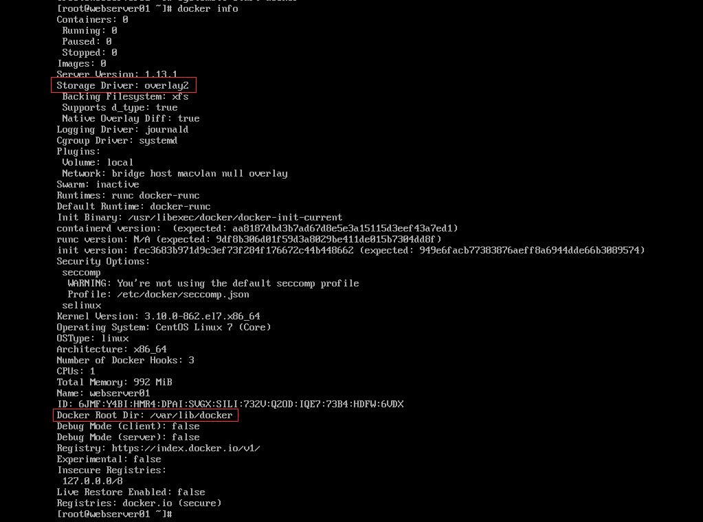
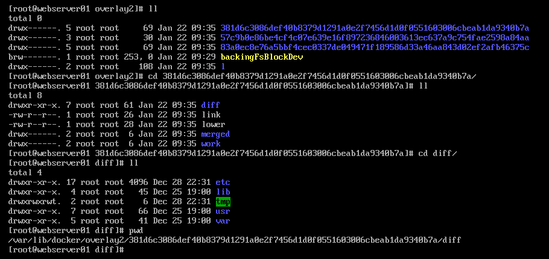

# Docker简介 #

## Docker概念 ##

**image**
The basis of a Docker container.The content at rest.

**Container**

The image when it is running.The standard unit for app service.

**Engine**

The software that executes commands for  contaners.Networking and volumes are part of Engine.Can be clustered together.

**Registry**

Stores,distributes and manages Docker images

**Control Plane**

Management plane for container and cluster orchestration.

## 相关历史 ##

- 2010年 Solomon Hykes成立dotcloud公司
- 2013年 dotcloud公司更为Docker，同年发布Docker-compose
- 2014年 Docker发布1.0版本
- 2015年 提供Docker Machine，支持windows，mac等平台
- 2015年 OCI开源社区成立，容器管理工具runc由社区维护（前身是Libcontainer）
- 2017年 Docker发布版分为Docker CE、EE、Moby
- 2018年 Docker支持Kubernetes

## Docker底层实现 ##

- OCI Open Container Initiative

也就是常说的OCI，是由多家公司共同成立的项目，并由linux基金会进行管理，致力于container runtime的标准的制定和runc的开发等工作，目前OCI发布了两个规范：runtime spec 和 image format spec。

- 容器runtime

runtime跟操作系统kernel紧密协作，为容器提供运行环境，lxc、runc和rkt是目前主流的三种容器 runtime。

- [runCrunc](https://github.com/opencontainers/runc)

前身是libcontainer，是对于OCI标准的一个参考实现，是一个可以用于创建和运行容器的CLI(command-line interface)工具。runc直接与容器所依赖的cgroup/linux kernel等进行交互，负责为容器配置cgroup/namespace等启动容器所需的环境，创建启动容器的相关进程。为了兼容OCI标准，Docker也做了架构调整。将容器运行时相关的程序从docker daemon剥离出来，形成了containerd。Containerd向docker提供运行容器的API，二者通过grpc进行交互。containerd最后会通过runc来实际运行容器。

### Docker Engine使用的Linux隔离技术 ###

- PID NameSpace: 管理PID命名空间
- NET NameSpace： 管理网络命名空间
- IPC NameSpace： 管理进程通信命名空间
- MNT NameSpace： 管理文件系统挂载点命名空间
- UTS NameSpace： Unix时间系统隔离

#### Cgroups（资源限额）###

[https://fr.wikipedia.org/wiki/Cgroups](https://fr.wikipedia.org/wiki/Cgroups)

Cgroups是Control groups的缩写，是Linux内核提供的一种可以限制、记录、隔离进程组（process groups）所使用的物理资源（如：cpu,memory,IO等等）的机制。由google的工程师与2007年提出，2008年被整合进Linux内核。Cgroups也是LXC为实现虚拟化所使用的资源管理手段。

Docker实现CPU、内存、网络的限制均是通过cgroups实现。

#### Unionfs ###

[https://en.wikipedia.org/wiki/UnionFS](https://en.wikipedia.org/wiki/UnionFS)

Unionfs（Union File System）即联合文件系统，于2004年由纽约州立大学石溪分校开发，它可以把多个目录(也叫分支)内容联合挂载到同一个目录下，而目录的物理位置是分开的。UnionFS允许只读和可读写目录并存，就是说可同时删除和增加内容。UnionFS应用的地方很多，比如在多个磁盘分区上合并不同文件系统的主目录，或把几张CD光盘合并成一个统一的光盘目录(归档)。另外，具有写时复制(copy-on-write)功能，UnionFS可以把只读和可读写文件系统合并在一起，虚拟上允许只读文件系统的修改可以保存到可写文件系统当中。

Docker默认使用AuFS（Advanced Union FS）来支持Docker镜像的Layer，也支持其它Unionfs的版本。

使用`docker info`命令能查看当前使用的Unionfs的版本与挂载根目录。

Overlay2文件层级目录结构如下：

