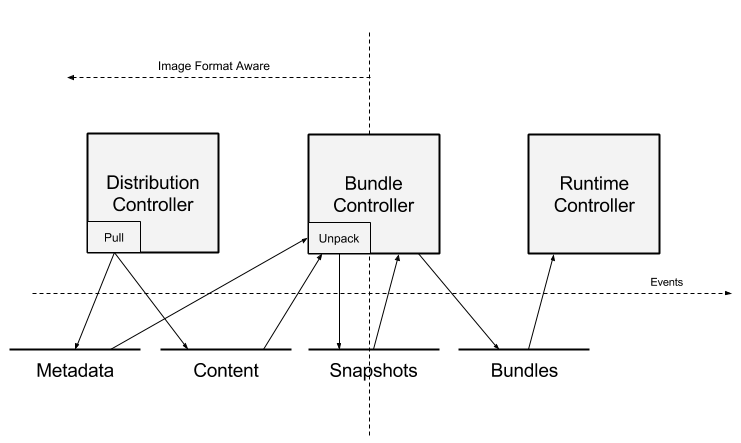

# Docker简介 #

## Docker概念 ##

**image**

The basis of a Docker container.The content at rest.

**Container**

The image when it is running.The standard unit for app service.

**Engine**

The software that executes commands for  contaners.Networking and volumes are part of Engine.Can be clustered together.

**Registry**

Stores,distributes and manages Docker images

**Control Plane**

Management plane for container and cluster orchestration.

## 相关历史 ##

- 2010年 Solomon Hykes成立dotcloud公司
- 2013年 dotcloud公司更为Docker，同年发布Docker-compose
- 2014年 Docker发布1.0版本
- 2015年 提供Docker Machine，支持windows，mac等平台
- 2015年 OCI开源社区成立，容器管理工具runc由社区维护（前身是Libcontainer）
- 2017年 Docker发布版分为Docker CE、EE、Moby
- 2018年 Docker支持Kubernetes

## Docker底层实现 ##

- OCI Open Container Initiative

也就是常说的OCI，是由多家公司共同成立的项目，并由linux基金会进行管理，致力于container runtime的标准的制定和runc的开发等工作，目前OCI发布了两个规范：runtime spec 和 image format spec。

- 容器runtime

runtime跟操作系统kernel紧密协作，为容器提供运行环境，lxc、runc和rkt是目前主流的三种容器 runtime。

- [runCrunc](https://github.com/opencontainers/runc)

前身是libcontainer，是对于OCI标准的一个参考实现，是一个可以用于创建和运行容器的CLI(command-line interface)工具。runc直接与容器所依赖的cgroup/linux kernel等进行交互，负责为容器配置cgroup/namespace等启动容器所需的环境，创建启动容器的相关进程。为了兼容OCI标准，Docker也做了架构调整。将容器运行时相关的程序从docker daemon剥离出来，形成了containerd。Containerd向docker提供运行容器的API，二者通过grpc进行交互。containerd最后会通过runc来实际运行容器。

### Docker Engine使用的Linux隔离技术 ###

- PID NameSpace: 管理PID命名空间
- NET NameSpace： 管理网络命名空间
- IPC NameSpace： 管理进程通信命名空间
- MNT NameSpace： 管理文件系统挂载点命名空间
- UTS NameSpace： Unix时间系统隔离

#### Cgroups（资源限额）###

[https://fr.wikipedia.org/wiki/Cgroups](https://fr.wikipedia.org/wiki/Cgroups)

Cgroups是Control groups的缩写，是Linux内核提供的一种可以限制、记录、隔离进程组（process groups）所使用的物理资源（如：cpu,memory,IO等等）的机制。由google的工程师与2007年提出，2008年被整合进Linux内核。Cgroups也是LXC为实现虚拟化所使用的资源管理手段。

Docker实现CPU、内存、网络的限制均是通过cgroups实现。

#### Unionfs ###

[https://en.wikipedia.org/wiki/UnionFS](https://en.wikipedia.org/wiki/UnionFS)

Unionfs（Union File System）即联合文件系统，于2004年由纽约州立大学石溪分校开发，它可以把多个目录(也叫分支)内容联合挂载到同一个目录下，而目录的物理位置是分开的。UnionFS允许只读和可读写目录并存，就是说可同时删除和增加内容。UnionFS应用的地方很多，比如在多个磁盘分区上合并不同文件系统的主目录，或把几张CD光盘合并成一个统一的光盘目录(归档)。另外，具有写时复制(copy-on-write)功能，UnionFS可以把只读和可读写文件系统合并在一起，虚拟上允许只读文件系统的修改可以保存到可写文件系统当中。

Docker默认使用AuFS（Advanced Union FS）来支持Docker镜像的Layer，也支持其它Unionfs的版本。

使用`docker info`命令能查看当前使用的Unionfs的版本与挂载根目录。


Overlay2文件层级目录结构如下：


## Docker核心组件 ##

Docker的核心组件如下：


它们之间的调用关系如下：


- 1. docker daemon 模块通过grpc和containerd模块通信：dockerd由libcontainerd负责和containerd模块进行交换，通信socket文件：docker-containerd.sock 
- 2. containerd在dockerd启动时被启动，并启动grpc请求监听。containerd处理grpc请求，根据请求做相应动作； 
- 3. 若是start或是exec容器，containerd会拉起一个container-shim , 并通过exit 、control 文件（每个容器独有）通信； 
- 4. container-shim别拉起后，start/exec/create拉起runC进程，通过exit、control文件和containerd通信，通过父子进程关系和SIGCHLD监控容器中进程状态； 
- 5. 若是top等命令，containerd通过runC二级制组件直接和容器交换； 
- 6. 在整个容器生命周期中，containerd通过 epoll 监控容器文件，监控容器的OOM等事件。


**containerd**

containerd是容器技术标准化之后的产物，为了能够兼容OCI标准，将容器运行时及其管理功能从Docker Daemon剥离出来。containerd主要职责是镜像管理（镜像、元信息等）、容器执行（调用最终运行时组件执行）。其架构如下：


[https://github.com/docker/containerd/blob/master/design/architecture.md](https://github.com/docker/containerd/blob/master/design/architecture.md)

- Distribution子系统

	实现Pull镜像功能；

- Bundle子系统

	允许用户从磁盘映像中提取镜像和打包成bundle。

- runtime子系统

	该服务实现bundles的执行，包括创建运行时容器。

- Executor组件

	实际容器运行时的执行器

- Supervisor组件

	监视和报告容器状态

- Metadata组件

	将元数据存储在图形数据库中。用于存储对镜像和bundle的任何持久性引用。输入到数据库的数据将具有在组件之间协调的模式，以提供对任意数据的访问。其他功能包括定义了用于磁盘资源的垃圾回收的钩子。

- Content组件

	提供对content addressable storage （镜像的层文件）的访问，所有不可变的内容将存储在这里，通过内容的hash索引。

- Snapshot组件

	管理容器映像的文件系统快照。这类似于Docker中的graphdriver。图层被解包到快照中。

- Events组件

	支持事件的收集和使用，以提供一致的，事件驱动的行为和审计。

- Metrics组件

	每个组件将导出几个指标，可通过指标API访问。


bundle是containerd的核心，创建bundle的数据流如下：



- 指示Distribution组件拉取一个指定的镜像；
- Distribution组件将镜像的content放入content组件中存储；
- 将镜像名字和根清单指针向metadata组件存储注册；
- bundle组件解压镜像为一个bundle；
- 根据上面content组件中存储，将镜像的层文件解压到snapshot 组件中；
- 当一个容器的rootfs的snapshot准备好时，bundle组件使用镜像清单指针和配置来准备执行所有的配置；
- 将准备好的bundle传递给runtime子系统执行；
- runtime子系统读取bundle配置，创建一个运行容器。


**containerd-shim**

containerd-shim是一个真实运行的容器载体，每启动一个容器时docker-containerd都会创建一个或多个新的docker-containerd-shim进程，创建docker-containerd-shim进程时会传入三个参数：容器id，boundle目录（containerd的对应某个容器生成的目录，一般位于：/var/run/docker/libcontainerd/containerID，这个目录包含了容器配置和标准输入、标准输出、标准错误三个管道文件），运行时二进制（默认为runc）。containerd-shim会通过调用runC来管理容器的生命周期。


**runC**

[https://github.com/opencontainers/runc](https://github.com/opencontainers/runc)

runC实际上来源于Docker的libcontainer，本质上是在libcontainer之上做了一层封装，实现了容器启停、资源隔离等功能。Docker默认的runtime为`docker-runc`，我们还可以在启动Docker Daemon时增加`--add-runtime`参数来选择其他的runC。例如：

`docker daemon --add-runtime "custom=/usr/local/bin/my-runc-replacement"`

通过runC创建一个容器：

1、下载源码编译

```
cd github.com/opencontainers
git clone https://github.com/opencontainers/runc
cd runc
make
sudo make install

```

2、创建容器根文件系统

```
mkdir /mycontainer
cd /mycontainer

mkdir rootfs

docker export $(docker create busybox) | tar -C rootfs -xvf -

```

3、通过`runc spec`命令创建默认的配置文件config.json

```
runc spec
```

4、运行容器

```
cd /mycontainer
runc run mycontainerid
/ # ls
bin　　dev　　etc　　home　　proc　　root　　sys　　tmp　　usr　　var

runc list
ID              PID         STATUS      BUNDLE         CREATED                          OWNER
mycontainerid   1070        running     /mycontainer   2017-12-20T12:26:30.159978871Z   root

```


摘自：

[https://blog.csdn.net/Jinhua_Wei/article/details/79874592](https://blog.csdn.net/Jinhua_Wei/article/details/79874592)

[https://my.oschina.net/u/2306127/blog/1600270](https://my.oschina.net/u/2306127/blog/1600270)