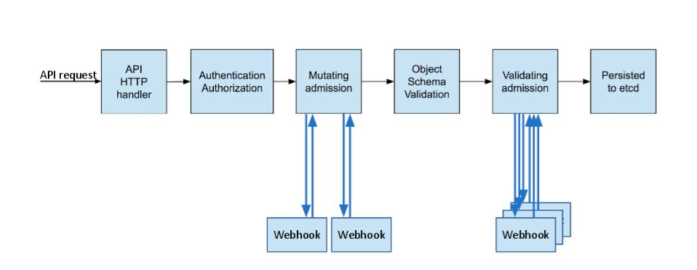

# Kubernetes Admission Webhooks #

[https://my.oschina.net/jxcdwangtao/blog/1591681](https://my.oschina.net/jxcdwangtao/blog/1591681)

## 外部Admission Webhooks ##

外部admission webhooks是一些HTTP的callback, 用来接受admission的请求， 并且做一些相应的处理。 外部admission webhook做什么是由使用者来决定的, 但是必须遵从[这个接口](https://github.com/kubernetes/kubernetes/blob/v1.7.0-rc.1/pkg/apis/admission/v1alpha1/types.go), 来响应是否允许这个admission请求。跟initializers或者插件化的admission controllers不一样的是, 外部的admission webhooks不允许以任何方式突变这个admission request,因为admission是一个很高级别的安全相关的操作, 外部的admission webhooks必须支持TLS。

当集群管理员需要强制对某些请求或者所有请求都进行校验或者修改的时候，就可以考虑使用`ValidatingAdmissionWebhook`或`MutatingAdmissionWebhook`，两者的区别如下：

- `MutatingAdmissionWebhook`允许在webhook中对object进行mutate修改；

- `ValidatingAdmissionWebhook`(Kubernetes 1.9之前叫GenericAdmissionWebhook)不允许在webhook中对Object进行mutate修改，只是返回validate结果为true or false

**启用External Admission Webhooks**

启用External Admission Webhooks需要在每个kube-apiserver实例（考虑到Kubernetes Master HA）中`--admission-controll`中添加ValidatingAdmissionWebhook，MutatingAdmissionWebhook。另外，还需要在每个kube-apiserver实例的`--runtime-config`中添加`admissionregistration.k8s.io/v1alpha1。disable`。

**注意事项：**

MutatingAdmissionWebhook：
 
- beta in 1.9;
- MutatingAdmissionWebhook是让匹配的webhooks串行执行的，因为每个webhook都可能会mutate object。
- 同Initializers的使用类似，MutatingAdmissionWebhook是通过创建MutatingWebhookConfiguration来配置什么样的request会触发哪个webhook。
- apiserver调用webhook时一定是通过TLS认证的，所以MutatingWebhookConfiguration中一定要配置caBundle。

ValidatingAdmissionWebhook：

- alpha in 1.8，beta in 1.9;
- ValidatingAdmissionWebhook是让匹配的webhooks并发执行的，因为每个webhook只会进行validate操作，而不会mutate object。
- 同Initializers的使用类似，ValidatingAdmissionWebhook是通过创建ValidatingWebhookConfiguration来配置什么样的request会触发哪个webhook。
- apiserver调用webhook时一定是通过TLS认证的，所以ValidatingWebhookConfiguration中一定要配置caBundle。

**工作流程**

[https://github.com/morvencao/kube-mutating-webhook-tutorial](https://github.com/morvencao/kube-mutating-webhook-tutorial)

1.api请求到达K8S API Server
2.请求要先经过认证
	- kubectl调用需要kubeconfig
	- 直接调用K8S api需要证书+bearToken
	- client-go调用也需要kubeconfig
3.执行一连串的admission controller，包括MutatingAdmissionWebhook和ValidatingAdmissionWebhook, 先串行执行MutatingAdmission的Webhook list
4.对请求对象的schema进行校验
5.并行执行ValidatingAdmission的Webhook list
6.最后写入etcd