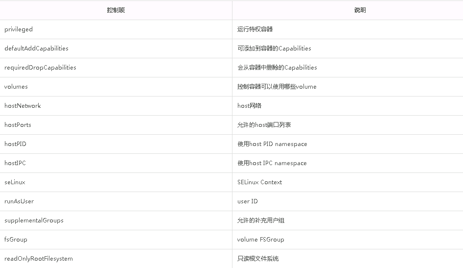

# Kubernetes Security Context #

Security Context的的目是限制不可信容器的行为，保护系统和其他容器不受其影响。Kubernetes提供了三种配置Security Context的方法：

- **Container-level Security Context**：仅应用到指定的容器，并且不会影响Volume。比如设置容器运行在特权模式：

	```yaml
	apiVersion: v1
	kind: Pod
	metadata:
	  name: hello-world
	spec:
	  containers:
	    - name: hello-world-container
	      # The container definition
	      # ...
	      securityContext:
	        privileged: true
	```
	支持的配置项：
	- allowPrivilegeEscalation
	
		控制进程是否可以获得比其父进程更多的权限，当容器以特权模式运行或者具有`CAP_SYS_ADMIN`时此值一直为true。
	- capabilities 
	
		从linux内核2.2开始，Linux把超级用户不同单元的权限分开，可以单独的开启和禁止，称为能力(capability)。可以将能力赋给普通的进程，使其可以做root用户可以做的事情。此配置项可以配置在默认的能力集上进行移除和添加某些能力。
		[capabilities帮助文档](http://man7.org/linux/man-pages/man7/capabilities.7.html)
		[参考Kubernetes对Container Capabilities的支持](https://cloud.tencent.com/developer/article/1097480)
	- privileged
	
		控制容器中的进程是否以特权模式运行，默认为false。特权容器中的进程基本上等同于主机上的root。
	- readOnlyRootFilesystem
		
		控制容器中的root文件系统是否为只读，默认为false。
	- runAsGroup
	
		配置容器运行endpoint的组ID。可以在PodSecurityContext中设置， 如果在SecurityContext和PodSecurityContext中都有设置，则SecurityContext中指定的值优先。
	- runAsNonRoot
	
		控制容器必须以非root用户身份运行。 如果为true，则Kubelet将在运行时验证镜像，以确保它不以UID 0（root）身份运行，如果镜像配置以root运行则无法启动容器该容器。 如果未设置或设置为false，则不会执行此类验证。 可以在PodSecurityContext中设置，如果在SecurityContext和PodSecurityContext中都设置，则SecurityContext中指定的值优先。
	- runAsUser
	
		配置容器运行endpoint的用户ID。 如果未指定，则默认为镜像元数据中指定的用户ID。 可以在PodSecurityContext中设置， 如果在SecurityContext和PodSecurityContext中都设置，则SecurityContext中指定的值优先。
	- seLinuxOptions
	
		配置容器的SELinux上下文。 如果未指定，运行时将为每个容器分配一个随机SELinux上下文。 可以在PodSecurityContext中设置，如果在SecurityContext和PodSecurityContext中都设置，则SecurityContext中指定的值优先。
		配置时可以指定level、role、type和user标签。

- **Pod-level Security Context**：应用到Pod内所有容器以及Volume(securityContext的配置项与`Container-level Security Context`一致，在`securityContext`同层级可以支持配置`hostIPC`、`hostNetwork`和`hostPID`)
	[参考API接口文档](https://kubernetes.io/docs/reference/generated/kubernetes-api/v1.10/#podsecuritycontext-v1-core)

	```yaml
	apiVersion: v1
	kind: Pod
	metadata:
	  name: hello-world
	spec:
	  containers:
	  # specification of the pod's containers
	  # ...
	  securityContext:
	    fsGroup: 1234
	    supplementalGroups: [5678]
	    seLinuxOptions:
	      level: "s0:c123,c456"
	```

- **Pod Security Policies（PSP）**：应用到集群内部所有Pod以及Volume,使用PSP需要API Server开启extensions/v1beta1/podsecuritypolicy，并且配置PodSecurityPolicyadmission控制器。

	支持的部分控制项如下：
	[参考API接口文档](https://kubernetes.io/docs/reference/generated/kubernetes-api/v1.10/#podsecuritypolicyspec-v1beta1-policy)
	

	示例：（限制容器的host端口范围为8000-8080）

	```yaml
	apiVersion: extensions/v1beta1
	kind: PodSecurityPolicy
	metadata:
	  name: permissive
	spec:
	  seLinux:
	    rule: RunAsAny
	  supplementalGroups:
	    rule: RunAsAny
	  runAsUser:
	    rule: RunAsAny
	  fsGroup:
	    rule: RunAsAny
	  hostPorts:
	  - min: 8000
	    max: 8080
	  volumes:
	  - '*'
	 ```


