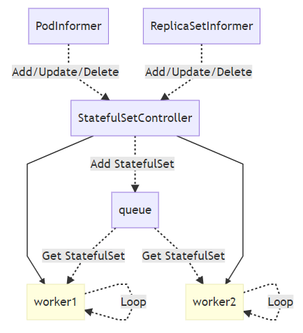

 ## StatefulSet ##

[https://blog.51cto.com/newfly/2140004](https://blog.51cto.com/newfly/2140004)

StatefulSet本质上是Deployment的一种变体，在v1.9版本中已成为GA版本，它为了解决有状态服务的问题，它所管理的Pod拥有固定的Pod名称，启停顺序，在StatefulSet中，Pod名字称为网络标识(hostname)，还必须要用到共享存储。在Deployment中，与之对应的服务是service，而在StatefulSet中与之对应的headless service，与service的区别就是它没有Cluster IP，解析它的名称时将返回该Headless Service对应的全部Pod的Endpoint列表。除此之外，StatefulSet在Headless Service的基础上又为StatefulSet控制的每个Pod副本创建了一个DNS域名，这个域名的格式为：

```
$(podname).(headless server name)   
FQDN： $(podname).(headless server name).namespace.svc.cluster.local
```

**稳定的身份标识**

StatefulSet中反复强调的“稳定的身份标识”，主要指Pods的hostname以及对应的DNS Records、pvc。


- **HostName：** StatefulSet的Pods的hostname按照这种格式生成：$(statefulset name)-$(ordinal)， ordinal从0 ~ N-1(N为期望副本数)。

	```golang
	@kubernetes/pkg/controller/statefulset/stateful_set_utils.go
	func getPodName(set *apps.StatefulSet, ordinal int) string {
	    return fmt.Sprintf("%s-%d", set.Name, ordinal)  // ordinal为索引号
	}
	```

	StatefulSet Controller在创建pods时，会给pod加上一个pod name label：statefulset.kubernetes.io/pod-name, 然后设置到Pod的pod name和hostname中。我们可以创建独立的Service匹配到这个指定的pod，然后方便我们单独对这个pod进行debug等处理。

- **DNS Records：**

	```golang
	@kubernetes/pkg/controller/statefulset/stateful_set_utils.go
	func initIdentity(set *apps.StatefulSet, pod *v1.Pod) {
	    updateIdentity(set, pod)
	    // Set these immutable fields only on initial Pod creation, not updates.
	    pod.Spec.Hostname = pod.Name  // hostname设置为podName
	    pod.Spec.Subdomain = set.Spec.ServiceName // subdomain设置为Headless Service的名称
	}
	```

	- Headless Service的DNS解析：$(service name).$(namespace).svc.cluster.local 通过DNS RR解析到后端其中一个Pod。SRV Records只包含对应的Running and Ready的Pods，不Ready的Pods不会在对应的SRV Records中。
	- Pod的DNS解析：$(hostname).$(service name).$(namespace).svc.cluster.local解析到对应hostname的Pod。

- **PVC**

	```golang
	@kubernetes/pkg/controller/statefulset/stateful_set_utils.go
	func getPersistentVolumeClaimName(set *apps.StatefulSet, claim *v1.PersistentVolumeClaim, ordinal int) string {
	    // NOTE: This name format is used by the heuristics for zone spreading in ChooseZoneForVolume
	    // ordinal为pod的索引号
	    return fmt.Sprintf("%s-%s-%d", claim.Name, set.Name, ordinal)
	}
	```

**Statefulset的启停顺序**

- 有序部署：部署StatefulSet时，如果有多个Pod副本，它们会被顺序地创建（从0到N-1）并且，在下一个Pod运行之前所有之前的Pod必须都是Running和Ready状态。
- 有序删除：当Pod被删除时，它们被终止的顺序是从N-1到0。
- 有序扩展：当对Pod执行扩展操作时，与部署一样，它前面的Pod必须都处于Running和Ready状态。

**Statefulset Pod管理策略**

	在v1.7以后，通过允许修改Pod排序策略，同时通过`.spec.podManagementPolicy`字段确保其身份的唯一性。

	- **OrderedReady**：默认设置，参照**Statefulset的启停顺序**所述。
	- **Parallel**：告诉StatefulSet控制器并行启动或终止所有Pod，并且在启动或终止另一个Pod之前不等待前一个Pod变为Running and Ready或完全终止。

**更新策略**

	在Kubernetes 1.7及更高版本中，通过`.spec.updateStrategy`字段允许配置或禁用Pod、labels、source request/limits、annotations自动滚动更新功能。

	- **OnDelete**：通过`.spec.updateStrategy.type`字段设置为OnDelete，StatefulSet控制器不会自动更新StatefulSet中的Pod。用户必须手动删除Pod，以使控制器创建新的Pod。
	- **RollingUpdate**：通过`.spec.updateStrategy.type`字段设置为RollingUpdate，实现了Pod的自动滚动更新，如果`.spec.updateStrategy`未指定，则此为默认策略。 StatefulSet控制器将删除并重新创建StatefulSet中的每个Pod。它将以Pod终止（从最大序数到最小序数）的顺序进行，一次更新每个Pod。在更新下一个Pod之前，必须等待这个Pod Running and Ready。
	- **Partitions**：通过指定`.spec.updateStrategy.rollingUpdate.partition`来对 RollingUpdate 更新策略进行分区，如果指定了分区，则当StatefulSet的`.spec.template`更新时，具有大于或等于分区序数的所有Pod将被更新。具有小于分区的序数的所有Pod将不会被更新，即使删除它们也将被重新创建。如果StatefulSet的`.spec.updateStrategy.rollingUpdate.partition`大于其`.spec.replicas`，则其`.spec.template`的更新将不会传播到Pod。在大多数情况下，不需要使用分区。

**节点离线后的pod状态**

节点NotReady后对于不同类型的workloads，其对应的pod处理方式因为controller-manager中各个控制器的逻辑不通而不同：

- deployment: 节点NotReady触发eviction后，pod将会在新节点重建(如果有nodeSelector或者亲和性要求，会处于Pending状态)，故障节点的Pod仍然会保留处于Unknown状态，所以此时看到的pod数多于副本数。
- statefulset: 节点NotReady同样会对StatefulSet触发eviction操作，但是用户看到的Pod会一直处于Unknown状态没有变化。
- daemonSet: 节点NotReady对DaemonSet不会有影响，查询pod处于NodeLost状态并一直保持。

**节点恢复Ready后pod状态**

- deployment: 此时pod已经有正确的pod在其他节点running，此时故障节点恢复后，kubelet执行优雅删除，删除旧的Pod。
- statefulset: statefulset会从Unknown状态变为Terminating状态，执行优雅删除，detach PV，然后执行重新调度与重建操作。
- daemonset: daemonset会从NodeLost状态直接变成Running状态，不涉及重建。

## 实现原理 ##

[https://draveness.me/kubernetes-statefulset](https://draveness.me/kubernetes-statefulset)

StatefulSet控制器主要由`StatefulSetController`、`StatefulSetControl`和`StatefulPodControl`三个组件协作来完成StatefulSet的管理，StatefulSetController会同时从`PodInformer`和`ReplicaSetInformer`中接受增删改事件并将事件推送到队列中：



控制器StatefulSetController会在Run方法中启动多个Goroutine协程，这些协程会从队列中获取待处理的StatefulSet资源进行同步。

**同步**

`StatefulSetController`使用`sync`方法同步StatefulSet资源

```golang
func (ssc *StatefulSetController) sync(key string) error {
	namespace, name, _ := cache.SplitMetaNamespaceKey(key)
	set, _ := ssc.setLister.StatefulSets(namespace).Get(name)

	ssc.adoptOrphanRevisions(set)

	selector, _ := metav1.LabelSelectorAsSelector(set.Spec.Selector)
	pods, _ := ssc.getPodsForStatefulSet(set, selector)

	return ssc.syncStatefulSet(set, pods)
}

func (ssc *StatefulSetController) syncStatefulSet(set *apps.StatefulSet, pods []*v1.Pod) error {
	ssc.control.UpdateStatefulSet(set.DeepCopy(), pods); err != nil
	return nil
}
```

- 先重新获取StatefulSet对象；
- 收养集群中与StatefulSet有关的孤立控制器版本；
- 获取当前StatefulSet对应的全部Pod副本；
- 调用syncStatefulSet方法同步资源；

	
## 代码分析 ##

摘自[https://segmentfault.com/a/1190000019488735](https://segmentfault.com/a/1190000019488735)和[https://my.oschina.net/jxcdwangtao/blog/1784739?fromerr=XjbBhQrv](https://my.oschina.net/jxcdwangtao/blog/1784739?fromerr=XjbBhQrv)

