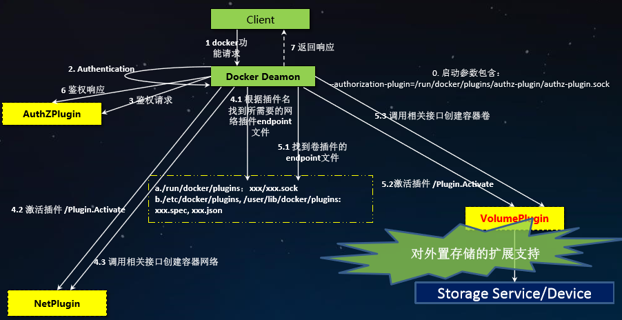

# Kubernetes存储 #

## Docker插件架构 ##

**Docker Volume Plugin列表** 

- [Azure File Storage plugin](https://github.com/Azure/azurefiledockervolumedriver)
Lets you mount Microsoft Azure File Storage shares to Docker containers as volumes using the SMB 3.0 protocol. Learn more.

- [BeeGFS Volume Plugin](https://github.com/RedCoolBeans/docker-volume-beegfs)
An open source volume plugin to create persistent volumes in a BeeGFS parallel file system. 

- [Blockbridge plugin](https://github.com/blockbridge/blockbridge-docker-volume) 
A volume plugin that provides access to an extensible set of container-based persistent storage options. It supports single and multi-host Docker environments with features that include tenant isolation, automated provisioning, encryption, secure deletion, snapshots and QoS.

-[Contiv Volume Plugin](https://github.com/rancher/convoy)
An open source volume plugin that provides multi-tenant, persistent, distributed storage with intent based consumption. It has support for Ceph and NFS.

- [DigitalOcean Block Storage plugin](https://github.com/omallo/dockervolume-plugin-dostorage)
Integrates DigitalOcean’s block storage solution into the Docker ecosystem by automatically attaching a given block storage volume to a DigitalOcean droplet and making the contents of the volume available to Docker containers running on that droplet.

- [DRBD plugin](https://www.drbd.org/en/supporte d-projects/docker) 
A volume plugin that provides highly available storage replicated by DRBD. Data written to the docker volume is replicated in a cluster of DRBD nodes.

- [Flocker plugin](https://clusterhq.com/dockerplugin/) 
A volume plugin that provides multi-host portable volumes for Docker, enabling you to run databases and other stateful containers and move them around across a cluster of machines.

- [Fuxi Volume Plugin](https://github.com/openstack/fuxi) 
A volume plugin that is developed as part of the OpenStack Kuryr project and implements the Docker volume plugin API by utilizing Cinder, the OpenStack block storage service.

- [gce-docker plugin](https://github.com/mcuadros/gcedocker)
A volume plugin able to attach, format and mount Google Compute persistent-disks.

- [GlusterFS plugin](https://github.com/calavera/docker -volume-glusterfs)
A volume plugin that provides multi-host volumes management for Docker using GlusterFS.

- [Horcrux Volume Plugin](https://github.com/muthu-r/horcrux)
A volume plugin that allows on-demand, version controlled access to your data. Horcrux is an open-source plugin, written in Go, and supports SCP, Minio and Amazon S3.

- [HPE 3Par Volume Plugin](https://github.com/hpestorage/python-hpedockerplugin/)
A volume plugin that supports HPE 3Par and StoreVirtual iSCSI storage arrays.

- [Infinit volume plugin](https://infinit.sh/documentation/dock er/volume-plugin)
A volume plugin that makes it easy to mount and manage Infinit volumes using Docker.

- [IPFS Volume Plugin](http://github.com/vdemeester/docker -volume-ipfs)
An open source volume plugin that allows using an ipfs filesystem as a volume.

- [Keywhiz plugin](https://github.com/calavera/dockervolume-keywhiz)
A plugin that provides credentials and secret management using Keywhiz as a central repository.

- [Local Persist Plugin](https://github.com/CWSpear/localpersist)
A volume plugin that extends the default local driver’s functionality by allowing you specify a mountpoint anywhere on the host, which enables the files to always persist, even if the volume is removed via docker volume rm.

- [NetApp Plugin(nDVP)](https://github.com/NetApp/netappdvp)
A volume plugin that provides direct integration with the Docker ecosystem for the NetApp storage portfolio. The nDVP package supports the provisioning and management of storage resources from the storage platform to Docker hosts, with a robust framework for adding additional platforms in the future.

- [Netshare plugin](https://github.com/ContainX/dockervolume-netshare)
A volume plugin that provides volume management for NFS 3/4, AWS EFS and CIFS file systems.

- [Nimble Storage Volume Plugin](https://connect.nimblestorage.com/co mmunity/app-integration/docker)
A volume plug-in that integrates with Nimble Storage Unified Flash Fabric arrays. The plug-in abstracts array volume capabilities to the Docker administrator to allow self-provisioning of secure multi-tenant volumes and clones.

- [OpenStorage Plugin](https://github.com/libopenstorage/ openstorage)
A cluster-aware volume plugin that provides volume management for file and block storage solutions. It implements a vendor neutral specification for implementing extensions such as CoS, encryption, and snapshots. It has example drivers based on FUSE, NFS, NBD and EBS to name a few.

- [Portworx Volume Plugin](https://github.com/portworx/pxdev)
A volume plugin that turns any server into a scale-out converged compute/storage node, providing container granular storage and highly available volumes across any node, using a shared-nothing storage backend that works with any docker scheduler.

- [Quobyte Volume Plugin](https://github.com/quobyte/docker-volume)
A volume plugin that connects Docker to Quobyte’s data center file system, a general-purpose scalable and fault-tolerant storage platform.

- [REX-Ray plugin](https://github.com/emccode/rexray)
A volume plugin which is written in Go and provides advanced storage functionality for many platforms including VirtualBox, EC2, Google Compute Engine, OpenStack, and EMC.

- [Virtuozzo Storage and Ploop plugin](https://github.com/virtuozzo/docke r-volume-ploop)
A volume plugin with support for Virtuozzo Storage distributed cloud file system as well as ploop devices.

- [VMware vSphere Storage Plugin](https://github.com/vmware/dockervolume-vsphere)
Docker Volume Driver for vSphere enables customers to address persistent storage requirements for Docker containers in vSphere environments.

