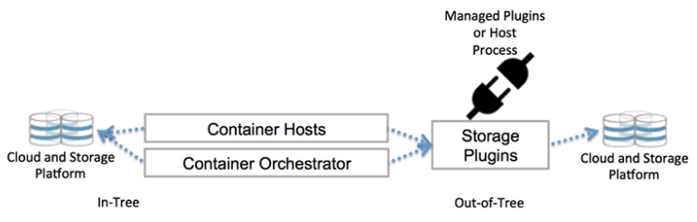

# Kubernetes存储 #

## Docker插件架构 ##


**Docker Volume Plugin列表** 

- [Azure File Storage plugin](https://github.com/Azure/azurefiledockervolumedriver)
Lets you mount Microsoft Azure File Storage shares to Docker containers as volumes using the SMB 3.0 protocol. Learn more.

- [BeeGFS Volume Plugin](https://github.com/RedCoolBeans/docker-volume-beegfs)
An open source volume plugin to create persistent volumes in a BeeGFS parallel file system. 

- [Blockbridge plugin](https://github.com/blockbridge/blockbridge-docker-volume) 
A volume plugin that provides access to an extensible set of container-based persistent storage options. It supports single and multi-host Docker environments with features that include tenant isolation, automated provisioning, encryption, secure deletion, snapshots and QoS.

- [Contiv Volume Plugin](https://github.com/rancher/convoy)
An open source volume plugin that provides multi-tenant, persistent, distributed storage with intent based consumption. It has support for Ceph and NFS.

- [DigitalOcean Block Storage plugin](https://github.com/omallo/dockervolume-plugin-dostorage)
Integrates DigitalOcean’s block storage solution into the Docker ecosystem by automatically attaching a given block storage volume to a DigitalOcean droplet and making the contents of the volume available to Docker containers running on that droplet.

- [DRBD plugin](https://www.drbd.org/en/supporte d-projects/docker) 
A volume plugin that provides highly available storage replicated by DRBD. Data written to the docker volume is replicated in a cluster of DRBD nodes.

- [Flocker plugin](https://clusterhq.com/dockerplugin/) 
A volume plugin that provides multi-host portable volumes for Docker, enabling you to run databases and other stateful containers and move them around across a cluster of machines.

- [Fuxi Volume Plugin](https://github.com/openstack/fuxi) 
A volume plugin that is developed as part of the OpenStack Kuryr project and implements the Docker volume plugin API by utilizing Cinder, the OpenStack block storage service.

- [gce-docker plugin](https://github.com/mcuadros/gcedocker)
A volume plugin able to attach, format and mount Google Compute persistent-disks.

- [GlusterFS plugin](https://github.com/calavera/docker -volume-glusterfs)
A volume plugin that provides multi-host volumes management for Docker using GlusterFS.

- [Horcrux Volume Plugin](https://github.com/muthu-r/horcrux)
A volume plugin that allows on-demand, version controlled access to your data. Horcrux is an open-source plugin, written in Go, and supports SCP, Minio and Amazon S3.

- [HPE 3Par Volume Plugin](https://github.com/hpestorage/python-hpedockerplugin/)
A volume plugin that supports HPE 3Par and StoreVirtual iSCSI storage arrays.

- [Infinit volume plugin](https://infinit.sh/documentation/dock er/volume-plugin)
A volume plugin that makes it easy to mount and manage Infinit volumes using Docker.

- [IPFS Volume Plugin](http://github.com/vdemeester/docker -volume-ipfs)
An open source volume plugin that allows using an ipfs filesystem as a volume.

- [Keywhiz plugin](https://github.com/calavera/dockervolume-keywhiz)
A plugin that provides credentials and secret management using Keywhiz as a central repository.

- [Local Persist Plugin](https://github.com/CWSpear/localpersist)
A volume plugin that extends the default local driver’s functionality by allowing you specify a mountpoint anywhere on the host, which enables the files to always persist, even if the volume is removed via docker volume rm.

- [NetApp Plugin(nDVP)](https://github.com/NetApp/netappdvp)
A volume plugin that provides direct integration with the Docker ecosystem for the NetApp storage portfolio. The nDVP package supports the provisioning and management of storage resources from the storage platform to Docker hosts, with a robust framework for adding additional platforms in the future.

- [Netshare plugin](https://github.com/ContainX/dockervolume-netshare)
A volume plugin that provides volume management for NFS 3/4, AWS EFS and CIFS file systems.

- [Nimble Storage Volume Plugin](https://connect.nimblestorage.com/co mmunity/app-integration/docker)
A volume plug-in that integrates with Nimble Storage Unified Flash Fabric arrays. The plug-in abstracts array volume capabilities to the Docker administrator to allow self-provisioning of secure multi-tenant volumes and clones.

- [OpenStorage Plugin](https://github.com/libopenstorage/ openstorage)
A cluster-aware volume plugin that provides volume management for file and block storage solutions. It implements a vendor neutral specification for implementing extensions such as CoS, encryption, and snapshots. It has example drivers based on FUSE, NFS, NBD and EBS to name a few.

- [Portworx Volume Plugin](https://github.com/portworx/pxdev)
A volume plugin that turns any server into a scale-out converged compute/storage node, providing container granular storage and highly available volumes across any node, using a shared-nothing storage backend that works with any docker scheduler.

- [Quobyte Volume Plugin](https://github.com/quobyte/docker-volume)
A volume plugin that connects Docker to Quobyte’s data center file system, a general-purpose scalable and fault-tolerant storage platform.

- [REX-Ray plugin](https://github.com/emccode/rexray)
A volume plugin which is written in Go and provides advanced storage functionality for many platforms including VirtualBox, EC2, Google Compute Engine, OpenStack, and EMC.

- [Virtuozzo Storage and Ploop plugin](https://github.com/virtuozzo/docke r-volume-ploop)
A volume plugin with support for Virtuozzo Storage distributed cloud file system as well as ploop devices.

- [VMware vSphere Storage Plugin](https://github.com/vmware/dockervolume-vsphere)
Docker Volume Driver for vSphere enables customers to address persistent storage requirements for Docker containers in vSphere environments.


## Kubernetes存储 ##

## Kubernetes存储架构 ###
摘自[https://www.kubernetes.org.cn/3462.html](https://www.kubernetes.org.cn/3462.html)



Kubernetes挂载PV的过程：

- 用户通过API创建一个包含PVC的Pod；
- Scheduler把这个Pod分配到某个节点，比如Node1；
- Node1上的Kubelet开始等待Volume Manager准备device；
- PV controller调用相应Volume Plugin（in-tree或者out-of-tree），创建PV，并在系统中与对应的PVC绑定；
- Attach/Detach controller或者Volume Manager通过Volume Plugin实现device挂载（Attach）；
- Volume Manager等待device挂载完成后，将卷挂载到节点指定目录（mount），比如/var/lib/kubelet/pods/xxxxxxxxxxx/volumes/aws-ebs/vol-xxxxxxxxxxxxxxxxx；
- Node1上的Kubelet此时被告知volume已经准备好后，开始启动Pod，通过volume mapping将PV已经挂载到相应的容器中去。

### In-Tree Volume Plugins ###

Kubernetes的VolumePlugin提供了插件化扩展存储的机制，分为内置插件（In-Tree Plugins）和外置插件（Out-of-Tree）两种。

- awsElasticBlockStore 
mounts an Amazon Web Services (AWS) EBS Volume (Elastic Block Store)

- azureDisk 
is used to mount a Microsoft Azure Data Disk into a Pod.

- azureFile
is used to mount a Microsoft Azure File Volume (SMB 2.1 and 3.0) into a Pod.

- cephfs 
allows an existing CephFS volume to be mounted into your pod. 

- cinder 
is used to mount OpenStack Block Storage into a pod.

- configMap 
The data stored in a ConfigMap object can be referenced in a volume of type configMap and then consumed by containerized applications running in a Pod.

- downwardAPI 
is used to make downward API data available to applications. It mounts a directory and writes the requested data in plain text files

- emptyDir 
is first created when a Pod is assigned to a Node, and exists as long as that Pod is running on that node. When a Pod is removed from a node for any reason, the data in the emptyDir is deleted forever.

- fc (fibre channel) 
allows an existing fibre channel volume to be mounted in a pod

- flocker 
allows a Flocker dataset to be mounted into a pod. 

- gcePersistentDisk 
mounts a Google Compute Engine (GCE) Persistent Disk into your pod. 

- gitRepo 
mounts an empty directory and clones a git repository into it for your pod to use.

- glusterfs 
allows a Glusterfs (an open source networked filesystem) volume to be mounted into your pod

- hostPath 
mounts a file or directory from the host node’s filesystem into your pod. 

- iscsi 
allows an existing iSCSI (SCSI over IP) volume to be mounted into your pod

- local 
represents a mounted local storage device such as a disk, partition or directory.  can only be used as a statically created PersistentVolume.

- nfs 
allows an existing NFS (Network File System) share to be mounted into your pod

- persistentVolumeClaim 
is used to mount a PersistentVolume into a pod. 

- projected 
maps several existing volume sources into the same directory.

- portworxVolume 
can be dynamically created through Kubernetes or it can also be pre-provisioned and referenced inside a Kubernetes pod. 

- quobyte 
allows an existing Quobyte volume to be mounted into your pod. 

- rbd 
allows a Rados Block Device volume to be mounted into your pod.

- scaleIO 
ScaleIO is a software-based storage platform that can use existing hardware to create clusters of scalable shared block networked storage. The ScaleIO volume plugin allows deployed pods to access existing ScaleIO volumes

- secret 
is used to pass sensitive information, such as passwords, to pods

- storageos 
allows an existing StorageOS volume to be mounted into your pod. StorageOS provides block storage to containers, accessible via a file system.

- vsphereVolume 
used to mount a vSphere VMDK Volume into your Pod.


### K8S FlexVolume ###

此Volume Driver允许不同厂商去开发他们自己的驱动来挂载卷到计算节点。

**Flex Volume架构**：


特点：
- driver以二进制命令行形式实现FlexVolume API，以供Controller-Manager和Kubelet调用，对外接口实现容易；
- DaemonSet方式部署确保Master和Node上都会将driver安装到插件目录；
- Docker镜像+yaml配置的交付形式

**Flex Volume CLI API**

- Init (`<driver executable> init`)
初始化驱动。在Kubelet和Controller-Manager初始化时被调用。若调用成功则需要返回一个展示对应驱动所支持的FlexVolume能力的map，现在只包含一个必填字段attach，用于表明本驱动是否需要attach和detach操作。为向后兼容该字段一般默认值设为true。

- Attach(`<driver executable> attach <json options> <node name>`)
将给定规格的卷添加到给定的主机上。若调用成功则返回存储设备添加到该主机的路径。Kubelet和Controller-Manager都需要调用该方法。

- Detach(`<driver executable> detach <mount device> <node name>`)
卸载给定主机上的指定卷。Kubelet和Controller-Manager都需要调用该方法。

- Wait for attach(`<driver executable> waitforattach <mount device> <json options>`)
等待卷被添加到远程节点。若调用成功则将返回设备路径。Kubelet和Controller-Manager都需要调用该方法。

- Volume is Attached(`<driver executable> isattached <json options> <node name>`)
检查卷是否已被添加到节点上。Kubelet和Controller-Manager都需要调用该方法。

- Mount device(`<driver executable> mountdevice <mount dir> <mount device> <json options>`)
将存储设备挂载到一个将被pod使用的全局路径上。Kubelet需要调用该方法。

- Unmount device(`<driver executable> unmountdevice <mount device>`)
将存储设备卸载。This is called once all bind mounts have been unmounted.Kubelet需要调用该方法。

- Mount(`<driver executable> mount <mount dir> <json options>`)
将卷挂载到指定目录。Kubelet需要调用该方法。

- Unmount(`<driver executable> unmount <mount dir>`)
将卷进行卸载。Kubelet需要调用该方法。


### PV和PVC ###

- PersistentVolume（一些简称PV）：由管理员添加的的一个存储的描述，是一个全局资源，包含存储的类型，存储的大小和访问模式等。它的生命周期独立于Pod，例如当使用它的Pod销毁时对PV没有影响。 

- PersistentVolumeClaim（一些简称PVC）：是Namespace里的资源，描述对PV的一个请求。请求信息包含存储大小，访问模式等。

**PV和PVC的生命周期**

- Provisioning
	即PV的创建，可以直接创建PV（静态方式），也可以使用StorageClass动态创建

- Binding
	当集群中新添加一个PVC时，k8s里的PVController会试图查找最合适（存储大小和访问模式）的PV并建立绑定关系。 最合适的意思是PVC一定满足PV的要求，单也可能比PVC要求的要多，例如PVC请求5G存储，但当前最小的PV是10G，那么这个PV也会被分配给PVC。 注意一个PV只能绑定给一个PVC。

- Using
	Pod通过PVC使用该Volume

- Releasing
	当用户使用完PVC可以把它删除，绑定在其上的PV会变成“released”并准备被回收。

- Reclaiming
	回收PV，可以保留PV以便下次使用，也可以直接从云存储中删除
	有三种回收策略： 
	- Retained：PV会保持原有数据并允许用户手动回收数据。 
	- Recycled：删除数据并允许PV被绑定到其它PVC。 
	- Deleted： 将删除PV和外部关联的存储资源。

**PV状态**

- Available：未被任何PVC使用
- Bound：绑定到了PVC上
- Released：PVC被删掉，资源未被使用
- Failed：自动回收失败


### Storage Classes ###
[https://kubernetes.io/docs/concepts/storage/storage-classes/](https://kubernetes.io/docs/concepts/storage/storage-classes/)

StorageClass为管理员提供了一种描述存储类型的方法。通常情况下，管理员需要手工创建所需的存储资源。利用动态容量供给的功能，就可以实现动态创建PV的能力。动态容量供给（Dynamic Volume Provisioning）主要依靠StorageClass。

部分参数：

- Provisioner
	存储类有一个供应商，它确定用于配置PV的卷插件。 必须指定此字段。
- Parameters
	存储类具有描述属于存储类的卷的参数。 取决于供应商，可以接受不同的参数。 例如，参数类型的值io1和参数iopsPerGB特定于EBS。 当省略参数时，使用一些默认值。

示例：

**Ceph RBD**
```
kind: StorageClass
apiVersion: storage.k8s.io/v1
metadata:
  name: fast
provisioner: kubernetes.io/rbd
parameters:
  monitors: 10.16.153.105:6789
  adminId: kube
  adminSecretName: ceph-secret
  adminSecretNamespace: kube-system
  pool: kube
  userId: kube
  userSecretName: ceph-secret-user
  userSecretNamespace: default
  fsType: ext4
  imageFormat: "2"
  imageFeatures: "layering"
```

**Glusterfs**
```
apiVersion: storage.k8s.io/v1
kind: StorageClass
metadata:
  name: slow
provisioner: kubernetes.io/glusterfs
parameters:
  resturl: "http://127.0.0.1:8081"
  clusterid: "630372ccdc720a92c681fb928f27b53f"
  restauthenabled: "true"
  restuser: "admin"
  secretNamespace: "default"
  secretName: "heketi-secret"
  gidMin: "40000"
  gidMax: "50000"
  volumetype: "replicate:3"
```

**Local**
```
kind: StorageClass
apiVersion: storage.k8s.io/v1
metadata:
  name: local-storage
provisioner: kubernetes.io/no-provisioner
volumeBindingMode: WaitForFirstConsumer
```

**OpenStack Cinder**
```
kind: StorageClass
apiVersion: storage.k8s.io/v1
metadata:
  name: gold
provisioner: kubernetes.io/cinder
parameters:
  availability: nova
```