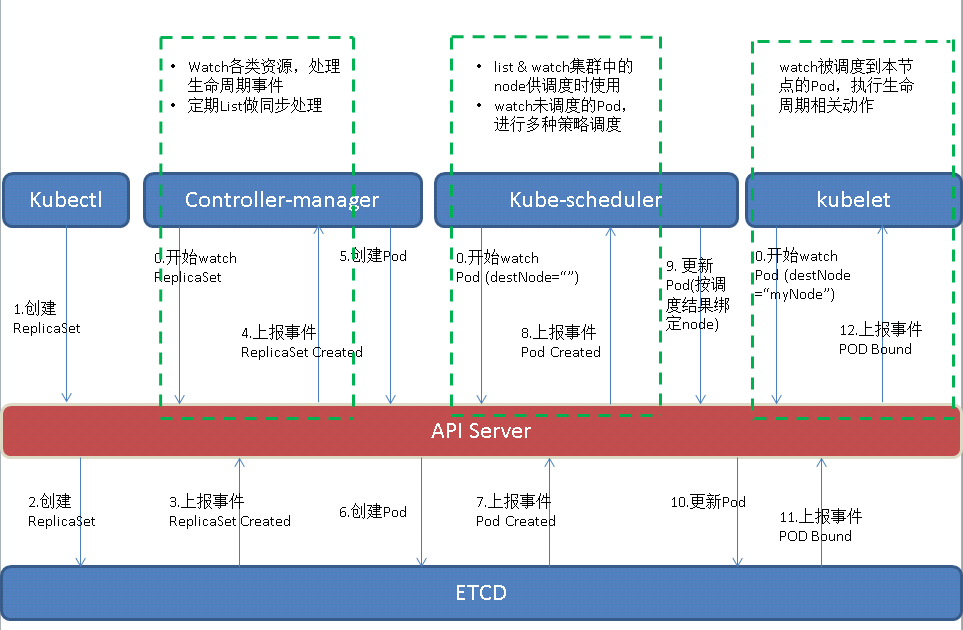
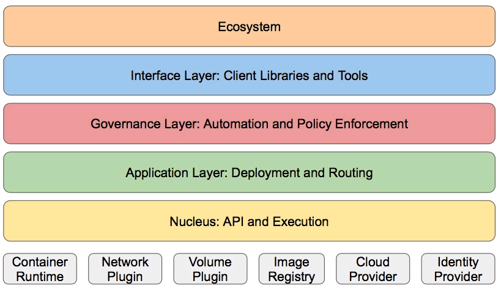

# Kubernetes技术架构 #

## CNCF ##

**当前项目**

- 容器编排
	Kubernetes、Helm
- 容器引擎
	Containerd、Rocket
- 容器镜像仓库
	Notary、TUF
- 容器网络
	CNI
- 服务网格&服务发现
	CoreDNS、Linkerd、Envoy
- 容器监控运维
	Prometheus、Fluentd 、Jaeger、OpenTracing
- 消息通信
	GPRC、NATS
- 数据库
	Vitness
- Sandbox项目
	Rook、 SPIFFE、SPIRE、Open Policy Agent、CloudEvents、Telepresence

## 容器技术 ##

**Linux Cgroup**

Docker使用Linux Cgroup技术来实现容器实例的资源管理

**Linux Namespace**

Docker使用linux namespace技术来实现容器实例间的资源隔离

## Kubernetes技术 ##

**kubernetes基于list-watch机制的控制器架构**

**Kubernetes分层架构**

- 生态系统：在接口层之上的庞大容器集群管理调度的生态系统，可以划分为两个范畴
	Kubernetes外部：日志、监控、配置管理、CI、CD、Workflow、FaaS、OTS应用、ChatOps等
	Kubernetes内部：CRI、CNI、CVI、镜像仓库、Cloud Provider、集群自身的配置和管理等
- 接口层：kubectl命令行工具、客户端SDK以及集群联邦
- 管理层：系统度量（如基础设施、容器和网络的度量），自动化（如自动扩展、动态Provision等）以及策略管理（RBAC、Quota、PSP、NetworkPolicy等）
- 应用层：部署（无状态应用、有状态应用、批处理任务、集群应用等）和路由（服务发现、DNS解析等）
- 核心层：Kubernetes最核心的功能，对外提供API构建高层的应用，对内提供插件式应用执行环境

