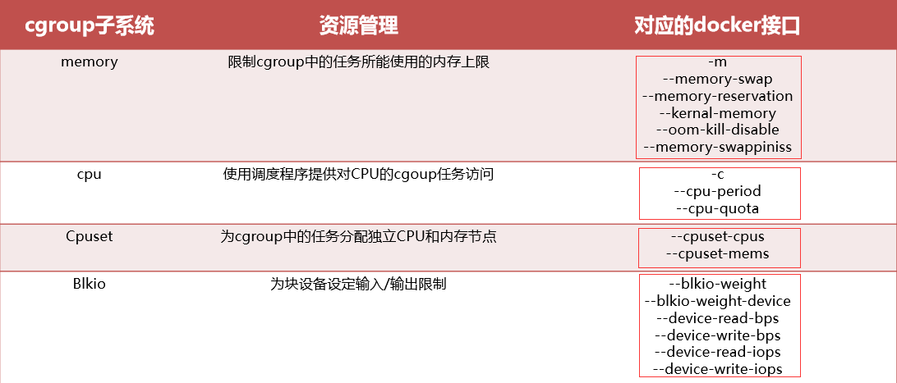
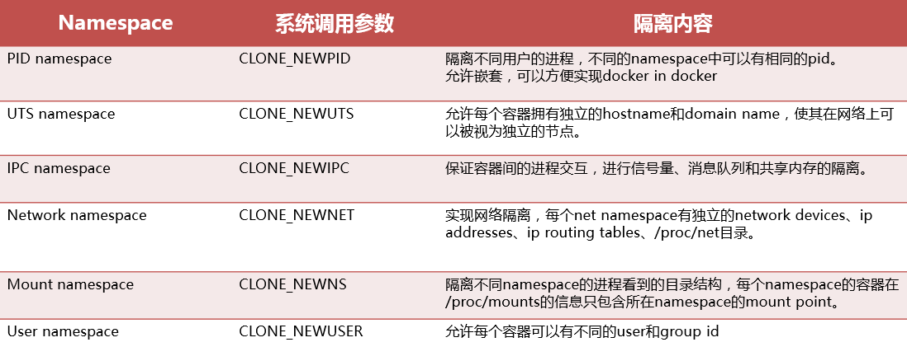

# Kubernetes技术架构 #

## CNCF ##

**当前项目**

- 容器编排
	Kubernetes、Helm
- 容器引擎
	Containerd、Rocket
- 容器镜像仓库
	Notary、TUF
- 容器网络
	CNI
- 服务网格&服务发现
	CoreDNS、Linkerd、Envoy
- 容器监控运维
	Prometheus、Fluentd 、Jaeger、OpenTracing
- 消息通信
	GPRC、NATS
- 数据库
	Vitness
- Sandbox项目
	Rook、 SPIFFE、SPIRE、Open Policy Agent、CloudEvents、Telepresence

## 容器技术 ##

**Linux Cgroup**

Docker使用Linux Cgroup技术来实现容器实例的资源管理

**Linux Namespace**

Docker使用linux namespace技术来实现容器实例间的资源隔离

## Kubernetes技术 ##

