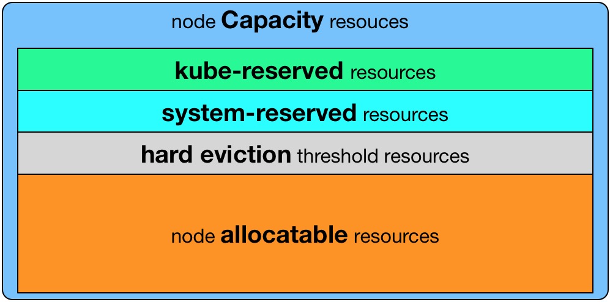
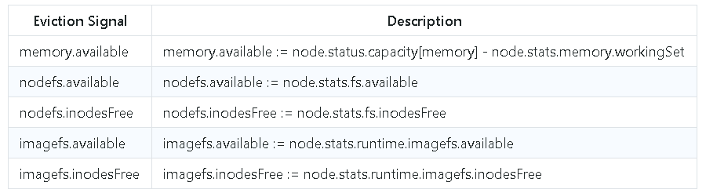

# Kubernetes服务质量（QoS）

摘自[http://dockone.io/article/2592](http://dockone.io/article/2592)

QoS的英文全称为"Quality of Service",中文名为"服务质量"。在Kubernetes中，每个Pod都会被标注一个Qos级别，Kubernetes针对不同服务质量的预期，通过QoS来对Pod进行服务质量管理。其中有两个指标，一个是CPU，一个是内存，体现在配置上就是`requests`和`limits`两种类型。


## `requests`和`limits` ##

`requests`申请范围从0到Node的最大配置，而`limits`申请范围是从`requests`到无限，即

`0 <= requests <=Node Allocatable`

`requests <= limits <= Infinity`

**超限额处理**

- 对于CPU，如果容器中服务使用的CPU超过设置的limits，容器不会被kill掉但会被限制。如果没有设置limits，容器可以使用全部空闲的CPU资源。

- 对于内存，当一个容器使用内存超过了设置的limits，Pod中container的进程会被kernel因OOM kill掉。当container因为OOM被kill掉时，系统倾向于在其原所在的机器上重启该container或在本机/其它机器上重新创建一个Pod。

## QoS分类 ##

**Guaranteed**

Pod中所有容器都必须统一设置limits，并且设置参数都一致，如果有一个容器要设置requests，那么所有容器都要设置，并设置参数同limits一致，那么这个Pod的QoS就是Guaranteed级别。

注：如果一个容器只指明limit而未设定request，则request的值等于limit值。

**Burstable**

Pod中只要有一个容器的requests和limits的设置不相同，该Pod的QoS即为Burstable。

**Best-Effort**

全部resources的requests与limits均未设置，该Pod的QoS即为Best-Effort。

### QoS优先级 ###

`Best-Effort  -> Burstable  -> Guaranteed `


## 资源回收策略 ##

Kubernetes根据资源能否伸缩进行分类，划分为可压缩资源和不可以压缩资源两种。CPU资源是目前支持的一种可压缩资源，而内存资源和磁盘资源为目前所支持的不可压缩资源。

Kubernetes根据QoS类型来进行资源回收（以内存为例）：

- Best-Effort：系统用完了全部内存时，该类型Pods会最先被kill掉。

- Burstable：系统用完了全部内存，且没有Best-Effort container可以被kill时，该类型Pods会被kill掉。

- Guaranteed：系统用完了全部内存、且没有Burstable与Best-Effort container可以被kill时，该类型的Pods会被kill掉。


### OOM打分 ###

有关Linux OOM参考[郭建：Linux内存管理系统参数配置之OOM（内存耗尽） ](https://www.sohu.com/a/238012686_467784)

各类容器的`OOM_SCORE_ADJ`参数定义如下：

```
pkg/kubelet/qos/policy.go:21
 
const (
    PodInfraOOMAdj        int = -998
    KubeletOOMScoreAdj    int = -999
    DockerOOMScoreAdj     int = -999
    KubeProxyOOMScoreAdj  int = -999
    guaranteedOOMScoreAdj int = -998
    besteffortOOMScoreAdj int = 1000
)

```

容器`OOM_SCORE_ADJ`计算规则如下：

```
pkg/kubelet/qos/policy.go:40

func GetContainerOOMScoreAdjust(pod *v1.Pod, container *v1.Container, memoryCapacity int64) int {
        switch GetPodQOS(pod) {
        case Guaranteed:
                // Guaranteed containers should be the last to get killed.
                return guaranteedOOMScoreAdj
        case BestEffort:
                return besteffortOOMScoreAdj
        }

        // Burstable containers are a middle tier, between Guaranteed and Best-Effort. Ideally,
        // we want to protect Burstable containers that consume less memory than requested.
        // The formula below is a heuristic. A container requesting for 10% of a system's
        // memory will have an OOM score adjust of 900. If a process in container Y
        // uses over 10% of memory, its OOM score will be 1000. The idea is that containers
        // which use more than their request will have an OOM score of 1000 and will be prime
        // targets for OOM kills.
        // Note that this is a heuristic, it won't work if a container has many small processes.
        memoryRequest := container.Resources.Requests.Memory().Value()
        oomScoreAdjust := 1000 - (1000*memoryRequest)/memoryCapacity
        // A guaranteed pod using 100% of memory can have an OOM score of 10. Ensure
        // that burstable pods have a higher OOM score adjustment.
        if int(oomScoreAdjust) < (1000 + guaranteedOOMScoreAdj) {
                return (1000 + guaranteedOOMScoreAdj)
        }
        // Give burstable pods a higher chance of survival over besteffort pods.
        if int(oomScoreAdjust) == besteffortOOMScoreAdj {
                return int(oomScoreAdjust - 1)
        }
        return int(oomScoreAdjust)
}
```

由上可知几种类型的`OOM_SCORE_ADJ`值：


1. **Best-effort**

	OOM_SCORE_ADJ: 1000

	best-effort容器的OOM_SCORE 值为1000

2. **Guaranteed**

	OOM_SCORE_ADJ: -998

	guaranteed容器的OOM_SCORE 值为0 或 1

3. **Burstable**

	- 如果总的memory request大于99.9%的可用内存，OOM_SCORE_ADJ设置为2。否则，OOM_SCORE_ADJ = 1000-10 * (% of memory requested)，这确保了burstable的POD OOM_SCORE > 1
	- 如果memory request设置为0，OOM_SCORE_ADJ默认设置为999。所以如果burstable pods和guaranteed pods冲突时，前者会被kill。
	- 如果burstable pod使用的内存少于request值，那它的OOM_SCORE < 1000。如果best-effort pod和这些 burstable pod冲突时，best-effort pod会先被kill掉。
	- 如果burstable pod容器中进程使用比request值的内存更多，OOM_SCORE设置为1000。反之，OOM_SCORES少于1000。
	- 在一堆burstable pod中，使用内存超过request值的pod，优先于内存使用少于request值的pod被kill。
	- 如果burstable pod有多个进程冲突，则OOM_SCORE会被随机设置，不受“request & limit”限制。

4. **Pod infra containers or Special Pod init process**

	OOM_SCORE_ADJ: -998

5. **Kubelet, Docker**

	OOM_SCORE_ADJ: -999 (won’t be OOM killed)
	系统上的关键进程，如果和guranteed 进程冲突，则会优先被kill 。将来会被放到一个单独的cgroup中，并且限制内存。


## 节点可用资源 ##

理想情况下，我们总是希望节点所有的资源都能提供给Pod使用，但实际上，节点上还会运行很多其它进程，包括一些系统进程、Kubelet、Docker进程等，而这些进程是保障Kubernetes集群能正常运行，甚至是这个集群能正常运行的，所以，我们需要为这些进程预留一部分资源，保障其正常运行，剩余的资源再分配给集群Pod使用。

节点资源分配大致如下：
摘自[从一次集群雪崩看Kubelet资源预留的正确姿势](https://my.oschina.net/jxcdwangtao/blog/1629059)



- Node Capacity: Node的所有硬件资源
- Kube-Reserved: 预留给kube组件的资源
- System-Reserved： 预留给System进程的资源
- Hard-Eviction-Threshold： kubelet eviction设定的阈值
- Allocatable： scheduler调度Pod时的参考值

计算方式： ` [Allocatable] = [Node Capacity] - [Kube-Reserved] - [System-Reserved] - [Hard-Eviction-Threshold]`

[参考官方说明](https://github.com/kubernetes/community/blob/master/contributors/design-proposals/node/node-allocatable.md#recommended-cgroups-setup)

Kubernetes相关配置：

- --enforce-node-allocatable

	默认为pods，要为kube组件和System进程预留资源，则需要设置为`pods,kube-reserved,system-reserve`。

- --cgroups-per-qos

	默认开启。开启后，kubelet会将管理所有workload Pods的cgroups。

- --cgroup-driver

	默认为cgroupfs，另一可选项为systemd。取决于容器运行时使用的cgroup driver，kubelet与其保持一致。比如配置docker使用systemd cgroup driver，那么kubelet也需要配置`--cgroup-driver=systemd`。

- --kube-reserved
 
	用于配置为kube组件（kubelet,kube-proxy,dockerd等）预留的资源量，比如`—kube-reserved=cpu=1000m,memory=8Gi，ephemeral-storage=16Gi`。

- --kube-reserved-cgroup
 
	如果你设置了--kube-reserved，那么一定要设置对应的cgroup，并且该cgroup目录要事先创建好，否则kubelet将不会自动创建导致kubelet启动失败。比如设置为`kube-reserved-cgroup=/kubelet.service`。

- --system-reserved

	用于配置为System进程预留的资源量，比如`—system-reserved=cpu=500m,memory=4Gi,ephemeral-storage=4Gi`。

- --system-reserved-cgroup

	如果你设置了--system-reserved，那么一定要设置对应的cgroup，并且该cgroup目录要事先创建好，否则kubelet将不会自动创建导致kubelet启动失败。比如设置为`system-reserved-cgroup=/system.slice`。

- --eviction-hard
 
	用来配置kubelet的hard eviction条件，只支持memory和ephemeral-storage两种不可压缩资源。当出现MemoryPressure时，Scheduler不会调度新的Best-Effort QoS Pods到此节点。当出现DiskPressure时，Scheduler不会调度任何新Pods到此节点。


## Pod优先级（Priority）与抢占（Preemption） ##

### Pod优先级（Priority） ###

[参考官方说明](https://kubernetes.io/docs/concepts/configuration/pod-priority-preemption/)

我们可以自定义Pod的优先级，在1.8版本引入，但目前还未GA（截止20190215）。使用起来比较简单，首先创建一个PriorityClass，指定优先级大小，如下：

```
apiVersion: scheduling.k8s.io/v1beta1
kind: PriorityClass
metadata:
  name: high-priority
value: 1000000   # 小于一亿的32bit整数，数字越大优先级越高，超过一亿的数字被系统保留，用于指派给系统组件。
globalDefault: false
description: "This priority class should be used for XYZ service pods only."
```

在创建Pod时可以在`Pod.spec.PriorityClassName`处指定使用哪个优先级，如下：

```
apiVersion: v1
kind: Pod
metadata:
  name: nginx
  labels:
    env: test
spec:
  containers:
  - name: nginx
    image: nginx
    imagePullPolicy: IfNotPresent
  priorityClassName: high-priority
```

在Kubernetes 1.9及之后的版本，Pod的优先级会影响到Pod的调度，所有的Pod都在同一个调度队列里，优先级高的Pod会被提前调度。

### 抢占（Preemption） ###

当某个Pod由于节点资源不足无法找到合适的Node时，就会触发Preemption流程，此流程比较简单粗暴，调度器试图寻找这样一个节点，找到它上面优先级低于当前待调度Pod的所有Pod，如果Kill掉它们，就能腾出足够的资源来创建待调度容器，调度器会执行删除操作，然后把Pod调度到该节点上，然后会在该Pod的status的`nominatedNodeName`中记录下节点名称，这样用户就能知晓此Pod引发的抢占的行为。


## 驱逐（Eviction） ##

当集群中出现节点不可用，或者资源占用太高时会严重影响业务可用性。Kubernetes提供了一个功能来试图解决此问题，即`pod eviction`。

Pod驱逐可以根据触发组件来划分为两类：

- Kube-controller-manger触发的驱逐： 周期性检查所有节点的状态，当节点处于异常状态超过一段时间后，驱逐该节点上的Pod。
 
- Kubelet触发的驱逐： 周期性检查本节点的资源占用情况，当节点资源不足时，按照优先级驱逐本节点Pod。

### Kube-controller-manger触发的驱逐 ###

Kube-controller-manager周期性地检查集群所有节点的状态，当有节点状态异常，并且超出`podEvictionTimeout`时间后，就把该节点上的Pod驱逐到其它节点。其驱逐速度受驱逐速度参数、集群大小等影响，相关参数如下：

- --pod-eviction-timeout
 
	在异常节点上驱逐Pod的宽限期，默认值：5m0s。
 
- --node-eviction-rate
 
	一个健康的Zone中Node失败时，每秒删除异常Node上Pod的百分比，默认值：0.1，即默认10s删除失败节点的所有Pod。（zone是指非多区域集群中的整个集群）

- --large-cluster-size-threshold
 
	判断集群是否为大集群，默认值：50，即50个节点以上的集群为大集群。与下面将提到的`--secondary-node-eviction-rate`配合使用。

- --unhealthy-zone-threshold

	Zone中异常节点（至少3个）的比例达到该值时，就将该Zone标记为不健康，默认值：0.55，即Zone中有55%的节点为NotReady时将该Zone置为不健康。此参数也与下面将提到的`--secondary-node-eviction-rate`配合使用。

- --secondary-node-eviction-rate
 
	Zone不健康时，每秒删除失败Node上Pod的百分比。如果集群规模小于`--large-cluster-size-threshold`，则该值将隐式重写为0。默认值：0.01，即默认100s删除异常节点的所有Pod。


### Kubelet触发的驱逐 ###

Kubelet实时监控节点上的资源使用情况，一旦发现某个不可压缩资源出现要耗尽的情况，就会主动终止节点上的Pod，让节点能够正常运行。被终止的Pod中所有容器会停止，状态会被设置为Failed。

[参考官方说明](https://github.com/kubernetes/community/blob/master/contributors/design-proposals/node/kubelet-eviction.md#enforce-node-allocatable)

目前有三种资源不足会触发Kubelet驱逐行为：实际可用内存不足、节点文件系统的可用空间（文件系统剩余大小和Inode 数量）不足、镜像文件系统的可用空间（包括文件系统剩余大小和Inode数量）不足。下图是触发驱逐会用到的相关参数：



用户可以定义具体达到何种条件进行Pod驱逐，比如有一个节点，内存为10G，想配置当其实际可用内存小于10%时触发驱逐，可以配置`memory.available<10%`或者`memory.available<1Gi`(即支持按照百分比和按照绝对数量两种配置方式)，默认情况下配置的为`memory.available<100Mi,nodefs.available<10%,nodefs.inodesFree<10%`。

**Soft Eviction和Hard Eviction**

因为驱逐Pod很容易对业务稳定性造成影响，有时候某个节点的内存使用率只是暂时较高，比如在某个时段刚好有一些特别吃内存的业务在跑，而这种情况可能并不会持续很长时间，十几二十秒内存使用率就会降下来。这种情况去驱逐Pod没有太大必要，还有可能对业务稳定性造成影响。还有一种情况是节点内存占用率很高，达到百分之九十几，此时应该立即驱逐Pod，因为内存占用还会继续增长，对整个节点上运行的服务造成风险。

为了解决以上这种情况，Kubernetes引入了`Soft Eviction`和`Hard Eviction`功能。

**`Soft Eviction`**

当资源占用较高但还不是很严重时，比如内存占用达到80%，Kubelet可以配置在发现资源使用率达到设定的阈值之后，不立即触发驱逐程序，而是继续观察一段时间，如果这段时间内资源占用一直高于所设阈值，才触发驱逐，而且在驱逐Pod时，会遵循Grace Period，即会等待Pod处理完自身业务清理逻辑再完全清除此Pod。

相关的启动参数如下：

- --eviction-soft

	软驱逐的触发条件，比如 memory.available<1.5Gi。

- --eviction-sfot-grace-period

	达到触发条件持续多长时间才开始驱逐，比如 memory.available=1m30s。

- --eviction-max-Pod-grace-period

	在Kill Pod时等待Grace Period的时间让Pod做一些自身业务数据清理工作，如果过了等待时间还没有结束数据清理工作就会Kill掉此Pod。此参数会和Pod本身配置的Grace Period比较，选择较小的一个生效。

注意：前两个参数必须全部配置，`Soft Eviction`才会生效。

**`Hard Eviction`**

当节点资源占用很高时，可以采用`Hard Eviction`立即强制Kill掉节点Pod。Kubelet发现节点达到配置的硬驱逐阈值后，就会立即开始驱逐程序，而且不会遵循 Grace Period规则，也就是说立即强制杀死Pod。

相关参数如下：

- --eviction-hard
	
	硬驱逐的触发条件。


Pod Eviction配置示例：

```
--eviction-hard=memory.available<4Gi,nodefs.available<20Gi,imagefs.available<5Gi 
--eviction-max-pod-grace-period=30 
--eviction-soft=memory.available<8Gi,nodefs.available<100Gi,imagefs.available<20Gi 
--eviction-soft-grace-period=memory.available=30s,nodefs.available=2m,imagefs.available=2m 
```


