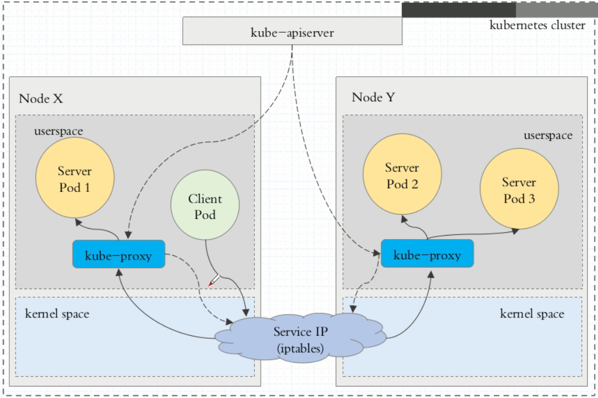

# Kubernetes负载均衡 #

摘自[https://www.cnblogs.com/linuxk/p/9605901.html](https://www.cnblogs.com/linuxk/p/9605901.html)

在Kubernetes集群中，每个Node运行一个kube-proxy进程。kube-proxy负责为Service实现了一种VIP（虚拟IP）的形式，而不是ExternalName的形式。 在Kubernetes v1.0版本，代理完全在userspace。在Kubernetes v1.1版本，新增了iptables代理，但并不是默认的运行模式。 从Kubernetes v1.2起，默认就是iptables代理。在Kubernetes v1.8.0-beta.0中，添加了ipvs代理。在Kubernetes v1.0版本，Service是 “4层”（TCP/UDP over IP）概念。 在Kubernetes v1.1版本，新增了Ingress API（beta 版），用来表示 “7层”（HTTP）服务。

kube-proxy 这个组件始终监视着apiserver中有关service的变动信息，获取任何一个与service资源相关的变动状态，通过watch监视，一旦有service资源相关的变动和创建，kube-proxy都要转换为当前节点上的能够实现资源调度规则（例如：iptables、ipvs）

**userspace代理模式**

当客户端Pod请求内核空间的service iptables后，把请求转到给用户空间监听的kube-proxy的端口，由kube-proxy进行处理，再由kube-proxy将请求转给内核空间的service ip，再由service iptalbes根据请求转给各节点中的的service pod。

由此可见这个模式有很大的问题，由客户端请求先进入内核空间的，又进去用户空间访问kube-proxy，由kube-proxy封装完成后再进去内核空间的iptables，再根据iptables的规则分发给各节点的用户空间的pod。这样流量从用户空间进出内核带来的性能损耗是不可接受的。在Kubernetes 1.1版本之前，userspace是默认的代理模型。

**iptables代理模式**

客户端IP请求时，直接请求本地内核service ip，根据iptables的规则直接将请求转发到到各pod上，因为使用iptable NAT来完成转发，也存在不可忽视的性能损耗。另外，如果集群中存在上万的Service/Endpoint，那么Node上的iptables rules将会非常庞大，性能还会再打折扣。iptables代理模式由Kubernetes 1.1版本引入，自1.2版本开始成为默认类型。

**ipvs代理模式**

Kubernetes自1.9-alpha版本引入了ipvs代理模式，自1.11版本开始成为默认设置。客户端IP请求时到达内核空间时，根据ipvs的规则直接分发到各pod上。kube-proxy会监视Kubernetes Service对象和Endpoints，调用netlink接口以相应地创建ipvs规则并定期与Kubernetes Service对象和Endpoints对象同步ipvs规则，以确保ipvs状态与期望一致。访问服务时，流量将被重定向到其中一个后端Pod。

与iptables类似，ipvs基于netfilter 的 hook 功能，但使用哈希表作为底层数据结构并在内核空间中工作。这意味着ipvs可以更快地重定向流量，并且在同步代理规则时具有更好的性能。

**注意：** ipvs模式假定在运行kube-proxy之前在节点上都已经安装了IPVS内核模块。当kube-proxy以ipvs代理模式启动时，kube-proxy将验证节点上是否安装了IPVS模块，如果未安装，则kube-proxy将回退到iptables代理模式。

如果某个服务后端pod发生变化，标签选择器适应的pod有多一个，适应的信息会立即反映到apiserver上,而kube-proxy一定可以watch到etc中的信息变化，而将它立即转为ipvs或者iptables中的规则，这一切都是动态和实时的，删除一个pod也是同样的原理。如图：

