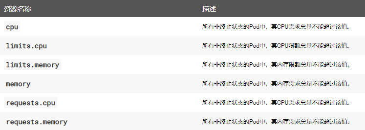
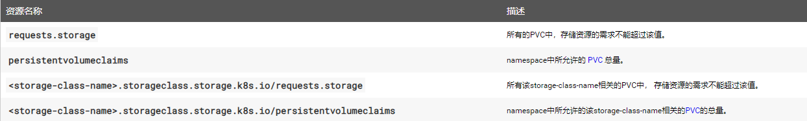
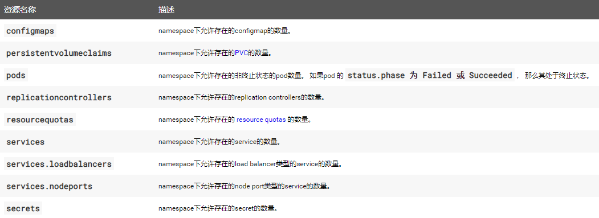
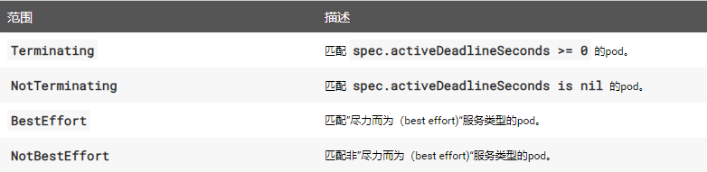

# Kubernetes配额管理 #

## 资源配额（ResourceQuota） ##

[https://kubernetes.io/zh/docs/concepts/policy/resource-quotas/](https://kubernetes.io/zh/docs/concepts/policy/resource-quotas/)

ResourceQuota对象用来定义某个命名空间下所有资源的使用限额：

- 计算资源
- 存储资源
- 对象数量

在集群容量小于各namespace配额总和的情况下，可能存在资源竞争。 Kubernetes采用先到先服务的方式处理这类问题。已经创建好的资源不会受影响。

**资源配额的启用**

许多Kubernetes发行版本默认开启了资源配额的支持。当在apiserver的`–admission-control`配置中添加`ResourceQuota`参数后，便启用了资源配额功能。当一个命名空间中含有ResourceQuota对象时，资源配额将强制执行。 一个namespace中最多只应存在一个ResourceQuota对象。

有关admission-control参考[Kubernetes认证、授权和准入](https://github.com/SecurityNeo/ReadingNotes/blob/master/PaaS/Kubernetes/Kubernetes%E8%AE%A4%E8%AF%81%E3%80%81%E6%8E%88%E6%9D%83%E4%B8%8E%E5%87%86%E5%85%A5.md)

- **计算资源配额**

	限制某个Namespace中总的[计算资源](https://kubernetes.io/docs/concepts/configuration/manage-compute-resources-container/)。开启计算资源配额后，创建容器时必须配置计算资源请求或限制。

	配置如下：

	


- **存储资源配额**

	限制某个Namespace中总的存储资源，还可以根据相关的存储类（Storage Class）来限制存储资源的消耗

	

- **对象数量配额**

	限制某个Namespace中给定类型的对象数量。 支持以下类型：

	


**配额的作用域**

每个配额都有一组相关的作用域（scope），配额只会对作用域内的资源生效。




**注意：资源配额对象与集群容量无关，它们以绝对单位表示。即增加节点的资源并不会增加已经配置的namespace的资源。**


## Pod限额（LimitRange） ##

`ResourceQuota`对象可以限制某个Namespace下所有Pod(容器)的资源配额，`LimitRange`可以用来设置Namespace中某种资源的默认配额。资源对象包括：Pod、Container、PersistentVolumeClaim。

- 如果没有指定pod的request和limit，则创建的pod会使用LimitRange对象定义的默认值（request和limit）
- 如果指定pod的limit但未指定request，则创建的pod的request值会取limit的值，而不会取LimitRange对象定义的request默认值。
- 如果指定pod的request但未指定limit，则创建的pod的limit值会取LimitRange对象定义的limit默认值。

示例：

```
apiVersion: v1
kind: LimitRange
metadata:
  name: limitrange-demo
spec:
  limits:
  - type: Pod
    min:
      cpu: 50m
      meomery: 5Mi
    max:
      cpu: 1
      meomery: 1Gi
  - type: Container
    defaultRequest:
      cpu: 100m
      memory: 10Mi
    default:
      cpu: 200m
      memory: 100Mi
    min:
      cpu: 50m
      memory: 5Mi
    max:
      cpu: 1
      memory: 1Gi
    maxLimitRequestRatio:
      cpu: 4
      memory: 10
  - type: PersistentVolumeClaim
    min:
      storage: 1Gi
    max:
      storage: 10Gi
```

参数说明：

- default：默认的limit
- defaultRequest： 默认的request
- max： limit的最大值
- min： request的最小值
- maxLimitRequestRatio： limit/request的上限。由于节点是根据pod request调度资源，可以做到节点超配，maxLimitRequestRatio代表pod最大超配比例。
