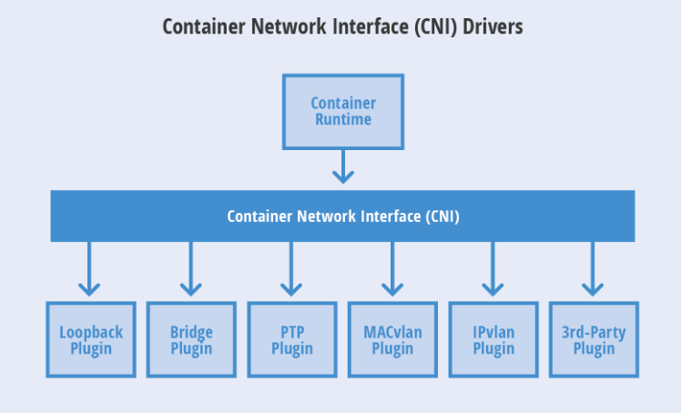

# Kubernetes网络插件 #

[https://www.cnblogs.com/rexcheny/p/10960233.html](https://www.cnblogs.com/rexcheny/p/10960233.html)

[https://github.com/containernetworking/cni](https://github.com/containernetworking/cni)

[https://github.com/keontang/k8s-notes/blob/master/kubernetes-network.md](https://github.com/keontang/k8s-notes/blob/master/kubernetes-network.md)

在Kubernetes中，kubelet主要负责和容器打交道，和容器引擎交互使用的是CRI（Container Runtime Interface，它规定了运行一个容器所必须的参数和标准）接口，所以只要容器引擎提供了符合CRI标准的接口那么可以被Kubernetes使用。容器引擎会把接口传递过来的数据进行翻译，翻译成对Linux的系统调用操作，比如创建各种名称空间、Cgroups等。而kubelet默认使用的容器运行时是通过kubelet命令中的`--container-runtime=`来设置的，默认就是docker。

kubelet启动的命令有关CNI的参数：

- `--cni-bin-dir=STRING`： 用于搜索CNI插件目录，默认/opt/cni/bin

- `--cni-conf-dir=STRING`： 用于搜索CNI插件配置文件路径，默认是/opt/cni/net.d

- `--network-plugin=STRING`： 要使用的CNI插件名，它就是去`--cni-bin-dir`目录去搜索

**CNI插件分类：**

[https://github.com/containernetworking/cni/blob/master/SPEC.md](https://github.com/containernetworking/cni/blob/master/SPEC.md)

[https://feisky.gitbooks.io/kubernetes/network/network.html](https://feisky.gitbooks.io/kubernetes/network/network.html)

- main插件：提供某种网络功能，比如birdge就是创建Linux网桥的程序、ptp就是创建Veth Pair设备的程序、loopback就是创建lo设备的程序，等等。

	- bridge：创建网桥，并添加主机和容器到该网桥
	- ipvlan：在容器中添加一个ipvlan接口
	- loopback：创建一个回环接口
	- macvlan：创建一个新的MAC地址，将所有的流量转发到容器
	- ptp：创建veth对
	- vlan：分配一个vlan设备

- meta插件：不能作为独立的插件使用，需要调用其他插件，例如flannel，或者配合其他插件使用，例如portmap。meta插件一般由社区维护。

	- flannel：根据flannel的配置文件创建接口
	- tuning：调整现有接口的sysctl参数
	- portmap：一个基于iptables的portmapping插件。将端口从主机的地址空间映射到容器。

- ipam插件：对所有CNI插件共有的IP管理部分的抽象，从而减少插件编写过程中的重复工作，官方提供的有dhcp和host-local两种类型，dhcp就是会向DHCP服务器发起地址申请、host-local就是会使用预先设置的IP地址段来进行分配，就像在dockerd中设置--bip一样。

	- dhcp：在主机上运行守护程序，代表容器发出DHCP请求
	- host-local：维护分配IP的本地数据库

**CNI配置文件**

- **cniVersion（string）**：插件使用的CNI版本
- **name（string）**：Network name。这应该在整个管理域中都是唯一的
- **type（string）**：插件类型，也代表了CNI插件可执行文件的文件名
- **args（dictionary）**：由容器运行时提供的可选的参数。比如，可以将一个由label组成的dictionary传递给CNI插件，通过在args下增加一个labels字段来实现
- **ipMasqs (boolean)**：可选项（如果插件支持的话）。为network在宿主机创建IP masquerade。如果需要将宿主机作为网关，为了能够路由到容器分配的IP，这个字段是必须的
- **ipam**：由特定的IPAM值组成的dictionary
- **type（string）**：IPAM插件的类型，也表示IPAM插件的可执行文件的文件名
- **dns**：由特定的DNS值组成的dictionary
	- **nameservers (list of strings)**：一系列对network可见的，以优先级顺序排列的DNS nameserver列表。列表中的每一项都包含了一个IPv4或者一个IPv6地址
	- **domain（string）**：用于查找short hostname的本地域
	- **search（list of strings）**：以优先级顺序排列的用于查找short domain的查找域。对于大多数resolver，它的优先级比domain更高
	- **options（list of strings）**：一系列可以被传输给resolver的可选项