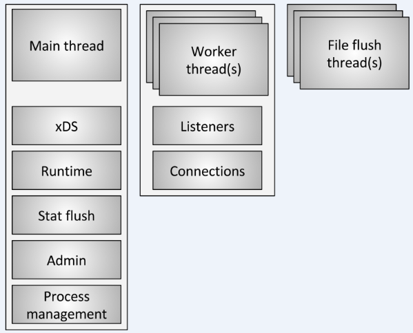
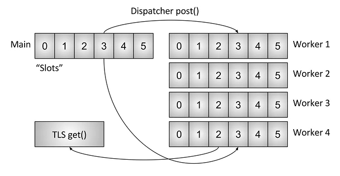

[Envoy中文文档](http://www.servicemesher.com/envoy/)

[网易云刘超的《深入解读 Service Mesh 背后的技术细节》](https://www.cnblogs.com/163yun/p/8962278.html)

[理解Istio Service Mesh中Envoy代理Sidecar注入及流量劫持](https://jimmysong.io/posts/envoy-sidecar-injection-in-istio-service-mesh-deep-dive/)

## Envoy threading model ##

[https://blog.envoyproxy.io/envoy-threading-model-a8d44b922310](https://blog.envoyproxy.io/envoy-threading-model-a8d44b922310)

**Envoy三种线程**

- Main Thread：此线程拥有服务器启动和关闭、所有xDS API的处理（包括DNS，运行状况检查和常规集群管理）、运行时、统计刷新、管理和一般进程管理（信号，热启动等）的功能。 此线程是异步并且是“非阻塞的”。通常，主线程不需要消耗大量CPU就可以完成关键功能。 

- Worker Thread：默认情况下，Envoy为系统中的每个硬件线程生成一个工作线程。 （可以通过`--concurrency`选项控制）。 每个工作线程运行一个“非阻塞”事件循环，负责监听每个侦听器（当前没有侦听器分片），接受新连接，为连接实例化过滤器堆栈，以及处理所有IO的生命周期。 同样，这允许将大多数连接处理代码写成好像是单线程的。

- File Flush：Envoy写入的每个文件（主要是访问日志）都有一个独立的阻塞刷新线程。 这是因为即使使用`O_NONBLOCK`写入文件系统缓存文件有时也会阻塞。 当工作线程需要写入文件时，数据实际上被移入内存缓冲区，最终通过文件刷新线程刷新至磁盘。 所有worker都可以在同一个锁上阻塞，因为它们可能会同时尝试写内存缓冲区。 

**连接处理**

所有工作线程都会在没有任何分片的情况下监听所有侦听器。内核将接收的socket分派给工作线程。一旦Worker接受了连接， 连接就永远不会离开那个Worker。所有进一步的处理都在Worker线程内完成，其中包括转发。

- Envoy中的所有连接池都和Worker线程绑定。 尽管HTTP/2连接池一次只与每个上游主机建立一个连接，但如果有四个Worker，则每个上游主机在稳定状态下将有四个HTTP/2连接。
- Envoy以这种方式工作的原因是将所有连接都在单个Worker线程中处理，这样几乎所有代码都可以在无锁的情况下编写，就像它是单线程一样。 这种设计使得大多数代码更容易编写，并且可以非常好地扩展到几乎无限数量的Worker。
- 从内存和连接池效率的角度来看，调整`--concurrency`选项实际上非常重要。 拥有太多的Worker将浪费内存，创建更多空闲连接，并导致连接池命中率降低。 在Lyft，作为sidecar运行的Envoy并发度很低，性能大致与他们旁边的服务相匹配。 但是我们以最大并发度运行边缘节点Envoy。

**线程本地存储**

由于Envoy将主线程职责与工作线程职责分开，因此需要在主线程上完成复杂处理，然后以高度并发的方式使每个工作线程可用。

Envoy的TLS系统的工作原理：

- 在主线程上运行的代码可以分配进程范围的TLS槽。 虽然是抽象的，但实际上，这是一个允许O（1）访问的向量索引。
- 主线程可以将任意数据设置到其槽中。 完成此操作后，数据将作为正常事件循环事件发布到每个工作程序中。
- 工作线程可以从其TLS槽读取，并将检索那里可用的任何线程本地数据。

虽然非常简单，但这是一个非常强大的范例，与RCU锁定概念非常相似。 （实质上，工作线程在工作时从不会看到TLS插槽中的数据发生任何变化。更改只发生在工作事件之间的静止期间）。 Envoy以两种不同的方式使用它：

- 通过在没有任何锁定的情况下访问每个工作线程存储不同的数据
- 通过将共享指针存储到每个worker的只读全局数据。 因此，每个worker都具有对在工作时不能递减的数据的引用计数。 只有当所有工作人员都已停顿并加载新的共享数据时，旧数据才会被销毁。 这与RCU相同。

