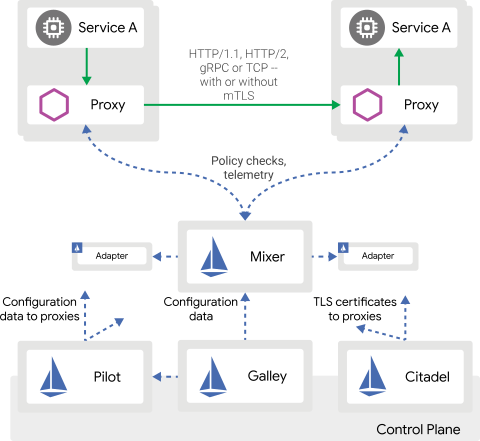
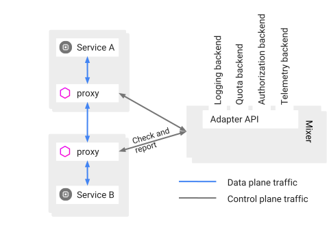
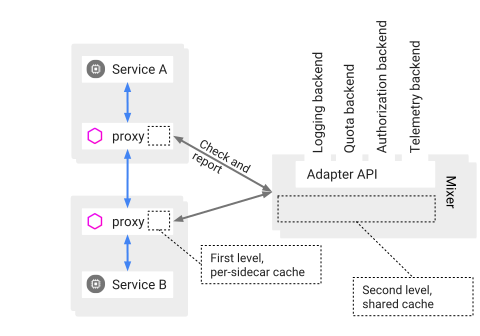
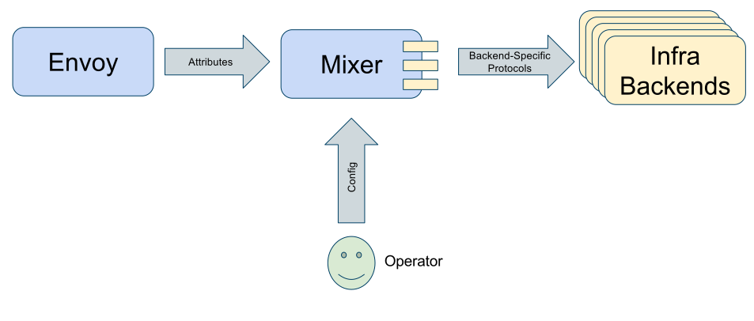

# Istio #

## 架构 ##



Istio 服务网格逻辑上分为数据平面和控制平面。

- 数据平面由一组以 sidecar 方式部署的智能代理（Envoy）组成。这些代理可以调节和控制微服务及 Mixer 之间所有的网络通信。
 
- 控制平面负责管理和配置代理来路由流量。此外控制平面配置 Mixer 以实施策略和收集遥测数据。

**组件**

- Envoy

	参考本目录Envoy内容

- Mixer

	Mixer是一个独立于平台的组件，负责在服务网格上执行访问控制和使用策略，并从Envoy代理和其他服务收集遥测数据。代理提取请求级属性，发送到Mixer进行评估。Mixer中包括一个灵活的插件模型，使其能够接入到各种主机环境和基础设施后端，从这些细节中抽象出Envoy代理和Istio管理的服务。

- Pilot

	Pilot为Envoy sidecar提供服务发现功能，为智能路由（例如 A/B 测试、金丝雀部署等）和弹性（超时、重试、熔断器等）提供流量管理功能。它将控制流量行为的高级路由规则转换为特定于 Envoy 的配置，并在运行时将它们传播到sidecar。Pilot将平台特定的服务发现机制抽象化并将其合成为符合Envoy数据平面API的任何sidecar都可以使用的标准格式。这种松散耦合使得Istio能够在多种环境下运行（例如，Kubernetes、Consul、Nomad），同时保持用于流量管理的相同操作界面。

- Citadel

	Citadel通过内置身份和凭证管理赋能强大的服务间和最终用户身份验证。可用于升级服务网格中未加密的流量，并为运维人员提供基于服务标识而不是网络控制的强制执行策略的能力。从0.5版本开始，Istio支持基于角色的访问控制，以控制谁可以访问您的服务，而不是基于不稳定的三层或四层网络标识。

- Galley

	Galley代表其他的Istio控制平面组件，用来验证用户编写的Istio API配置。随着时间的推移，Galley将接管Istio获取配置、 处理和分配组件的顶级责任。它将负责将其他的Istio组件与从底层平台（例如 Kubernetes）获取用户配置的细节中隔离开来。


## Mixer ##

[istio源码解析系列(三)-Mixer工作流程浅析](https://www.jianshu.com/p/312b9b9a7e01?from=groupmessage)

[https://istio.io/zh/docs/concepts/policies-and-telemetry/](https://istio.io/zh/docs/concepts/policies-and-telemetry/)


**Mixer主要功能：**

- 前置条件检查（Precondition Checking）

	某一服务响应外部请求前，通过Envoy向Mixer发送Check请求，检查该请求是否满足一定的前提条件，包括白名单检查、ACL检查等。

- 配额管理（Quota Management）

	当多个请求发生资源竞争时，通过配额管理机制可以实现对资源的有效管理。

- 遥测报告上报（Telemetry Reporting）

	该服务处理完请求后，通过Envoy向Mixer上报日志、监控等数据。

无缓存拓扑：


有缓存拓扑：


关于Mixer性能相关问题，阅读一下[敖小剑--Istio Mixer Cache工作原理与源码分析part1－基本概念](http://www.servicemesher.com/blog/istio-mixer-cache-part1-concepts/)


**相关概念**

- Attribute（属性）

	大部分attributes由Envoy提供。Istio用attributes来控制服务在Service Mesh中运行时行为。attributes是有名称和类型的元数据，用来描述入口和出口流量和流量产生时的环境。attributes携带了一些具体信息，比如：API请求状态码、请求响应时间、TCP连接的原始地址等。Mixer本质上是一个属性处理机。每个经过Envoy sidecar的请求都会调用Mixer，为Mixer提供一组描述请求和请求周围环境的属性。基于Envoy sidecar的配置和给定的特定属性集，Mixer会调用各种基础设施后端。

	
	

- RefrencedAttributes（被引用的属性）

	refrencedAttributes是Mixer Check时进行条件匹配后被使用的属性的集合。Envoy向Mixer发送的Check请求中传递的是属性的全集，refrencedAttributes只是该全集中被应用的一个子集。属性词汇由`[_.a-z0-9]`组成，其中"."为命名空间分隔符。[属性词汇](https://preliminary.istio.io/docs/reference/config/policy-and-telemetry/attribute-vocabulary/)，[属性类型](https://github.com/istio/api/blob/master/policy/v1beta1/value_type.proto)

	例：Envoy某次发送的Check请求中发送的attributes为`{request.path: xyz/abc, request.size: 234,source.ip: 192.168.0.1}`，如Mixer中调度到的多个adapters只用到了`request.pat`h和`request.size`这两个属性。那么Check后返回的`refrencedAttributes`为`{request.path: xyz/abc, request.size: 234}`。
	为防止每次请求时Envoy都向Mixer中发送Check请求，Mixer中建立了一套复杂的缓存机制，使得大部分请求不需要向Mixer发送Check请求。

- Adapter（适配器）

	Mixer是一个高度模块化、可扩展组件，内部提供了多个适配器(adapter)。Envoy提供request级别的属性（attributes）数据。adapters基于这些attributes来实现日志记录、监控指标采集展示、配额管理、ACL检查等功能。Istio内置的部分adapters：

		- circonus：一个微服务监控分析平台。
		
		- cloudwatch：一个针对AWS云资源监控的工具。
		 
		- fluentd：一款开源的日志采集工具。
		 
		- prometheus：一款开源的时序数据库，非常适合用来存储监控指标数据。
		 
		- statsd：一款采集汇总应用指标的工具。
		 
		- stdio：stdio适配器使Istio能将日志和metrics输出到本地，结合内置的ES、Grafana就可以查看相应的日志或指标了。

	

- Template（模板）

	对于一个网络请求，Mixer通常会调用两个rpc：Check和Report。不同的adapter需要不同的attributes，template定义了attributes到adapter输入数据映射的schema，一个适配器可以支持多个template。一个上报metric数据的模板如下所示：

	```
	apiVersion: "config.istio.io/v1alpha2"
	kind: metric
	metadata:
	  name: requestsize
	  namespace: istio-system
	spec:
	  value: request.size | 0
	  dimensions:
	    source_service: source.service | "unknown"
	    source_version: source.labels["version"] | "unknown"
	    destination_service: destination.service | "unknown"
	    destination_version: destination.labels["version"] | "unknown"
	    response_code: response.code | 200
	  monitored_resource_type: '"UNSPECIFIED"'
	```

**Mixer的配置模型**

	Mixer的yaml配置可以抽象成三种模型：`Handler、Instance、Rule`。这三种模型主要通过yaml中的kind字段做区分，kind值有如下几种：

		- adapter kind：表示此配置为Handler。 
		- template kind：表示此配置为Template。
		- "rule"：表示此配置为Rule。

	**Handler**

		一个Handler是配置好的Adpater的实例。Handler从yaml配置文件中取出adapter需要的配置数据。一个典型的Promethues Handler配置如下所示：

		```
		apiVersion: config.istio.io/v1alpha2
		kind: prometheus
		metadata:
		  name: handler
		  namespace: istio-system
		spec:
		  metrics:
		  - name: request_count
		    instance_name: requestcount.metric.istio-system
		    kind: COUNTER
		    label_names:
		    - destination_service
		    - destination_version
		    - response_code
		```

		对于Handler而言，{metadata.name}.{kind}.{metadata.namespace}是其完全限定名（Fully Qualified name），上述Handler的完全限定名是handler.prometheus.istio-system，完全限定名是全局唯一的。

	**Instance**

		Instance定义了attributes到adapter输入的映射，一个处理requestduration metric数据的Instance配置如下所示：

		```
		apiVersion: config.istio.io/v1alpha2
		kind: metric
		metadata:
		  name: requestduration
		  namespace: istio-system
		spec:
		  value: response.duration | "0ms"
		  dimensions:
		    destination_service: destination.service | "unknown"
		    destination_version: destination.labels["version"] | "unknown"
		    response_code: response.code | 200
		  monitored_resource_type: '"UNSPECIFIED"'
		```

	**Rule**

		Rule定义了一个特定的Instance何时调用一个特定的Handler，一个典型的Rule配置如下所示：
		```
		apiVersion: config.istio.io/v1alpha2
		kind: rule
		metadata:
		  name: promhttp
		  namespace: istio-system
		spec:
		  match: destination.service == "service1.ns.svc.cluster.local" && request.headers["x-user"] == "user1"
		  actions:
		  - handler: handler.prometheus
		    instances:
		    - requestduration.metric.istio-system
		```

		上述例子中，定义的Rule为：对目标服务为`service1.ns.svc.cluster.local`且`request.headers["x-user"]`为user1的请求，`Instance: requestduration.metric.istio-system`才调用Handler: `handler.prometheus`。


	

## istio-init容器 ##

该容器就是通过修改iptables规则让Envoy代理可以拦截所有的进出Pod的流量，即将入站流量重定向到Sidecar，再拦截应用容器的出站流量经过Sidecar处理后再出站。该容器的入口脚本为[istio-iptables.sh](https://github.com/istio/istio/blob/master/tools/packaging/common/istio-iptables.sh)，脚本的使用方法(部分，摘自[https://jimmysong.io/posts/envoy-sidecar-injection-in-istio-service-mesh-deep-dive/](https://jimmysong.io/posts/envoy-sidecar-injection-in-istio-service-mesh-deep-dive/),完整使用方法可阅读脚本)：

```
$ istio-iptables.sh -p PORT -u UID -g GID [-m mode] [-b ports] [-d ports] [-i CIDR] [-x CIDR] [-h]
  -p: 指定重定向所有 TCP 流量的 Envoy 端口（默认为 $ENVOY_PORT = 15001）
  -u: 指定未应用重定向的用户的 UID。通常，这是代理容器的 UID（默认为 $ENVOY_USER 的 uid，istio_proxy 的 uid 或 1337）
  -g: 指定未应用重定向的用户的 GID。（与 -u param 相同的默认值）
  -m: 指定入站连接重定向到 Envoy 的模式，“REDIRECT” 或 “TPROXY”（默认为 $ISTIO_INBOUND_INTERCEPTION_MODE)
  -b: 逗号分隔的入站端口列表，其流量将重定向到 Envoy（可选）。使用通配符 “*” 表示重定向所有端口。为空时表示禁用所有入站重定向（默认为 $ISTIO_INBOUND_PORTS）
  -d: 指定要从重定向到 Envoy 中排除（可选）的入站端口列表，以逗号格式分隔。使用通配符“*” 表示重定向所有入站流量（默认为 $ISTIO_LOCAL_EXCLUDE_PORTS）
  -i: 指定重定向到 Envoy（可选）的 IP 地址范围，以逗号分隔的 CIDR 格式列表。使用通配符 “*” 表示重定向所有出站流量。空列表将禁用所有出站重定向（默认为 $ISTIO_SERVICE_CIDR）
  -x: 指定将从重定向中排除的 IP 地址范围，以逗号分隔的 CIDR 格式列表。使用通配符 “*” 表示重定向所有出站流量（默认为 $ISTIO_SERVICE_EXCLUDE_CIDR）。

环境变量位于 $ISTIO_SIDECAR_CONFIG（默认在：/var/lib/istio/envoy/sidecar.env）
```