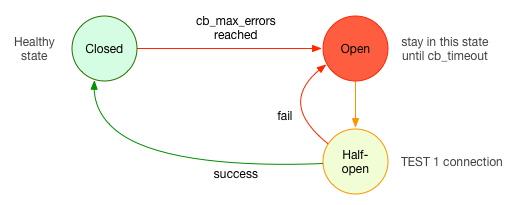

# KrakenD #

[https://www.krakend.io/](https://www.krakend.io/)

[https://github.com/devopsfaith](https://github.com/devopsfaith)

KrakenD是一个收费的API网关生成器和代理生成器，位于客户端和所有源服务器之间，添加了一个新层，可以消除客户机的所有复杂性，为客户机只提供UI需要的信息。 KrakenD充当了许多源的集合，可以将许多源集成到单个端点中，并允许对响应进行分组、包装。 另外它支持大量middelwares和插件，允许扩展功能，比如添加Oauth授权或者安全层。

## 配置解析 ##

### Service ###

#### TLS Endpoint ####

KrakenD需要在全局配置中开启TLS，一旦开启了TLS，KrakenD将不会响应任何HTTP请求。

示例：

```
{
  "version": 2,
  "tls": {
    "public_key": "/path/to/cert.pem",
    "private_key": "/path/to/key.pem"
  }
}
```

- public_key: 公钥文件，绝对或相对路径（相对工作目录）
- private_key：私钥文件，绝对或相对路径（相对工作目录）

可选配置：

- disabled (boolean): 临时关闭TLS，用户开发测试环境
- min_version (string): 最低TLS版本 (SSL3.0, TLS10, TLS11 或者 TLS12)
- max_version (string): 最高TLS版本 (SSL3.0, TLS10, TLS11 或者 TLS12)
- curve_preferences (integer array): 椭圆数字签名算法签名长度(23表示CurveP256, 24表示CurveP384，25表示CurveP521)
- prefer_server_cipher_suites (boolean): 强制使用服务器提供的密码套件，而不是使用客户端建议的套件。
- cipher_suites (integer array): 加密算法，可选算法如下：
	- 5: TLS_RSA_WITH_RC4_128_SHA
	- 10: TLS_RSA_WITH_3DES_EDE_CBC_SHA
	- 47: TLS_RSA_WITH_AES_128_CBC_SHA
	- 53: TLS_RSA_WITH_AES_256_CBC_SHA
	- 60: TLS_RSA_WITH_AES_128_CBC_SHA256
	- 156: TLS_RSA_WITH_AES_128_GCM_SHA256
	- 157: TLS_RSA_WITH_AES_256_GCM_SHA384
	- 49159: TLS_ECDHE_ECDSA_WITH_RC4_128_SHA
	- 49161: TLS_ECDHE_ECDSA_WITH_AES_128_CBC_SHA
	- 49162: TLS_ECDHE_ECDSA_WITH_AES_256_CBC_SHA
	- 49169: TLS_ECDHE_RSA_WITH_RC4_128_SHA
	- 49170: TLS_ECDHE_RSA_WITH_3DES_EDE_CBC_SHA
	- 49171: TLS_ECDHE_RSA_WITH_AES_128_CBC_SHA
	- 49172: TLS_ECDHE_RSA_WITH_AES_256_CBC_SHA
	- 49187: TLS_ECDHE_ECDSA_WITH_AES_128_CBC_SHA256
	- 49191: TLS_ECDHE_RSA_WITH_AES_128_CBC_SHA256
	- 49199: TLS_ECDHE_RSA_WITH_AES_128_GCM_SHA256
	- 49195: TLS_ECDHE_ECDSA_WITH_AES_128_GCM_SHA256
	- 49200: TLS_ECDHE_RSA_WITH_AES_256_GCM_SHA384
	- 49196: TLS_ECDHE_ECDSA_WITH_AES_256_GCM_SHA384
	- 52392: TLS_ECDHE_RSA_WITH_CHACHA20_POLY1305
	- 52393: TLS_ECDHE_ECDSA_WITH_CHACHA20_POLY1305


### Endpoint ###

#### Endpoint Rate Limiting ####

可以限制Endpoint的速率，有两种限制方法，一种为限制每个Endpoint的速率，一种为限制每个Endpoint可接受单个客户端的速率。
注意： 开始针对每个客户端的速率限制将在很大程度上影响API网关的性能！

示例：

```
{
    "version": 2,
    "endpoints": [
      {
          "endpoint": "/happy-hour",
          "extra_config": {
              "github.com/devopsfaith/krakend-ratelimit/juju/router": {
                  "maxRate": 0,
                  "clientMaxRate": 0
              }
          }
          ...
      },
      {
          "endpoint": "/limited-endpoint",
          "extra_config": {
            "github.com/devopsfaith/krakend-ratelimit/juju/router": {
                "maxRate": 50,
                "clientMaxRate": 5,
                "strategy": "ip"
              }
          },
          ...
      },
      {
          "endpoint": "/user-limited-endpoint",
          "extra_config": {
            "github.com/devopsfaith/krakend-ratelimit/juju/router": {
                "clientMaxRate": 10,
                "strategy": "header",
                "key": "X-Auth-Token"
              }
          },
          ...
      }
```

- maxRate: 不配置或配置`"maxRate": 0 `表示不进行限速。当达到Endpoint的限速配置后，客户端将收到`503 Service Unavailable`。
- clientMaxRate：不配置或配置`"clientMaxRate": 0`表示不进行限速。当达到Endpoint的限速配置后，客户端将收到`429 Too Many Requests`。
	- "strategy": "ip"：通过客户端IP地址识别是否为同一个客户端。
	- "strategy": "header"： 通过请求包对应的头部来识别是否为同一个客户端。


#### Response Manipulation ####

KrakenD可以修改Backend返回的数据，主要包含以下几类：Merging（数据聚合）、Filtering（数据过滤）、Grouping（数据分组）、Mapping (key修改)、Target（数据截取）、Collection（数据组合）。

**Merging**

将所有Backend返回的数据聚合到一个字典中，如果多个Backend中有key冲突，则对应key的值将取返回数据最慢的那个Backend的值。

示例：
```
"endpoints": [
    {
      "endpoint": "/abc",
      "timeout": "800ms",
      "method": "GET",
      "backend": [
        {
          "url_pattern": "/a",
          "encoding": "json",
          "host": [
            "http://service-a.company.com"
          ]
        },
        {
          "url_pattern": "/b",
          "encoding": "xml",
          "host": [
            "http://service-b.company.com"
          ]
        }
      ]
    }
```

- timeout: KrakenD不会一直等待Backend返回数据，需要为其配置一个超时时间，此配置可以为全局配置，也可以为某个具体的Backend配置超时时间，如果都有配置，则以对应Backend中的超时时间为准。如果达到超时时间，部分Backend仍然没有返回数据，KrakenD会返回达到超时时间前获取到的部分数据，在头部字段中不会返回cache头部，并且新增一个头部：`x-krakend-completed: false`，反之该头部为`x-krakend-completed: true`。

**Filtering**

KrakenD可以过滤Backend返回的数据，这样可以极大地降低客户端带宽的占用，实现方式有两种：`Blacklist`和`Whitelist`。
注意：`Blacklist`和`Whitelist`只能取其中之一，因为它们本身就是两个冲突的行为，另外从性能上来讲，`Blacklist`要比`Whitelist`快。

- Blacklist： 指定哪些字段内容不转发到客户端，可以支持嵌套，但不支持数组，关于数组可以参考`flatmap_filter`。

	示例：
	```
	{
	  "endpoint": "/posts/{user}",
	  "method": "GET",
	  "backend": [
	    {
	      "url_pattern": "/posts/{user}",
	      "host": [
	        "https://jsonplaceholder.typicode.com"
	      ],
	      "blacklist": [
	        "body",
	        "user.userId"
	      ]
	    }
	  ]
	}
	```

- Whitelist： 指定只转发这部分字段内容到客户端，可以支持嵌套，但不支持数组，关于数组可以参考`flatmap_filter`。

	示例：
	
	```
	{
	  "endpoint": "/posts/{user}",
	  "method": "GET",
	  "backend": [
	    {
	      "url_pattern": "/posts/{user}",
	      "host": [
	        "https://jsonplaceholder.typicode.com"
	      ],
	      "whitelist": [
	        "id",
	        "title"
	      ]
	    }
	  ]
	}
	```

**Grouping**

KrakenD可以为Backend返回的数据分组，简单来说，可以为某个Backend指定gourp，转发给客户端时，此Backend的Response将嵌套到指定的group中，这在一定程度上解决多个Backend返回了相同的key，但key的含义不一样，都是客户端需要的这种情况。
注意：同一个Endpoint的每个Backend中group应该是不同的，如果相同，那最终转发到客户端的数据中对应group的值为最慢的那个Backend返回的数据。

示例：

```
{
  "endpoint": "/users/{user}",
  "method": "GET",
  "backend": [
    {
      "url_pattern": "/users/{user}",
      "host": [
        "https://jsonplaceholder.typicode.com"
      ]
    },
    {
      "url_pattern": "/posts/{user}",
      "host": [
        "https://jsonplaceholder.typicode.com"
      ],
      "group": "last_post"
    }
  ]
}
```
返回数据：
```
{
  "id": 1,
  "phone": "1-770-736-8031 x56442",
  "website": "hildegard.org"
  ...
  "last_post": {
    "id": 1,
    "userId": 1,
    "title": "sunt aut facere repellat provident occaecati excepturi optio reprehenderit"
  }
}
```

**Mapping**

KrakenD可以对Backend返回的字段进行重命名。目前貌似只修改支持最外层的key。

示例：

```
{
  "endpoint": "/users/{user}",
  "method": "GET",
  "backend": [
    {
      "url_pattern": "/users/{user}",
      "host": [
        "https://jsonplaceholder.typicode.com"
      ],
      "mapping": {
        "email": "personal_email"
      }
    }
  ]
}
```
返回数据：
```
{
  "id": 1,
  "name": "Leanne Graham",
  "username": "Bret",
  "personal_email": "Sincere@april.biz",
  ...
}
```

**Target**

KrakenD能获取Backend某个字段的内容，并只将这个字段的内容转发给客户端。
注意，`Target`跟`Whitelist`不一样。`Target`可以与`whitelist`、`mapping`等混用，`Target`发生在这些动作之后。

示例：
	原始数据:
	```
	{
	  "apiVersion":"2.0",
	  "data": {
	    "updated":"2010-01-07T19:58:42.949Z",
	    "totalItems":800,
	    "startIndex":1,
	    "itemsPerPage":1,
	    "items":[]
	  }
	}
	```

	配置：
	```
	{
	  "endpoint": "/foo",
	  "method": "GET",
	  "backend": [
	    {
	      "url_pattern": "/bar",
	      "target": "data"
	    }
	  ]
	}
	```

	转发的数据内容：
	```
	{
	    "updated":"2010-01-07T19:58:42.949Z",
	    "totalItems":800,
	    "startIndex":1,
	    "itemsPerPage":1,
	    "items":[]
	}
	```

**Collection**

KrakenD期望Backend返回的数据都是一个字典，当Backend返回的数据是一个数组时，添加配置`"is_collection": true`，KrakenD会将返回的字段转换为一个字典，默认的key为`collection`，可以通过`mapping`自定义key值。
示例：
```
"endpoints": [
    {
      "endpoint": "/posts",
      "backend": [
        {
          "url_pattern": "/posts",
          "host": ["http://jsonplaceholder.typicode.com"],
          "sd": "static",
          "is_collection": true,
          "mapping": {
            "collection": "myposts"
          }
        }
      ]
    }
]
```


#### 参数与头部转发 ####

默认情况下，为了安全考虑，KrakenD不转发客户端发送的任何参数和头部字段，如果有类似需求，需要做相关配置。

- 参数转发

	在Endpoint的`querystring_params`中可指定允许转发的参数key，相当于一个白名单。
	示例，KrakenD只会转发参数a和b，其它的都会被忽略：
	```
	{
	  "version": 2,
	  "endpoints": [
	    {
	      "endpoint": "/v1/foo",
	      "querystring_params": [
	        "a",
	        "b"
	      ],
	      "backend": [
	        {
	          "url_pattern": "/catalog",
	          "host": [
	            "http://some.api.com:9000"
	          ]
	        }
	      ]
	    }
	  ]
	}
	```
	如果需要配置所有参数转发，可使用通配符`*`，如下(不建议这样做，有可能会造成注入漏洞风险)：
	```
	"querystring_params":[  
	      "*"
	]
	```

	另外，可以通过配置变量的方式来强制客户端传递一些参数，如下：
	```
	{
	        "endpoint": "/v3/{channel}/foo",
	        "backend": [
	                {
	                        "host": ["http://backend"],
	                        "url_pattern": "/foo?channel={channel}"
	                }
	        ]
	}
	```
	注意：变量配置和`querystring_params`结合使用的情况，看下边的例子。

	配置文件：
	```
	{
	        "endpoint": "/v3/{channel}/foo",
	        "querystring_params": [
	                "page",
	                "limit"
	        ],
	        "backend": [
	                {
	                        "host": ["http://backend"],
	                        "url_pattern": "/foo?channel={channel}"
	                }
	        ]
	}
	```
	客户端请求： `http://krakend/v3/iOS/foo?limit=10&evil=here`，Backend收到的请求是`/foo?limit=10`;
	客户端请求： `http://krakend/v3/iOS/foo?evil=here`，Backend收到的请求是`/foo?channel=foo`。

- 头部转发

	KrakenD会向Backend发送一些基本的头部字段，如下：
	```
	Accept-Encoding: gzip
	Host: localhost:8080
	User-Agent: KrakenD Version 0.9.0
	X-Forwarded-For: ::1
	```
	同样的，可以通过`headers_to_pass`来配置KrakenD转发哪些客户端的头部。也可以使用通配符`*`来配置其转发所有头部字段。
	```
	"headers_to_pass":[  
	      "*"
	]
	```

#### Content Types ####

KrakenD可以通过配置`output_encoding`来指定返回给客户端的数据格式，支持的格式有：
- json: 返回Json格式数据
- negotiate： 客户端通过`Accept`头部来决定将数据解析为何种格式，支持的格式为JSON、XML、RSS、YAML。
- string： 返回字符串格式数据
- no-op：不进行编码解码，相当于KrakenD仅仅当做一个proxy。注意：设置KrakenD为no-op模式下时，KrakenD只会将请求转发到其中一个Backend，不会做merge、Filtering、Grouping、Mapping等操作。

官方对no-op模式的解释：
 
- The KrakenD endpoint works just like a regular proxy
- The router pipe functionalities are available (e.g., rate limiting the endpoint)
- The proxy pipe functionalities are disabled (aggregate/merge, filter, manipulations, body inspection, concurrency…)
- Headers passing to the backend still need to be declared under headers_to_pass, as they hit the router layer first.
- Backend response and headers remain unchanged (including status codes)
- The body cannot be changed and is set solely by the backend
- 1:1 relationship between endpoint-backend (one backend per endpoint).

设置KrakenD为no-op模式：

- 在endpoint中添加`"output_encoding": "no-op"`
- 在Backend中添加`"encoding": "no-op"`

#### Backend的顺序调用 ####

有时候会有这样一个场景，后面一个API请求的请求体需要使用前面一个API请求的部分返回值，可以通过配置` "sequential": true`来打开此功能。
示例：
```
"endpoint": "/hotels/{id}",
"backend": [
    { <--- Index 0
        "host": [
            "https://hotels.api"
        ],
        "url_pattern": "/hotels/{id}"
    },
    { <--- Index 1
        "host": [
            "https://hotels.api"
        ],
        "url_pattern": "/destinations/{resp0_destination_id}"
    }
],
"extra_config": {
    "github.com/devopsfaith/krakend/proxy": {
        "sequential": true
    }
}
```

#### Static Proxy ####

KrakenD可以根据Backend返回数据成功与否、数据是否完成聚合来为转发到客户端的数据增加一些静态内容。此过程是在所有Backend数据聚合之后，所以请注意添加的数据不要与实际数据产生冲突，否则会被重写。支持的策略如下：
- always: 不管何种情况都在返回的数据中添加静态内容。
- success: 当所有Backend都正常返回数据的情况下在返回的数据中添加静态内容。
- complete: 当所有Backend都正常返回数据，并且数据正常聚合的情况下在返回的数据中添加静态内容。
- errored: 当Backend出现异常并返回明确的错误时在返回的数据中添加静态内容。
- incomplete: 当部分Backend没有返回数据（超时或者其它原因引起的）时在返回的数据中添加静态内容。

示例：
```
"extra_config": {
    "github.com/devopsfaith/krakend/proxy": {
        "static": {
            "strategy": "errored",
            "data": {
                // YOUR STATIC JSON OBJECT GOES HERE
            }
        }
    }
}
```


### Backend ###

#### 断路器 ####

KrakenD中有一个组件可以实现当Backend超限返回错误时中断到其上的连接，简单地可以理解为一个断路器。

**工作原理：**
首先在Backend上配置这样三个参数`interval`、`timeout`、`maxErrors`，在`interval`间隔时间内连续收到Backend返回`maxErrors`个错误，KrakenD将会中断到此Backend的所有连接，中断时间间隔为`timeout`，到达中断时长之后，KrakenD会向此Backend发送一个请求，如果这个请求仍然收到错误，KrakenD将继续中断连接`timeout`时长，如果请求正常返回，KrakenD将恢复到正常状态。

断路器的状态机：


- CLOSED: 初始化状态，KrakenD正常转发请求到Backend。
- OPEN: KrakenD收到Backend返回所配置的错误数量后进入到OPEN状态，并且不会再转发任何请求到Backend上，此状态持续`timeout`秒。
- HALF-OPEN:`timeout`秒之后，KrakenD再发送一个请求到Backend，如果正常将进入CLOSE状态，正常转发请求，如果继续收到ERROR则重新进入OPEN状态。

**配置**

```
"endpoints": [
{
    "endpoint": "/myendpoint",
    "method": "GET",
    "backend": [
    {
        "host": [
            "http://127.0.0.1:8080"
        ],
        "url_pattern": "/mybackend-endpoint",
        "extra_config": {
            "github.com/devopsfaith/krakend-circuitbreaker/gobreaker": {
                "interval": 60,
                "timeout": 10,
                "maxErrors": 1,
                "logStatusChange": true
            }
        }
    }
    ]
```


