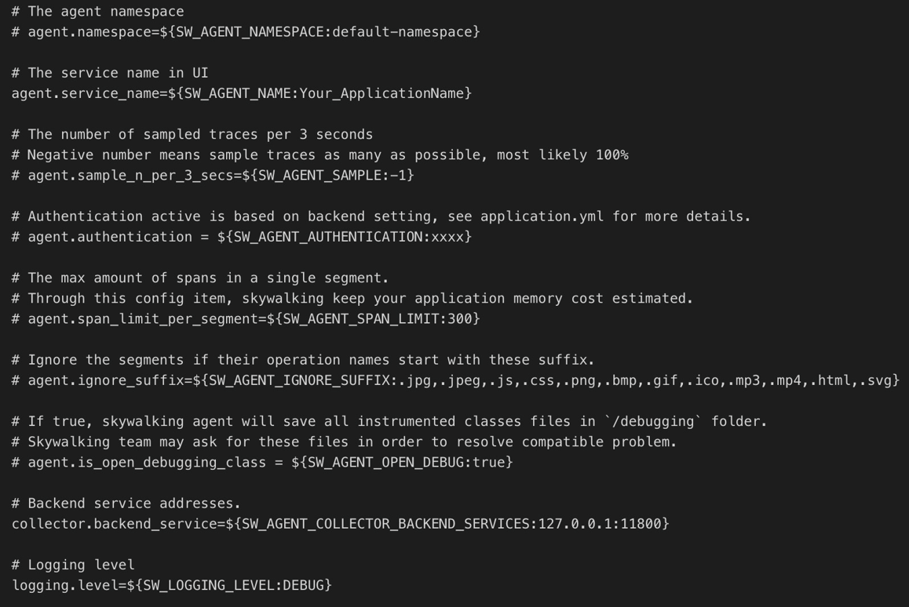
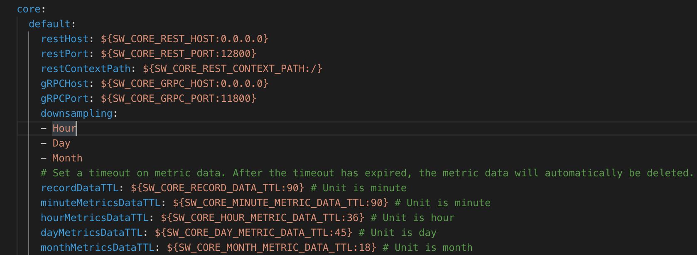
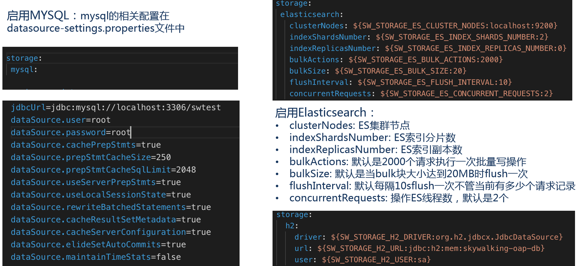
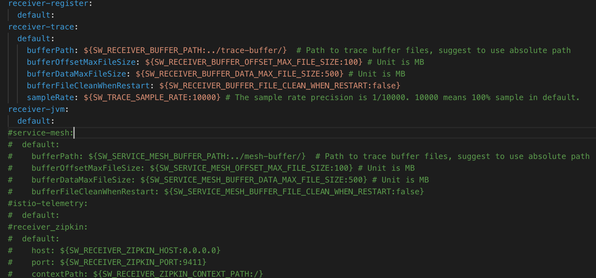

# Skywalking #

[https://github.com/apache/skywalking](https://github.com/apache/skywalking)

[Skywalking Helm](https://github.com/apache/skywalking-kubernetes)

SkyWalking是一款优秀的国产APM工具，包括了分布式追踪、性能指标分析、应用和服务依赖分析等。

[http://skywalking.apache.org/zh/blog/2019-03-29-introduction-of-skywalking-and-simple-practice.html](http://skywalking.apache.org/zh/blog/2019-03-29-introduction-of-skywalking-and-simple-practice.html)

Agent支持列表：

[https://github.com/apache/skywalking/blob/master/docs/en/setup/service-agent/java-agent/Supported-list.md](https://github.com/apache/skywalking/blob/master/docs/en/setup/service-agent/java-agent/Supported-list.md)

**架构**

[https://www.jianshu.com/p/2fd56627a3cf](https://www.jianshu.com/p/2fd56627a3cf)

[https://www.liangzl.com/get-article-detail-37412.html](https://www.liangzl.com/get-article-detail-37412.html)

SkyWalking的核心是数据分析和度量结果的存储平台，通过HTTP或gRPC方式向SkyWalking Collecter提交分析和度量数据，SkyWalking Collecter对数据进行分析和聚合，存储到Elasticsearch、H2、MySQL、TiDB等其一即可，最后可以通过SkyWalking UI的可视化界面对最终的结果进行查看。Skywalking支持从多个来源和多种格式收集数据：多种语言的Skywalking Agent 、Zipkin v1/v2 、Istio勘测、Envoy度量等数据格式。

- **Skywalking Agent**：使用Javaagent做字节码植入，无侵入式的收集，并通过HTTP或者gRPC方式发送数据到Skywalking Collector。
- **Skywalking Collector**：链路数据收集器，对agent传过来的数据进行整合分析处理并落入相关的数据存储中。
- **Storage**：Skywalking的存储，在6.x版本中支持以ElasticSearch、Mysql、TiDB、H2、作为存储介质进行数据存储。
- **UI**：Web可视化平台，用来展示落地的数据。

**Protocol**

[https://github.com/apache/skywalking/blob/master/docs/en/protocols/README.md](https://github.com/apache/skywalking/blob/master/docs/en/protocols/README.md)

## 配置 ##

[http://www.primeton.com/read.php?id=2751](http://www.primeton.com/read.php?id=2751)

**Skywalking Agent配置**

- agent.namespace: 跨进程链路中的header，不同的namespace会导致跨进程的链路中断
- agent.service_name:一个服务（项目）的唯一标识，这个字段决定了在sw的UI上的关于service的展示名称
- agent.sample_n_per_3_secs: 客户端采样率，默认是-1代表全采样
- agent.authentication: 与collector进行通信的安全认证，需要同collector中配置相同
- agent.ignore_suffix: 忽略特定请求后缀的trace
- collecttor.backend_service: agent需要同collector进行数据传输的IP和端口
- logging.level: agent记录日志级别

**Skywalking Collector配置**

存储配置：

- downsampling: 采样汇总统计维度，会分别按照分钟、【小时、天、月】（可选）来统计各项指标数据。
通过设置TTL相关配置项可以对数据进行自动清理。

端口配置：

Receiver配置：

Receiver是Skywalking在6.x提出的新的概念，负责从被监控的系统中接受指标数据。用户完全可以参照OpenTracing规范来上传自定义的监控数据。Skywalking官方提供了service-mesh、istio、zipkin的相关能力。
注意：如果Collector以集群方式部署，比如：Acollector和Bcollector，建议Acollector.sampleRate = Bcollector.sampleRate。如果采样率设置不相同可能会出现数据丢失问题。

