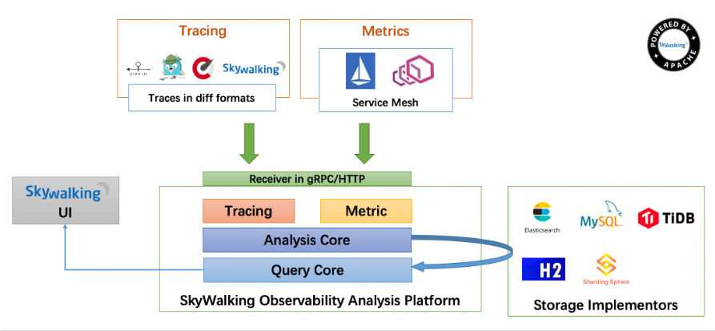

# 调用链 #

[https://www.jianshu.com/p/0fbbf99a236e](https://www.jianshu.com/p/0fbbf99a236e)

## Zipkin ##

[https://zipkin.io/](https://zipkin.io/)
[https://zipkin.io/pages/quickstart.html](https://zipkin.io/pages/quickstart.html)

Zipkin是Twitter开源的调用链分析工具，其可以帮助我们收集微服务架构中用于解决延时问题的时序数据，更直白地讲就是可以帮我们追踪调用的轨迹。

支持的Libraries


**架构**

[https://segmentfault.com/a/1190000012342007](https://segmentfault.com/a/1190000012342007)


- Reporter

	在某个应用中安插的用于发送数据给Zipkin的组件称为Report，目的就是用于追踪数据收集

- Span

	微服务中调用一个组件时，从发出请求开始到被响应的过程会持续一段时间，将这段跨度称为Span,其包含了一些描述信息：id，parentId，name，timestamp，duration，annotations等。

	```
	{
	      "traceId": "bd7a977555f6b982",
	      "name": "get-traces",
	      "id": "ebf33e1a81dc6f71",
	      "parentId": "bd7a977555f6b982",
	      "timestamp": 1458702548478000,
	      "duration": 354374,
	      "annotations": [
	        {
	          "endpoint": {
	            "serviceName": "zipkin-query",
	            "ipv4": "192.168.1.2",
	            "port": 9411
	          },
	          "timestamp": 1458702548786000,
	          "value": "cs"
	        }
	      ],
	      "binaryAnnotations": [
	        {
	          "key": "lc",
	          "value": "JDBCSpanStore",
	          "endpoint": {
	            "serviceName": "zipkin-query",
	            "ipv4": "192.168.1.2",
	            "port": 9411
	          }
	        }
	      ]
	}
	```

	- traceId：标记一次请求的跟踪，相关的Spans都有相同的traceId,64位或128位，全局唯一；
	- id：span id,64位，tranceId内唯一；
	- name：span的名称，一般是接口方法的名称；
	- parentId：可选的id，当前Span的父Span id，通过parentId来保证Span之间的依赖关系，如果没有parentId，表示当前Span为根Span(64位，根span的parentId为空)；
	- timestamp：Span创建时的时间戳，使用的单位是微秒（而不是毫秒），所有时间戳都有错误，包括主机之间的时钟偏差以及时间服务重新设置时钟的可能性，
	- 出于这个原因，Span应尽可能记录其duration；
	- duration：持续时间使用的单位是微秒（而不是毫秒）；
	- annotations：注释用于及时记录事件；有一组核心注释用于定义RPC请求的开始和结束；

		- cs:Client Send，客户端发起请求；
		- sr:Server Receive，服务器接受请求，开始处理；
		- ss:Server Send，服务器完成处理，给客户端应答；
		- cr:Client Receive，客户端接受应答从服务器；
		
	- binaryAnnotations：二进制注释，旨在提供有关RPC的额外信息。
	

- Trace

	从Client发出请求到完成请求处理，中间会经历一个调用链，将这一个整个过程称为一个追踪（Trace）。一个Trace可能包含多个Span，反之每个Span都有一个上级的Trace。

- Transport

	一种数据传输的方式，比如最简单的HTTP方式，当然在高并发时可以换成Kafka等消息队列,收集的Spans必须从被追踪的服务运输到Zipkin collector，有三个主要的传输方式：HTTP, Kafka和Scribe。

装配有Report组件的Client通过Transport来向Zipkin发送追踪数据。追踪数据由Collector收集器进行手机然后持久化到Storage之中。最后需要数据的一方，可以通过UI界面调用API接口，从而最终取到Storage中的数据。

## Skywalking ##

SkyWalking是一款优秀的国产APM工具，包括了分布式追踪、性能指标分析、应用和服务依赖分析等。

**架构**



[https://www.jianshu.com/p/2fd56627a3cf](https://www.jianshu.com/p/2fd56627a3cf)
[https://www.liangzl.com/get-article-detail-37412.html](https://www.liangzl.com/get-article-detail-37412.html)

SkyWalking的核心是数据分析和度量结果的存储平台，通过HTTP或gRPC方式向SkyWalking Collecter提交分析和度量数据，SkyWalking Collecter对数据进行分析和聚合，存储到Elasticsearch、H2、MySQL、TiDB等其一即可，最后可以通过SkyWalking UI的可视化界面对最终的结果进行查看。Skywalking支持从多个来源和多种格式收集数据：多种语言的Skywalking Agent 、Zipkin v1/v2 、Istio勘测、Envoy度量等数据格式。


- **Skywalking Agent**：使用Javaagent做字节码植入，无侵入式的收集，并通过HTTP或者gRPC方式发送数据到Skywalking Collector。
- **Skywalking Collector**：链路数据收集器，对agent传过来的数据进行整合分析处理并落入相关的数据存储中。
- **Storage**：Skywalking的存储，在6.x版本中支持以ElasticSearch、Mysql、TiDB、H2、作为存储介质进行数据存储。
- **UI**：Web可视化平台，用来展示落地的数据。


