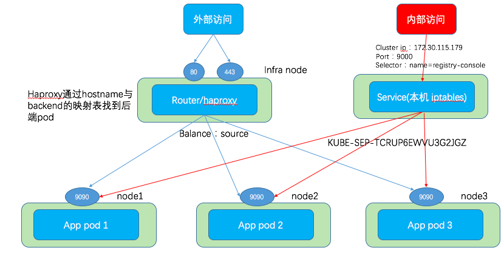

# OpenShift Router和Route #

[https://www.cnblogs.com/sammyliu/p/10013461.html](https://www.cnblogs.com/sammyliu/p/10013461.html)

在OpenShift中，Router是路由器，Route是路由器中配置的路由，Router跟Ingress实际上是一类资源。

OpenShift中外部访问Pod服务与集群内访问的流量图大致如下：


## Router的部署 ##

使用ansible采用默认配置部署OpenShift集群时，在集群Infra节点上，会以`Host networking`方式运行一个HAProxy的pod，它会在所有网卡的80和443端口上进行监听。

```
[root@infra-node3 cloud-user]# netstat -lntp | grep haproxy
tcp        0      0 127.0.0.1:10443         0.0.0.0:*               LISTEN      583/haproxy         
tcp        0      0 127.0.0.1:10444         0.0.0.0:*               LISTEN      583/haproxy         
tcp        0      0 0.0.0.0:80              0.0.0.0:*               LISTEN      583/haproxy         
tcp        0      0 0.0.0.0:443             0.0.0.0:*               LISTEN      583/haproxy
```

其中，172.0.0.1上的10443和10444端口供HAproxy自己使用。

OpenShift HAProxy Router支持两种部署方式：

- 一种是常见的单Router服务部署，它有一个或多个实例（pod），分布在多个节点上，负责整个集群上部署的服务的对外访问。
- 另一种是分片（sharding）部署。此时，会有多个Router服务，每个Router服务负责指定的若干project，两者之间采用标签（label）进行映射。这是为了解决单个Router的性能不够问题而提出的解决方案。

可以通过`oc adm router`命令创建router服务:

```
[root@master1 cloud-user]# oc adm router router2 --replicas=1 --service-account=router
info: password for stats user admin has been set to J3YyPjlbqf
--> Creating router router2 ...
    warning: serviceaccounts "router" already exists
    clusterrolebinding.authorization.openshift.io "router-router2-role" created
    deploymentconfig.apps.openshift.io "router2" created
    service "router2" created
--> Success
```

## HAProxy ##

在Router服务的每个pod之中，openshift-router进程启动了一个haproy进程：

```
UID        PID  PPID  C STIME TTY          TIME CMD
1000000+     1     0  0 Nov21 ?        00:14:27 /usr/bin/openshift-router
1000000+ 16011     1  0 12:42 ?        00:00:00 /usr/sbin/haproxy -f /var/lib/haproxy/conf/haproxy.config -p /var/lib/haproxy/run/haproxy.pid -x /var/lib/haproxy/run/haproxy.sock -sf 16004
```

Haproxy配置分以下两部分：

- 全局配置，比如最大连接数 maxconn，超时时间 timeout 等；以及front部分，即前端配置，HAProxy 默认会在 443 和 80 两个端口上分别监听外部 https 和 http 请求。
- backend，即每个服务的后端配置，里面有很多关键内容，比如后端协议（mode）、负载均衡方法（balance）、后端列表（server，这里是pod，包括其IP 地址和端口）、证书等。

OpenShift中HAProxy全局配置两种修改方式：


- 使用`oc adm router`命令在创建router时候指定各种参数，比如`--max-connections`用于设置最大连接数。比如：
`oc adm router --max-connections=200000 --ports='81:80,444:443' router3`
创建出来的HAProxy的maxconn将是20000，router3 这个服务对外暴露出来的端口是81和444，但是HAProxy pod的端口依然是80和443.

- 通过设置`dc/<dc router名>`的环境变量来设置router的全局配置。在官方文档 https://docs.openshift.com/container-platform/3.4/architecture/core_concepts/routes.html#haproxy-template-router中有完整的环境变量列表。比如运行以下命令后，
`oc set env dc/router3 ROUTER_SERVICE_HTTPS_PORT=444 ROUTER_SERVICE_HTTP_PORT=81 STATS_PORT=1937`
router3会重新部署，新部署的HAProxy的https监听端口是444，http监听端口是80，统计端口是1937.