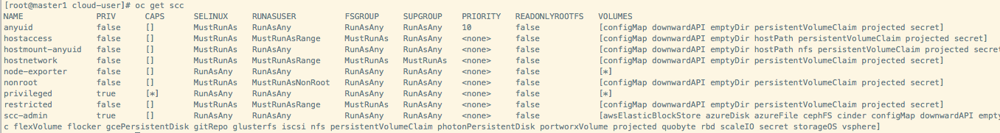

# OpenShift用户与权限管理 #

[](https://www.cnblogs.com/sammyliu/p/10083659.html)

## Security Context Constraint（SCC） ##

SCC使用UserID，FsGroupID以及supplemental group ID和SELinux label等策略，通过校验Pod定义的ID是否在有效范围内来限制pod的权限。如果校验失败，则Pod也会启动失败。SCC的策略值设置为RunAsAny表示pod拥有该策略下的所有权限。否则只有pod的SCC设置与SCC策略匹配时才能通过认证。openshift role和clusterrole用于控制pod服务对openshift资源的访问；而SCC用于控制pod的启动和对挂载卷的访问

**OpenShift默认的scc**



SCC可能会给出所允许的策略的值的范围(如Must RunAsRange)，如果pod中没有指定对应策略的值，则默认使用该pod所在的project中的最小值。

```
metadata:
  annotations:  																#当SCC策略非RunAsAny时提供默认值
    openshift.io/sa.scc.mcs: s0:c1,c0 											#在pod或SCC没有定义SELinux时提供默认值
    openshift.io/sa.scc.supplemental-groups: 1000000000/10000 					#允许的group ID范围。可以支持多个范围，使用逗号分隔
    openshift.io/sa.scc.uid-range: 1000000000/10000 							#允许的user ID范围，仅支持单个范围

```
M/N表示M为起始ID，范围为M~M+N-1

每个pod中，运行主进程的用户都有三个属性：

- **uid** 即user id。其策略分为三种：
	- MustRunAs 需要配置一个区间，要么在project中配置，要么在scc中指定。默认使用区间的第一个值。指定特定值的话，会检查是否在该区间内。
	- MustRunAsNonRoot 要求指定非root的user id，不提供默认值。
	- RunAsAny 允许所有用户，不提供默认值。
- **gid** 即用户的primary group id（主组ID）。
- **fsGroup** 定义pod的文件系统group ID，用于块存储，比如Ceph RDB和iSCSI。

`Supplemental groups ID`用于控制访问共享存储，如NFS，Gluster FS，而fsGroup用于控制访问块存储，如Ceph RBD，iSCSI。OpenShift容器中挂载的卷和目标存储拥有相同的权限。如目标存储的UID为1234，groupID为5678，则mount到node和容器中的卷同样拥有这些ID值。因此容器的进程需要匹配一个或两个ID才能使用这些卷。pod中的supplementalGroups和fsGroup在系统层面是不作区分的，只是用于在pod层面区分不同的场景，pod在定义这类值后，会添加到器系统的supplemental groups中。通常使用supplemental group ID或fsGroup作为访问存储的凭证。

**容器使用的默认scc**

根据创建pod的用户不同，pod使用不同的默认scc：

- 非cluster admin角色的openshift用户创建的没有显式指定service account和scc的pod，其默认使用的sa user为default，默认使用的scc为 restricted。
- cluster admin用户，根据scc优先级，anyuid将是这种pod默认使用的scc。

SCC优先级：一个sa user可以被加到多的scc当中。当一个service account user有多个SCC可用时，其scc按照下面的规则排序

- 最高优先级的scc排在最前面。默认地，对于cluster admin角色的用户的pod，anyuid scc会被授予最高优先级，排在最前面。这会允许集群管理员能够以任意user运行pod，而不需要指定pod的SecurityContext中的RunAsUser字段。
- 如果优先级相同，scc将从限制最高的向限制最少的顺序排序。
- 如果优先级和限制都一样，那么将按照名字排序。