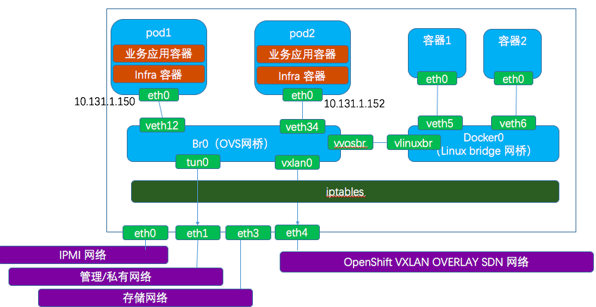
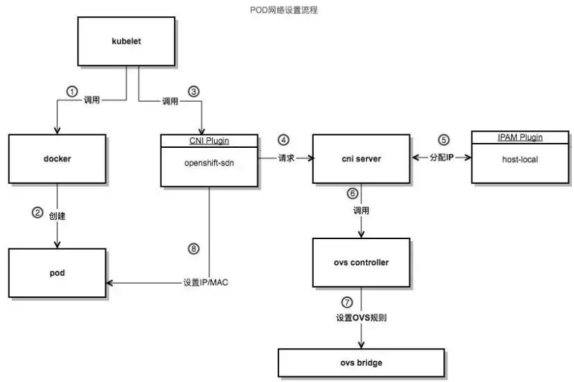
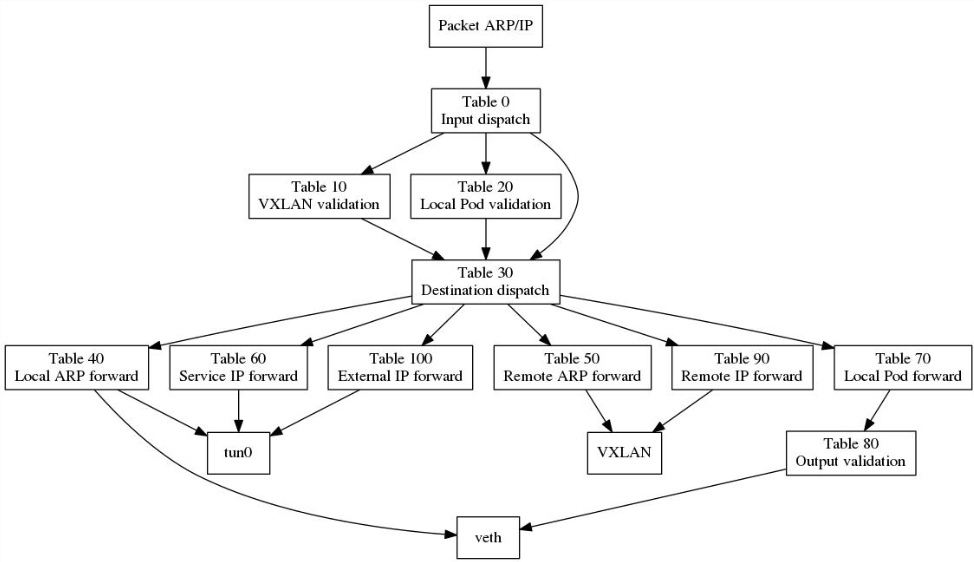
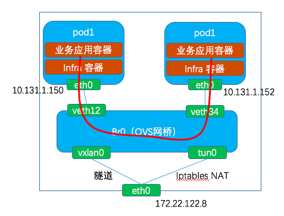
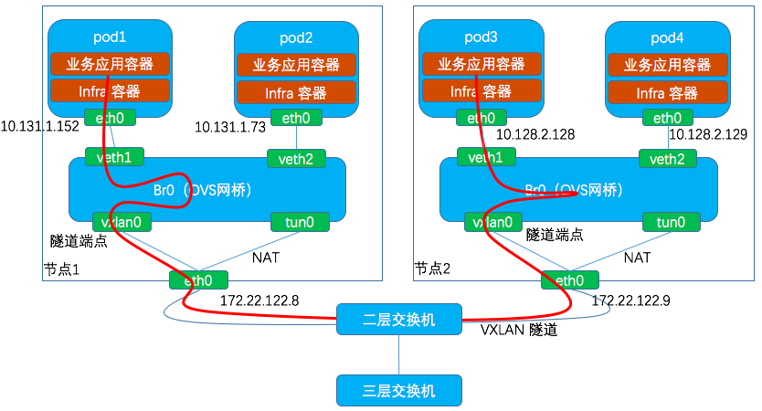
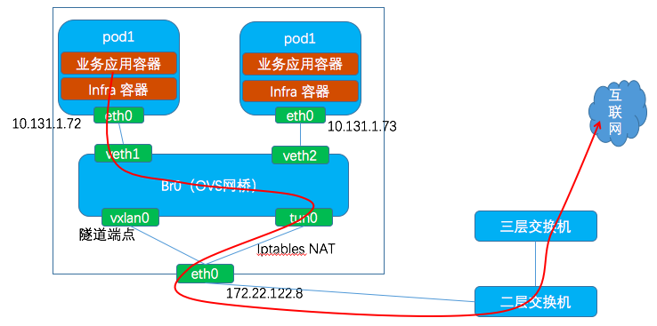
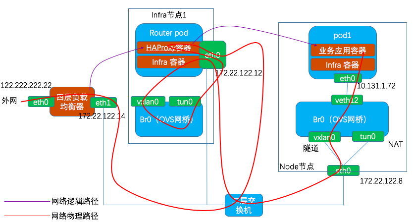
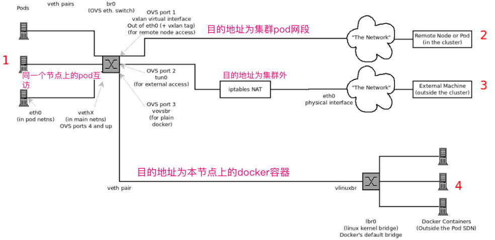

# OpenShift网络 #

[摘自https://www.cnblogs.com/sammyliu/p/10064450.html,写得非常好！！！](https://www.cnblogs.com/sammyliu/p/10064450.html)

## 插件类型 ##

OpenShift使用SDN（软件定义网络）提供集群网络，实现集群POD之间的通信。Openshift SDN使用的是OpenvSwitch（OVS）。有关OVS介绍，可参考[Network/OpenvSwitch(OVS)](https://github.com/SecurityNeo/ReadingNotes/blob/master/Network/OpenvSwitch(OVS).md)

三种插件：

- ovs-subnet：ovs-subnet实现的是一种扁平网络，未实现租户之间的网络隔离，这意味着所有租户之间的pod都可以互访，这使得该实现无法用于绝大多数的生产环境。
- ovs-multitenant：基于OVS和VxLA 等技术实现了项目（project）之间的网络隔离。
- ovs-networkpolicy：介于ovs-subnet和ovs-multitenant之间的一种实现。考虑到ovs-multitenant只是实现了项目级别的网络隔离，这种隔离粒度在一些场景中有些过大，用户没法做更精细的控制，这种需求导致了ovs-networkpolicy的出现。默认地，它和ovs-subnet一样，所有租户之间都没有网络隔离。但是，管理员可以通过定义NetworkPolicy对象来精细地进行网络控制。

当使用ansible部署OpenShift时，默认会启用ovs-subnet。

## Nodes网络 ##



节点上的主要网络设备：

- br0：OpenShift创建和管理的Open vSwitch网桥, 它会使用OpenFlow规则来实现网络隔离和转发。
- vethXXXXX：veth对，它负责将pod的网络命名空间连接到br0网桥。
- tun0 ：OVS内部端口，它会被分配本机的pod子网的网关IP地址，用于OpenShift po 以及Docker容器与集群外部的通信。iptables的NAT规则会作用于tun0。
- docker0：Docker管理和使用的linux bridge网桥，通过veth对将不受OpenShift管理的Docker容器的网络地址空间连接到docker0上。
- vovsbr/vlinuxbr：将docker0和br0连接起来的veth对，使得Docker容器能和OpenShift pod通信，以及通过tun0访问外部网络
- vxlan0：OVS VXLAN隧道端点，用于集群内部pod之间的网络通信。

## 具体实现 ##

**Pod网络设置流程**



[解析 | OpenShift源码简析之pod网络配置(一）](https://mp.weixin.qq.com/s?__biz=MzA3MDg4Nzc2NQ==&mid=2652137188&idx=1&sn=98608470be8014acf8cfa1bacb219bfb&scene=21#wechat_redirect)

- OpenShift使用运行在每个节点上的kubelet来负责pod的创建和管理，其中就包括网络配置部分。
- 当kubelet接受到pod创建请求时，会首先调用docker client来创建容器，然后再调用docker api接口启动上一步中创建成功的容器。kubelet 在创建pod时是先创建一个infra容器，配置好该容器的网络，然后创建真正用于业务的应用容器，最后再把业务容器的网络加到infra容器的网络命名空间中，相当于业务容器共享infra容器的网络命名空间。业务应用容器和infra容器共同组成一个pod。
- kubelet使用CNI来创建和管理Pod网络（openshift在启动kubelet时传递的参数是--netowrk-plugin=cni）。OpenShift实现了CNI插件（由`/etc/cni/net.d/80-openshift-network.conf`文件指定），其二进制文件是`/opt/cni/bin/openshift-sdn`。因此，kubelet通过CNI接口来调用openshift sdn插件，然后具体做两部分事情：一是通过IPAM获取IP地址，二是设置OVS（其中，一是通过调用ovs-vsctl将infra容器的主机端虚拟网卡加入br0，二是调用ovs-ofctl命令来设置规则）。


**OVS网桥br0中的规则**



流量规则表：

- table 0: 根据输入端口（in_port）做入口分流，来自VXLAN隧道的流量转到表10并将其VXLAN VNI保存到OVS中供后续使用，从tun0过来的（来自本节点或进本节点来做转发的）流量分流到表30，将剩下的即本节点的容器（来自veth***）发出的流量转到表20；
- table 10: 做入口合法性检查，如果隧道的远端IP（tun_src）是某集群节点的IP，就认为是合法，继续转到table 30去处理;
- table 20: 做入口合法性检查，如果数据包的源IP（nw_src）与来源端口（in_port）相符，就认为是合法的，设置源项目标记，继续转到table 30去处理；如果不一致，即可能存在ARP/IP欺诈，则认为这样的的数据包是非法的;
- table 30: 数据包的目的（目的IP或ARP请求的IP）做转发分流，分别转到table 40~70去处理;
- table 40: 本地ARP的转发处理，根据ARP请求的IP地址，从对应的端口（veth）发出;
- table 50: 远端ARP的转发处理，根据ARP请求的IP地址，设置VXLAN隧道远端IP，并从隧道发出;
- table 60: Service的转发处理，根据目标Service，设置目标项目标记和转发出口标记，转发到table 80去处理;
- table 70: 对访问本地容器的包，做本地IP的转发处理，根据目标IP，设置目标项目标记和转发出口标记，转发到table 80去处理;
- table 80: 做本地的IP包转出合法性检查，检查源项目标记和目标项目标记是否匹配，或者目标项目是否是公开的，如果满足则转发;（这里实现了OpenShift网络层面的多租户隔离机制，实际上是根据项目/project进行隔离，因为每个项目都会被分配一个VXLAN VNI，table 80只有在网络包的VNI和端口的VNI tag相同才会对网络包进行转发）

常用操作命令：

- 查询OVS流表： ovs-ofctl -O OpenFlow13 dump-flows br0
- 查询OVS设备： ovs-vsctl show
- 查看OVS网桥： ovs-ofctl -O OpenFlow13 show br0
- 在容器中运行命令：nsenter -t <容器的PiD> -n ip a
- 查询 iptables NAT表：iptables -t nat -S

** 同一个节点上的两个pod之间的互访**



OVS流表：

```
table=0, n_packets=14631632, n_bytes=1604917617, priority=100,ip actions=goto_table:20
table=20, n_packets=166585, n_bytes=12366463, priority=100,ip,in_port=96,nw_src=10.131.1.152 actions=load:0xbe3127->NXM_NX_REG0[],goto_table:21
table=21, n_packets=14671413, n_bytes=1606835395, priority=0 actions=goto_table:30
table=30, n_packets=8585493, n_bytes=898571869, priority=200,ip,nw_dst=10.131.0.0/23 actions=goto_table:70
table=70, n_packets=249967, n_bytes=16177300, priority=100,ip,nw_dst=10.131.1.152 actions=load:0xbe3127->NXM_NX_REG1[],load:0x60->NXM_NX_REG2[],goto_table:80
table=80, n_packets=0, n_bytes=0, priority=100,reg0=0xbe3127,reg1=0xbe3127 actions=output:NXM_NX_REG2[]
table=80, n_packets=0, n_bytes=0, priority=0 actions=drop #不合法的包会被丢弃
```

表20会判断包类型（IP）、源地址（nw_src）、进来端口的ID（96），将其对应的VNI ID（这里是 0xbe3127，十进制是12464423）保存在REG0中。这意味着所有通过OVS端口进入OVS br0网桥的来自pod的网络包都会被打上对口对应的VNID标签。
集群中所有项目对应的VNID可以使用`oc get netnamespaces`命令查到：

```
[root@master1 cloud-user]# oc get netnamespaces
NAME                                NETID      EGRESS IPS
cicd                                16604171   []
default                             0          []
demoproject2                        16577323   []
demoprojectone                      1839630    []
dev                                 12464423   []
```

表70会根据目的地址，也就是目的pod的地址，将网络包的目的出口标记（这里为0x60，十进制为96）保存到REG2，同时设置其项目的VNI ID到REG1（这里是0xbe3127）。

根据端口的ID 96找到veth网络设备：

```
96(veth0612e07f): addr:66:d0:c3:e3:be:cf
     config:     0
     state:      0
     current:    10GB-FD COPPER
     speed: 10000 Mbps now, 0 Mbps max
```

查找其对应的容器中的网卡:

```
[root@node1 cloud-user]# ip link  | grep veth0612e07f
443: veth0612e07f@if3: <BROADCAST,MULTICAST,UP,LOWER_UP> mtu 1400 qdisc noqueue master ovs-system state UP mode DEFAULT 
```

这与pod2容器中的eth0正好吻合：

```
3: eth0@if443: <BROADCAST,MULTICAST,UP,LOWER_UP> mtu 1400 qdisc noqueue state UP 
    link/ether 0a:58:0a:83:01:98 brd ff:ff:ff:ff:ff:ff link-netnsid 0
    inet 10.131.1.152/23 brd 10.131.1.255 scope global eth0
       valid_lft forever preferred_lft forever
```

表80会检查报的来源VNI ID（REG0）和目的端口的VNI ID（REG1），将相符的合法的包转发到表70设置的出口，以完成转发。

**不同节点上的两个pod之间的互访**



发送端（node1）的OVS流表：

```
table=0, n_packets=14703186, n_bytes=1612904326, priority=100,ip actions=goto_table:20
table=20, n_packets=167428, n_bytes=12428845, priority=100,ip,in_port=96,nw_src=10.131.1.152 actions=load:0xbe3127->NXM_NX_REG0[],goto_table:21
table=21, n_packets=14736461, n_bytes=1613954556, priority=0 actions=goto_table:30
table=30, n_packets=1143761, n_bytes=1424533777, priority=100,ip,nw_dst=10.128.0.0/14 actions=goto_table:90
table=90, n_packets=0, n_bytes=0, priority=100,ip,nw_dst=10.128.2.0/23 actions=move:NXM_NX_REG0[]->NXM_NX_TUN_ID[0..31],set_field:172.22.122.9->tun_dst,output:1
```

- tabel 21：将源pod的VNI ID保存在REG0中。
- tabel 30：会判断目的地址是不是集群内pod的IP CIDR。
- tabel 90：会设置VNI ID为之前保存在REG0中的值，然后根据目的地址的网段（这里是 10.128.2.0/23），计算出其所在的节点的IP地址（这里是 172.22.122.9）并设置为tun_dst，然后发到vxlan0，它会负责根据提供的信息来做VXLAN UDP包封装。


接收端（node2）的OVS流表： 

```
table=0, n_packets=1980863, n_bytes=1369174876, priority=200,ip,in_port=1,nw_src=10.128.0.0/14 actions=move:NXM_NX_TUN_ID[0..31]->NXM_NX_REG0[],goto_table:10
table=10, n_packets=0, n_bytes=0, priority=100,tun_src=172.22.122.8 actions=goto_table:30
table=30, n_packets=16055284, n_bytes=1616511267, priority=200,ip,nw_dst=10.128.2.0/23 actions=goto_table:70
table=70, n_packets=248860, n_bytes=16158751, priority=100,ip,nw_dst=10.128.2.128 actions=load:0xbe3127->NXM_NX_REG1[],load:0x32->NXM_NX_REG2[],goto_table:80
table=80, n_packets=0, n_bytes=0, priority=100,reg0=0xbe3127,reg1=0xbe3127 actions=output:NXM_NX_REG2[]
```

- tabel 0：将发送到保存在`NXM_NX_TUN_ID[0..31]`中的源VNI ID取出来保存到REG0.
- tabel 10：检查包的来源节点的地址。
- tabel 30：检查包的目的地址是不是本机上pod的网段。
- tabel 70：根据目的地址，将目的VNI ID保存到REG1，将目的端口ID保存到REG2
- tabel 80：检查目的VNI ID和源VNI ID，如果相符的话，则将包转发到保存在REG2中的目的端口ID指定的端口。然后包就会通过veth管道进入目的pod。

**pod访问外网**



OVS流表：

```
table=0, n_packets=14618128, n_bytes=1603472372, priority=100,ip actions=goto_table:20
table=20, n_packets=0, n_bytes=0, priority=100,ip,in_port=17,nw_src=10.131.1.73 actions=load:0xfa9a3->NXM_NX_REG0[],goto_table:21
table=21, n_packets=14656675, n_bytes=1605262241, priority=0 actions=goto_table:30
table=30, n_packets=73508, n_bytes=6820206, priority=0,ip actions=goto_table:100
table=100, n_packets=44056, n_bytes=3938540, priority=0 actions=goto_table:101
table=101, n_packets=44056, n_bytes=3938540, priority=0 actions=output:2
```

- tabel 20：检查IP包的来源端口和IP地址，并将源项目的VNI ID保存到REG0.
- tabel 101：将包发送到端口2即tun0. 然后被iptables做NAT然后发送到eth0.
- SNAT：将容器发出的IP包的源IP地址修改为宿主机的eth0网卡的IP地址。

** 外网访问pod**



Infra节点上的HAproxy容器采用`host-network`模式，因此它是直接使用宿主机的eth0网卡的。

宿主机路由表：

```
[root@infra-node1 /]# route -n
Kernel IP routing table
Destination     Gateway         Genmask         Flags Metric Ref    Use Iface
0.0.0.0         172.22.122.1    0.0.0.0         UG    100    0        0 eth0
10.128.0.0      0.0.0.0         255.252.0.0     U     0      0        0 tun0
169.254.169.254 172.22.122.1    255.255.255.255 UGH   100    0        0 eth0
172.17.0.0      0.0.0.0         255.255.0.0     U     0      0        0 docker0
172.22.122.0    0.0.0.0         255.255.255.0   U     100    0        0 eth0
172.30.0.0      0.0.0.0         255.255.0.0     U     0      0        0 tun0
```

从HAProxy容器内出来目的地址为业务pod（ip：10.128.2.128）的网络包，根据上面的路由表，其下一跳是tun0，也就是说它又进入了OVS网桥br0. 对应的OVS流表规则为：
```
ip,in_port=2 actions=goto_table:30
ip,nw_dst=10.128.0.0/14 actions=goto_table:90
ip,nw_dst=10.128.2.0/23 actions=move:NXM_NX_REG0[]->NXM_NX_TUN_ID[0..31],set_field:172.22.122.9->tun_dst,output:1
```

**总结**



总体来说，OVS中的OpenFlow流表根据网络包的目的地址将其分为四类来处理：

- 到本地pod的，直接在br0中转发。
- 到本集群pod的，经过br0后发到vxlan0，封装为vxlan udp包经物理网卡发到对方节点。
- 到集群外的，经过br0后发到tun0，经过iptables做SNAT，然后经物理网卡发出。

## 项目（project）级别的网络隔离 ##

OpenShift 中的网络隔离是在项目（project）级别实现的。OpenShfit默认的项目 『default』的VNID （Virtual Network ID）为0，表明它是一个特权项目，因为它可以发网络包到其它所有项目，也能接受其它所有项目的pod发来的网络包。这从table 80的规则上可以看出来，如果来源项目的VNID（reg0）或目标项目的VNID（reg1）为0，都会允许包转发到pod的端口：

```
table=80, n_packets=8244506, n_bytes=870316191, priority=200,reg0=0 actions=output:NXM_NX_REG2[]
table=80, n_packets=13576848, n_bytes=1164951315, priority=200,reg1=0 actions=output:NXM_NX_REG2[]
```

其它所有项目都会有一个非0的 VNID。在 OpenShift ovs-multitenant 实现中，非0 VNID 的项目之间的网络是不通的。

从一个本地pod发出的所有网络流量，在它进入OVS网桥时，都会被打上它所通过的OVS端口ID相对应的VNID。port:VNID映射会在pod创建时通过查询master上的etcd来确定。从其它节点通过VXLAN发过来的网络包都会带有发出它的pod 所在项目的 VNID。

根据上面的分析，OVS网桥中的OpenFlow规则会阻止带有与目标端口上的VNID不同的网络包的投递（VNID 0除外）。这就保证了项目之间的网络流量是互相隔离的。

可以使用下面的命令查看namespace的NETID也就是VNID：
```
oc get namespaces
```

## CluserIP类型的Service ##

OpenShift Serivce有多种类型，默认的和最常用的是ClusterIP类型。每个这种类型的Service，创建时都会被从一个子网中分配一个IP地址，在集群内部可以使用该IP地址来访问该服务，进而访问到它后端的pod。因此，Service实际上是用于OpenShift集群内部的四层负载均衡器，它是基于 iptables实现的。


