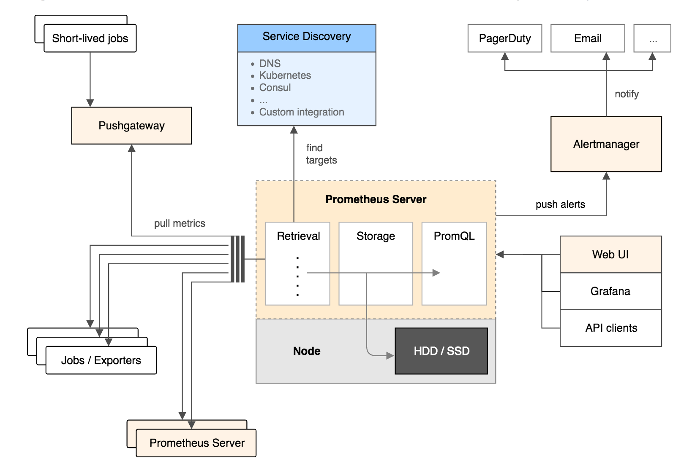

# Prometheus简介 #

[https://prometheus.io/](https://prometheus.io/)
[https://github.com/prometheus](https://github.com/prometheus)

摘自[https://www.ibm.com/developerworks/cn/cloud/library/cl-lo-prometheus-getting-started-and-practice/index.html](https://www.ibm.com/developerworks/cn/cloud/library/cl-lo-prometheus-getting-started-and-practice/index.html)

**Prometheus特点**
- 强大的多维度数据模型：
	- 时间序列数据通过 metric 名和键值对来区分。
	- 所有的 metrics 都可以设置任意的多维标签。
	- 数据模型更随意，不需要刻意设置为以点分隔的字符串。
	- 可以对数据模型进行聚合，切割和切片操作。
	- 支持双精度浮点类型，标签可以设为全 unicode。
- 灵活而强大的查询语句（PromQL）：在同一个查询语句，可以对多个 metrics 进行乘法、加法、连接、取分数位等操作。
- 易于管理： Prometheus server 是一个单独的二进制文件，可直接在本地工作，不依赖于分布式存储。
- 高效：平均每个采样点仅占 3.5 bytes，且一个 Prometheus server 可以处理数百万的 metrics。
- 使用 pull 模式采集时间序列数据，这样不仅有利于本机测试而且可以避免有问题的服务器推送坏的 metrics。
- 可以采用 push gateway 的方式把时间序列数据推送至 Prometheus server 端。
- 可以通过服务发现或者静态配置去获取监控的 targets。
- 有多种可视化图形界面。
- 易于伸缩。

**架构**

主要组件：

- Prometheus Server: 用于收集和存储时间序列数据。
- Client Library: 客户端库，为需要监控的服务生成相应的 metrics 并暴露给 Prometheus server。当 Prometheus server 来 pull 时，直接返回实时状态的 metrics。
- Push Gateway: 主要用于短期的 jobs。由于这类 jobs 存在时间较短，可能在 Prometheus 来 pull 之前就消失了。为此，这次 jobs 可以直接向 Prometheus server 端推送它们的 metrics。这种方式主要用于服务层面的 metrics，对于机器层面的 metrices，需要使用 node exporter。
- Exporters: 用于暴露已有的第三方服务的 metrics 给 Prometheus。
- Alertmanager: 从 Prometheus server 端接收到 alerts 后，会进行去除重复数据，分组，并路由到对收的接受方式，发出报警。常见的接收方式有：电子邮件，pagerduty，OpsGenie, webhook 等。

Prometheus的工作流

- Prometheus server定期从配置好的jobs或者exporters中拉取metrics，或者接收来自Pushgateway发送过来的metrics，或者从其它的Prometheus server中拉metrics。
- Prometheus server在本地存储收集到的metrics，并运行定义好的alerts.rules，记录新的时间序列或者向Alert manager推送警报。
- Alertmanager根据配置文件，对接收到的警报进行处理，发出告警。
- 在图形界面中，可视化采集数据。
