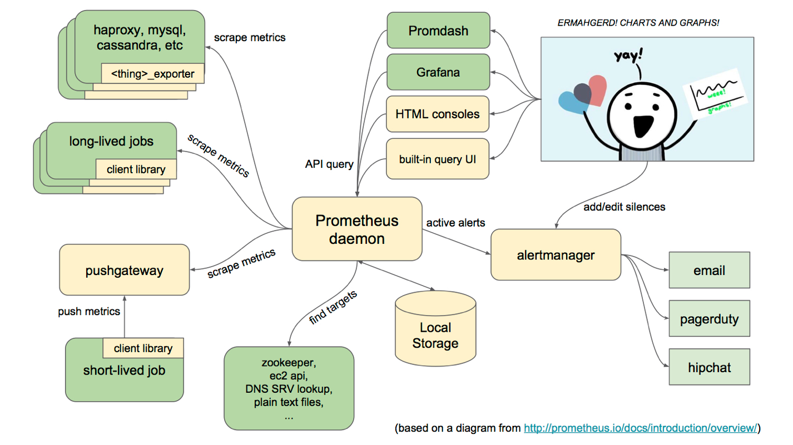

# Prometheus简介 #

[https://prometheus.io/](https://prometheus.io/)
[https://github.com/prometheus](https://github.com/prometheus)

摘自[https://www.ibm.com/developerworks/cn/cloud/library/cl-lo-prometheus-getting-started-and-practice/index.html](https://www.ibm.com/developerworks/cn/cloud/library/cl-lo-prometheus-getting-started-and-practice/index.html)

**Prometheus特点**
- 强大的多维度数据模型：
	- 时间序列数据通过metric名和键值对来区分。
	- 所有的metrics都可以设置任意的多维标签。
	- 数据模型更随意，不需要刻意设置为以点分隔的字符串。
	- 可以对数据模型进行聚合，切割和切片操作。
	- 支持双精度浮点类型，标签可以设为全unicode。
- 灵活而强大的查询语句（PromQL）：在同一个查询语句，可以对多个metrics进行乘法、加法、连接、取分数位等操作。
- 易于管理： Prometheus server 是一个单独的二进制文件，可直接在本地工作，不依赖于分布式存储。
- 高效：平均每个采样点仅占3.5 bytes，且一个Prometheus server可以处理数百万的metrics。
- 使用pull模式采集时间序列数据，这样不仅有利于本机测试而且可以避免有问题的服务器推送坏的metrics。
- 可以采用push gateway的方式把时间序列数据推送至Prometheus server端。
- 可以通过服务发现或者静态配置去获取监控的targets。
- 有多种可视化图形界面。
- 易于伸缩。

**架构**




主要组件：

- Prometheus Server: 用于收集和存储时间序列数据，提供PromQL查询语言的支持。
- Client Library: 客户端库，为需要监控的服务生成相应的metrics并暴露给Prometheus server。当Prometheus server来pull时，直接返回实时状态的metrics。
- Push Gateway: 主要用于短期的Jobs。由于这类jobs存在时间较短，可能在Prometheus来pull之前就消失了。为此，这些jobs可以直接向Prometheus server端推送它们的metrics。这种方式主要用于服务层面的metrics，对于机器层面的metrices，需要使用node exporter。
- Exporters: 用于暴露已有的第三方服务的metrics给Prometheus。
- Alertmanager: 从Prometheus server端接收到alerts后，会进行去除重复数据，分组，并路由到对收的接受方式，发出报警。常见的接收方式有：电子邮件，pagerduty，OpsGenie, webhook 等。

Prometheus的工作流

- Prometheus Daemon负责定时去目标上抓取metrics(指标)数据，每个抓取目标需要暴露一个http服务的接口给它定时抓取。Prometheus支持通过配置文件、文本文件、Zookeeper、Consul、DNS SRV Lookup等方式指定抓取目标。Prometheus采用PULL的方式进行监控，即服务器可以直接通过目标PULL数据或者间接地通过中间网关来Push数据。
- Prometheus server定期从配置好的jobs或者exporters中拉取metrics，或者接收来自Pushgateway发送过来的metrics，或者从其它的Prometheus server中拉metrics。
- Prometheus server在本地存储收集到的metrics，并运行定义好的alerts.rules，记录新的时间序列或者向Alert manager推送警报。
- Alertmanager根据配置文件，对接收到的警报进行处理，发出告警。
- 在图形界面中，可视化采集数据。

## 数据模型 ##

**时序索引**

时序(time series) 是由指标名字(Metric)，以及一组key/value标签定义的，具有相同的名字以及标签属于相同时序。时序的名字由ASCII字符，数字，下划线，以及冒号组成，它必须满足正则表达式`[a-zA-Z_:][a-zA-Z0-9_:]*`, 其名字应该具有语义化，一般表示一个可以度量的指标，例如: `http_requests_total`, 可以表示http请求的总数。时序的标签可以使Prometheus的数据更加丰富，能够区分具体不同的实例，例如：`http_requests_total{method="POST"}`可以表示所有http中的POST请求。标签名称由ASCII字符，数字，以及下划线组成，其中__开头属于Prometheus保留，标签的值可以是任何Unicode字符，支持中文。

**时序样本**

按照某个时序以时间维度采集的数据，称之为样本，其值包含：
- 一个float64值
- 一个毫秒级的unix时间戳

**格式**

Prometheus时序格式与OpenTSDB相似：

`<metric name>{<label name>=<label value>, ...}`

其中包含时序名字以及时序的标签。

**四种时序类型**

Prometheus时序数据分为Counter（变化的增减量）,Gauge（瞬时值）,Histogram（采样并统计）,Summary（采样结果）四种类型。

Counter：表示收集的数据是按照某个趋势（增加／减少）一直变化的，我们往往用它记录服务请求总量、错误总数等。 例如Prometheus server中`http_requests_total`, 表示Prometheus处理的http请求总数，我们可以使用delta, 很容易得到任意区间数据的增量
Gauge:表示搜集的数据是一个瞬时的值，与时间没有关系，可以任意变高变低，往往可以用来记录内存使用率、磁盘使用率等。 例如Prometheus server中`go_goroutines`, 表示Prometheus当前goroutines的数量。
Histogram:主要用于表示一段时间范围内对数据进行采样（通常是请求持续时间或响应大小），并能够对其指定区间以及总数进行统计，通常它采集的数据展示为直方图。Histogram由`<basename>_bucket{le="<upper inclusive bound>"}，<basename>_bucket{le="+Inf"}, <basename>_sum，<basename>_count`组成，例如Prometheus server中`prometheus_local_storage_series_chunks_persisted`, 表示Prometheus中每个时序需要存储的chunks数量，我们可以用它计算待持久化的数据的分位数。
Summary:主要用于表示一段时间内数据采样结果（通常是请求持续时间或响应大小），它直接存储了quantile数据，而不是根据统计区间计算出来的。Summary和Histogram类似，由`<basename>{quantile="<φ>"}，<basename>_sum，<basename>_count`组成，例如Prometheus server中`prometheus_target_interval_length_seconds`。


## 部署配置 ##

[https://www.cnblogs.com/chenqionghe/p/10494868.html](https://www.cnblogs.com/chenqionghe/p/10494868.html)

[https://songjiayang.gitbooks.io/prometheus/content/configuration/global.html](https://songjiayang.gitbooks.io/prometheus/content/configuration/global.html)

**全局配置**：

global属于全局的默认配置，它主要包含4个属性：

- scrape_interval: 抓取间隔，默认为1m
- scrape_timeout: 抓取超时时间，默认为10s
- evaluation_interval: 规则评估间隔，默认为1m
- external_labels: 额外的属性，会添加到拉取的数据并存到数据库中。

```
global:
  scrape_interval:     15s 
  evaluation_interval: 15s 
  scrape_timeout: 10s
  external_labels:
    monitor: 'codelab-monitor'
```

**抓取配置**:

scrape_configs可以有多个，一般来说每个任务（Job）对应一个配置。单个抓取配置的格式如下：

- job_name：任务名称
- honor_labels： 用于解决拉取数据标签有冲突，当设置为true, 以拉取数据为准，否则以服务配置为准。即当抓取回来的采样值的标签值跟服务端配置的不一致时，如果该配置为true，则以抓取回来的为准。否则以服务端的为准，抓取回来的值会保存到一个新标签下，该新标签名在原来的前面加上了“exported_”，比如 exported_job。
- params：数据拉取访问时带的请求参数
- scrape_interval： 拉取时间间隔,默认为对应全局配置
- scrape_timeout: 拉取超时时间,默认为对应全局配置
- metrics_path： 拉取节点的metric 路径,默认为`/metrics`
- scheme： 拉取数据访问协议
- sample_limit： 存储的数据标签个数限制，如果超过限制，该数据将被忽略，不入存储；默认值为0，表示没有限制
- relabel_configs： 拉取数据重置标签配置
- metric_relabel_configs：metric重置标签配置
- static_configs:静态目标配置，配置了该任务要抓取的所有实例，按组配置，包含相同标签的实例可以分为一组，以简化配置。

**规则配置**

记录规则允许我们把一些经常需要使用并且查询时计算量很大的查询表达式，预先计算并保存到一个新的时序。查询这个新的时序比从原始一个或多个时序实时计算快得多，并且还能够避免不必要的计算。在一些特殊场景下这甚至是必须的，比如仪表盘里展示的各类定时刷新的数据，数据种类多且需要计算非常快。

```
groups:
  [ - <rule_group> ]
```
单个组的配置如下：

```
name: <string> 
[ interval: <duration> | default = global.evaluation_interval ]
rules:
  [ - <rule> ... ]
```

每个组下包含多个规则：

```
record: <string>
expr: <string>
labels:
  [ <labelname>: <labelvalue> ]
```

**告警配置**

alerting主要包含两个个参数：

- alert_relabel_configs: 动态修改alert属性的规则配置。
- alertmanagers: 用于动态发现Alertmanager的配置。


**远程存储**

在metrics的存储这块，prometheus提供了本地存储，即tsdb时序数据库。本地存储的优势就是运维简单，启动prometheus只需一个命令，下面两个启动参数指定了数据路径和保存时间。

- storage.tsdb.path: tsdb数据库路径，默认 data/
- storage.tsdb.retention: 数据保留时间，默认15天

本地存储的一个缺点就是无法将大量的metrics持久化。当然prometheus2.0以后压缩数据能力得到了很大的提升。为了解决单节点存储的限制，prometheus没有自己实现集群存储，而是提供了远程读写的接口，让用户自己选择合适的时序数据库来实现prometheus的扩展性。prometheus通过下面两张方式来实现与其他的远端存储系统对接

- Prometheus按照标准的格式将metrics写到远端存储
- prometheus按照标准格式从远端的url来读取metrics

配置文件：

远程写:

```
url: <string>  //访问地址
[ remote_timeout: <duration> | default = 30s ]  //超时时间，默认30S
write_relabel_configs:                          //标签重置配置, 拉取到的数据，经过重置处理后，发送给远程存储
  [ - <relabel_config> ... ]
basic_auth:
  [ username: <string> ]
  [ password: <string> ]
  [ password_file: <string> ]

[ bearer_token: <string> ]


[ bearer_token_file: /path/to/bearer/token/file ]

tls_config:
  [ <tls_config> ]

[ proxy_url: <string> ]

queue_config:

  [ capacity: <int> | default = 100000 ]

  [ max_shards: <int> | default = 1000 ]

  [ max_samples_per_send: <int> | default = 100]

  [ batch_send_deadline: <duration> | default = 5s ]

  [ max_retries: <int> | default = 10 ]

  [ min_backoff: <duration> | default = 30ms ]

  [ max_backoff: <duration> | default = 100ms ]
```


