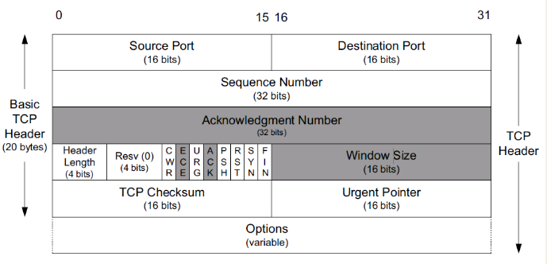
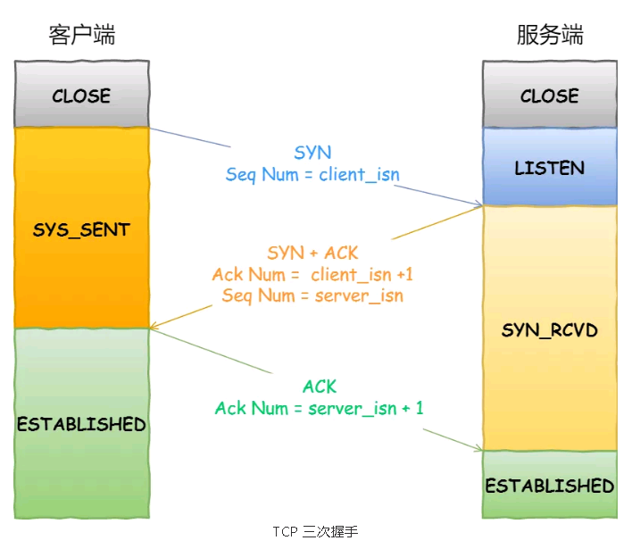
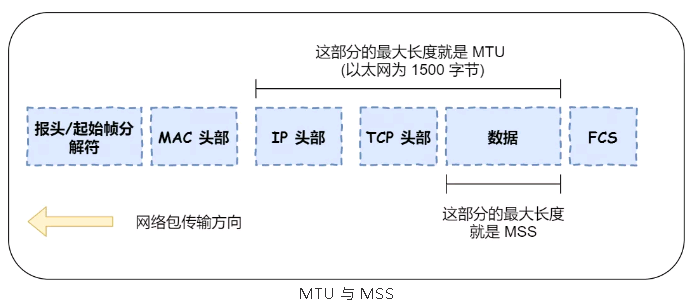
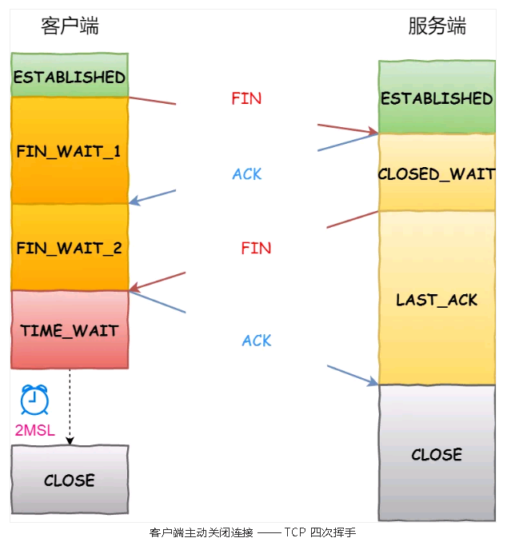

# TCP/IP的握手与挥手 #

[https://mp.weixin.qq.com/s/pqUFksNEwT9UWDpcKdGpQg](https://mp.weixin.qq.com/s/pqUFksNEwT9UWDpcKdGpQg)

## TCP头部 ##

- TCP序列号（序列码SN,Sequence Number）

	在建立连接时由计算机生成的随机数作为其初始值，通过SYN包传给接收端主机，每发送一次数据，就累加一次该数据字节数的大小。用来解决网络包乱序问题。比如发送端发送的一个TCP包净荷(不包含TCP头)为12byte，SN为5，则发送端接着发送的下一个数据包的时候，SN应该设置为5+12=17。通过系列号，TCP接收端可以识别出重复接收到的TCP包，从而丢弃重复包，同时对于乱序数据包也可以依靠系列号进行重排序，进而对高层提供有序的数据流。

- TCP应答号(Acknowledgment Number简称ACK Number或简称为ACK Field)

	ACK Number标识报文发送端期望接收的字节序列。比如当前接收端接收到一个净荷为12byte的数据包，SN为5，则发送端可能会回复一个确认收到的数据包，如果这个数据包之前的数据也都已经收到了，这个数据包中的ACK Number则设置为12+5=17，表示17byte之前的数据都已经收到了。

- 校验位(Checksum)
 
	发送端基于数据内容计算一个数值，接收端checksum校验失败的时候会直接丢掉这个数据包。CheckSum是根据伪头+TCP头+TCP数据三部分进行计算。另外对于大的数据包，checksum并不能可靠的反应比特错误，应用层应该再添加自己的校验方式。

- CWR(Congestion Window Reduce)

	拥塞窗口减少标志被发送主机设置，用来表明它接收到了设置ECE标志的TCP包。拥塞窗口是被TCP维护的一个内部变量，用来管理发送窗口大小。

- ECE(ECN Echo)

	用来在TCP三次握手时表明一个TCP端是具备ECN功能的。在数据传输过程中，它也用来表明接收到的TCP包的IP头部的ECN被设置为11，即网络线路拥堵。

- URG(Urgent)

	该标志位置位表示紧急(The urgent pointer) 标志有效。

- ACK(Acknowledgment)

	取值1代表Acknowledgment Number字段有效

- PSH(Push)

	该标志置位时，一般是表示发送端缓存中已经没有待发送的数据，接收端不将该数据进行队列处理，而是尽可能快将数据转由应用处理。在处理telnet或rlogin等交互模式的连接时，该标志总是置位的。

- RST(Reset)

	用于复位相应的TCP连接。通常在发生异常或者错误的时候会触发复位TCP连接。

- SYN(Synchronize)

	同步序列编号(Synchronize Sequence Numbers)有效。该标志仅在三次握手建立TCP连接时有效。

- FIN(Finish)
 
	带有该标志置位的数据包用来结束一个TCP会话，但对应端口仍处于开放状态，准备接收后续数据。

## 三次握手 ##

注意： 第三次握手是可以携带数据的。RFC 793中有一句话: ["Data or controls which were queued for transmission may be included."](https://www.rfc-editor.org/rfc/rfc793.html)。

- Q1：TCP握手为什么不是两次、四次？

	1、防止旧的重复连接初始化造成混乱。RFC 793中也有提及： ["The principle reason for the three-way handshake is to prevent old duplicate connection initiations from causing confusion."](https://www.rfc-editor.org/rfc/rfc793.html)
	2、三次握手才可以同步双方的初始序列号
	3、减少通信次数，避免资源浪费

- Q2：初始序列号ISN如何产生？

	初始序列号不能设置为一个固定的值，否则容易被攻击者推算出后续的序列号。RFC 1948中提出了一个较好的初始化序列号ISN随机生成算法： `ISN = M + F(localhost, localport, remotehost, remoteport)`。M是一个计时器，这个计时器每隔4毫秒加1。F是一个Hash算法，根据源IP、目的IP、源端口、目的端口生成一个随机数值。（能在一定程度上预防序列号猜测攻击。）

- Q3： MTU和MSS

	MTU（Maximum Transmit Unit,最大传输单元）：一个网络包的最大长度，以太网中一般为1500字节
	MSS（Maximum Segment Size，最大报文长度）：除去IP和TCP头部之后，一个网络包所能容纳的TCP数据的最大长度
	

	当IP层有一个超过MTU大小的数据（TCP头部 + TCP数据）要发送，那么IP层就要进行分片，把数据分片成若干片，保证每一个分片都小于MTU。把一份IP数据报进行分片以后，由目标主机的IP层来进行重新组装后，在交给上一层TCP传输层。但网络是不可靠的，如果一个IP分片丢失，整个IP报文的所有分片都得重传。IP层本身没有超时重传机制，它由传输层的TCP来负责超时和重传。当接收方发现TCP报文（头部 + 数据）的某一片丢失后，则不会响应ACK给对方，那么发送方的TCP在超时后，就会重发整个TCP报文（头部 + 数据）。另外，TCP协议在建立连接的时候通常要协商双方的MSS值，当TCP层发现数据超过MSS时，则就先会进行分片，当然由它形成的IP包的长度也就不会大于MTU ，自然也就不用IP分片了。

## 四次挥手 ##

注意：主动关闭连接的，才有TIME_WAIT状态。

- Q1：为什么挥手需要四次？

	1、关闭连接时，客户端向服务端发送 FIN 时，仅仅表示客户端不再发送数据了但是还能接收数据。
	2、服务器收到客户端的 FIN 报文时，先回一个 ACK 应答报文，而服务端可能还有数据需要处理和发送，等服务端不再发送数据时，才发送 FIN 报文给客户端来表示同意现在关闭连接。

- Q2：为什么需要TIME_WAI状态？

	[https://blog.csdn.net/wsyw126/java/article/details/70050297](https://blog.csdn.net/wsyw126/java/article/details/70050297)
	- 1、保证连接正确关闭。RFC 793中有提及["TIME-WAIT - represents waiting for enough time to pass to be sure the remote TCP received the acknowledgment of its connection termination request."](https://www.rfc-editor.org/rfc/rfc793.html)。客户端四次挥手的最后一个ACK报文如果在网络中被丢失了，此时如果客户端TIME-WAIT过短或没有，则就直接进入了CLOSE状态了，那么服务端则会一直处在LASE-ACK状态。当客户端发起建立连接的SYN请求报文后，服务端会发送RST报文给客户端，连接建立的过程就会被终止。
	- 2、防止旧连接的数据包。如果Client直接CLOSED，然后又再向Server发起一个新连接，我们不能保证这个新连接与刚关闭的连接的端口号是不同的。也就是说有可能新连接和老连接的端口号是相同的。一般来说不会发生什么问题，但是还是有特殊情况出现：假设新连接和已经关闭的老连接端口号是一样的，如果前一次连接的某些数据仍然滞留在网络中，这些延迟数据在建立新连接之后才到达Server，由于新连接和老连接的端口号是一样的，又因为TCP协议判断不同连接的依据是socket pair，于是，TCP协议就认为那个延迟的数据是属于新连接的，这样就和真正的新连接的数据包发生混淆了。

	
