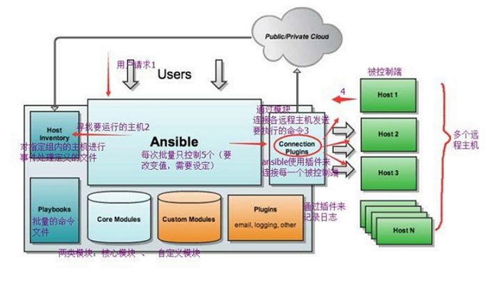

# Ansible笔记 #

## 介绍 ##

ansible是基于paramiko开发的,并且基于模块化工作，本身没有批量部署的能力。真正具有批量部署的是ansible所运行的模块，ansible只是提供一种框架。

架构图：



- Ansible：Ansible核心程序。
- HostInventory：记录由Ansible管理的主机信息，包括端口、密码、ip等。
- Playbooks：“剧本”YAML格式文件，多个任务定义在一个文件中，定义主机需要调用哪些模块来完成的功能。
- CoreModules：核心模块，主要操作是通过调用核心模块来完成管理任务。
- CustomModules：自定义模块，完成核心模块无法完成的功能，支持多种语言。
- ConnectionPlugins：连接插件，Ansible和Host通信使用

## 杂项 ##

**tags**

ansible 2.5以后内置的tags有以下几个（当然可以为task自定义tag）：

- always: 指定这个tag后，task任务将永远被执行，而不用去考虑是否使用了--skip-tags标记
- tagged: 当 --tags 指定为它时，则只要有tags标记的task都将被执行,--skip-tags效果相反
- untagged: 当 --tags 指定为它时，则所有没有tag标记的task 将被执行,--skip-tags效果相反
- all: 这个标记无需指定，ansible-playbook默认执行的时候就是这个标记.所有task都被执行

**set_fact**

ansible有一个模块叫setup，用于获取远程主机的相关信息，并可以将这些信息作为变量在playbook里进行调用。而setup模块获取这些信息的方法就是依赖于fact。

- 手动设置fact

ansible除了能获取到预定义的fact的内容,还支持手动为某个主机定制fact。称之为本地fact。本地fact默认存放于被控端的/etc/ansible/facts.d目录下，如果文件为ini格式或者json格式，ansible会自动识别。

- 使用set_fact模块定义新的变量

set_fact模块可以自定义facts，这些自定义的facts可以通过template或者变量的方式在playbook中使用。

```
- name: set_fact example
  hosts: test
  tasks:
    - name: Calculate InnoDB buffer pool size
      set_fact: innodb_buffer_pool_size_mb="{{ ansible_memtotal_mb / 2 |int }}"
      
    - debug: var=innodb_buffer_pool_size_mb
```

**fact缓存**

fact缓存目前支持三种存储方式:JSON、memcached、redis。

- Json文件

  使用JSON文件作为fact缓存后端的时候，ansible将会把采集的fact写入到控制主机的文件中。

  ansible.cfg配置如下：

	```
	[defaults]
	gathering = smart
	#缓存时间，单位为秒
	fact_caching_timeout = 86400    
	fact_caching = jsonfile
	#指定ansible包含fact的json文件位置，如果目录不存在，会自动创建
	fact_caching_connection = /tmp/ansible_fact_cache
	```
- Redis

	使用redis作为fact缓存后端，需要在控制主机上安装redis服务并保持运行。需要安装python操作redis的软件包。  

	ansible.cfg配置如下：

	```
	[defaults]
	gathering = smart
	fact_caching_timeout = 86400 
	fact_caching = redis  
	```

- Memcached

	使用memcached作为fact缓存后端，需要在控制主机上安装Memcached服务并保持运行，需要安装python操作memcached的软件包。

	ansible.cfg配置如下：

	```
	[defaults]
	gathering = smart
	fact_caching_timeout = 86400 
	fact_caching = memcached
	```

**stat**

获取文件的详细信息，一般与register一起使用。

```
tasks:
    - name: check dir state
      stat:
        path: /home/ansible
      register: dir_state
    - debug:
        msg: "{{dir_state.stat.size}}"
      when: dir_state.stat.size > 6
```

**lineinfile**
[https://blog.csdn.net/dylloveyou/article/details/80698531](https://blog.csdn.net/dylloveyou/article/details/80698531)

lineinfile模块，确保”某一行文本”存在于指定的文件中，或者确保从文件中删除指定的”文本”（即确保指定的文本不存在于文件中），还可以根据正则表达式，替换”某一行文本”。

常用参数：

- path参数 ：必须参数，指定要操作的文件。
- line参数 : 使用此参数指定文本内容。
- regexp参数 ：使用正则表达式匹配对应的行，当替换文本时，如果有多行文本都能被匹配，则只有最后面被匹配到的那行文本才会被替换，当删除文本时，如果有多行文本都能被匹配，这么这些行都会被删除。
- state参数：当想要删除对应的文本时，需要将state参数的值设置为absent，absent为缺席之意，表示删除，state的默认值为present。
- backrefs参数：默认情况下，当根据正则替换文本时，即使regexp参数中的正则存在分组，在line参数中也不能对正则中的分组进行引用，除非将backrefs参数的值设置为yes。backrefs=yes表示开启后向引用，这样，line参数中就能对regexp参数中的分组进行后向引用了，这样说不太容易明白，可以参考后面的示例命令理解。backrefs=yes除了能够开启后向引用功能，还有另一个作用，默认情况下，当使用正则表达式替换对应行时，如果正则没有匹配到任何的行，那么line对应的内容会被插入到文本的末尾，不过，如果使用了backrefs=yes，情况就不一样了，当使用正则表达式替换对应行时，同时设置了backrefs=yes，那么当正则没有匹配到任何的行时，则不会对文件进行任何操作，相当于保持原文件不变。
- insertafter参数：借助insertafter参数可以将文本插入到“指定的行”之后，insertafter参数的值可以设置为EOF或者正则表达式，EOF为End Of File之意，表示插入到文档的末尾，默认情况下insertafter的值为EOF，如果将insertafter的值设置为正则表达式，表示将文本插入到匹配到正则的行之后，如果正则没有匹配到任何行，则插入到文件末尾，当使用backrefs参数时，此参数会被忽略。
- insertbefore参数：借助insertbefore参数可以将文本插入到“指定的行”之前，insertbefore参数的值可以设置为BOF或者正则表达式，BOF为Begin Of File之意，表示插入到文档的开头，如果将insertbefore的值设置为正则表达式，表示将文本插入到匹配到正则的行之前，如果正则没有匹配到任何行，则插入到文件末尾，当使用backrefs参数时，此参数会被忽略。
- backup参数：是否在修改文件之前对文件进行备份。
- create参数 ：当要操作的文件并不存在时，是否创建对应的文件。

**命令行模块**

- command为系统默认模块，使用时可以直接省略，注意command不支持管道命令
- raw和command类似，两个模块都是调用远程主机的指令，但是raw支持管道命令
- shell模块调用远程主机的指令，支持shell特性，包括执行脚本、管道命令等
- script只能执行脚本，不能调用其他指令，但是script执行的是存放在ansbile管理机上的脚本，并且script不支持管道命令

**notify与handlers**

notify可用于在每个play的最后被触发，这样可以避免多次有改变发生时每次都执行指定的操作，仅在所有的变化发生完成最后一次性地执行指定操作。在notify中列出的操作称为handler，也即notify中调用handler中定义的操作。

看一个httpd的例子：

```
tasks:
  - name: install httpd package
    yum: name=httpd
    tages: inshttpd
  - name: copy conf file
    copy: src=files/httpd.conf dest=/etc/httpd/conf backup=yes
    notify: 
     - restart service
     - check service
  - name: start service      
    service: name=httpd state=started enabled=yes
    tages: rshttpd
handlers:
  - name: restart service
    service: name=httpd state=restarted  enabled=yes
  - name: checke service
    service: killall -0 httpd > /tmp/http.log
```

**role目录功能约定**

- tasks目录：至少应该包含一个main.yml的文件，其定义了此角色的任务列表；此文件可以使用include包含其他的位于此目录的task文件
- files目录：存放由copy或script等模块调用的文件
- templates目录：templates模块会自动在此目录中寻找Jinja2模版文件
- handlers目录：此目录中应该包含一个main.yml
- yml文件，用于定义此角色用到的各handler，在handler中使用include包含的其他handler文件也应该位于此目录中
- vars目录：应当包含一个main.yml文件，用于定义此角色用到的变量
- meta目录：应当包含一个main.yml文件,用于定于此角色的特殊设定及依赖关系,ansible1.3 以后才支持
- default目录: 为当前角色设定默认变量时使用此目录，应当包含一个main.yml文件

**block**

block是ansible在2.0版本引入的一个特性，块功能可以将任务进行逻辑分组，并且可以在块级别上应用任务变量。同时也可以使用类似于其他编程语言处理异常那样的方法，来处理块内部的任务异常。block中的组任务，都会继承block的属相（支持when，不支持with_items），部署时会分别执行组中的任务，并且都会继承block的属相（在任务后添加block的when条件）

```
- hosts: localhost
  tasks:   
    - block:
        - yum: name={{ item }} state=installed
          with_items:
             - httpd
             - memcached
        - template: src=templates/src.j2 dest=/etc/foo.conf
        - name： start service
          service: name=bar state=started enabled=True
      when: ansible_distribution == 'CentOS'
      become: true
      become_user: root
```